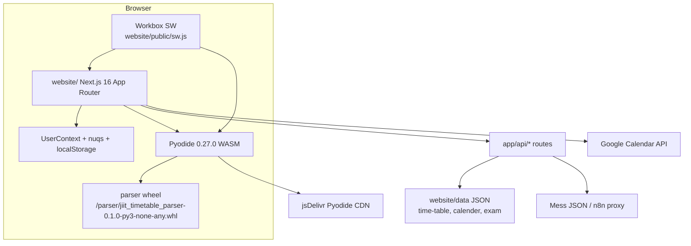
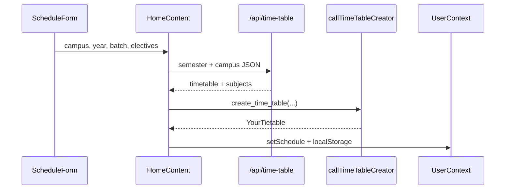
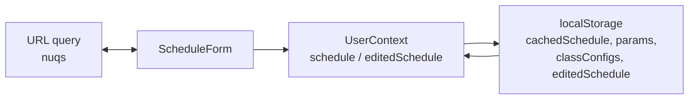
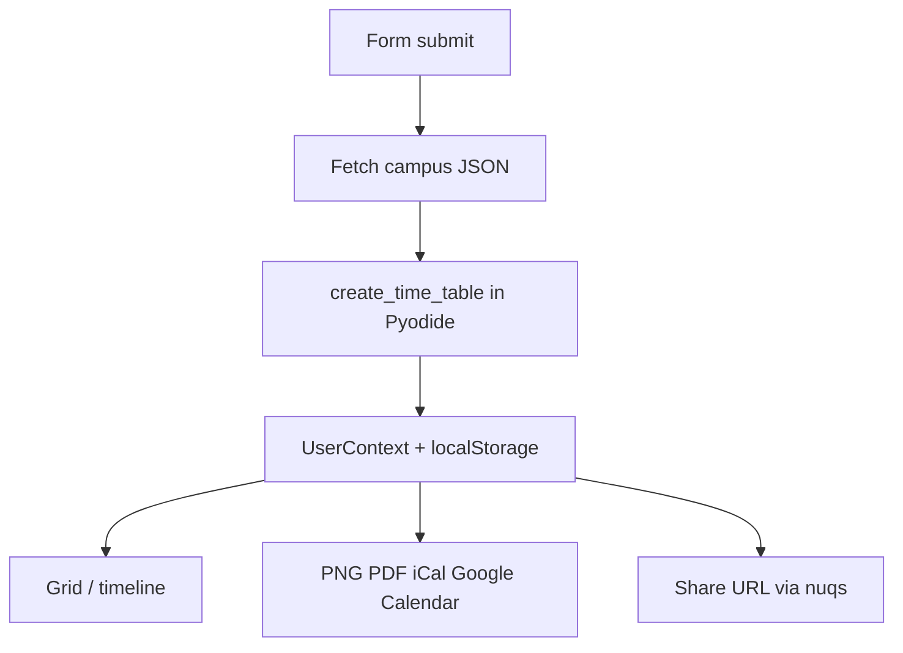

# Overview

JIIT Timetable Creator is a browser PWA that builds a personal class schedule. Python parsing runs in the page through Pyodide, so timetable generation does not need a backend. A Workbox service worker keeps the app usable offline after the first load.

Live site: [https://jiit-timetable.tashif.codes/](https://jiit-timetable.tashif.codes/)
Source: [github.com/tashifkhan/JIIT-time-table-website](https://github.com/tashifkhan/JIIT-time-table-website)

Deeper pages:

* System architecture: [3](3-system-architecture)
* Schedule generation: [4](4-schedule-generation-(core-feature))
* Pyodide WASM: [3.2](3.2-pyodide-wasm-integration)
* PWA and offline: [3.3](3.3-pwa-and-offline-capabilities)
* State management: [3.5](3.5-state-management)
* Export and sharing: [9](9-export-and-sharing)

## System layers

Three runtime layers sit in the browser. Static JSON is the data layer. Next.js App Router API routes only serve that JSON (and a mess-menu proxy). They do not generate schedules.



| Aspect | Implementation |
| --- | --- |
| Frontend | Next.js 16 App Router, React 18, TypeScript, Tailwind CSS v4, shadcn/ui |
| Schedule engine | Pyodide 0.27.0 (Python 3.12 package, no stdlib extras) loaded from jsDelivr |
| Parser | `create_time_table`, `compare_timetables`, `create_and_compare_timetable` in the `parser/` wheel |
| Data | Static JSON under `website/data/` (and repo-root `data/`), read by `app/api/*` |
| Offline | `@ducanh2912/next-pwa` + Workbox at `website/public/sw.js` |
| State | React Context, localStorage, `nuqs` query params |
| Analytics | PostHog via `/ph/*` rewrite, Vercel Analytics |

The service worker at [`website/public/sw.js`](https://github.com/tashifkhan/JIIT-time-table-website/blob/main/website/public/sw.js) uses three strategies:

* NetworkFirst for `/` (`start-url` cache)
* CacheFirst for `https://cdn.jsdelivr.net/pyodide/v0.27.0/full/*` with a 1-year TTL
* Precache for Next.js chunks, fonts, `manifest.json`, leftover `/modules/*.py` files, and `_creator.py`

## Features and routes

| Feature | Route | Page / component |
| --- | --- | --- |
| Schedule generation | `/` | `app/page.tsx` → `HomeContent` |
| Timeline | `/timeline` | `app/timeline/page.tsx` → `TimelineView` |
| Compare | `/compare-timetables` | `app/compare-timetables/page.tsx` |
| Academic calendar | `/academic-calendar` | `app/academic-calendar/page.tsx` → `CalendarContent` |
| Exam schedule | `/exam-schedule` | `app/exam-schedule/page.tsx` → `ExamContent` |
| Mess menu | `/mess-menu` | `app/mess-menu/page.tsx` → `MenuContent` |
| API docs | `/api-doc` | Swagger UI from `/swagger.json` |

### Schedule generation



`HomeContent` fetches mappings with TanStack Query (`useTimeTables`, `useBatchMappings`), then calls `callTimeTableCreator` in [`website/utils/pyodide.ts`](https://github.com/tashifkhan/JIIT-time-table-website/blob/main/website/utils/pyodide.ts). Campus and year routing lives in Python `create_time_table`, not in a JS function-name switch.

## Architecture notes

### Client-side Python

`initializePyodide()` injects `pyodide.js` from jsDelivr, loads micropip, installs `/parser/jiit_timetable_parser-0.1.0-py3-none-any.whl`, then runs:

```python
from main import create_time_table, compare_timetables, create_and_compare_timetable
```

`create_time_table` in [`parser/main.py`](https://github.com/tashifkhan/JIIT-time-table-website/blob/main/parser/main.py) picks the campus parser:

| Campus | Year 1 | Year 2+ |
| --- | --- | --- |
| 62 | `time_table_creator` | `time_table_creator_v2` |
| 128 | `bando_year1` | `banado` |
| BCA | `creator_year1` | `creator` |

### State



`UserContext` holds `schedule` (Python output) and `editedSchedule` (user edits). `nuqs` keeps `year`, `batch`, `campus`, `selectedSubjects` in the URL. When those params disagree with a cached schedule, `UrlParamsDialog` offers override, prefill, or keep existing.

## Stack

| Category | Package | Role |
| --- | --- | --- |
| Framework | Next.js ^16.0.7 | App Router, API routes |
| UI | React 18, Tailwind 4, Radix/shadcn, Framer Motion 11 | Layout and motion |
| URL state | nuqs 2 | Shareable query params |
| Data fetching | @tanstack/react-query 5 | `/api/*` cache |
| Python | pyodide 0.27.0 | In-browser parser |
| Export | html-to-image, jspdf | PNG / PDF |
| Calendar | googleapis, GSI client | OAuth + events |
| PWA | @ducanh2912/next-pwa, workbox | Service worker |
| Analytics | posthog-js, @vercel/analytics | Usage |
| Search | fuse.js | Subject picker |

Creator tools (`creator/`) are Streamlit + Typer. They convert Excel/PDF into JSON and use Gemini for PDF notices. They are not part of the website runtime.

## Data flow

1. User picks campus, year, batch, electives on `/`.
2. `HomeContent` loads `/api/time-table/{semester}/{campus}` JSON.
3. Pyodide runs `create_time_table`.
4. Result is stored in context and `cachedSchedule`.
5. `ScheduleDisplay` and `/timeline` render it. Export tools read `editedSchedule || schedule`.



## Repo layout

```text
.
├── website/                 Next.js 16 app
│   ├── app/                 pages and API routes
│   ├── components/
│   ├── context/
│   ├── data/                calendars, timetables, exams
│   ├── public/              sw.js, parser wheel, manifest
│   └── utils/               pyodide.ts, download.ts, calendar.ts
├── parser/                  Python package, built as a wheel
├── creator/                 Streamlit + Typer JSON converters
└── data/                    shared JSON (API also looks here)
```

There is no `src/App.tsx` and no Vite `main.tsx`. Routing is App Router under `website/app/`.

## Core type

```ts
interface YourTietable {
  [day: string]: {
    [timeSlot: string]: {
      subject_name: string;
      type: "L" | "T" | "P" | "C";
      location: string;
    };
  };
}
```

Defined in [`website/types/index.ts`](https://github.com/tashifkhan/JIIT-time-table-website/blob/main/website/types/index.ts).

## Deployment

Vercel hosts the Next app. [`website/vercel.json`](https://github.com/tashifkhan/JIIT-time-table-website/blob/main/website/vercel.json) proxies PostHog:

* `/ph/static/*` → `eu-assets.i.posthog.com`
* `/ph/*` → `eu.i.posthog.com`

`website/next.config.ts` adds the same `/ph/:path*` rewrite and PWA Workbox options. There is no SPA `index.html` fallback. App Router owns the routes.
