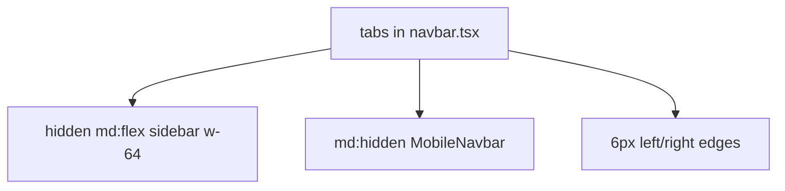
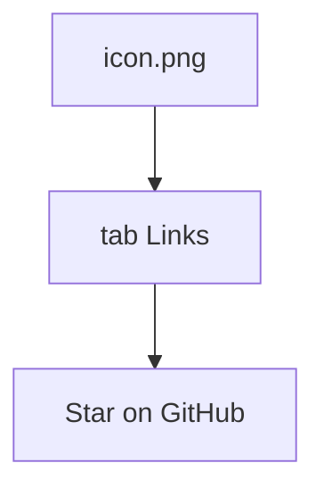
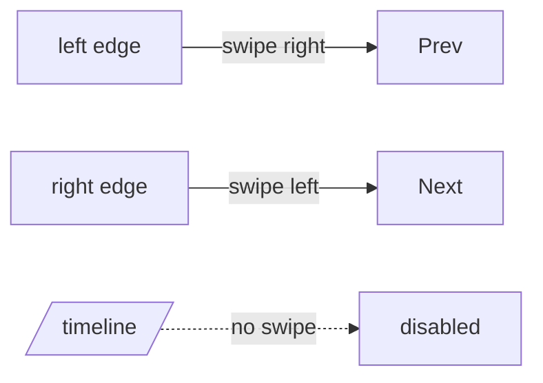

# Navigation and mobile experience

Six tabs, desktop sidebar, mobile pill, edge swipe. Related: [Schedule](4-schedule-generation-(core-feature)), [Timeline](5-timeline-view), [Academic calendar](6-academic-calendar), [Compare](7-compare-timetables), [Mess](8-mess-menu). Exam schedule is the sixth tab (`/exam-schedule`).

## Dual nav

[`website/components/layout/navbar.tsx`](https://github.com/tashifkhan/JIIT-time-table-website/blob/main/website/components/layout/navbar.tsx) exports `tabs`. [`mobile-navbar.tsx`](https://github.com/tashifkhan/JIIT-time-table-website/blob/main/website/components/layout/mobile-navbar.tsx) imports that array.

## Tab model

| Property | Use |
| --- | --- |
| label | Desktop |
| mobileLabel | 10px caption under the icon |
| path | App Router path |
| icon | lucide-react |

Order: Create, Timeline, Mess, Academic Calendar, Exam Schedule, Compare.

## Desktop

Fixed `h-screen w-64`, dark gradient, logo `icon.png`, `layoutId="activeTab"` highlight, GitHub link at the bottom. Main column offset: `md:ml-64`.

Active: `pathname === "/"` for home, `pathname.startsWith(path)` otherwise.

## Mobile

Fixed bottom `w-[90%] max-w-md`, rounded-full bar. Spring indicator tracks the active button width/left. Click calls `useHaptic("navigation")` then `router.push`.

## Swipe

`react-swipeable`: `delta: 50`, `trackTouch` and `trackMouse`. Left → next tab, right → previous, wrap-around. Disabled when `pathname === "/timeline"`. Invisible hit areas are `w-6` on each edge below the top 5rem.

## Haptics

`website/hooks/use-haptic.ts` wraps `web-haptics`. Nav clicks and swipes fire `"navigation"`.

## Layout vs chrome

Root layout: `pb-24` on small screens so the pill does not cover content. Timeline still owns its own pan; that is why swipe nav is off there.
