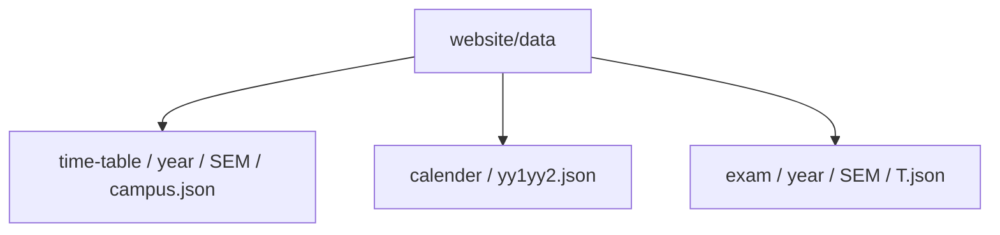
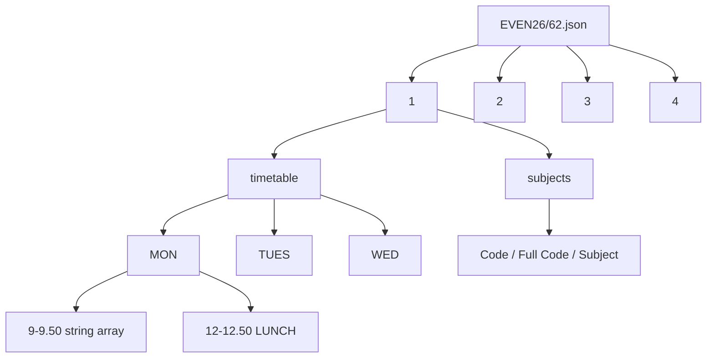
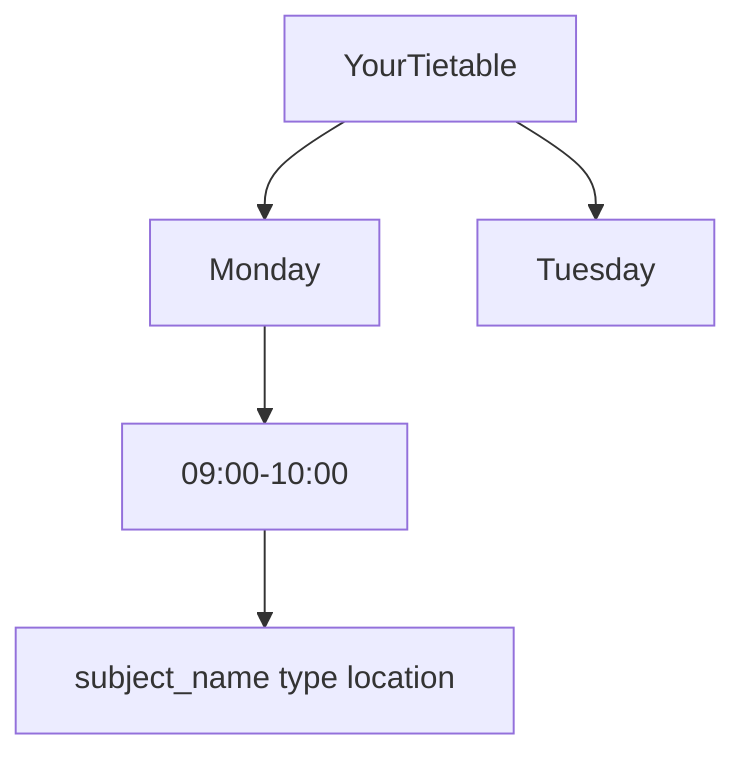

# Timetable data format reference

On-disk JSON for classes, calendars, and exams. Related: [Python pipeline](4.2-python-processing-pipeline), [Types](3.4-data-model-and-types).

## Directories

JSON lives in `website/data/` (API also checks `../data`). It is **not** under `public/data/`.



| Path | Contents |
| --- | --- |
| `website/data/time-table/{year}/{SEM}/{campus}.json` | Year-keyed timetable + subjects |
| `website/data/calender/{yy1yy2}.json` | Academic events |
| `website/data/exam/{year}/{SEM}/T*.json` | Exam rows |
| `website/public/parser/*.whl` | Parser wheel (not JSON) |

Campus files: `62`, `128`, `BCA`. ODD26 currently has `62` and `BCA`; EVEN26 has all three. Default semester constant: `ODD26`.

HTTP:

```http
GET /api/time-table
GET /api/time-table/{semester}/{batch}
GET /api/academic-calendar
GET /api/academic-calendar/{year}
GET /api/exam-schedule
GET /api/exam-schedule/{semester}
GET /api/mess-menu
```

`batch` here is the campus file stem (`62`), not a student batch like `A6`. `GET /api/time-table/EVEN26/62` returns the whole campus file below.

## Timetable file

One JSON object per campus. Top-level keys are year numbers as strings. B.Tech files use `"1"` through `"4"`. BCA stops at `"3"`. Each year has two siblings: `timetable` (the grid) and `subjects` (the catalog for that year).



EVEN26 Sector 62 year 1, trimmed to one morning. This is the real shape, not a made-up schema:

```json
{
  "1": {
    "timetable": {
      "MON": {
        "9-9.50": [
          "LB3,B4(CI121)-CR325/ANP",
          "TA4(CI121)-TS10/APR",
          "TG2(CI121)-F7/NIY"
        ],
        "10-10.50": [
          "LA1,A2(PH211)-G1/ANU",
          "LA3,A4(PH211)-FF1/RKD"
        ],
        "12-12.50": ["LUNCH"]
      },
      "TUES": {},
      "WED": {},
      "THUR": {},
      "FRI": {},
      "SAT": {}
    },
    "subjects": [
      {
        "Code": "CI111",
        "Full Code": "",
        "Subject": "Software Development Fundamentals-"
      },
      {
        "Code": "PH211",
        "Full Code": "",
        "Subject": "Physics-2"
      },
      {
        "Code": "PH271",
        "Full Code": "",
        "Subject": "Physics Lab-2"
      }
    ]
  },
  "2": {
    "timetable": {},
    "subjects": [
      {
        "Code": "MA223",
        "Full Code": "25B12MA223",
        "Subject": "Time Series Analysis and Forecasting"
      }
    ]
  }
}
```

Days in the file are `MON`, `TUES`, `WED`, `THUR`, `FRI`, `SAT`. Not every year has every day. Year 3 EVEN26/62 has no `TUES`. Year 4 has no `SAT`.

Slot keys are the Excel headings, written the way the creator dumped them: `9-9.50`, `10-10.50`, …, `4-4.50`. Year 2+ sometimes adds a 5pm slot. A slot value is always an array of strings. One string is one overlapping class in that hour. `LUNCH` is a real entry, not a hole in the object.

Year 1 EVEN26/62 has 12 subjects. Year 2 has 38. Year 1 `Full Code` is often empty; the parser then matches on `Code` or a slice of whatever sits in the activity string. Year 2 fills `Full Code` with the catalog id (`25B12MA223`).

TypeScript for the file (not exported as one type; this is the on-disk contract):

```ts
type CampusFile = {
  [year: string]: {
    timetable: {
      [day: string]: {
        [slot: string]: string[];
      };
    };
    subjects: Array<{
      Code: string;
      "Full Code": string;
      Subject: string;
    }>;
  };
};
```

### Activity strings

Each class cell is a packed token, not a JSON object. From EVEN26/62 Monday 9am:

```text
TA4(CI121)-TS10/APR
LB3,B4(CI121)-CR325/ANP
LA1,A2(PH211)-G1/ANU
PA5(PH271)-PL1/MKC/MTR
LUNCH
```

`TA4(CI121)-TS10/APR` reads left to right:

| Chunk | Value | Meaning |
| --- | --- | --- |
| leading letter | `T` | class type: `L` lecture, `T` tutorial, `P` practical |
| batch | `A4` | student batch. Commas and ranges pack several: `LB3,B4`, `LA1,A2` |
| `(…)` | `CI121` | subject code the parser looks up |
| after `-` | `TS10` | room |
| after `/` | `APR` | faculty initials. Labs can list two: `MKC/MTR` |

The parser does not store faculty. It keeps name, type, and room. `subject_extractor` takes the parenthesis (dash fallback if there is none). `location_extractor` takes the room. Type is that first `L`/`T`/`P`. Batch matching is [the pipeline page](4.2-python-processing-pipeline).

### Generated timetable

Raw slots stay strings until Pyodide. `create_time_table(campus, year, time_table_json, subject_json, batch, electives)` walks every day, every slot, every string, and keeps the rows whose batch (and electives) match. That object is the timetable the grid and timeline render. It is also what `HomeContent` writes to localStorage as `cachedSchedule`.



Days become full names (`MON` → `Monday`). Slot keys become 24h ranges (`9-9.50` → `09:00-10:00`). Each cell is one class, not an array. `LUNCH` is dropped. Practicals (`P`) get an extra hour on the end, so `10-10.50` lab is `10:00-12:00`. If two matching classes land on the same hour, the later one overwrites. Type `C` is not in this output. EditEventDialog writes it onto `editedSchedule`.

Subject lookup uses `Code`, then slices of `Full Code`. Year 1 EVEN26/62 often has empty `Full Code`, so a token like `CI121` or `MA211` can stay the code if nothing in `subjects` matches.

Batch `A4`, year 1, EVEN26 Sector 62, no electives. This is the week `time_table_creator` builds from the campus file above:

```json
{
  "Monday": {
    "09:00-10:00": {
      "subject_name": "CI121",
      "type": "T",
      "location": "TS10"
    },
    "10:00-11:00": {
      "subject_name": "Physics-2",
      "type": "L",
      "location": "FF1"
    },
    "11:00-12:00": {
      "subject_name": "MA211",
      "type": "L",
      "location": "FF1"
    }
  },
  "Tuesday": {
    "10:00-11:00": {
      "subject_name": "HS111",
      "type": "L",
      "location": "FF1"
    },
    "11:00-12:00": {
      "subject_name": "CI121",
      "type": "L",
      "location": "FF1"
    }
  },
  "Wednesday": {
    "09:00-10:00": {
      "subject_name": "CI121",
      "type": "L",
      "location": "CR325"
    },
    "10:00-11:00": {
      "subject_name": "Workshop",
      "type": "T",
      "location": "TS17"
    },
    "11:00-12:00": {
      "subject_name": "HS111",
      "type": "L",
      "location": "FF4"
    },
    "13:00-15:00": {
      "subject_name": "Software Development Fundamentals Lab-",
      "type": "P",
      "location": "CL02"
    },
    "16:00-17:00": {
      "subject_name": "MA211",
      "type": "L",
      "location": "FF1"
    }
  },
  "Thursday": {
    "09:00-10:00": {
      "subject_name": "Physics-2",
      "type": "T",
      "location": "TS6"
    },
    "10:00-12:00": {
      "subject_name": "Physics Lab-2",
      "type": "P",
      "location": "PL2"
    },
    "13:00-14:00": {
      "subject_name": "Physics-2",
      "type": "L",
      "location": "G1"
    },
    "14:00-15:00": {
      "subject_name": "MA211",
      "type": "L",
      "location": "FF1"
    },
    "15:00-16:00": {
      "subject_name": "MA211",
      "type": "T",
      "location": "TS7"
    },
    "16:00-17:00": {
      "subject_name": "CI121",
      "type": "L",
      "location": "G8"
    }
  },
  "Friday": {
    "09:00-11:00": {
      "subject_name": "Workshop",
      "type": "P",
      "location": "EW2"
    },
    "13:00-14:00": {
      "subject_name": "HS111",
      "type": "T",
      "location": "TS6"
    }
  },
  "Saturday": {
    "10:00-11:00": {
      "subject_name": "Physics-2",
      "type": "L",
      "location": "G1"
    },
    "11:00-13:00": {
      "subject_name": "HS111",
      "type": "P",
      "location": "LL1"
    }
  }
}
```

TypeScript (`website/types/index.ts`):

```ts
interface YourTietable {
  [day: string]: {
    [timeSlot: string]: {
      subject_name: string;
      type: "L" | "T" | "P" | "C";
      location: string;
    };
  };
}
```

`WeekSchedule` in `types/schedule.ts` is the same nested shape. After `toJs()`, Home JSON-clones it so Pyodide Proxies do not land in React state. Display reads `editedSchedule || schedule`. A new generate sets `editedSchedule` to null.

`cachedSchedule` in localStorage is that week object. Next to it:

```json
{
  "year": "1",
  "batch": "A4",
  "campus": "62",
  "selectedSubjects": []
}
```

That params blob is `cachedScheduleParams`. `classConfigs` stores named form presets, not this grid. The share URL is year/batch/campus/electives, not the generated cells.

## Calendar file

`website/data/calender/{yy1yy2}.json` is a JSON array. The folder name is a typo that stuck (`calender`). `2526.json` is academic year 2025-26 (146 events). Google-calendar shaped: `summary` plus `start.date` / `end.date` as ISO dates. Same-day events repeat the date. Ranges use a later `end`.

```json
[
  {
    "summary": "Registration of 1st Semester (B.Tech, Intgt M.Tech, All UG and Diploma)",
    "start": { "date": "2025-07-10" },
    "end": { "date": "2025-07-10" }
  },
  {
    "summary": "T1 Examination & Results - Examination Schedule",
    "start": { "date": "2025-08-29" },
    "end": { "date": "2025-09-06" }
  },
  {
    "summary": "Holiday - Semester Break - Diwali (Odd)",
    "start": { "date": "2025-10-19" },
    "end": { "date": "2025-10-26" }
  }
]
```

The UI treats a title that starts with `Holiday -` as a holiday. Everything else is an academic event.

## Exam file

`website/data/exam/{year}/{SEM}/T*.json` is a JSON array. EVEN26 T3 has 316 rows, all `subject_type: "L"` in that dump.

```json
[
  {
    "subject_code": "19M21BT117",
    "subject_type": "L",
    "subject_name": "ENZYMES AND BIOPROCESS TECHNOLOGY",
    "exam_date": "11-05-2026",
    "exam_time": "10.00 AM",
    "exam_day": "Monday",
    "semester": "2"
  },
  {
    "subject_code": "24B11CS243",
    "subject_type": "L",
    "subject_name": "Data Science & Data Analytics: Theory & Practice",
    "exam_date": "11-05-2026",
    "exam_time": "10.00 AM",
    "exam_day": "Monday",
    "semester": "2, 4"
  }
]
```

`semester` on disk is a string: `"2"`, `"8"`, or a list like `"2, 4"` / `"1, 2, 3"`. The UI splits that into `semesters: number[]`. `ExamContent` searches with Fuse and can filter to "my exams" using the current timetable subjects. Dates stay `DD-MM-YYYY`. Times stay `10.00 AM`.

## How files get there

`creator/` Streamlit + Typer (Gemini for PDF notices) writes this JSON. Copy into `website/data/` (and repo-root `data/` if you use the parent fallback). The website does not parse Excel at runtime.
