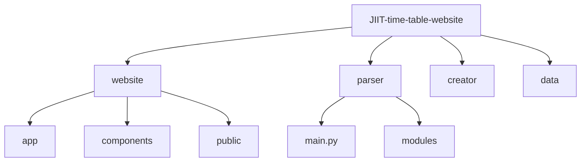
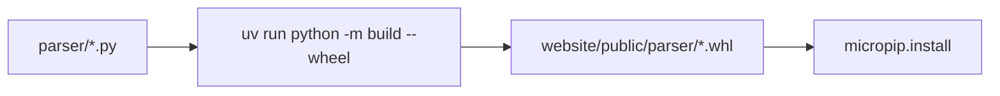
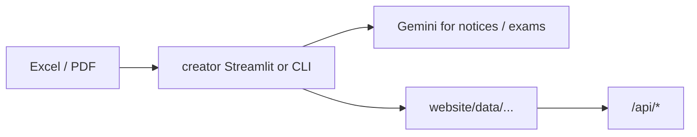
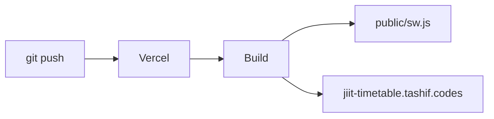

# Development guide

Local Next app, parser wheel, JSON from creator tools, Vercel deploy. Architecture: [3](3-system-architecture). Features: [4](4-schedule-generation-(core-feature))–[10](10-navigation-and-mobile-experience).

## Setup

| Tool | For |
| --- | --- |
| Node 18+, bun | `website/` |
| Python 3.12+, uv | `parser/`, `creator/` |
| Gemini key | creator PDF/exam tools |

```bash
git clone https://github.com/tashifkhan/JIIT-time-table-website
cd website
bun install
bun dev
```

App: [http://localhost:3000](http://localhost:3000). Confirm the form, `/api/time-table`, and Pyodide in the console.

Env: `NEXT_PUBLIC_POSTHOG_KEY`, `NEXT_PUBLIC_GOOGLE_CLIENT_ID`, `N8N_URI`, `N8N_128_URI`.

## Layout



Add a page: `website/app/<route>/page.tsx`, then a row in `tabs` in `navbar.tsx`. Add an API: `website/app/api/<name>/route.ts` plus swagger comments; `bun run generate-swagger` refreshes `public/swagger.json`.

## Parser changes



Do not treat `website/public/_creator.py` as the live engine. Dispatch belongs in `parser/main.py`. Campus loops live under `modules/tt_parsers/`. Shared helpers: `utils/batch.py`, `subject.py`, `location.py`, `time.py`.

Test with `create_time_table("62", "1", json, subjects, "A6", [])` from a Python REPL, then rebuild the wheel.

## JSON refresh



```bash
cd creator
uv sync
uv run python main.py web
```

Tools: timetable converter, subject extract (manual or AI), exam schedule (Gemini Vision), academic calendar. Output must match [data format](11-timetable-data-format-reference). Default semester in the app is `ODD26`.

## Quality checks

* Form: campus 62 / 128 / BCA, year 1 vs 2+, bad batch dialog
* Generate twice-on-first-load still yields a grid
* Timeline hydrates from `cachedSchedule`
* Compare free slots / together
* Exam search and calendar holiday filter
* PNG/PDF from `/timeline?download=1`
* `bun lint`

Pyodide first-run quirks: wait for `usePyodideStatus().loaded`. Stale SW: unregister in DevTools (PWA is off in `next dev`).

## Build and deploy

```bash
cd website
bun run build    # generate-swagger && next build
bun start
```



`next.config.ts`: PWA dest `public`, Pyodide CacheFirst, `/ph/:path*` rewrite. `vercel.json`: PostHog EU assets + ingest. `outputFileTracingIncludes` keeps `data/**/*` in the serverless bundle.

PWA: install from production only. After a parser wheel bump, hard-refresh so micropip fetches the new file.

## Style

* TypeScript, client components marked `"use client"`
* Paths `@/` → `website/`
* Sentence-case UI copy already in the app
* Python: stdlib dataclasses, no extra deps in the wheel

## Extra

New campus: add a `tt_parsers/` package, a branch in `create_time_table`, a `{campus}.json`, and form validation. Keep `callTimeTableCreator` as the only JS entry.

Pyodide size: `fullStdLib: false`, CacheFirst 1 year. Do not bundle the runtime into Next.

Export formats: add a function next to `download.ts` / `calendar.ts`, then a control on `ActionButtons`.
