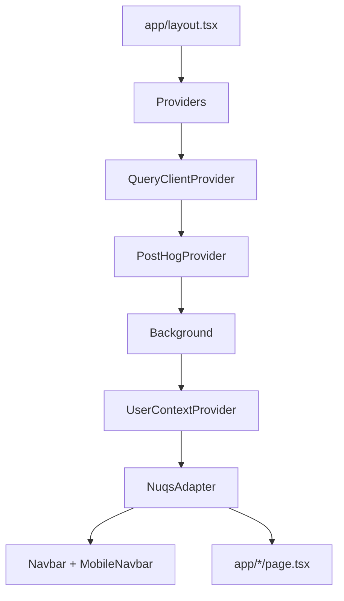
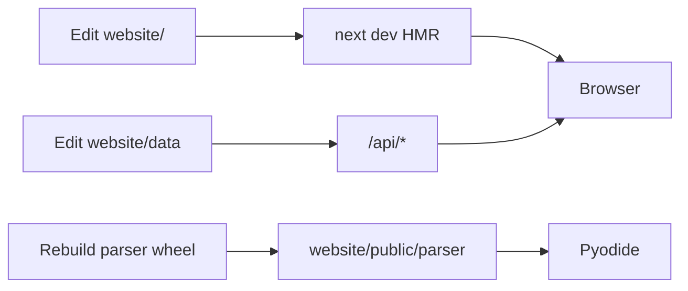

# Getting started

Run the Next.js app locally, then optionally the parser wheel and creator tools.

See [System architecture](3-system-architecture) and [Schedule generation](4-schedule-generation-(core-feature)).

## Prerequisites

| Tool | Version | Why |
| --- | --- | --- |
| Node.js | 18+ | Next.js 16 |
| bun (or npm) | latest | `website/` install |
| Git | any | clone |
| Modern browser | current Chrome, Edge, Firefox, Safari | WebAssembly |
| Python 3.12+ and uv | for `parser/` and `creator/` only | wheel build, JSON conversion |

Python is not required to run the website. Pyodide downloads the parser wheel in the browser.

## Website

```bash
git clone https://github.com/tashifkhan/JIIT-time-table-website
cd JIIT-time-table-website/website
bun install
bun dev
```

Open [http://localhost:3000](http://localhost:3000) (or the port Next prints).

`bun run build` runs `scripts/generate-swagger.ts` then `next build`.

### Boot order



[`website/app/providers.tsx`](https://github.com/tashifkhan/JIIT-time-table-website/blob/main/website/app/providers.tsx) wraps TanStack Query, PostHog (`NEXT_PUBLIC_POSTHOG_KEY`, host `/ph`), `UserContextProvider`, `NuqsAdapter`, Vercel Analytics, and the toaster. [`website/app/layout.tsx`](https://github.com/tashifkhan/JIIT-time-table-website/blob/main/website/app/layout.tsx) loads Google `api.js` and GSI, plus the PWA manifest.

## Repo layout

```text
JIIT-time-table-website/
├── website/                 Next.js 16 app
│   ├── app/                 App Router pages and API
│   ├── components/
│   ├── context/
│   ├── data/                JSON copies used at runtime
│   ├── hooks/               use-api, use-webportal, use-haptic
│   ├── lib/
│   ├── public/              sw.js, parser wheel, modules
│   ├── types/
│   └── utils/
├── parser/                  Python timetable library
├── creator/                 Streamlit + Typer converters
└── data/                    shared JSON (API fallback)
```

| Path | Role |
| --- | --- |
| `website/app/page.tsx` | Home, schedule form |
| `website/utils/pyodide.ts` | Load Pyodide and call parser |
| `website/public/parser/*.whl` | Wheel installed by micropip |
| `website/data/time-table/` | Semester JSON by year/campus |
| `website/data/calender/` | Academic years `2425.json`, `2526.json`, `2627.json` |
| `website/data/exam/` | Exam JSON, e.g. `2026/EVEN26/T3.json` |
| `parser/main.py` | Public Python API |
| `creator/` | Excel/PDF → JSON, Gemini for notices |

## Parser and creator (optional)

```bash
cd parser
uv sync
uv run python -m build --wheel
# copy dist/*.whl to website/public/parser/
```

```bash
cd creator
uv sync
cp .env.example .env   # GEMINI_API_KEY
uv run python main.py web
# or: uv run python main.py cli --help
```

## Env vars

Create `website/.env.local`:

| Variable | Required | Use |
| --- | --- | --- |
| `NEXT_PUBLIC_POSTHOG_KEY` | no | PostHog |
| `NEXT_PUBLIC_GOOGLE_CLIENT_ID` | for Calendar sync | GSI OAuth |
| `N8N_URI` / `N8N_128_URI` | mess menu API | `/api/mess-menu` fetches these |

PostHog is initialized in `providers.tsx` with `api_host: "/ph"`. Google Calendar uses the public client ID at runtime, not a server secret.

## Dev loop



* Pages live under `website/app/`.
* `bun lint` runs ESLint (`eslint-config-next` 16).
* PWA is disabled when `NODE_ENV === "development"` in `next.config.ts`.
* First Pyodide load hits jsDelivr. Later loads can use the service worker cache in production.

Useful URLs:

* `/` schedule
* `/timeline`
* `/compare-timetables`
* `/academic-calendar`
* `/exam-schedule`
* `/mess-menu`
* `/api-doc` Swagger UI
* `/api/doc` OpenAPI JSON
* `/api/time-table` semester index
* `/api/academic-calendar`
* `/api/exam-schedule`
* `/api/mess-menu`

## Troubleshooting

| Issue | Fix |
| --- | --- |
| Port in use | Next defaults to 3000. Kill the process or pass `-p`. |
| Pyodide fails | Check WASM support and jsDelivr. Hard refresh. |
| Stale schedule | Clear `cachedSchedule` / `classConfigs` in localStorage. |
| Mess menu 500 | Set `N8N_URI` and `N8N_128_URI`. Source JSON also lives at `https://raw.githubusercontent.com/life2harsh2/data/main/mess_menu.json`. |
| API empty | Confirm JSON under `website/data` or `../data` (`lib/data-path.ts`). |

Next: [System architecture](3-system-architecture), then [Schedule generation](4-schedule-generation-(core-feature)).
