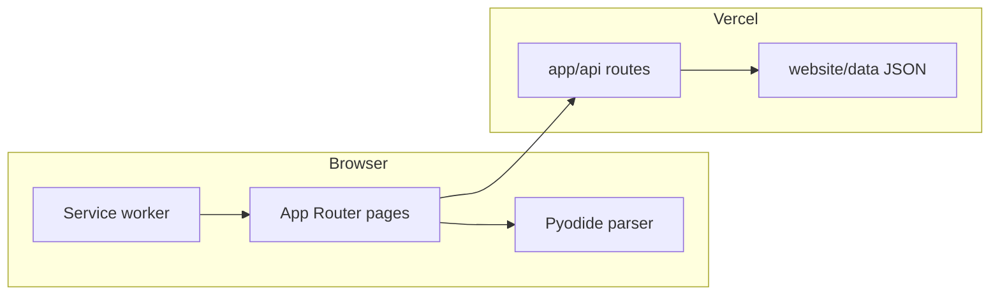
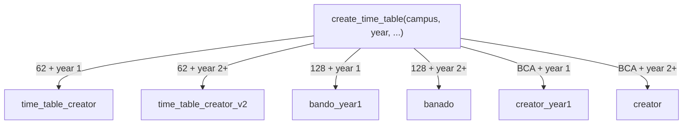
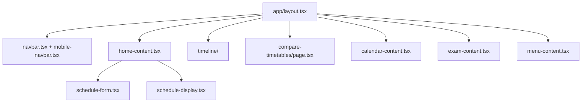
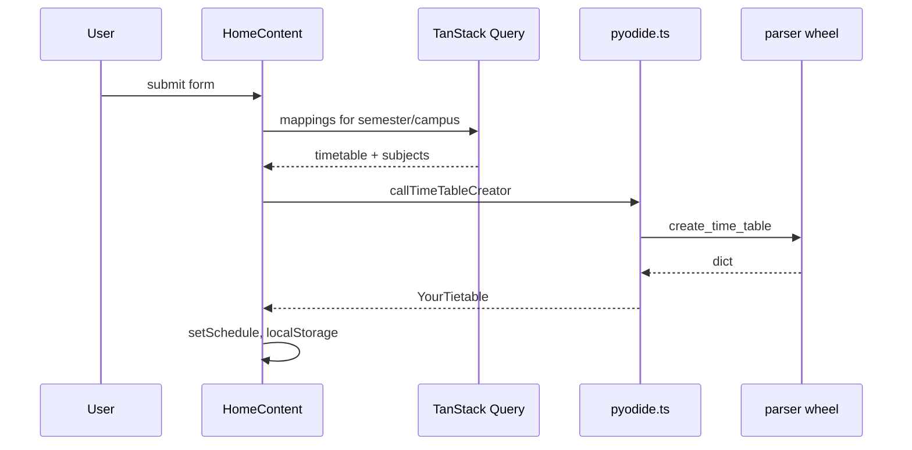
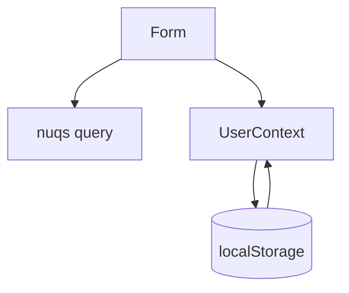
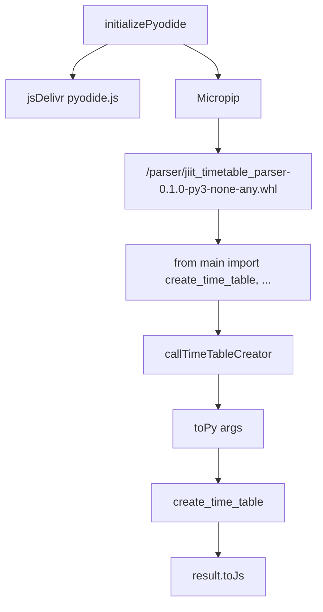
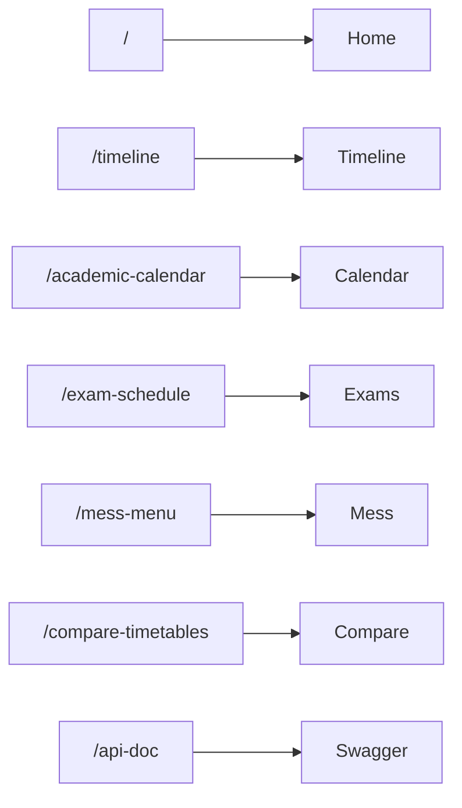
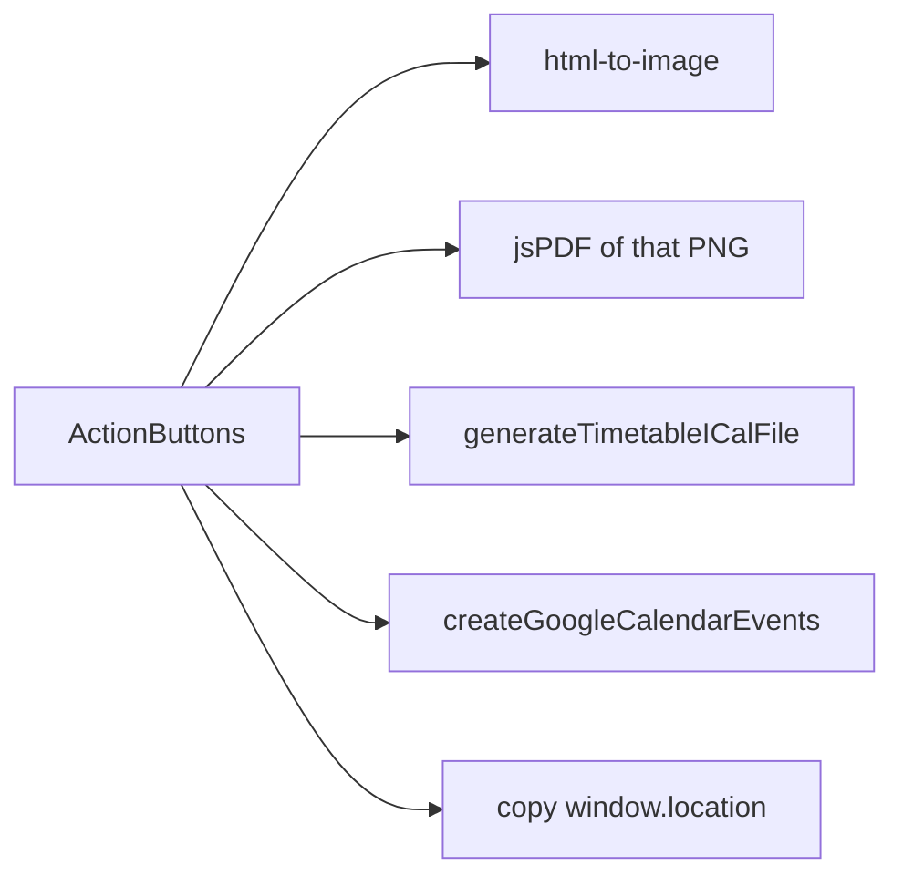
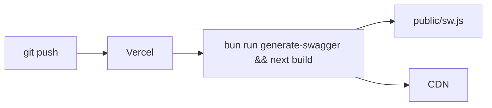

# System architecture

The site is a Next.js 16 App Router app. Schedule math runs in the browser with Pyodide. API routes read static JSON. Vercel hosts it.

Subsystem docs:

* Frontend and routing: [3.1](3.1-frontend-architecture-and-routing)
* Pyodide: [3.2](3.2-pyodide-wasm-integration)
* PWA: [3.3](3.3-pwa-and-offline-capabilities)
* Types: [3.4](3.4-data-model-and-types)
* State: [3.5](3.5-state-management)

## Overview

Users pick campus, year, batch, and electives. The app fetches campus JSON from `/api/time-table/...`, then calls `create_time_table` inside Pyodide. Nothing about that path needs a Python server.

| Piece | Choice |
| --- | --- |
| App | Next.js 16, React 18, TypeScript |
| Python | Pyodide 0.27.0 + `jiit_timetable_parser` wheel |
| Data | `website/data/` JSON via `app/api/*` |
| State | Context, localStorage, nuqs |
| Routing | App Router (`website/app/`) |
| PWA | `@ducanh2912/next-pwa`, Workbox |
| Host | Vercel |

## Client-first, JSON on the side

API routes list files and return JSON. They do not parse batches. Mess menu is the exception: `/api/mess-menu` pulls two n8n URLs (Sector 62 and 128) and merges lunch.

Data paths:

| Source | Pattern |
| --- | --- |
| Timetable | `website/data/time-table/{year}/{SEMESTER}/{campus}.json` |
| Calendar | `website/data/calender/{yy1yy2}.json` |
| Exams | `website/data/exam/{year}/{SEMESTER}/T*.json` |
| Mess | `/api/mess-menu` (n8n), README also points at life2harsh JSON |

`DATA_DIR` in [`website/lib/data-path.ts`](https://github.com/tashifkhan/JIIT-time-table-website/blob/main/website/lib/data-path.ts) is `website/data` if it exists, otherwise `../data`.

## Campus routing

Year 1 matches the batch only. Year 2+ also requires the subject in `electives_subject_codes`.

## Component map

| Component | File | Job |
| --- | --- | --- |
| HomeContent | `website/components/home/home-content.tsx` | Generate schedule |
| ScheduleForm | `website/components/schedule/schedule-form.tsx` | Inputs, saved configs, portal login |
| ScheduleDisplay | `website/components/schedule/schedule-display.tsx` | Day cards, edit |
| TimelineView | `website/components/timeline/timeline.tsx` | Week/day grid |
| Compare page | `website/app/compare-timetables/page.tsx` | Two configs, free slots |
| CalendarContent | `website/components/academic-calendar/calendar-content.tsx` | Events + GCal |
| ExamContent | `website/components/exam-schedule/exam-content.tsx` | Search / my exams |
| Navbar | `website/components/layout/navbar.tsx` | Desktop sidebar + swipe |

## Generation pipeline

First successful generation is run twice (`numExecutions === 0`) because the first Pyodide call can return a bad result.

## State

Keys: `cachedSchedule`, `cachedScheduleParams`, `classConfigs`, `editedSchedule`.

## Python in the page

Legacy `callPythonFunction(functionName, ...)` still exists. Home and compare use `callTimeTableCreator` / `callCompareTimetables`.

## Routes

`/timeline` shows `TimelineLanding` until a schedule exists in context or `cachedSchedule`.

## Integrations

| Service | Where |
| --- | --- |
| jsDelivr Pyodide | `website/utils/pyodide.ts` |
| Google Calendar | `website/utils/calendar.ts`, `calendar-AC.ts` |
| PostHog | `providers.tsx`, rewrite `/ph/*` |
| Vercel Analytics | `providers.tsx` |
| Mess sources | `N8N_URI`, `N8N_128_URI`; life2harsh JSON documented in README |

## Export

PNG/PDF navigate to `/timeline?download=1` and capture `#schedule-display`.

## Deploy

Live URL: [https://jiit-timetable.tashif.codes/](https://jiit-timetable.tashif.codes/). PWA files are generated into `website/public/`.
