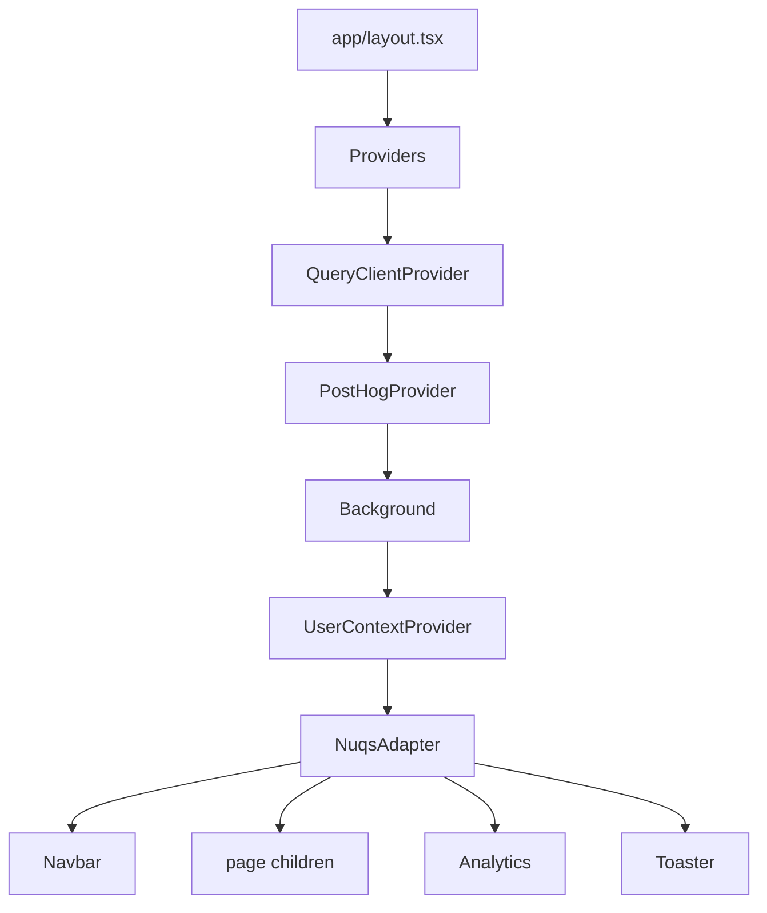
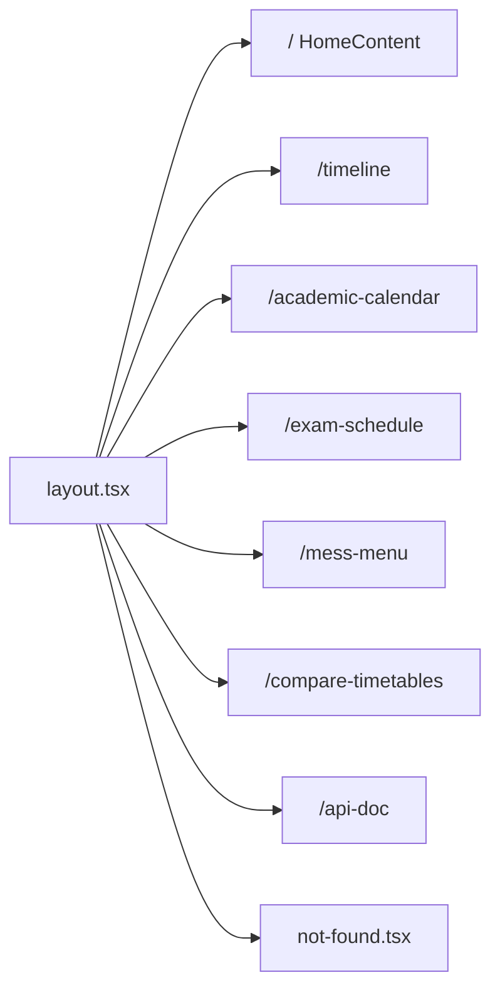
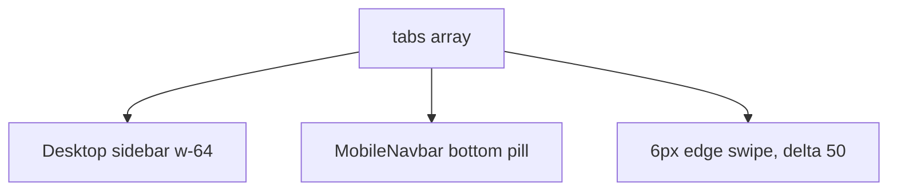
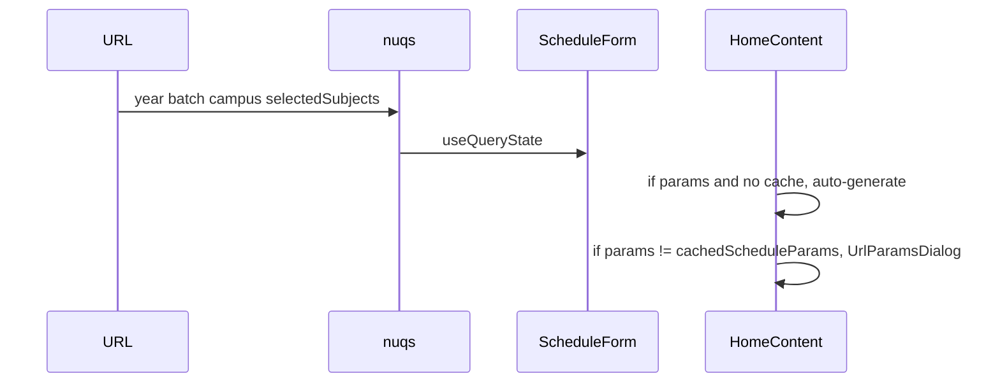
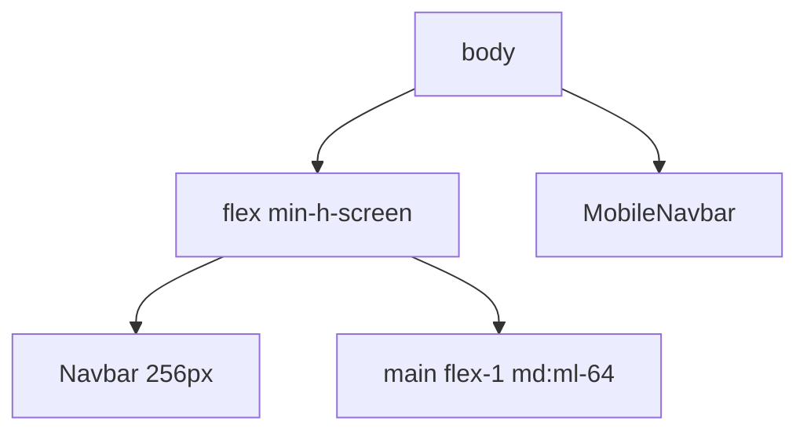

# Frontend architecture and routing

Next.js 16 App Router pages, shared layout, and `nuqs` for schedule query state.

See [Schedule generation](4-schedule-generation-(core-feature)), [Timeline view](5-timeline-view), [Academic calendar](6-academic-calendar), [Compare timetables](7-compare-timetables), [Mess menu](8-mess-menu). State: [3.5](3.5-state-management). URLs: [9.3](9.3-shareable-urls-and-configuration-saving).

## Entry

[`website/app/layout.tsx`](https://github.com/tashifkhan/JIIT-time-table-website/blob/main/website/app/layout.tsx) sets metadata, PWA manifest, Google scripts, Geist fonts, then wraps children in `Providers` and a sidebar + main column.



| Provider | Job |
| --- | --- |
| QueryClientProvider | `/api/*` cache, no refetch on focus |
| PostHogProvider | `NEXT_PUBLIC_POSTHOG_KEY`, host `/ph` |
| Background | Visual layer |
| UserContextProvider | `schedule` / `editedSchedule` |
| NuqsAdapter | `nuqs/adapters/next/app` |

There is no `BrowserRouter`. Navigation uses `next/link` and `useRouter`.

## Routes



| Path | File | UI |
| --- | --- | --- |
| `/` | `app/page.tsx` | `HomeContent` |
| `/timeline` | `app/timeline/page.tsx` | `TimelineWrapper` |
| `/academic-calendar` | `app/academic-calendar/page.tsx` | `CalendarContent` |
| `/exam-schedule` | `app/exam-schedule/page.tsx` | `ExamContent` |
| `/mess-menu` | `app/mess-menu/page.tsx` | `MenuContent` |
| `/compare-timetables` | `app/compare-timetables/page.tsx` | compare page |
| `/api-doc` | `app/api-doc/page.tsx` | Swagger UI |
| API | `app/api/*/route.ts` | JSON |

`vercel.json` only rewrites PostHog. App Router handles the rest. Catch-all 404 is `app/not-found.tsx`.

## Navigation

Tabs in [`website/components/layout/navbar.tsx`](https://github.com/tashifkhan/JIIT-time-table-website/blob/main/website/components/layout/navbar.tsx):

```ts
export const tabs = [
  { label: "Create Timetable", mobileLabel: "Create", path: "/", icon: Calendar },
  { label: "Timeline", mobileLabel: "Timeline", path: "/timeline", icon: Clock },
  { label: "Mess Menu", mobileLabel: "Menu", path: "/mess-menu", icon: Utensils },
  { label: "Academic Calendar", mobileLabel: "Calendar", path: "/academic-calendar", icon: Calendar },
  { label: "Exam Schedule", mobileLabel: "Exams", path: "/exam-schedule", icon: BookOpen },
  { label: "Compare Timetables", mobileLabel: "Compare", path: "/compare-timetables", icon: GitCompare },
];
```



Swipe is off on `/timeline` so it does not fight the calendar. Desktop is `md:flex` fixed left. Mobile is `md:hidden` bottom bar. Main content uses `md:ml-64` and `pb-24` on small screens.

Active tab: exact match for `/`, prefix match otherwise.

## URL state



`UrlParamsDialog` actions: generate from URL, prefill form, or keep the cached schedule.

## Layout



## State vs route

| Route | Context |
| --- | --- |
| `/` | Read/write `schedule`, persist `cachedSchedule` |
| `/timeline` | Read `editedSchedule \|\| schedule` |
| `/compare-timetables` | Local page state, can load `classConfigs` |
| `/academic-calendar`, `/exam-schedule`, `/mess-menu` | Independent queries |

Only home writes the shared schedule. Timeline hydrates from `cachedSchedule` if context is empty.
