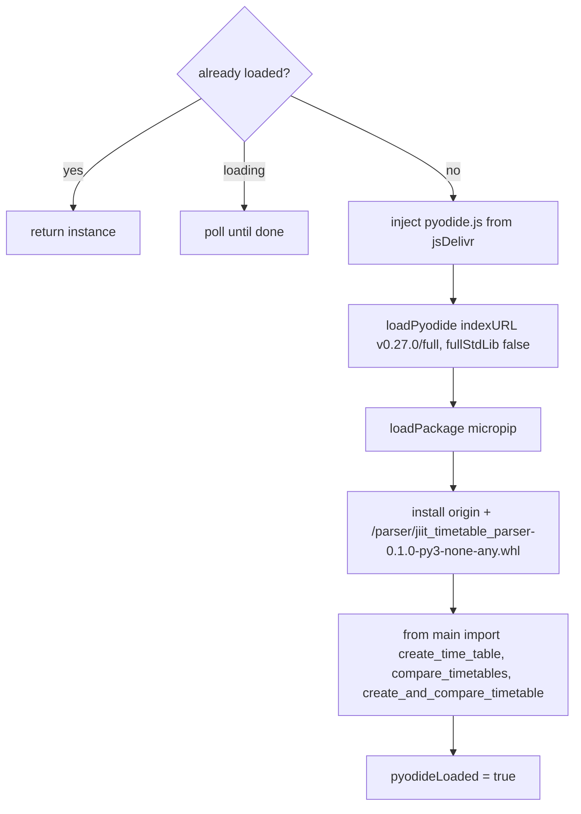
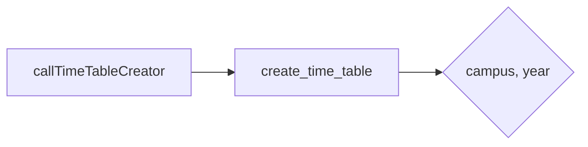
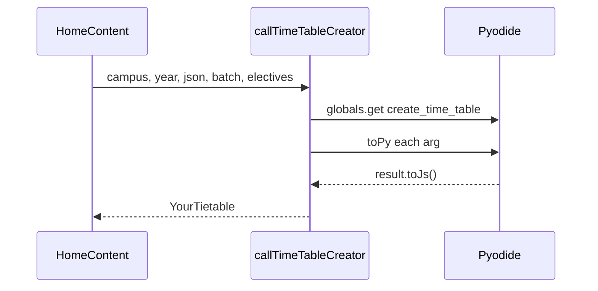
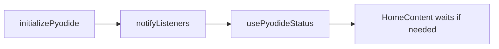

# Pyodide WASM integration

Pyodide 0.27.0 runs the `parser/` package in the browser. See [Python processing pipeline](4.2-python-processing-pipeline) and [Schedule generation](4-schedule-generation-(core-feature)).

## Pieces

| Piece | Location | Job |
| --- | --- | --- |
| Init + bridge | `website/utils/pyodide.ts` | Load runtime, install wheel, call functions |
| Wheel | `website/public/parser/jiit_timetable_parser-0.1.0-py3-none-any.whl` | `create_time_table`, compare APIs |
| Status hook | `usePyodideStatus` | loading / loaded / error |

Module-level flags keep a single instance:

```text
pyodideInstance, pyodideLoading, pyodideLoaded, pyodideError, listeners
```

## Init



CDN: `https://cdn.jsdelivr.net/pyodide/v0.27.0/full/`. Workbox CacheFirst stores it for a year in production.

The old path fetched `/_creator.py` and called named functions from JS. That file and `website/public/modules/BE62_creator.py` / `BE128_creator.py` still exist in `public/` (the SW precaches them) but `initializePyodide` no longer executes them.

## Campus dispatch (Python)



| Campus | Year 1 | Year 2+ |
| --- | --- | --- |
| 62 | `time_table_creator` | `time_table_creator_v2` |
| 128 | `bando_year1` | `banado` |
| BCA | `creator_year1` | `creator` |

JS does not pick the function name anymore.

## Call path



Exports:

* `callTimeTableCreator(campus, year, args)`
* `callCompareTimetables(tt1, tt2)` used by the compare page
* `callCompareAndCreate(params_list)` wraps `create_and_compare_timetable`
* `callPythonFunction(name, args)` deprecated

## Status



`HomeContent` calls `initializePyodide()` on mount. Submit waits if `loaded` is still false.

## Wheel layout

```text
parser/
├── main.py
├── models/          ClassInfo, Subject, enums
├── utils/           batch, subject, location, time
└── modules/
    ├── tt_parsers/  sector_62, sector_128, BCA
    └── compare_tt/  compare_timetables
```

Rebuild with `uv run python -m build --wheel` in `parser/` and copy the wheel into `website/public/parser/`.
