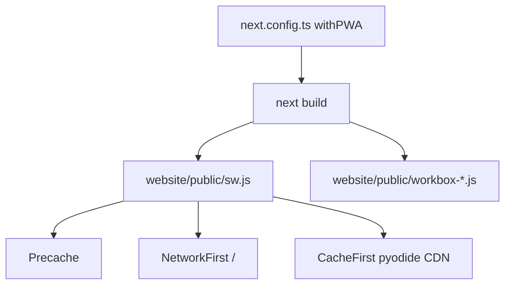
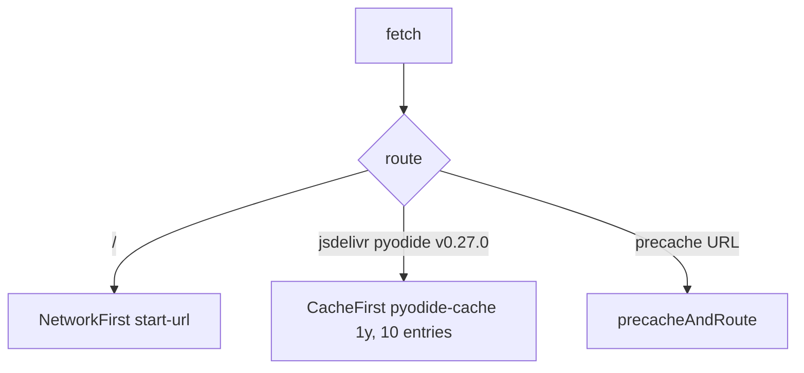
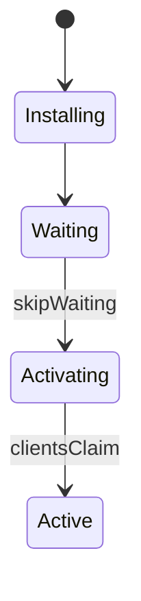

# PWA and offline capabilities

Workbox service worker generated into `website/public/sw.js`. Related: [Frontend](3.1-frontend-architecture-and-routing), [Pyodide](3.2-pyodide-wasm-integration).

After the first production visit you can generate a timetable, open a cached schedule, and run Pyodide if the WASM files are in `pyodide-cache`.

## Config

[`website/next.config.ts`](https://github.com/tashifkhan/JIIT-time-table-website/blob/main/website/next.config.ts) wraps Next with `@ducanh2912/next-pwa`:

| Option | Value |
| --- | --- |
| dest | `public` |
| register | true |
| skipWaiting | true |
| disable | development |

Manifest: [`website/public/manifest.json`](https://github.com/tashifkhan/JIIT-time-table-website/blob/main/website/public/manifest.json). Name "JIIT Time Table Website", standalone, theme `#F0BB78`, background `#131010`, icons from `icon.png`. Layout metadata points `manifest` at `/manifest.json`.

## Precache

Build writes a hashed list into `sw.js`. Typical entries:

| Kind | Example |
| --- | --- |
| Next chunks | `/_next/static/chunks/*.js` |
| CSS / fonts | `/_next/static/css/*`, `/_next/static/media/*.woff2` |
| PWA | `/icon.png`, `/manifest.json` |
| Legacy Python | `/_creator.py`, `/modules/BE62_creator.py`, `/modules/BE128_creator.py` |

The live parser is the wheel under `/parser/`. If a new build does not list the wheel, first offline generation still needs a prior network fetch of that file.

## Strategies

NetworkFirst on `/` prefers a live document, then `start-url`. Opaque redirects are rewritten to status 200.

CacheFirst for `^https://cdn.jsdelivr.net/pyodide/v0.27.0/full/.*` is set in `workboxOptions.runtimeCaching`. Statuses 0 and 200 are stored.

`cleanupOutdatedCaches()` drops old precache generations. `skipWaiting` + `clientsClaim` activate the new worker immediately.

## Lifecycle

Disabled in `next dev`. Test offline against a production build.

## What works offline

| Feature | After first load |
| --- | --- |
| Cached schedule grid / timeline | Yes (`cachedSchedule`) |
| Generate if JSON + wheel + Pyodide cached | Yes |
| Academic calendar / exam JSON | If those API responses were cached |
| Mess menu | Needs network unless previously cached |
| Google Calendar | Needs network |
| PostHog | Needs network |

Install from the browser using the manifest. `appleWebApp` metadata is set on the root layout.
