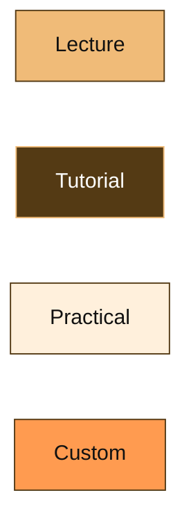
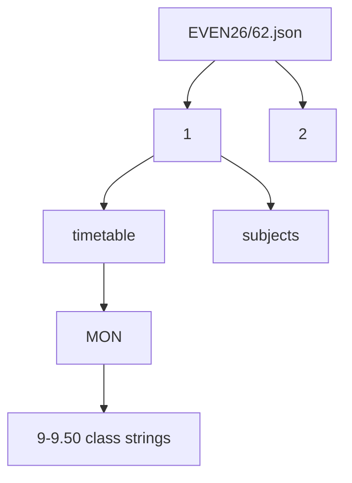
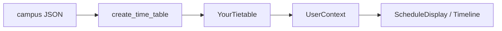

# Data model and types

TypeScript types for generated schedules, raw JSON, exams, and subjects. Related: [State](3.5-state-management), [Python pipeline](4.2-python-processing-pipeline).

## YourTietable

[`website/types/index.ts`](https://github.com/tashifkhan/JIIT-time-table-website/blob/main/website/types/index.ts):

```ts
interface YourTietable {
  [day: string]: {
    [timeSlot: string]: {
      subject_name: string;
      type: "L" | "T" | "P" | "C";
      location: string;
    };
  };
}
```

Days in the Python output are full names (`Monday`). Raw JSON uses `MON`. `WeekSchedule` in `types/schedule.ts` is the same nested shape.

## Class types



| Code | Source | Card color (Tailwind) |
| --- | --- | --- |
| L | parser | `#F0BB78` |
| T | parser | `#543A14` |
| P | parser | `#FFF0DC` |
| C | EditEventDialog | `#FF9B50` |

Python `ClassType` in `parser/models/enums.py` is the same union. `ClassInfo` is a dataclass: `subject_name`, `type`, `location`.

## Raw timetable JSON

Files: `website/data/time-table/{year}/{SEMESTER}/{campus}.json` with campus `62`, `128`, or `BCA`.



Year keys `"1"`…`"4"` (BCA up to `"3"`). Each year:

```json
{
  "timetable": {
    "MON": {
      "9-9.50": ["TA4(CI121)-TS10/APR", "PA5(PH271)-PL1/MKC"]
    }
  },
  "subjects": [
    { "Code": "CI121", "Full Code": "24B11CI121", "Subject": "..." }
  ]
}
```

Activity strings pack batch, type letter, subject code, room, faculty. The parser splits them.

## Subjects

[`website/types/subject.ts`](https://github.com/tashifkhan/JIIT-time-table-website/blob/main/website/types/subject.ts) and form `Subject`:

| Field | Meaning |
| --- | --- |
| Code | Short code used in electives |
| Full Code | Catalog code |
| Subject | Display name |

## Context

```ts
schedule: YourTietable | null
editedSchedule: (YourTietable cells + isCustom?) | null
```

Edits copy the base schedule, then overlay. Display uses `editedSchedule || schedule`.

## Exams

[`website/types/exam.ts`](https://github.com/tashifkhan/JIIT-time-table-website/blob/main/website/types/exam.ts):

```ts
interface ExamEntry {
  subject_code: string;
  subject_type: "L" | "T" | "P";
  subject_name: string;
  exam_date: string; // DD-MM-YYYY
  exam_time: string;
  exam_day: string;
  semesters: number[];
  exam_type: string;
}
```

On-disk JSON still has `semester` as a string like `"2, 4"`. The UI normalizes that to `semesters`.

## Academic calendar

```ts
{ summary: string; start: { date: string }; end: { date: string } }
```

Holidays are titles that start with `Holiday -`.

## Mess

```ts
menu: {
  [dayLabel: string]: {
    Breakfast: string;
    Lunch: string;
    Lunch128?: string;
    Dinner: string;
  };
}
```

Day keys look like `Monday 01.08.25`.

## Type flow



Raw slots stay strings until Python. After `toJs()`, TypeScript treats the object as `YourTietable`.
