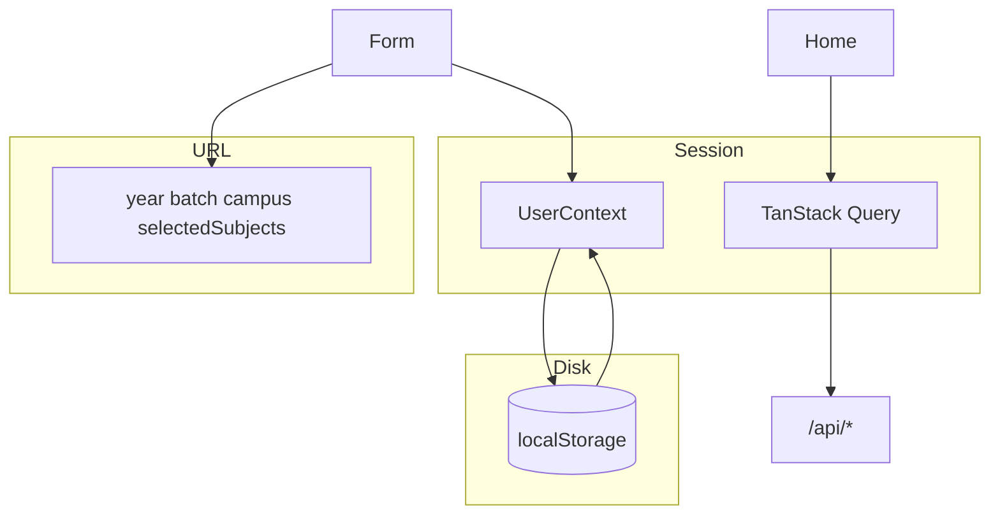
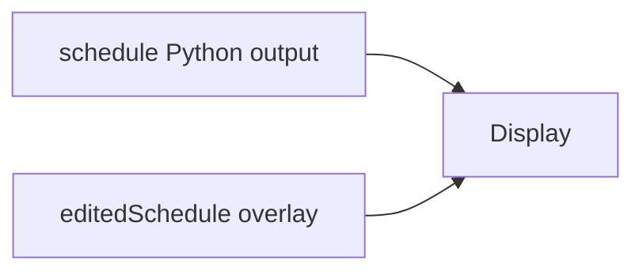
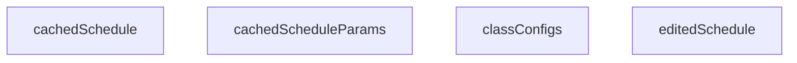
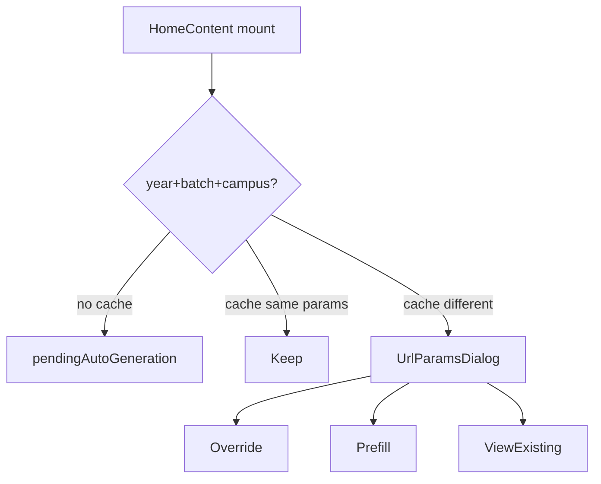

# State management

Three layers: React Context at runtime, localStorage across sessions, nuqs in the URL.

Related: [Data model](3.4-data-model-and-types), [Python pipeline](4.2-python-processing-pipeline).

## Layers



## UserContext

[`website/context/userContext.ts`](https://github.com/tashifkhan/JIIT-time-table-website/blob/main/website/context/userContext.ts) and [`userContextProvider.tsx`](https://github.com/tashifkhan/JIIT-time-table-website/blob/main/website/context/userContextProvider.tsx):



| Field | Role |
| --- | --- |
| schedule | Last generated timetable |
| editedSchedule | Edits and custom events |
| setters | `setSchedule`, `setEditedSchedule` |

Display components use `editedSchedule || schedule`. A new generate call sets `editedSchedule` to null.

The provider loads `editedSchedule` from localStorage on mount and writes it back whenever it changes. Null clears the key.

## localStorage



| Key | Shape |
| --- | --- |
| `cachedSchedule` | `YourTietable` |
| `cachedScheduleParams` | `{ year, batch, campus, selectedSubjects }` |
| `classConfigs` | `{ [name]: { year, batch, campus, selectedSubjects, electiveCount? } }` |
| `editedSchedule` | edited `YourTietable` |
| `timelineWelcomeDismissed` | `"1"` |

`HomeContent` hydrates `schedule` from `cachedSchedule` and writes it whenever the object is non-empty. After generate it also writes `cachedScheduleParams` for URL conflict checks.

Named configs live in `classConfigs`. The form can save, load, delete, and share them.

## nuqs

On home:

```text
year, batch, campus  parseAsString
electiveCount        parseAsInteger
selectedSubjects     parseAsArrayOf(parseAsString)
```



Override queues the same auto-generate path. Prefill only fills the form.

## Query cache

[`website/hooks/use-api.ts`](https://github.com/tashifkhan/JIIT-time-table-website/blob/main/website/hooks/use-api.ts):

| Hook | Endpoint | staleTime |
| --- | --- | --- |
| useTimeTables | `/api/time-table` | 24h |
| useBatchMappings | `/api/time-table/{sem}/{batch}` | 5 min |
| useAcademicYears / Calendar | `/api/academic-calendar` | 24h |
| useExamSemesters / Schedule | `/api/exam-schedule` | 24h |
| useMessMenu | `/api/mess-menu` | 1h |

Default semester is `ODD26` when present (`lib/constants.ts` + `getSmartSemester`). Default academic year is `2627`.
