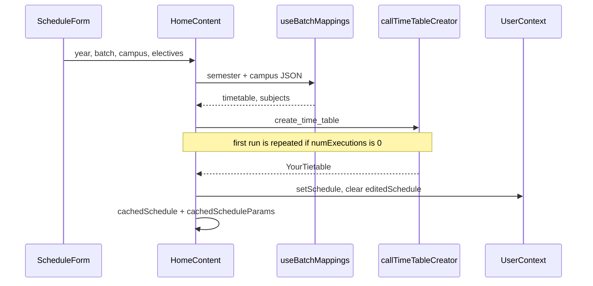
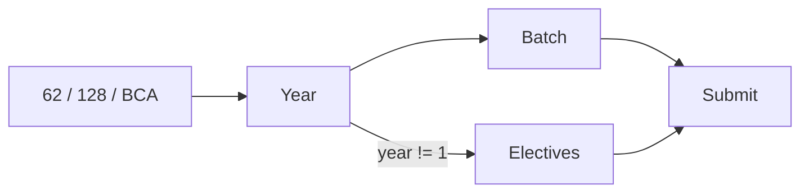
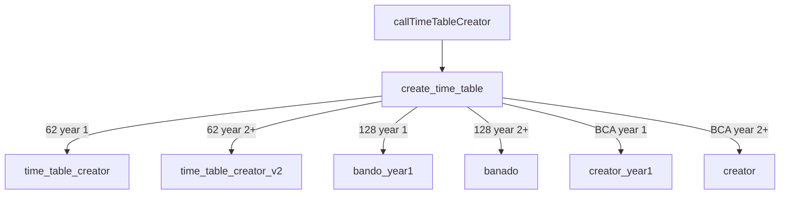

# Schedule generation (core feature)

Campus, year, batch, and electives become a weekly grid. Python in Pyodide does the filtering. Related: [Schedule form](4.1-schedule-form-and-user-input), [Python pipeline](4.2-python-processing-pipeline), [Display](4.3-schedule-display-and-editing).

## Flow



## Who does what

| Piece | File | Job |
| --- | --- | --- |
| ScheduleForm | `website/components/schedule/schedule-form.tsx` | Inputs, batch regex, Fuse search, saved configs, optional WebPortal login |
| HomeContent | `website/components/home/home-content.tsx` | Fetch JSON, call Pyodide, persist |
| callTimeTableCreator | `website/utils/pyodide.ts` | JS ↔ Python |
| create_time_table | `parser/main.py` | Campus/year dispatch |
| Campus creators | `parser/modules/tt_parsers/*` | Filter rows |
| UserContext | `website/context/` | Global schedule |

There is no `App.tsx`. Home is the orchestrator.

## Inputs



Batch checks in `handleSubmit`:

| Campus | Rule | Examples |
| --- | --- | --- |
| 62 | reject `^[DFH]|BBA|BCA|BSC|MCA|MBA|^[E]` | A6, B12, G2 |
| 128 | must `^[EFGH]` | E4, F12 |
| BCA | `^BCA\d*$` | BCA1 |

Year > 1 uses `SubjectSelector` (exact substring first, then Fuse.js threshold 0.4).

`useWebPortal` can log into the JIIT portal (`jsjiit`) and fill campus, year, batch, and matching subject codes.

## Python routing



Year 1 keeps classes whose batch list includes the student. Year 2+ also requires `is_enrolled_subject`.

## JSON

`useTimeTables` lists semesters. Default is `ODD26` when that folder exists. `useBatchMappings` loads each campus file for the semester (`62.json`, `128.json`, `BCA.json`). Home then reads `mapping[year].timetable` and `.subjects`.

On-disk: `website/data/time-table/2026/ODD26/62.json` (year directory + semester). API hides the year folder: `/api/time-table/ODD26/62`.

## Persistence after generate

* `setEditedSchedule(null)`
* `setSchedule` with `JSON.parse(JSON.stringify(result))` so Pyodide proxies do not leak
* `cachedSchedule`, `cachedScheduleParams`
* Auto-scroll to the grid

If Python throws, Home stores `{}`.

## Double run

The first Pyodide execution in a session can return garbage. `HomeContent` tracks `numExecutions` and, when it is still 0, calls `evaluteTimeTable` again before committing.

## Output

```json
{
  "Monday": {
    "09:00-10:00": {
      "subject_name": "Data Structures",
      "type": "L",
      "location": "G7"
    }
  }
}
```
