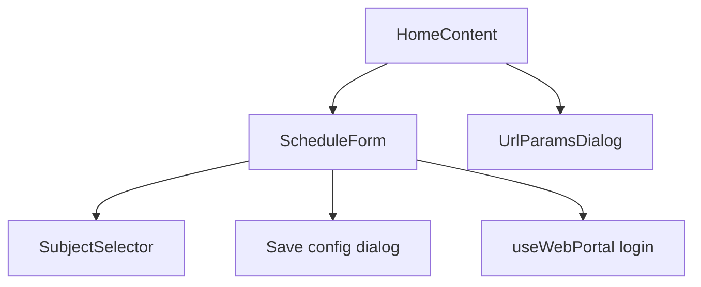
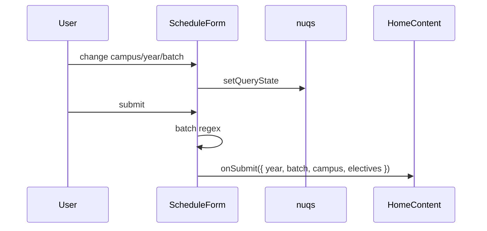

# Schedule form and user input

Related: [Python pipeline](4.2-python-processing-pipeline), [Display](4.3-schedule-display-and-editing), [Shareable URLs](9.3-shareable-urls-and-configuration-saving).

## Components

`ScheduleForm` lives in [`website/components/schedule/schedule-form.tsx`](https://github.com/tashifkhan/JIIT-time-table-website/blob/main/website/components/schedule/schedule-form.tsx). `SubjectSelector` is exported from the same file.

## Fields

| Field | nuqs key | Notes |
| --- | --- | --- |
| Campus | `campus` | `62`, `128`, `BCA` |
| Year | `year` | 1–4 (BCA 1–3) |
| Batch | `batch` | uppercased |
| Subjects | `selectedSubjects` | codes, needed when year ≠ 1 |

## Batch validation

| Campus | Allowed | Invalid |
| --- | --- | --- |
| 62 | A, B, C, G, H + number | F4, E7, BBA1 |
| 128 | E, F, G, H + number | A6 |
| BCA | BCA + digits | A1 |

Failures open a small dialog (`batchError`) instead of calling `onSubmit`.

## SubjectSelector

Fuse.js keys: `Subject` (0.7), `Code` (0.3), `Full Code` (0.2), threshold 0.4. Results: exact substring matches first (starts-with boosted), then unique fuzzy hits.

## Saved configs

`classConfigs` in localStorage. Save requires a unique name. Load calls `handleSelectConfig` on home, which writes nuqs state and `handleFormSubmit`. Delete removes the key. Share copies a URL with the same query params.

## WebPortal fill

`useWebPortal` dynamically imports `jsjiit`, logs in with enrollment + password, maps campus/year/batch from the profile, and intersects portal subject codes with the JSON `subjects` list.

## URL dialog

When the URL has year, batch, and campus, and `cachedScheduleParams` differ, `UrlParamsDialog` offers:

* Generate from URL
* Prefill form
* Keep cached schedule

Codes in `selectedSubjects` are split on commas and de-duplicated before display.
