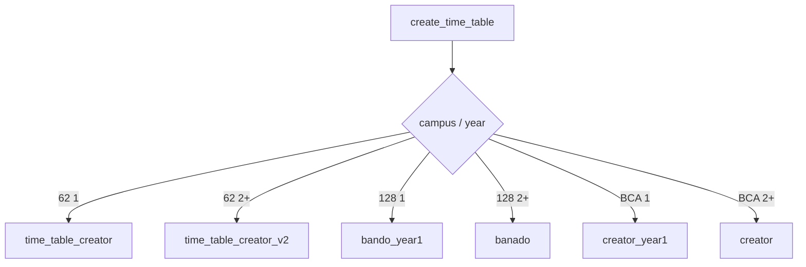
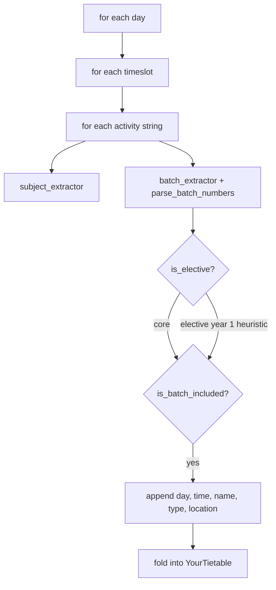
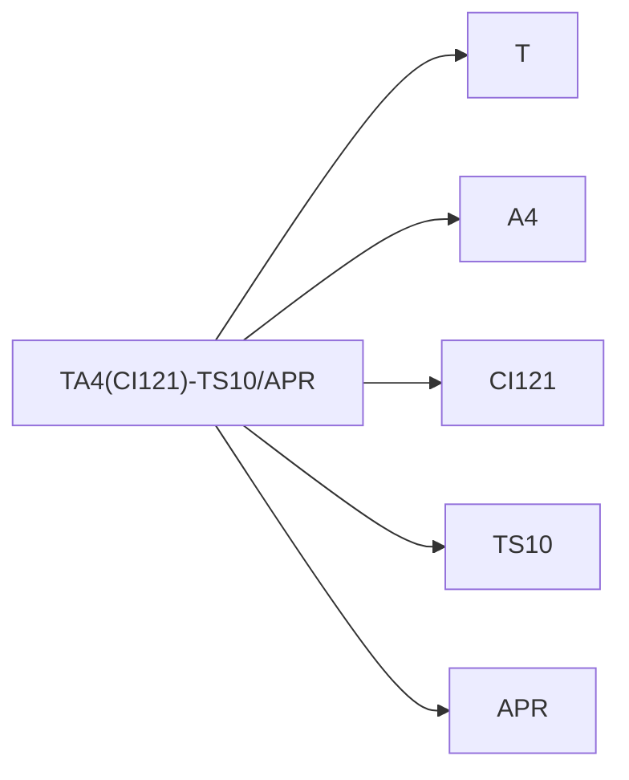
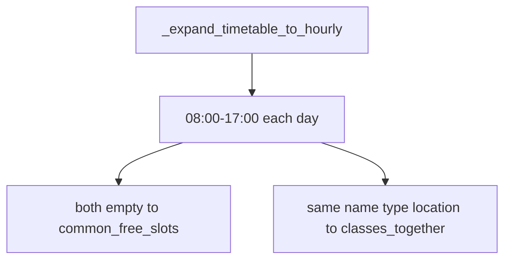
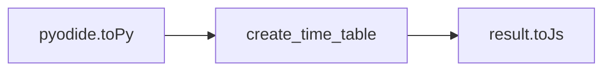

# Python processing pipeline

The `parser/` package, loaded as a wheel in Pyodide. Related: [Pyodide](3.2-pyodide-wasm-integration), [Schedule generation](4-schedule-generation-(core-feature)).

## Public API

[`parser/main.py`](https://github.com/tashifkhan/JIIT-time-table-website/blob/main/parser/main.py):

* `create_time_table(campus, year, time_table_json, subject_json, batch, electives_subject_codes)`
* `compare_timetables(tt1, tt2)`
* `create_and_compare_timetable([params1, params2])`

Campus modules:

* `parser/modules/tt_parsers/sector_62/creator.py`
* `parser/modules/tt_parsers/sector_128/creator.py`
* `parser/modules/tt_parsers/BCA/creator.py`

## Inner loop (Sector 62 year 1)

Year 2+ uses `is_enrolled_subject(code, electives_subject_codes)` instead of the year-1 elective heuristic.

## Batch parsing

[`parser/utils/batch.py`](https://github.com/tashifkhan/JIIT-time-table-website/blob/main/parser/utils/batch.py) `parse_batch_numbers`:

| Input | Result |
| --- | --- |
| empty / MINOR | A–D, G, H |
| `A15A17` | `A15`, `A17` |
| `ABC` | `A`, `B`, `C` |
| `A1-A10` | range |
| `ECE,CSE` | mapped to A, B |

BCA and 128 have extra extractors in their `utils.py`.

## Activity strings

Example: `TA4(CI121)-TS10/APR`

`subject_extractor` takes the parenthesis (or dash fallback). `location_extractor` takes the room after `-`. Type is the leading L/T/P.

## Electives

Year 1 `is_elective` treats some batch patterns as electives so they still attach when the batch matches. Year 2+ only keeps subjects whose code is in the form list.

`subject_name_extractor` matches `Code` or several slices of `Full Code`.

## Time and day

[`parser/utils/time.py`](https://github.com/tashifkhan/JIIT-time-table-website/blob/main/parser/utils/time.py):

* `process_day`: `MON` → `Monday`
* `process_timeslot`: `9-9.50` or `10:00-10:50 AM` → `09:00`, `10:00` (24h). Practicals can span two hours.

## Compare

[`parser/modules/compare_tt/compare.py`](https://github.com/tashifkhan/JIIT-time-table-website/blob/main/parser/modules/compare_tt/compare.py):

Multi-hour blocks split into 1-hour keys first.

## JS bridge

Home JSON-clones the result so Proxies do not survive into React state.

## Complexity

Per student this is O(days × slots × classes on that campus JSON). Fine in WASM. The expensive part is the first Pyodide download, not the loop.
