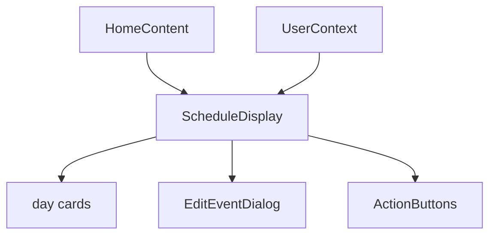
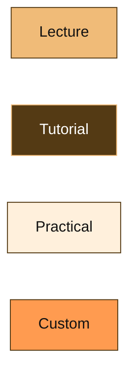
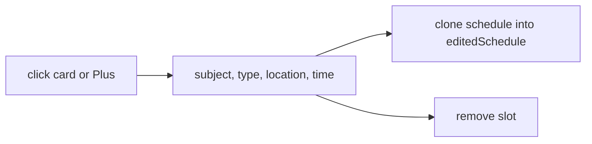
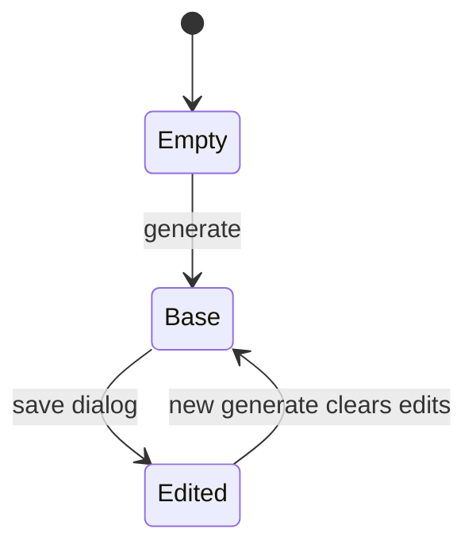

# Schedule display and editing

Grid of day cards, inline edits, custom events. Related: [Timeline](5-timeline-view), [Export](9-export-and-sharing).

## Architecture

[`website/components/schedule/schedule-display.tsx`](https://github.com/tashifkhan/JIIT-time-table-website/blob/main/website/components/schedule/schedule-display.tsx) renders `editedSchedule || schedule`. The capture root is `#schedule-display`.

## Grid

1 column on phones, 2 from `md`, 3 from `lg`. Each day is a glass card. Slots sort by time string. `formatTime` only inserts spaces around `-`.

## Colors

Labels: Lecture, Tutorial, Practical, Custom.

## Event card

Subject, type badge, clock + formatted range, pin + location. Edit icon opens the dialog with `{ day, time, event }`. Plus on the day header opens the same dialog with an empty event (custom).

## EditEventDialog

[`website/components/timeline/edit-event-dialog.tsx`](https://github.com/tashifkhan/JIIT-time-table-website/blob/main/website/components/timeline/edit-event-dialog.tsx)

Save writes `editedSchedule` (copy of current display, then mutate). Custom rows set `type: "C"` and `isCustom`. Delete drops that timeslot. Provider persists `editedSchedule`.

## Action buttons

[`website/components/timeline/action-buttons.tsx`](https://github.com/tashifkhan/JIIT-time-table-website/blob/main/website/components/timeline/action-buttons.tsx) on the grid: PNG, PDF, iCal, Google Calendar, copy URL, jump to `/timeline`. Exports use `editedSchedule || schedule`. PNG/PDF go to `/timeline?download=1` first.

## Context lifecycle

