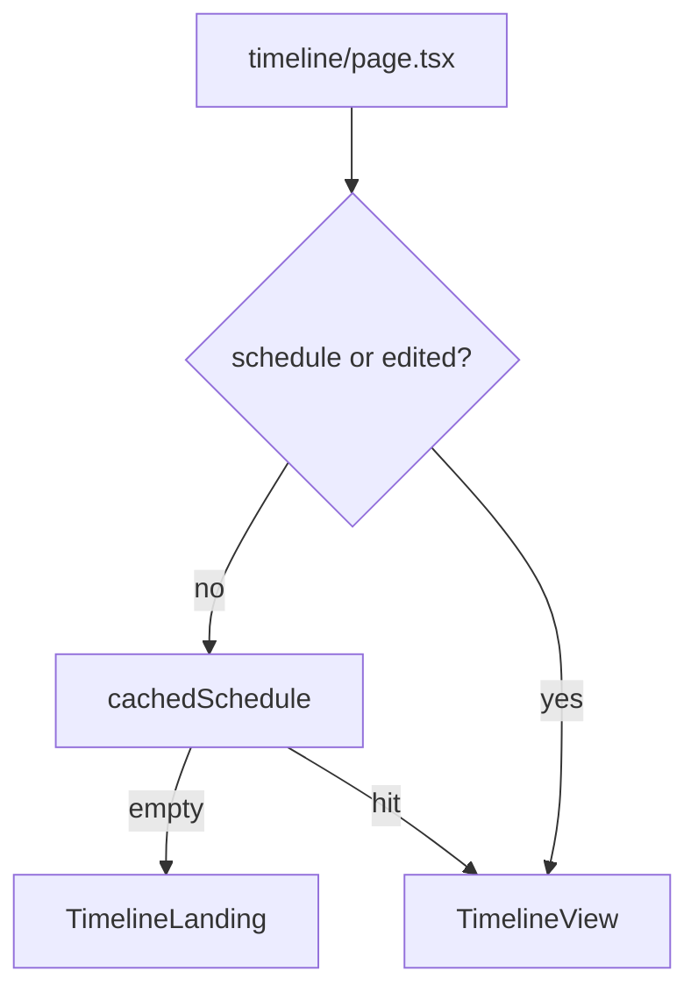
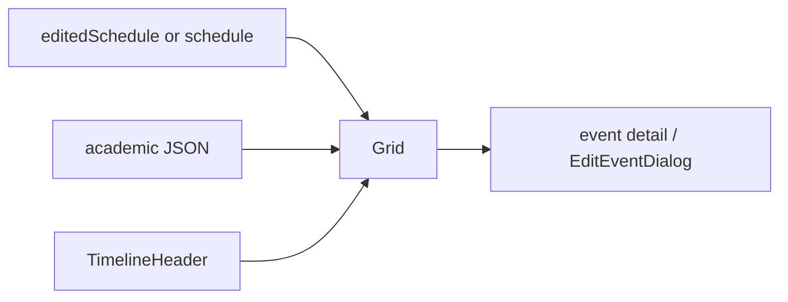

# Timeline view

Week or day grid of the current schedule, plus academic-calendar chips. Related: [Display](4.3-schedule-display-and-editing), [PDF/PNG](9.2-pdf-and-png-export).

## Wrapper

[`website/app/timeline/page.tsx`](https://github.com/tashifkhan/JIIT-time-table-website/blob/main/website/app/timeline/page.tsx) hydrates `cachedSchedule` into context. No schedule → `TimelineLanding` (CTA back to `/`). Else `TimelineView`.

## TimelineView

[`website/components/timeline/timeline.tsx`](https://github.com/tashifkhan/JIIT-time-table-website/blob/main/website/components/timeline/timeline.tsx)

| Behavior | Detail |
| --- | --- |
| View | `week` or `day`; phones default to day |
| Download | `?download=1` forces week |
| Now line | current time in the day column |
| Academic events | `useAcademicCalendar(defaultYear)` |
| Welcome | dismissed via `timelineWelcomeDismissed` |

## Layout

Desktop week: time gutter + six day columns (Mon–Sat), hours about 8:00–18:00. Blocks position from parsed start/end. Type colors match the home grid. Swipe navigation is disabled on this route so horizontal pan stays on the calendar.

## Download mode

`ActionButtons` navigates to `/timeline?download=1`. The view locks to week, hides chrome that would pollute the PNG, and `#schedule-display` is captured by `html-to-image`.

## Header

[`timeline-header.tsx`](https://github.com/tashifkhan/JIIT-time-table-website/blob/main/website/components/timeline/timeline-header.tsx) switches day/week, steps the date, and hosts export controls. [`google-calendar-button.tsx`](https://github.com/tashifkhan/JIIT-time-table-website/blob/main/website/components/timeline/google-calendar-button.tsx) syncs the week.
