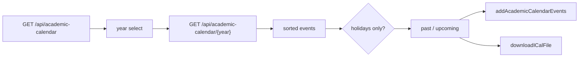

# Academic calendar

Institutional dates from JSON, holiday filter, Google Calendar and iCal. Related: [Schedule generation](4-schedule-generation-(core-feature)), [Google Calendar](9.1-google-calendar-integration).

## Flow



[`website/components/academic-calendar/calendar-content.tsx`](https://github.com/tashifkhan/JIIT-time-table-website/blob/main/website/components/academic-calendar/calendar-content.tsx) uses `useAcademicYears`, `useAcademicCalendar`, `useDefaultAcademicYear`. Default year is `2627` when that file exists.

## Data

Files: `website/data/calender/2425.json`, `2526.json`, `2627.json` (note the directory spelling `calender`).

```ts
{ summary: string; start: { date: string }; end: { date: string } }
```

API year list maps `2627` → label `2026-27`. Event route reads `{year}.json` from `DATA_DIR/calender`.

Holidays: `summary.startsWith("Holiday -")`.

## UI state

| State | Role |
| --- | --- |
| selectedYear | query key |
| showHolidaysOnly | filter |
| visibleEventsCount | progressive reveal |
| isLoading | GCal sync |

Upcoming vs past split on `start.date` vs today. A divider scrolls into view.

## Sync

[`website/utils/calendar-AC.ts`](https://github.com/tashifkhan/JIIT-time-table-website/blob/main/website/utils/calendar-AC.ts) builds all-day VEVENTs (`VALUE=DATE`, end = next day). Google path uses GSI + Calendar API, same client ID as the timetable button. iCal download is local.

This feature does not read `UserContext`.
