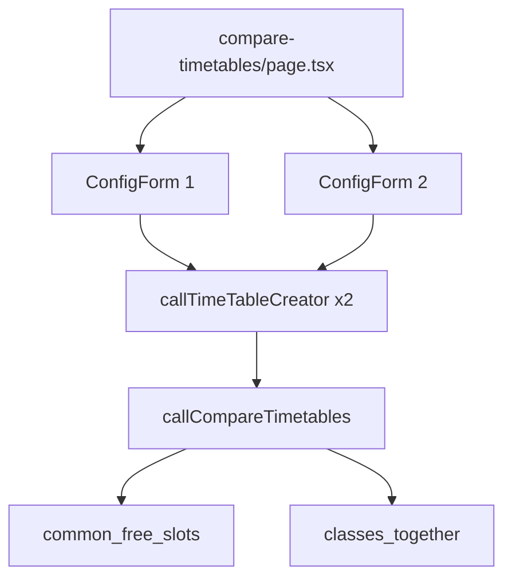
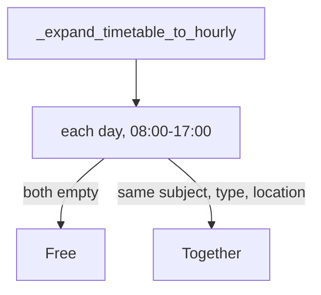

# Compare timetables

Two configs, two generated grids, common free hours and shared classes. Route: `/compare-timetables`.

## Architecture



The page does **not** use `create_and_compare_timetable`. It generates both tables in JS (`Promise.all`) then calls `compare_timetables`. `callCompareAndCreate` exists in `pyodide.ts` but this route ignores it.

State is local: `config1`, `config2`, electives, `timetable1/2`, `compareResult`. Saved `classConfigs` can fill either side.

## Generate

Same JSON as home: `useTimeTables` + `useBatchMappings`. Each config supplies campus, year, batch, electives. Empty mapping yields empty JSON and a blank table.

## Compare algorithm



Hourly expansion splits `10:00-12:00` into two keys so a 2-hour lab lines up with a 1-hour lecture.

Result:

```ts
{
  common_free_slots: { Monday: ["12:00-13:00"] },
  classes_together: { Tuesday: { "10:00-11:00": { subject_name, type, location } } }
}
```

## UI

Two collapsible forms (campus, year, batch, `SubjectSelector`). Compare button runs generation. Results list free slots sorted by time, then shared classes. `TimetableModal` can show either generated table.

Errors set `compareResult.error`. Missing Pyodide init is handled by `initializePyodide()` before the calls.
