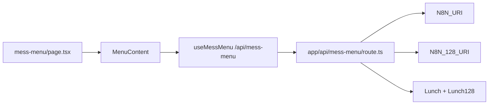
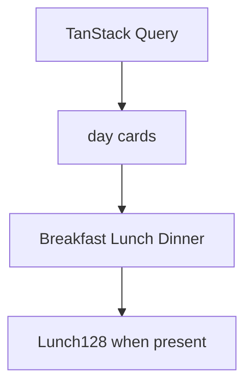

# Mess menu

Weekly meals for Sector 62 and 128. Route: `/mess-menu`. Related: [Academic calendar](6-academic-calendar).

## Flow



README source of truth for published JSON: `https://raw.githubusercontent.com/life2harsh2/data/main/mess_menu.json` ([@life2harsh](https://github.com/life2harsh)). The route itself fetches two n8n URLs (`N8N_URI`, `N8N_128_URI`), revalidate 3600s, and merges 128 lunch into `Lunch128`.

## Shape

```ts
menu: {
  "Monday 01.08.25": {
    Breakfast: string;
    Lunch: string;
    Lunch128?: string | null;
    Dinner: string;
  };
}
```

Keys are `DayName dd.mm.yy`. `MenuContent` parses that date, flags a menu whose Sunday is already past, and counts how many days stale it is.

## UI

[`website/components/mess-menu/menu-content.tsx`](https://github.com/tashifkhan/JIIT-time-table-website/blob/main/website/components/mess-menu/menu-content.tsx)



Independent of `UserContext`. Query `staleTime` is 1 hour. Offline only if the SW cached that GET.
