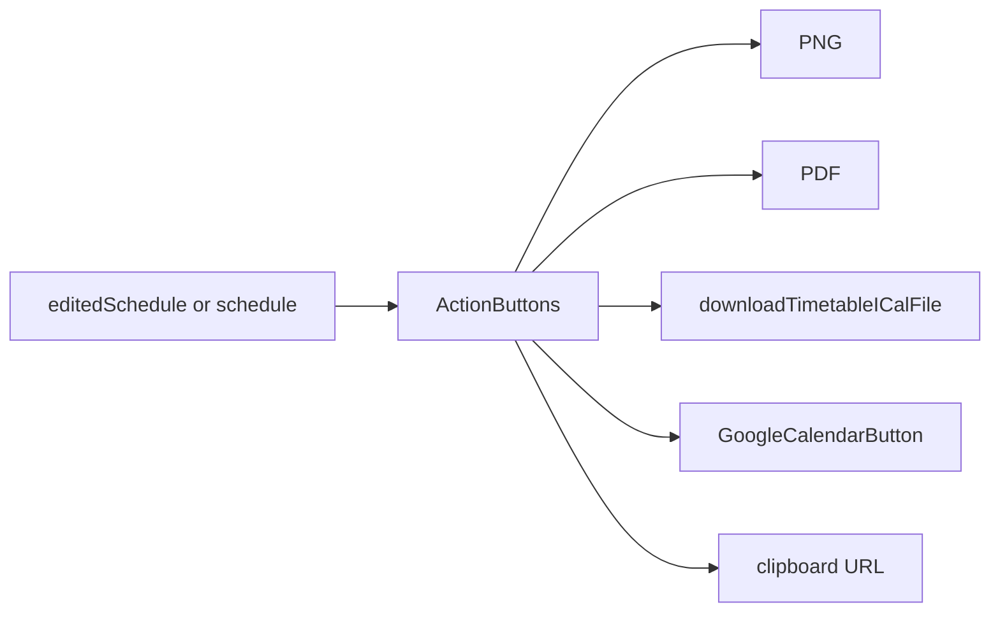
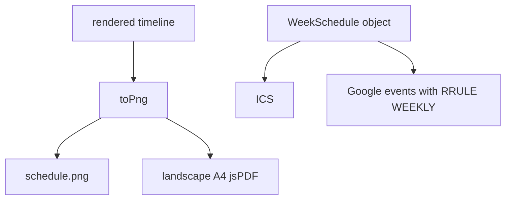

# Export and sharing

PNG, PDF, iCal, Google Calendar, and query-string links. Child pages: [9.1](9.1-google-calendar-integration), [9.2](9.2-pdf-and-png-export), [9.3](9.3-shareable-urls-and-configuration-saving).

## Overview

All exports prefer `editedSchedule` when it exists.

[`website/components/timeline/action-buttons.tsx`](https://github.com/tashifkhan/JIIT-time-table-website/blob/main/website/components/timeline/action-buttons.tsx)

| Type | Function | Library |
| --- | --- | --- |
| PNG | `downloadAsPng` | html-to-image |
| PDF | `downloadAsPdf` | jsPDF + PNG capture |
| iCal | `downloadTimetableICalFile` | `utils/calendar.ts` |
| Google | `createGoogleCalendarEvents` | GSI + Calendar v3 |
| Link | `navigator.clipboard.writeText` | current URL (nuqs params) |

PNG/PDF push `/timeline?download=1`, wait, capture `#schedule-display`. Toasts report progress.

## Capture vs calendar

Image export is a screenshot. Calendar export is structured events in Asia/Kolkata, weekly until ~5 months out. Custom (`C`) events skip RRULE.

## Share

Copying the URL shares generation params, not the edited overlay. Named configs are a second path (localStorage + optional share URL). See [9.3](9.3-shareable-urls-and-configuration-saving).
