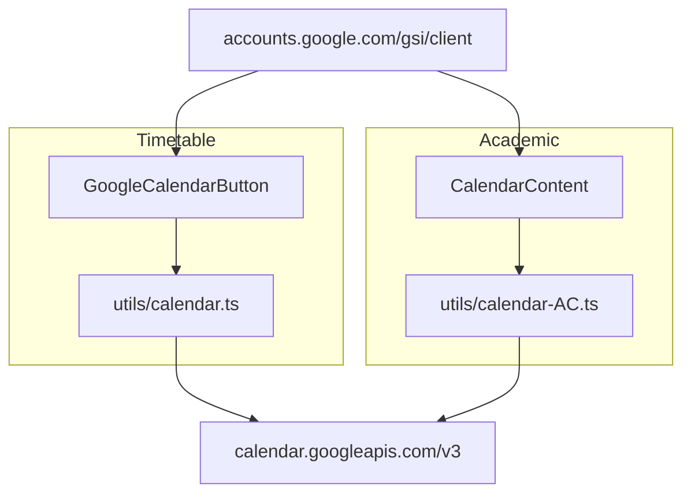
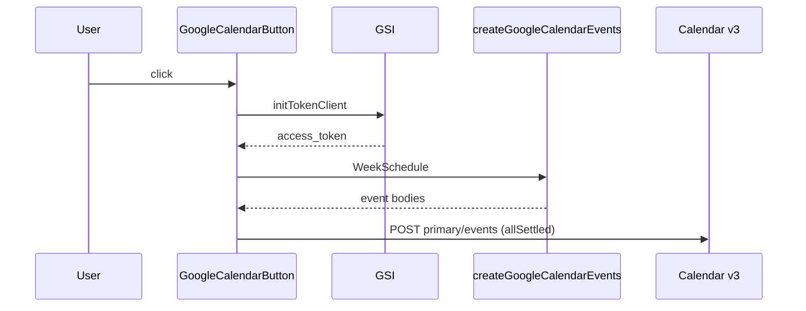

# Google Calendar integration

Two paths: weekly classes from the timetable, and all-day academic events. Related: [Academic calendar](6-academic-calendar), [PNG/PDF](9.2-pdf-and-png-export).

## Split

Layout already injects `apis.google.com/js/api.js` and GSI. The button also appends GSI on mount.

## Timetable button

[`website/components/timeline/google-calendar-button.tsx`](https://github.com/tashifkhan/JIIT-time-table-website/blob/main/website/components/timeline/google-calendar-button.tsx)

`NEXT_PUBLIC_GOOGLE_CLIENT_ID`, scope `https://www.googleapis.com/auth/calendar.events`, popup, `hosted_domain: gmail.com`.

## Event shape (classes)

[`website/utils/calendar.ts`](https://github.com/tashifkhan/JIIT-time-table-website/blob/main/website/utils/calendar.ts)

* `DTSTART` / `DTEND` next occurrence of that weekday, `Asia/Kolkata`
* Summary: `{type} - {subject_name}`
* Location from the slot
* `RRULE:FREQ=WEEKLY;UNTIL=` ~5 months, skipped for `type === "C"`
* Same module can download a `.ics` without OAuth

## Academic events

[`website/utils/calendar-AC.ts`](https://github.com/tashifkhan/JIIT-time-table-website/blob/main/website/utils/calendar-AC.ts)

All-day `VALUE=DATE`. End is the day after `end.date`. Holiday titles get a different color hint where the API allows it. iCal download does not need OAuth.

## Failures

`Promise.allSettled` on class POSTs. Partial failure alerts "Some events could not be added". Token errors log and alert. No server-side refresh token.
