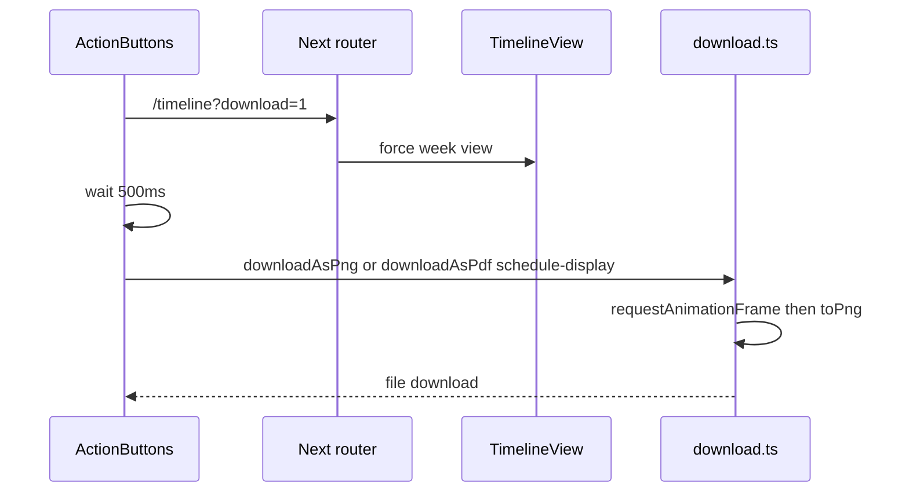
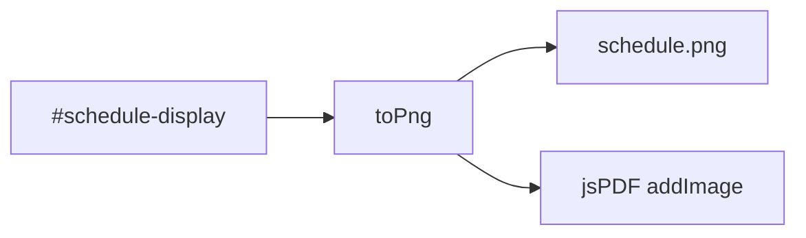

# PDF and PNG export

Screenshot of the timeline, saved as PNG or wrapped in a landscape PDF. Related: [Shareable URLs](9.3-shareable-urls-and-configuration-saving), [Google Calendar](9.1-google-calendar-integration).

## Pipeline

Missing `#schedule-display` toasts "Schedule not found".

## downloadAsPng

[`website/utils/download.ts`](https://github.com/tashifkhan/JIIT-time-table-website/blob/main/website/utils/download.ts)

* `toPng` from html-to-image
* `backgroundColor: #131010`
* `pixelRatio: devicePixelRatio || 2`
* `skipFonts: true`
* callbacks `onProgress`, `onSuccess`, `onError`

## downloadAsPdf

Same capture, then `jsPDF` landscape A4 (297×210 mm). The PNG is scaled to the page. Filename `schedule.pdf`.

This is a picture of the DOM, not a selectable text timetable. Google Calendar / iCal is the structured export.
