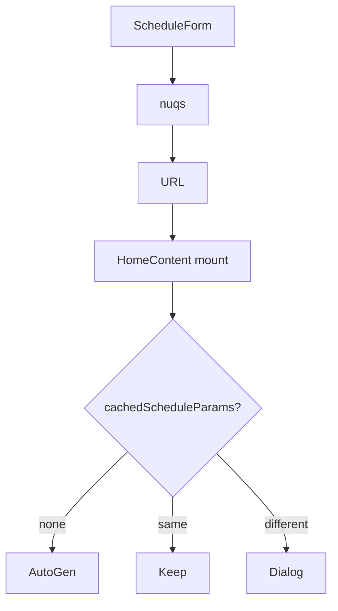
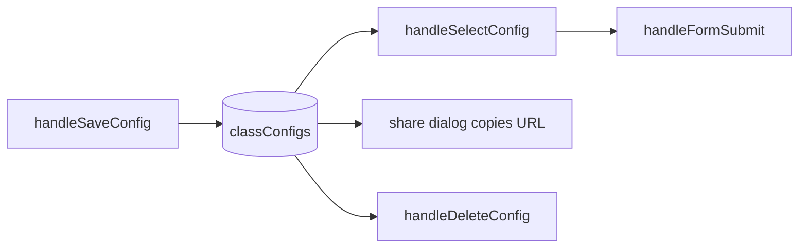

# Shareable URLs and configuration saving

Query params recreate a generate, named presets live in localStorage. Related: [State](3.5-state-management), [Schedule form](4.1-schedule-form-and-user-input).

## Two mechanisms

1. **URL.** `nuqs` writes year, batch, campus, selectedSubjects.
2. **classConfigs.** Named objects in localStorage.

Edits in `editedSchedule` are not encoded in the URL.

## Query schema

| Param | Parser |
| --- | --- |
| year | parseAsString |
| batch | parseAsString |
| campus | parseAsString |
| electiveCount | parseAsInteger |
| selectedSubjects | parseAsArrayOf(parseAsString) |

Example:

```http
https://jiit-timetable.tashif.codes/?year=2&batch=B12&campus=62&selectedSubjects=CS311,CI573
```



## Dialog

`UrlParamsDialog`: override (queue `pendingAutoGeneration`), prefill, or view existing. Subject codes are split on commas and mapped to names via the campus JSON.

Auto-generate waits until `mappings[campus][year]` exists so Pyodide is not called with empty tables.

## Named configs



Stored object: `{ year, batch, campus, selectedSubjects }`. Duplicate names are rejected. Compare page reads the same `classConfigs` key to fill either side.

## Copy link

`ActionButtons.handleShare` copies `window.location.href`. That is the nuqs URL of the current form, which may already match the generated params.
