# AI Agent System

<cite>
**Referenced Files in This Document**
- [agents/react_agent.py](file://agents/react_agent.py)
- [agents/react_tools.py](file://agents/react_tools.py)
- [core/llm.py](file://core/llm.py)
- [core/config.py](file://core/config.py)
- [prompts/browser_use.py](file://prompts/browser_use.py)
- [prompts/prompt_injection_validator.py](file://prompts/prompt_injection_validator.py)
- [tools/browser_use/tool.py](file://tools/browser_use/tool.py)
- [utils/agent_sanitizer.py](file://utils/agent_sanitizer.py)
- [routers/react_agent.py](file://routers/react_agent.py)
- [services/react_agent_service.py](file://services/react_agent_service.py)
- [models/requests/react_agent.py](file://models/requests/react_agent.py)
- [extension/entrypoints/utils/executeAgent.ts](file://extension/entrypoints/utils/executeAgent.ts)
- [extension/entrypoints/sidepanel/lib/agent-map.ts](file://extension/entrypoints/sidepanel/lib/agent-map.ts)
- [extension/entrypoints/utils/websocket-client.ts](file://extension/entrypoints/utils/websocket-client.ts)
</cite>

## Table of Contents
1. [Introduction](#introduction)
2. [Project Structure](#project-structure)
3. [Core Components](#core-components)
4. [Architecture Overview](#architecture-overview)
5. [Detailed Component Analysis](#detailed-component-analysis)
6. [Dependency Analysis](#dependency-analysis)
7. [Performance Considerations](#performance-considerations)
8. [Troubleshooting Guide](#troubleshooting-guide)
9. [Conclusion](#conclusion)
10. [Appendices](#appendices)

## Introduction
This document describes the AI Agent System that powers a reactive, tool-augmented reasoning loop for natural language instructions. Built on the LangGraph framework, the system orchestrates an agent that decides whether to answer directly or delegate to tools, iteratively refining its plan until completion. It integrates a broad toolset spanning web search, website analysis, YouTube Q&A, Gmail and Calendar operations, JIIT web portal attendance retrieval, and browser automation. The LLM provider abstraction supports multiple backends (OpenAI, Anthropic, Google, Ollama, DeepSeek, OpenRouter) while maintaining a model-agnostic design. A robust prompt engineering system supplies domain-specific instructions, and a sanitizer validates generated browser action plans. The system preserves conversation context, manages agent state, and coordinates multi-step workflows.

## Project Structure
The repository organizes functionality by concerns:
- agents: Reactive agent graph and tool integration
- core: LLM provider abstraction and configuration
- prompts: Domain-specific prompts and injection validation
- tools: Tool implementations and schemas
- services: Business logic and orchestration
- routers: API endpoints
- models: Request/response schemas
- utils: Utilities such as sanitization
- extension: Browser extension entrypoints and utilities

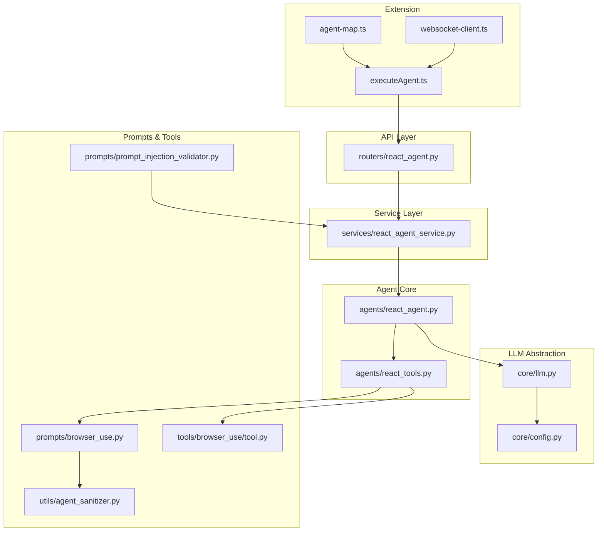

**Diagram sources**
- [agents/react_agent.py](file://agents/react_agent.py#L138-L180)
- [agents/react_tools.py](file://agents/react_tools.py#L609-L721)
- [core/llm.py](file://core/llm.py#L78-L170)
- [core/config.py](file://core/config.py#L1-L26)
- [prompts/browser_use.py](file://prompts/browser_use.py#L1-L138)
- [tools/browser_use/tool.py](file://tools/browser_use/tool.py#L1-L49)
- [utils/agent_sanitizer.py](file://utils/agent_sanitizer.py#L20-L96)
- [prompts/prompt_injection_validator.py](file://prompts/prompt_injection_validator.py#L1-L16)
- [routers/react_agent.py](file://routers/react_agent.py#L1-L57)
- [services/react_agent_service.py](file://services/react_agent_service.py#L1-L154)
- [extension/entrypoints/utils/executeAgent.ts](file://extension/entrypoints/utils/executeAgent.ts#L1-L299)
- [extension/entrypoints/sidepanel/lib/agent-map.ts](file://extension/entrypoints/sidepanel/lib/agent-map.ts#L1-L80)
- [extension/entrypoints/utils/websocket-client.ts](file://extension/entrypoints/utils/websocket-client.ts#L93-L132)

**Section sources**
- [agents/react_agent.py](file://agents/react_agent.py#L1-L191)
- [agents/react_tools.py](file://agents/react_tools.py#L1-L721)
- [core/llm.py](file://core/llm.py#L1-L215)
- [core/config.py](file://core/config.py#L1-L26)
- [prompts/browser_use.py](file://prompts/browser_use.py#L1-L138)
- [prompts/prompt_injection_validator.py](file://prompts/prompt_injection_validator.py#L1-L16)
- [tools/browser_use/tool.py](file://tools/browser_use/tool.py#L1-L49)
- [utils/agent_sanitizer.py](file://utils/agent_sanitizer.py#L1-L119)
- [routers/react_agent.py](file://routers/react_agent.py#L1-L57)
- [services/react_agent_service.py](file://services/react_agent_service.py#L1-L154)
- [models/requests/react_agent.py](file://models/requests/react_agent.py#L1-L45)
- [extension/entrypoints/utils/executeAgent.ts](file://extension/entrypoints/utils/executeAgent.ts#L1-L299)
- [extension/entrypoints/sidepanel/lib/agent-map.ts](file://extension/entrypoints/sidepanel/lib/agent-map.ts#L1-L80)
- [extension/entrypoints/utils/websocket-client.ts](file://extension/entrypoints/utils/websocket-client.ts#L93-L132)

## Core Components
- Reactive Agent Graph: Defines a LangGraph workflow with an agent node and a tool execution node, enabling conditional routing between reasoning and tool use.
- Tool Integration: Provides structured tools with typed schemas, dynamic composition based on context (tokens, session payloads), and robust async execution.
- LLM Provider Abstraction: Centralizes provider selection, model mapping, environment-driven configuration, and runtime client instantiation.
- Prompt Engineering: Supplies domain-specific prompts for browser automation and injection validation for safety.
- State Management: Maintains conversation context and message sequences for multi-turn interactions.
- Orchestration: Bridges the extension UI to backend APIs and services, capturing page context and assembling tool-ready payloads.

**Section sources**
- [agents/react_agent.py](file://agents/react_agent.py#L138-L180)
- [agents/react_tools.py](file://agents/react_tools.py#L609-L721)
- [core/llm.py](file://core/llm.py#L78-L170)
- [prompts/browser_use.py](file://prompts/browser_use.py#L1-L138)
- [prompts/prompt_injection_validator.py](file://prompts/prompt_injection_validator.py#L1-L16)
- [services/react_agent_service.py](file://services/react_agent_service.py#L16-L154)

## Architecture Overview
The system follows a layered architecture:
- Extension layer captures user intent, active tab context, and constructs payloads for backend endpoints.
- API layer exposes endpoints for agent orchestration and tool-specific operations.
- Service layer translates requests into agent state, injects context, and invokes the compiled LangGraph.
- Agent layer executes the reasoning loop, optionally invoking tools and returning final responses.
- Tool layer encapsulates domain capabilities with validated inputs and safe execution patterns.
- LLM abstraction provides a unified interface across providers and models.

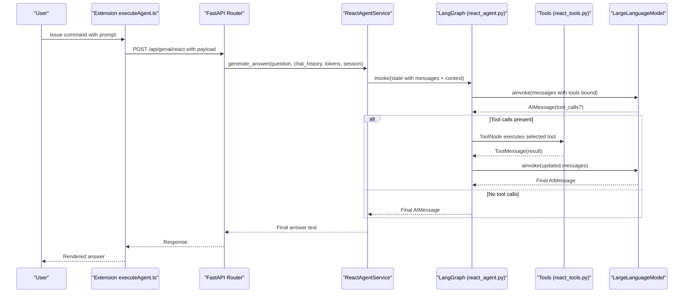

**Diagram sources**
- [extension/entrypoints/utils/executeAgent.ts](file://extension/entrypoints/utils/executeAgent.ts#L17-L127)
- [routers/react_agent.py](file://routers/react_agent.py#L18-L56)
- [services/react_agent_service.py](file://services/react_agent_service.py#L16-L154)
- [agents/react_agent.py](file://agents/react_agent.py#L123-L191)
- [agents/react_tools.py](file://agents/react_tools.py#L609-L721)
- [core/llm.py](file://core/llm.py#L78-L170)

## Detailed Component Analysis

### Reactive Agent Graph and State Management
The agent uses a LangGraph StateGraph with two nodes:
- Agent node: binds available tools to the LLM and generates a response.
- ToolNode: executes selected tools and returns results as ToolMessages.
Conditional edges route from agent to tool execution when tool_calls are detected, then back to the agent until completion.

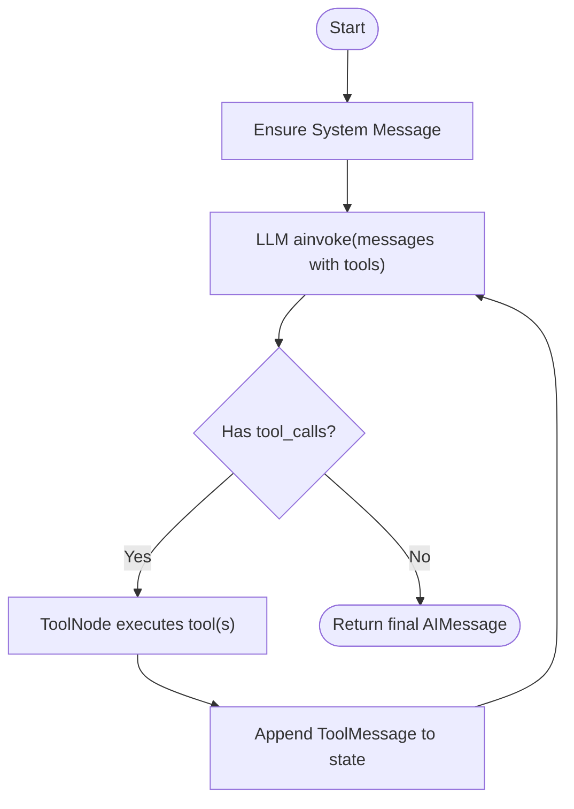

**Diagram sources**
- [agents/react_agent.py](file://agents/react_agent.py#L123-L170)

Key implementation highlights:
- AgentState defines a messages accumulator.
- Payload conversion helpers normalize content and preserve tool_calls and tool_call_id.
- GraphBuilder compiles the workflow once and caches it.
- run_react_agent converts external payloads to LangChain messages, invokes the graph, and returns normalized payloads.

**Section sources**
- [agents/react_agent.py](file://agents/react_agent.py#L40-L191)

### Tool Integration System
The tool system:
- Defines structured tools with Pydantic schemas for inputs.
- Dynamically composes tools from a base set, augmenting with Google and JIIT capabilities when context is provided.
- Executes tool coroutines asynchronously and formats results safely.

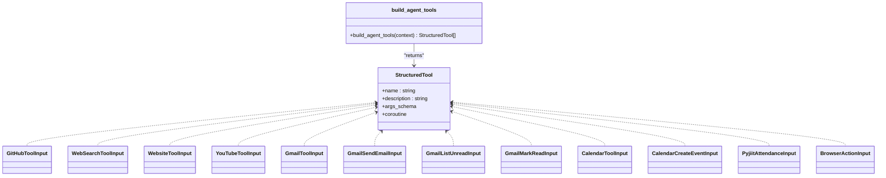

**Diagram sources**
- [agents/react_tools.py](file://agents/react_tools.py#L61-L721)

Tool selection and execution patterns:
- Tool selection is driven by the LLM’s tool_calls; LangGraph routes to ToolNode automatically.
- Execution runs in threads to keep LLM calls responsive.
- Results are normalized to text or JSON for downstream consumption.

**Section sources**
- [agents/react_tools.py](file://agents/react_tools.py#L217-L721)

### LLM Provider Abstraction and Model-Agnostic Design
The LLM abstraction centralizes provider configuration and client instantiation:
- Provider configs map provider names to LangChain chat model classes, default models, and environment variables.
- LargeLanguageModel initializes clients with environment-driven parameters and validates presence of required keys/base URLs.
- The agent uses a cached client instance, ensuring consistent model selection across the system.

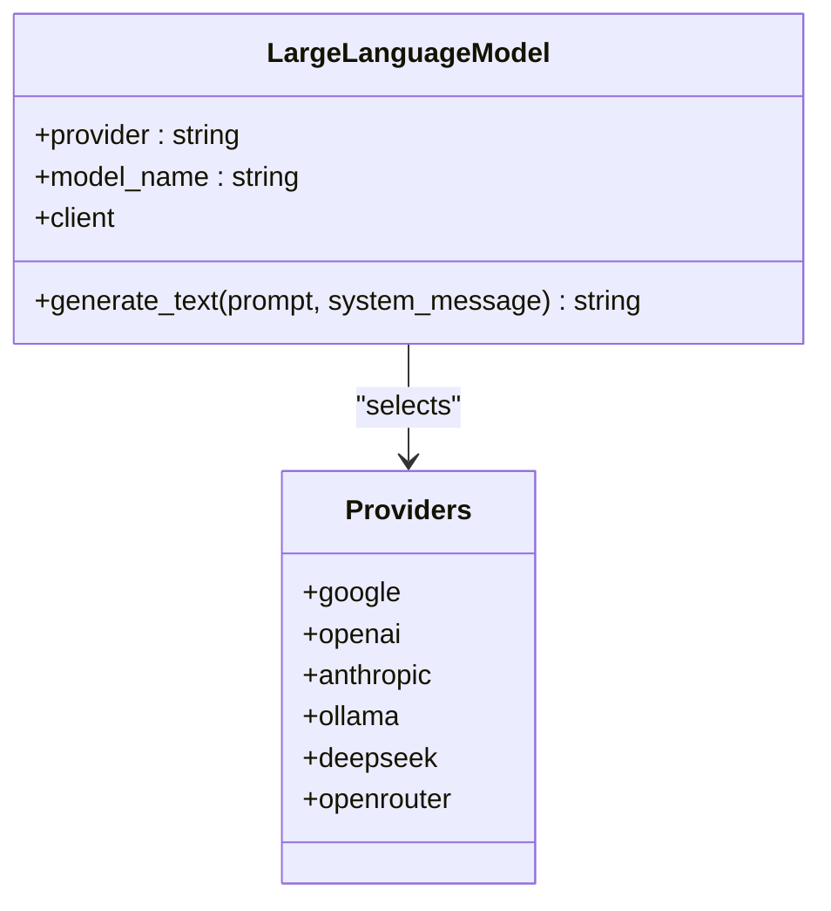

**Diagram sources**
- [core/llm.py](file://core/llm.py#L78-L170)
- [core/config.py](file://core/config.py#L1-L26)

Provider configuration and environment handling:
- API keys and base URLs are resolved from environment variables or provided parameters.
- Default models are provided per provider; errors guide users to configure missing values.

**Section sources**
- [core/llm.py](file://core/llm.py#L21-L170)
- [core/config.py](file://core/config.py#L1-L26)

### Prompt Engineering System and Injection Validation
Domain-specific prompts:
- Browser automation prompt defines actions, constraints, and JSON output expectations for generating reliable action plans.
- Other prompts support specialized tasks (e.g., website, YouTube, GitHub).

Injection validation:
- A validator prompt determines whether provided markdown text contains prompt injection attempts, returning a boolean decision.

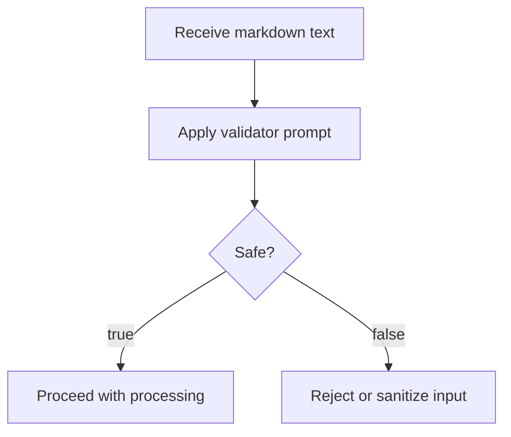

**Diagram sources**
- [prompts/browser_use.py](file://prompts/browser_use.py#L1-L138)
- [prompts/prompt_injection_validator.py](file://prompts/prompt_injection_validator.py#L1-L16)

**Section sources**
- [prompts/browser_use.py](file://prompts/browser_use.py#L1-L138)
- [prompts/prompt_injection_validator.py](file://prompts/prompt_injection_validator.py#L1-L16)

### Agent State Management and Conversation Context
The service layer:
- Builds AgentState from incoming chat history and question.
- Injects page context as a SystemMessage when client HTML is available.
- Logs message sequences for observability and invokes the graph.

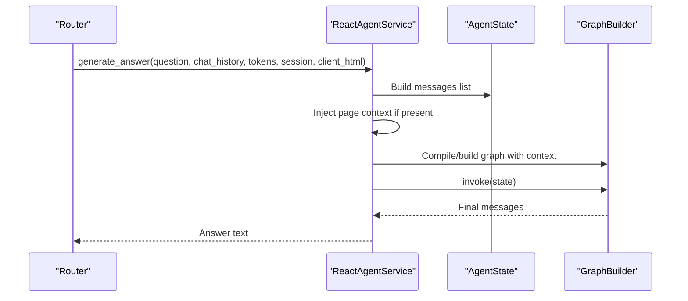

**Diagram sources**
- [services/react_agent_service.py](file://services/react_agent_service.py#L16-L154)
- [models/requests/react_agent.py](file://models/requests/react_agent.py#L10-L45)
- [agents/react_agent.py](file://agents/react_agent.py#L40-L191)

**Section sources**
- [services/react_agent_service.py](file://services/react_agent_service.py#L16-L154)
- [models/requests/react_agent.py](file://models/requests/react_agent.py#L10-L45)

### Multi-Step Workflow Orchestration
The workflow:
- Starts with a user question and optional chat history.
- Optionally augments with page context and tool availability.
- Iteratively decides between reasoning and tool execution until a final answer is produced.

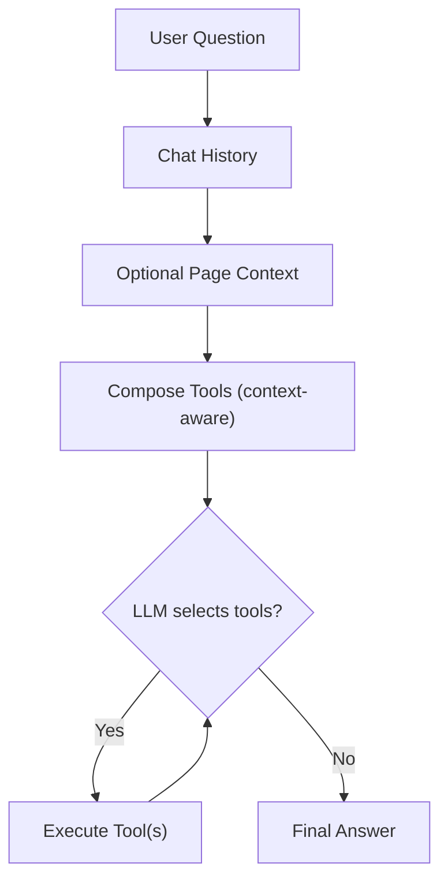

**Diagram sources**
- [services/react_agent_service.py](file://services/react_agent_service.py#L67-L154)
- [agents/react_agent.py](file://agents/react_agent.py#L123-L170)

**Section sources**
- [services/react_agent_service.py](file://services/react_agent_service.py#L67-L154)
- [agents/react_agent.py](file://agents/react_agent.py#L123-L170)

### Browser Action Generation and Safety
The browser action tool:
- Accepts a goal, optional target URL, DOM structure, and constraints.
- Delegates to a service that builds a chain using the browser automation prompt and LLM client.
- Returns a JSON action plan.

Safety validation:
- A sanitizer checks JSON structure, validates action types, and enforces required fields.
- Additional checks prevent dangerous script patterns.

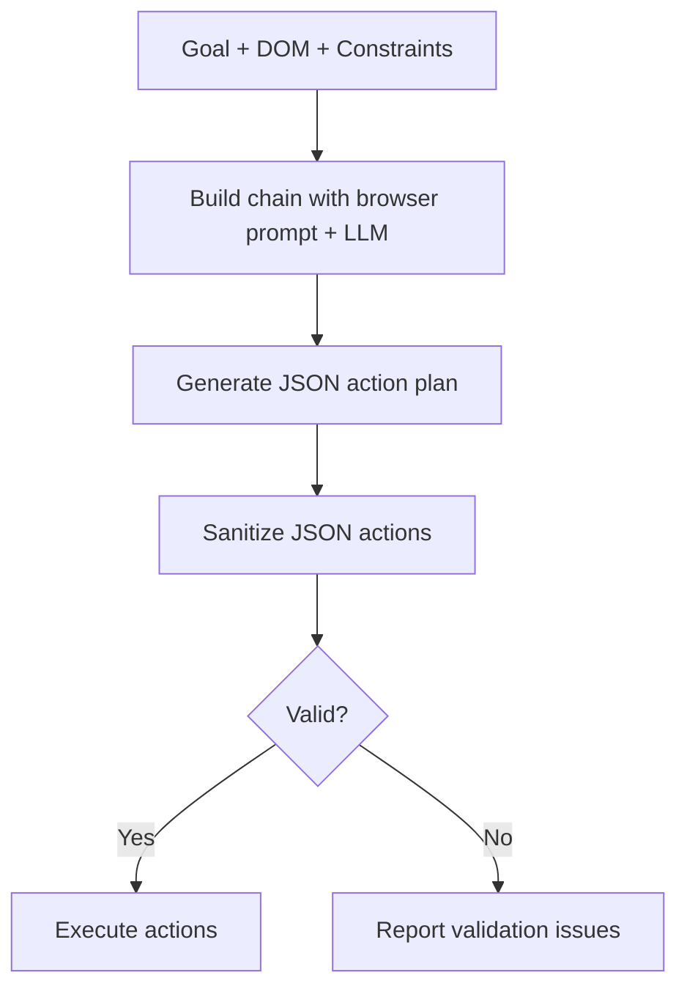

**Diagram sources**
- [tools/browser_use/tool.py](file://tools/browser_use/tool.py#L1-L49)
- [prompts/browser_use.py](file://prompts/browser_use.py#L1-L138)
- [utils/agent_sanitizer.py](file://utils/agent_sanitizer.py#L20-L96)

**Section sources**
- [tools/browser_use/tool.py](file://tools/browser_use/tool.py#L1-L49)
- [prompts/browser_use.py](file://prompts/browser_use.py#L1-L138)
- [utils/agent_sanitizer.py](file://utils/agent_sanitizer.py#L20-L96)

### Extension Integration Patterns
The extension:
- Parses slash commands and maps them to backend endpoints.
- Captures active tab HTML and constructs payloads for agent endpoints.
- Supports file uploads and special URL normalization for GitHub repositories.
- Uses a WebSocket client to coordinate agent execution and progress.

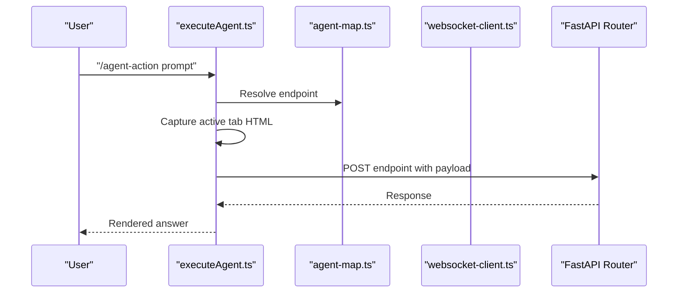

**Diagram sources**
- [extension/entrypoints/utils/executeAgent.ts](file://extension/entrypoints/utils/executeAgent.ts#L17-L168)
- [extension/entrypoints/sidepanel/lib/agent-map.ts](file://extension/entrypoints/sidepanel/lib/agent-map.ts#L1-L80)
- [extension/entrypoints/utils/websocket-client.ts](file://extension/entrypoints/utils/websocket-client.ts#L93-L132)
- [routers/react_agent.py](file://routers/react_agent.py#L18-L56)

**Section sources**
- [extension/entrypoints/utils/executeAgent.ts](file://extension/entrypoints/utils/executeAgent.ts#L1-L299)
- [extension/entrypoints/sidepanel/lib/agent-map.ts](file://extension/entrypoints/sidepanel/lib/agent-map.ts#L1-L80)
- [extension/entrypoints/utils/websocket-client.ts](file://extension/entrypoints/utils/websocket-client.ts#L93-L132)
- [routers/react_agent.py](file://routers/react_agent.py#L1-L57)

## Dependency Analysis
The system exhibits low coupling and high cohesion:
- agents/react_agent.py depends on core/llm.py and agents/react_tools.py.
- agents/react_tools.py depends on prompts and tool implementations.
- services/react_agent_service.py orchestrates agents and tools.
- routers/react_agent.py delegates to services.
- Extension utilities depend on agent-map and websocket-client for coordination.

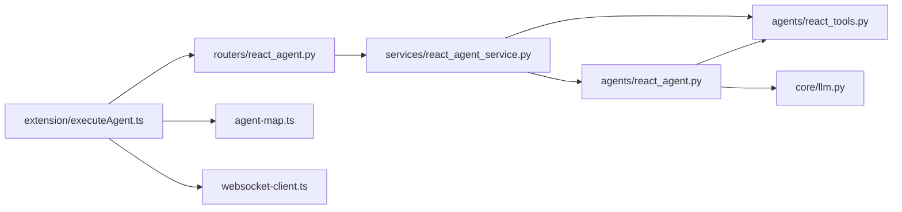

**Diagram sources**
- [agents/react_agent.py](file://agents/react_agent.py#L1-L191)
- [agents/react_tools.py](file://agents/react_tools.py#L1-L721)
- [core/llm.py](file://core/llm.py#L1-L215)
- [services/react_agent_service.py](file://services/react_agent_service.py#L1-L154)
- [routers/react_agent.py](file://routers/react_agent.py#L1-L57)
- [extension/entrypoints/utils/executeAgent.ts](file://extension/entrypoints/utils/executeAgent.ts#L1-L299)
- [extension/entrypoints/sidepanel/lib/agent-map.ts](file://extension/entrypoints/sidepanel/lib/agent-map.ts#L1-L80)
- [extension/entrypoints/utils/websocket-client.ts](file://extension/entrypoints/utils/websocket-client.ts#L93-L132)

**Section sources**
- [agents/react_agent.py](file://agents/react_agent.py#L1-L191)
- [agents/react_tools.py](file://agents/react_tools.py#L1-L721)
- [core/llm.py](file://core/llm.py#L1-L215)
- [services/react_agent_service.py](file://services/react_agent_service.py#L1-L154)
- [routers/react_agent.py](file://routers/react_agent.py#L1-L57)
- [extension/entrypoints/utils/executeAgent.ts](file://extension/entrypoints/utils/executeAgent.ts#L1-L299)
- [extension/entrypoints/sidepanel/lib/agent-map.ts](file://extension/entrypoints/sidepanel/lib/agent-map.ts#L1-L80)
- [extension/entrypoints/utils/websocket-client.ts](file://extension/entrypoints/utils/websocket-client.ts#L93-L132)

## Performance Considerations
- Async execution: Tools run in threads to avoid blocking the LLM invocation loop.
- Caching: GraphBuilder caches the compiled graph to reduce overhead on repeated invocations.
- Provider selection: Choose appropriate models and providers based on latency and cost profiles.
- Payload sizing: Limit DOM structures and chat histories to reasonable sizes to keep prompt costs and latency manageable.
- Rate limits: Respect provider rate limits and implement retries with backoff.

[No sources needed since this section provides general guidance]

## Troubleshooting Guide
Common issues and remedies:
- Missing API keys or base URLs: Ensure environment variables are set for the chosen provider.
- Tool failures: Inspect tool coroutines for exceptions and validate inputs using Pydantic schemas.
- JSON action plan errors: Use the sanitizer to identify malformed or unsafe actions.
- Extension errors: Verify endpoint resolution and payload construction; check WebSocket connectivity.
- Injection risks: Apply the injection validator to incoming markdown content before processing.

**Section sources**
- [core/llm.py](file://core/llm.py#L101-L170)
- [agents/react_tools.py](file://agents/react_tools.py#L279-L522)
- [utils/agent_sanitizer.py](file://utils/agent_sanitizer.py#L20-L96)
- [prompts/prompt_injection_validator.py](file://prompts/prompt_injection_validator.py#L1-L16)
- [extension/entrypoints/utils/executeAgent.ts](file://extension/entrypoints/utils/executeAgent.ts#L273-L298)

## Conclusion
The AI Agent System combines a reactive, tool-integrated reasoning loop with a flexible LLM provider abstraction and robust safety mechanisms. By structuring tools with typed schemas, preserving conversation context, and validating outputs, it enables reliable multi-step workflows across diverse domains—from web search and content analysis to browser automation and authenticated service integrations.

[No sources needed since this section summarizes without analyzing specific files]

## Appendices

### Agent Configuration Examples
- Configure provider and model via environment variables or constructor parameters.
- Supply optional context (Google access token, JIIT session payload) to dynamically compose tools.
- Use the extension slash command to trigger workflows and capture page context.

**Section sources**
- [core/llm.py](file://core/llm.py#L78-L170)
- [agents/react_tools.py](file://agents/react_tools.py#L609-L721)
- [extension/entrypoints/sidepanel/lib/agent-map.ts](file://extension/entrypoints/sidepanel/lib/agent-map.ts#L1-L80)

### Tool Creation Checklist
- Define a Pydantic input schema with constraints.
- Implement an async coroutine that performs the operation safely.
- Wrap as a StructuredTool with a clear description.
- Register the tool in the tool builder and ensure it is included in the agent graph.

**Section sources**
- [agents/react_tools.py](file://agents/react_tools.py#L609-L721)

### Debugging Techniques
- Enable logging at the service and router layers to trace message sequences.
- Inspect tool call payloads and results for mismatches.
- Validate browser action plans with the sanitizer and review warnings.
- Monitor provider quotas and adjust model selection accordingly.

**Section sources**
- [services/react_agent_service.py](file://services/react_agent_service.py#L16-L154)
- [utils/agent_sanitizer.py](file://utils/agent_sanitizer.py#L20-L96)
- [core/llm.py](file://core/llm.py#L101-L170)