# AI agent system

## Introduction
This page describes the AI Agent System that powers a reactive, tool-augmented reasoning loop for natural language instructions. Built on the LangGraph framework, the system orchestrates an agent that decides whether to answer directly or delegate to tools, iteratively refining its plan until completion. It integrates a broad toolset spanning web search, website analysis, YouTube Q&A, Gmail and Calendar operations, JIIT web portal attendance retrieval, and browser automation. The LLM provider abstraction supports multiple backends (OpenAI, Anthropic, Google, Ollama, DeepSeek, OpenRouter) while maintaining a model-agnostic design. A reliable prompt engineering system supplies domain-specific instructions, and a sanitizer validates generated browser action plans. The system preserves conversation context, manages agent state, and coordinates multi-step workflows.

## Project structure
The repository organizes functionality by concerns:
- agents: Reactive agent graph and tool integration
- core: LLM provider abstraction and configuration
- prompts: Domain-specific prompts and injection validation
- tools: Tool implementations and schemas
- services: Business logic and orchestration
- routers: API endpoints
- models: Request/response schemas
- utils: Utilities such as sanitization
- extension: Browser extension entrypoints and utilities

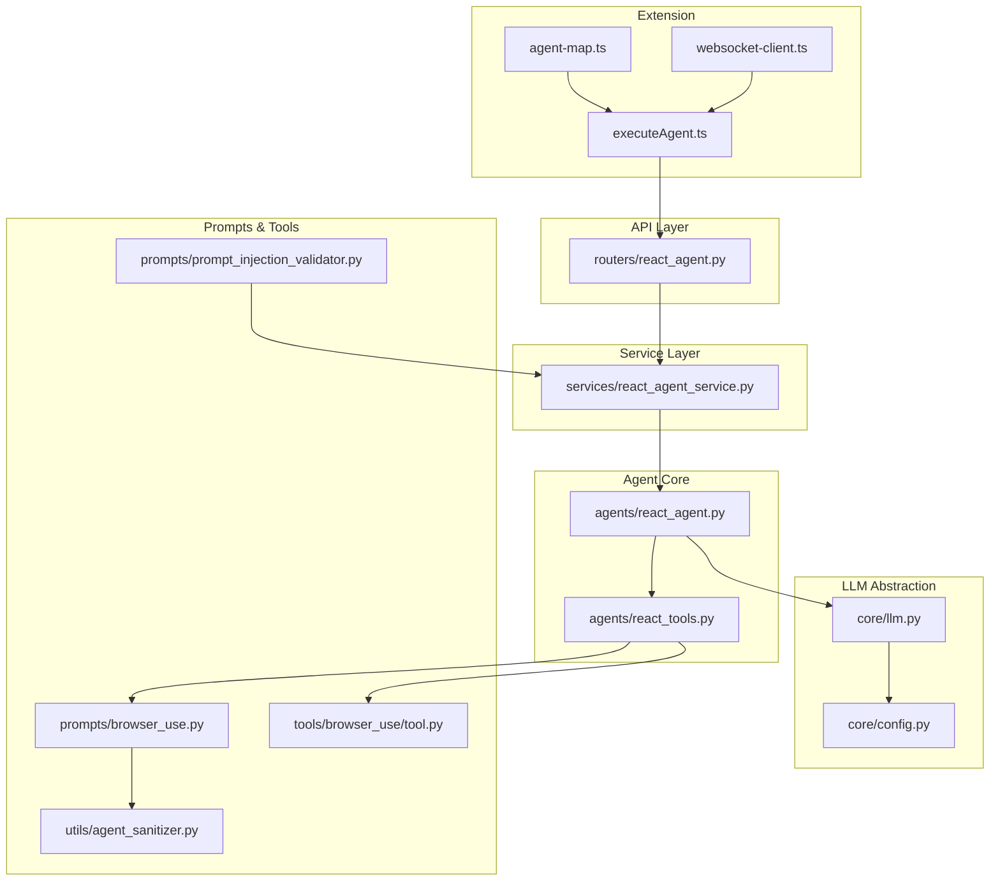
```mermaid
graph TB
subgraph "Extension"
EXTS["executeAgent.ts"]
MAP["agent-map.ts"]
WS["websocket-client.ts"]
end
subgraph "API Layer"
ROUTER["routers/react_agent.py"]
end
subgraph "Service Layer"
SVC["services/react_agent_service.py"]
end
subgraph "Agent Core"
GRAPH["agents/react_agent.py"]
TOOLS["agents/react_tools.py"]
end
subgraph "LLM Abstraction"
LLM["core/llm.py"]
CFG["core/config.py"]
end
subgraph "Prompts & Tools"
PROMPT_BROWSER["prompts/browser_use.py"]
TOOL_BROWSER["tools/browser_use/tool.py"]
SAN["utils/agent_sanitizer.py"]
INJ["prompts/prompt_injection_validator.py"]
end
EXTS --> ROUTER
MAP --> EXTS
WS --> EXTS
ROUTER --> SVC
SVC --> GRAPH
GRAPH --> TOOLS
TOOLS --> PROMPT_BROWSER
TOOLS --> TOOL_BROWSER
GRAPH --> LLM
LLM --> CFG
PROMPT_BROWSER --> SAN
INJ --> SVC
```

## Core components
- Reactive Agent Graph: Defines a LangGraph workflow with an agent node and a tool execution node, enabling conditional routing between reasoning and tool use.
- Tool Integration: Provides structured tools with typed schemas, dynamic composition based on context (tokens, session payloads), and reliable async execution.
- LLM Provider Abstraction: Centralizes provider selection, model mapping, environment-driven configuration, and runtime client instantiation.
- Prompt Engineering: Supplies domain-specific prompts for browser automation and injection validation for safety.
- State Management: Maintains conversation context and message sequences for multi-turn interactions.
- Orchestration: Bridges the extension UI to backend APIs and services, capturing page context and assembling tool-ready payloads.

## Architecture overview
The system follows a layered architecture:
- Extension layer captures user intent, active tab context, and constructs payloads for backend endpoints.
- API layer exposes endpoints for agent orchestration and tool-specific operations.
- Service layer translates requests into agent state, injects context, and invokes the compiled LangGraph.
- Agent layer executes the reasoning loop, optionally invoking tools and returning final responses.
- Tool layer encapsulates domain capabilities with validated inputs and safe execution patterns.
- LLM abstraction provides a unified interface across providers and models.

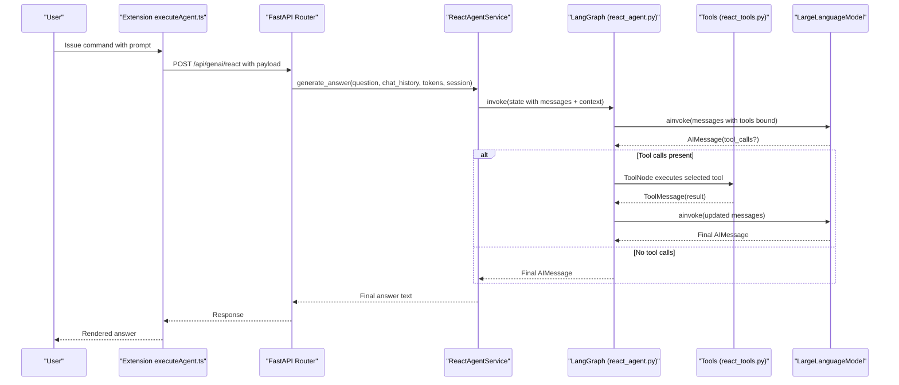
```mermaid
sequenceDiagram
participant User as "User"
participant Ext as "Extension executeAgent.ts"
participant API as "FastAPI Router"
participant Svc as "ReactAgentService"
participant Graph as "LangGraph (react_agent.py)"
participant Tools as "Tools (react_tools.py)"
participant LLM as "LargeLanguageModel"
User->>Ext : Issue command with prompt
Ext->>API : POST /api/genai/react with payload
API->>Svc : generate_answer(question, chat_history, tokens, session)
Svc->>Graph : invoke(state with messages + context)
Graph->>LLM : ainvoke(messages with tools bound)
LLM-->>Graph : AIMessage(tool_calls?)
alt Tool calls present
Graph->>Tools : ToolNode executes selected tool
Tools-->>Graph : ToolMessage(result)
Graph->>LLM : ainvoke(updated messages)
LLM-->>Graph : Final AIMessage
else No tool calls
Graph-->>Svc : Final AIMessage
end
Svc-->>API : Final answer text
API-->>Ext : Response
Ext-->>User : Rendered answer
```

## Detailed component analysis

### Reactive agent graph and state management
The agent uses a LangGraph StateGraph with two nodes:
- Agent node: binds available tools to the LLM and generates a response.
- ToolNode: executes selected tools and returns results as ToolMessages.
Conditional edges route from agent to tool execution when tool_calls are detected, then back to the agent until completion.

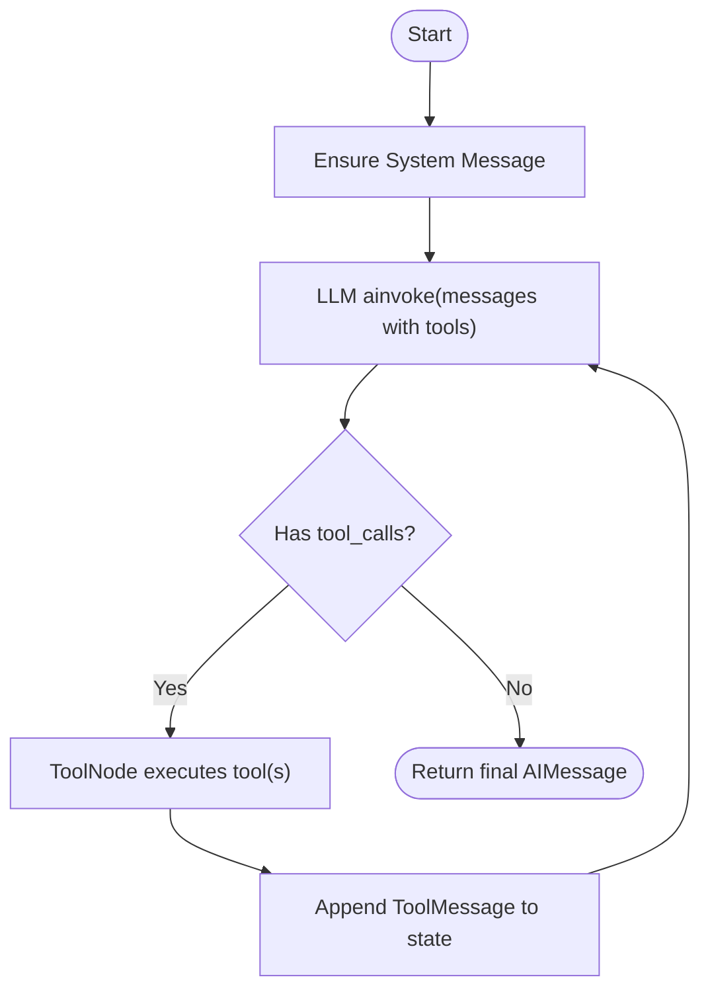
```mermaid
flowchart TD
Start(["Start"]) --> InitSys["Ensure System Message"]
InitSys --> InvokeAgent["LLM ainvoke(messages with tools)"]
InvokeAgent --> HasTools{"Has tool_calls?"}
HasTools --> |Yes| ToolExec["ToolNode executes tool(s)"]
ToolExec --> AppendToolMsg["Append ToolMessage to state"]
AppendToolMsg --> InvokeAgent
HasTools --> |No| Done(["Return final AIMessage"])
```

Key implementation highlights:
- AgentState defines a messages accumulator.
- Payload conversion helpers normalize content and preserve tool_calls and tool_call_id.
- GraphBuilder compiles the workflow once and caches it.
- run_react_agent converts external payloads to LangChain messages, invokes the graph, and returns normalized payloads.

### Tool integration system
The tool system:
- Defines structured tools with Pydantic schemas for inputs.
- Dynamically composes tools from a base set, augmenting with Google and JIIT capabilities when context is provided.
- Executes tool coroutines asynchronously and formats results safely.

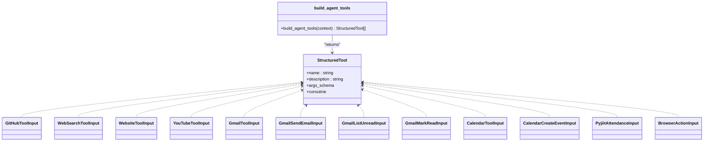
```mermaid
classDiagram
class StructuredTool {
+name : string
+description : string
+args_schema
+coroutine
}
class GitHubToolInput
class WebSearchToolInput
class WebsiteToolInput
class YouTubeToolInput
class GmailToolInput
class GmailSendEmailInput
class GmailListUnreadInput
class GmailMarkReadInput
class CalendarToolInput
class CalendarCreateEventInput
class PyjiitAttendanceInput
class BrowserActionInput
class build_agent_tools {
+build_agent_tools(context) StructuredTool[]
}
StructuredTool <.. GitHubToolInput
StructuredTool <.. WebSearchToolInput
StructuredTool <.. WebsiteToolInput
StructuredTool <.. YouTubeToolInput
StructuredTool <.. GmailToolInput
StructuredTool <.. GmailSendEmailInput
StructuredTool <.. GmailListUnreadInput
StructuredTool <.. GmailMarkReadInput
StructuredTool <.. CalendarToolInput
StructuredTool <.. CalendarCreateEventInput
StructuredTool <.. PyjiitAttendanceInput
StructuredTool <.. BrowserActionInput
build_agent_tools --> StructuredTool : "returns"
```

Tool selection and execution patterns:
- Tool selection is driven by the LLM's tool_calls; LangGraph routes to ToolNode automatically.
- Execution runs in threads to keep LLM calls responsive.
- Results are normalized to text or JSON for downstream consumption.

### LLM provider abstraction and model-agnostic design
The LLM abstraction centralizes provider configuration and client instantiation:
- Provider configs map provider names to LangChain chat model classes, default models, and environment variables.
- LargeLanguageModel initializes clients with environment-driven parameters and validates presence of required keys/base URLs.
- The agent uses a cached client instance, ensuring consistent model selection across the system.

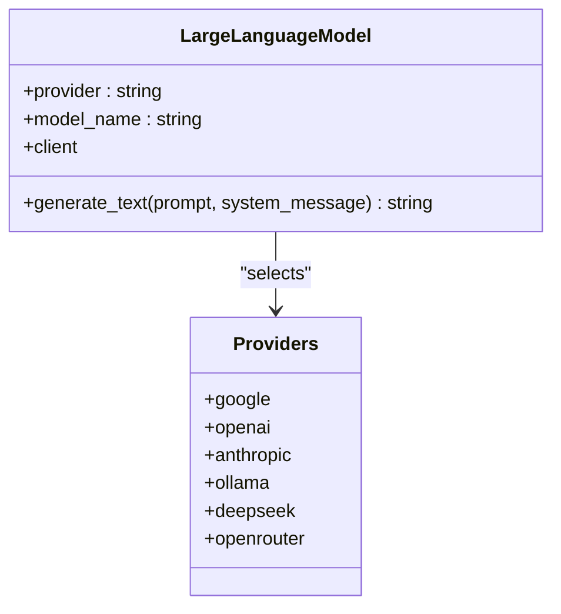
```mermaid
classDiagram
class LargeLanguageModel {
+provider : string
+model_name : string
+client
+generate_text(prompt, system_message) string
}
class Providers {
+google
+openai
+anthropic
+ollama
+deepseek
+openrouter
}
LargeLanguageModel --> Providers : "selects"
```

Provider configuration and environment handling:
- API keys and base URLs are resolved from environment variables or provided parameters.
- Default models are provided per provider; errors guide users to configure missing values.

### Prompt engineering system and injection validation
Domain-specific prompts:
- Browser automation prompt defines actions, constraints, and JSON output expectations for generating reliable action plans.
- Other prompts support specialized tasks (e.g., website, YouTube, GitHub).

Injection validation:
- A validator prompt determines whether provided markdown text contains prompt injection attempts, returning a boolean decision.

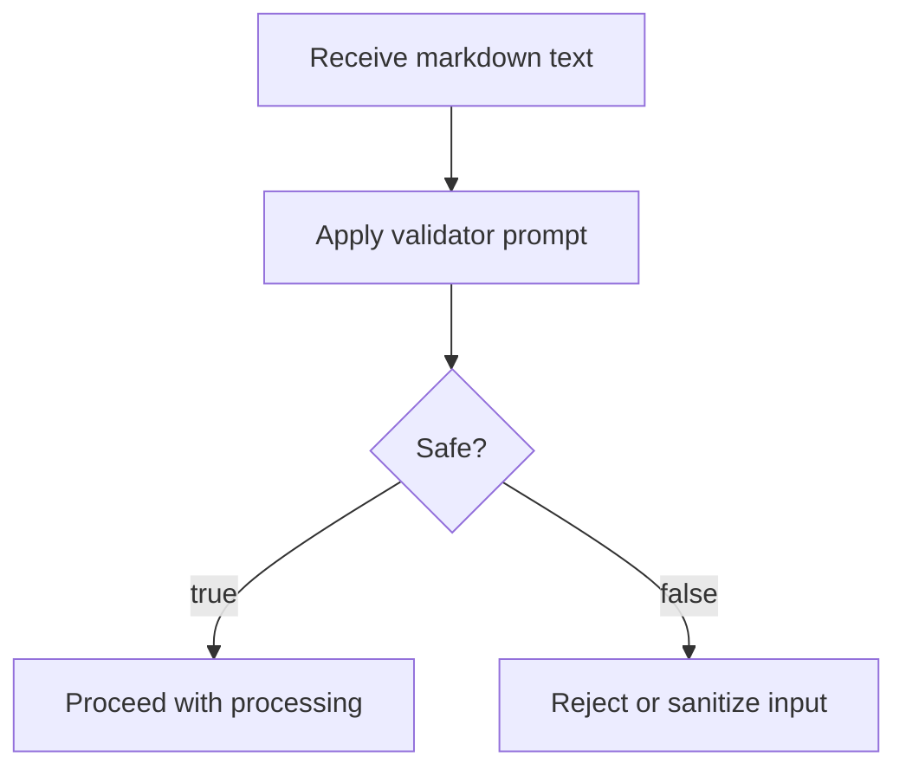
```mermaid
flowchart TD
A["Receive markdown text"] --> B["Apply validator prompt"]
B --> C{"Safe?"}
C --> |true| D["Proceed with processing"]
C --> |false| E["Reject or sanitize input"]
```

### Agent state management and conversation context
The service layer:
- Builds AgentState from incoming chat history and question.
- Injects page context as a SystemMessage when client HTML is available.
- Logs message sequences for observability and invokes the graph.

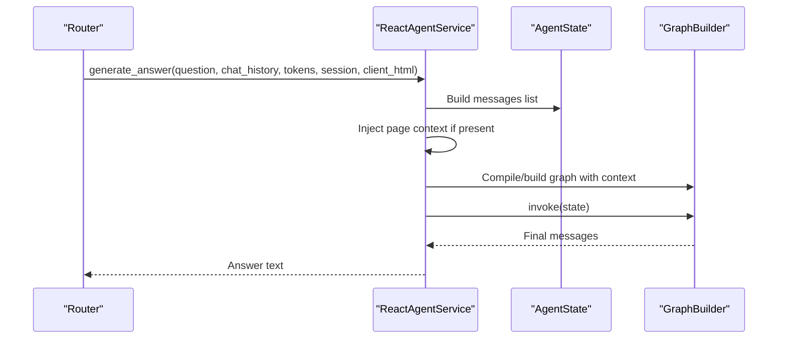
```mermaid
sequenceDiagram
participant API as "Router"
participant Svc as "ReactAgentService"
participant State as "AgentState"
participant Graph as "GraphBuilder"
API->>Svc : generate_answer(question, chat_history, tokens, session, client_html)
Svc->>State : Build messages list
Svc->>Svc : Inject page context if present
Svc->>Graph : Compile/build graph with context
Svc->>Graph : invoke(state)
Graph-->>Svc : Final messages
Svc-->>API : Answer text
```

### Multi-Step workflow orchestration
The workflow:
- Starts with a user question and optional chat history.
- Optionally augments with page context and tool availability.
- Iteratively decides between reasoning and tool execution until a final answer is produced.

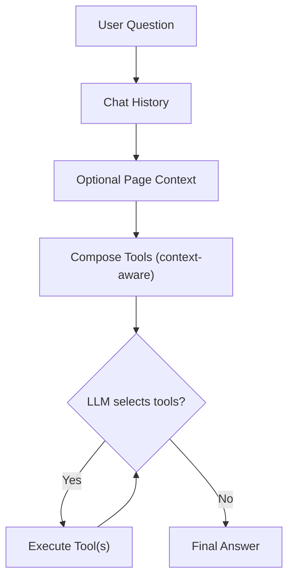
```mermaid
flowchart TD
Q["User Question"] --> H["Chat History"]
H --> Ctx["Optional Page Context"]
Ctx --> Tools["Compose Tools (context-aware)"]
Tools --> Loop{"LLM selects tools?"}
Loop --> |Yes| Exec["Execute Tool(s)"]
Exec --> Loop
Loop --> |No| Ans["Final Answer"]
```

### Browser action generation and safety
The browser action tool:
- Accepts a goal, optional target URL, DOM structure, and constraints.
- Delegates to a service that builds a chain using the browser automation prompt and LLM client.
- Returns a JSON action plan.

Safety validation:
- A sanitizer checks JSON structure, validates action types, and enforces required fields.
- Additional checks prevent dangerous script patterns.

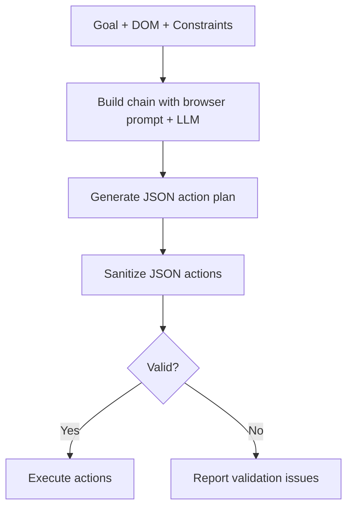
```mermaid
flowchart TD
Goal["Goal + DOM + Constraints"] --> Chain["Build chain with browser prompt + LLM"]
Chain --> Plan["Generate JSON action plan"]
Plan --> San["Sanitize JSON actions"]
San --> Valid{"Valid?"}
Valid --> |Yes| Exec["Execute actions"]
Valid --> |No| Fix["Report validation issues"]
```

### Extension integration patterns
The extension:
- Parses slash commands and maps them to backend endpoints.
- Captures active tab HTML and constructs payloads for agent endpoints.
- Supports file uploads and special URL normalization for GitHub repositories.
- Uses a WebSocket client to coordinate agent execution and progress.

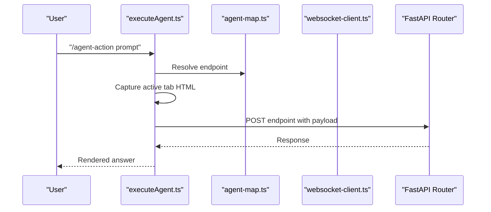
```mermaid
sequenceDiagram
participant User as "User"
participant Ext as "executeAgent.ts"
participant Map as "agent-map.ts"
participant WS as "websocket-client.ts"
participant API as "FastAPI Router"
User->>Ext : "/agent-action prompt"
Ext->>Map : Resolve endpoint
Ext->>Ext : Capture active tab HTML
Ext->>API : POST endpoint with payload
API-->>Ext : Response
Ext-->>User : Rendered answer
```

## Dependency analysis
The system exhibits low coupling and high cohesion:
- agents/react_agent.py depends on core/llm.py and agents/react_tools.py.
- agents/react_tools.py depends on prompts and tool implementations.
- services/react_agent_service.py orchestrates agents and tools.
- routers/react_agent.py delegates to services.
- Extension utilities depend on agent-map and websocket-client for coordination.

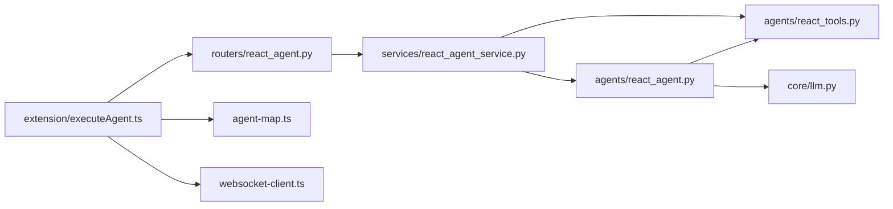
```mermaid
graph LR
RA["agents/react_agent.py"] --> RT["agents/react_tools.py"]
RA --> LLM["core/llm.py"]
SVC["services/react_agent_service.py"] --> RA
SVC --> RT
RTR["routers/react_agent.py"] --> SVC
EXT["extension/executeAgent.ts"] --> RTR
EXT --> MAP["agent-map.ts"]
EXT --> WS["websocket-client.ts"]
```

## Performance considerations
- Async execution: Tools run in threads to avoid blocking the LLM invocation loop.
- Caching: GraphBuilder caches the compiled graph to reduce overhead on repeated invocations.
- Provider selection: Choose appropriate models and providers based on latency and cost profiles.
- Payload sizing: Limit DOM structures and chat histories to reasonable sizes to keep prompt costs and latency manageable.
- Rate limits: Respect provider rate limits and implement retries with backoff.

[No sources needed since this section provides general guidance]

## Troubleshooting guide
Common issues and remedies:
- Missing API keys or base URLs: Ensure environment variables are set for the chosen provider.
- Tool failures: Inspect tool coroutines for exceptions and validate inputs using Pydantic schemas.
- JSON action plan errors: Use the sanitizer to identify malformed or unsafe actions.
- Extension errors: Verify endpoint resolution and payload construction; check WebSocket connectivity.
- Injection risks: Apply the injection validator to incoming markdown content before processing.

## Conclusion
The AI Agent System combines a reactive, tool-integrated reasoning loop with a flexible LLM provider abstraction and reliable safety mechanisms. By structuring tools with typed schemas, preserving conversation context, and validating outputs, it enables reliable multi-step workflows across diverse domains, from web search and content analysis to browser automation and authenticated service integrations.

[No sources needed since this section summarizes without analyzing specific files]

## Appendices

### Agent configuration examples
- Configure provider and model via environment variables or constructor parameters.
- Supply optional context (Google access token, JIIT session payload) to dynamically compose tools.
- Use the extension slash command to trigger workflows and capture page context.

### Tool creation checklist
- Define a Pydantic input schema with constraints.
- Implement an async coroutine that performs the operation safely.
- Wrap as a StructuredTool with a clear description.
- Register the tool in the tool builder and ensure it is included in the agent graph.

### Debugging techniques
- Enable logging at the service and router layers to trace message sequences.
- Inspect tool call payloads and results for mismatches.
- Validate browser action plans with the sanitizer and review warnings.
- Monitor provider quotas and adjust model selection accordingly.
