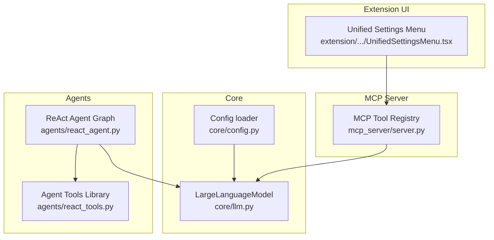
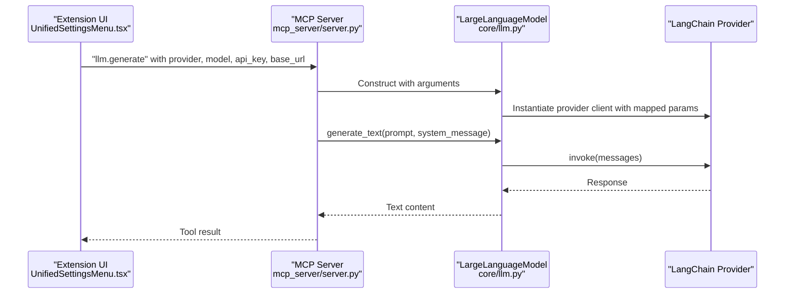
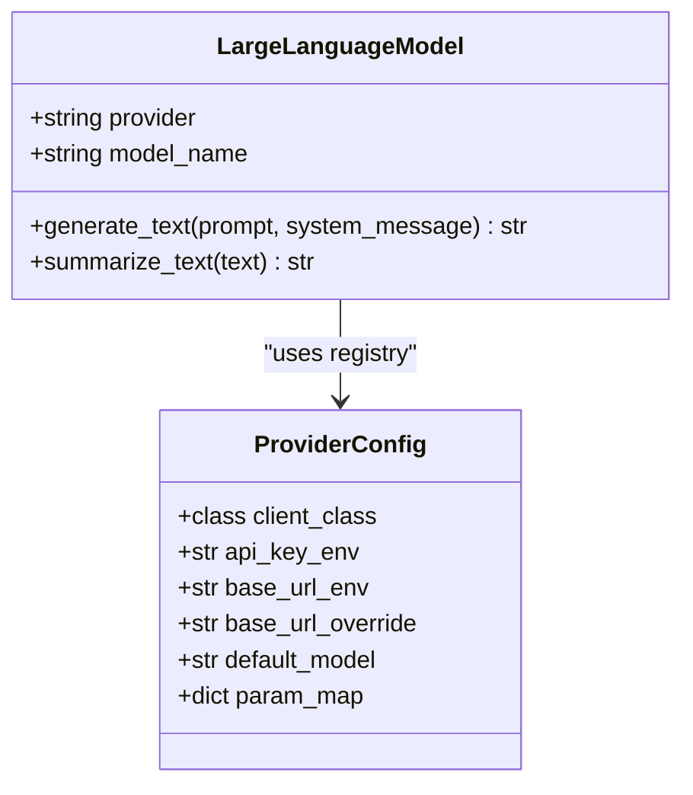
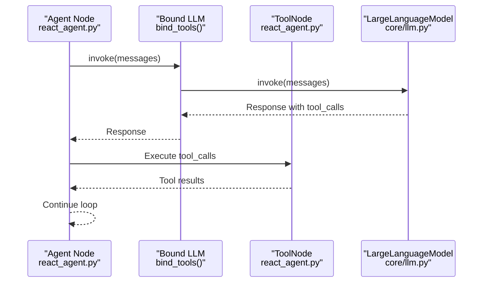
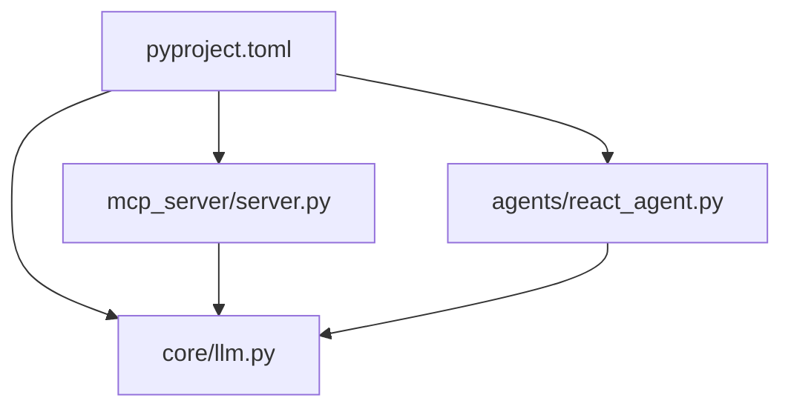

# LLM Provider Abstraction

<cite>
**Referenced Files in This Document**
- [core/llm.py](file://core/llm.py)
- [core/config.py](file://core/config.py)
- [mcp_server/server.py](file://mcp_server/server.py)
- [agents/react_agent.py](file://agents/react_agent.py)
- [agents/react_tools.py](file://agents/react_tools.py)
- [pyproject.toml](file://pyproject.toml)
- [README.md](file://README.md)
- [extension/entrypoints/sidepanel/components/UnifiedSettingsMenu.tsx](file://extension/entrypoints/sidepanel/components/UnifiedSettingsMenu.tsx)
</cite>

## Table of Contents
1. [Introduction](#introduction)
2. [Project Structure](#project-structure)
3. [Core Components](#core-components)
4. [Architecture Overview](#architecture-overview)
5. [Detailed Component Analysis](#detailed-component-analysis)
6. [Dependency Analysis](#dependency-analysis)
7. [Performance Considerations](#performance-considerations)
8. [Troubleshooting Guide](#troubleshooting-guide)
9. [Conclusion](#conclusion)
10. [Appendices](#appendices)

## Introduction
This document explains the Large Language Model (LLM) provider abstraction layer that enables a model-agnostic design across multiple LLM providers (OpenAI, Anthropic, Google, Ollama, DeepSeek, OpenRouter). It covers provider configuration, credential management, model selection, and the binding mechanism that connects LLM clients with tool definitions for function calling. It also documents provider switching, fallback behavior, performance characteristics, and security considerations for API key management.

## Project Structure
The LLM abstraction spans three main areas:
- Core provider abstraction and configuration
- MCP server integration for tool-based invocation
- Agent orchestration with tool binding and function calling

**Diagram sources**
- [core/llm.py](file://core/llm.py#L78-L194)
- [core/config.py](file://core/config.py#L1-L26)
- [mcp_server/server.py](file://mcp_server/server.py#L16-L124)
- [agents/react_agent.py](file://agents/react_agent.py#L123-L175)
- [agents/react_tools.py](file://agents/react_tools.py#L609-L721)
- [extension/entrypoints/sidepanel/components/UnifiedSettingsMenu.tsx](file://extension/entrypoints/sidepanel/components/UnifiedSettingsMenu.tsx#L27-L52)

**Section sources**
- [core/llm.py](file://core/llm.py#L1-L215)
- [core/config.py](file://core/config.py#L1-L26)
- [mcp_server/server.py](file://mcp_server/server.py#L1-L139)
- [agents/react_agent.py](file://agents/react_agent.py#L1-L191)
- [agents/react_tools.py](file://agents/react_tools.py#L1-L721)
- [README.md](file://README.md#L27-L33)

## Core Components
- LargeLanguageModel: Central abstraction that encapsulates provider selection, credential resolution, base URL handling, and model instantiation. It exposes a simple generate_text method for text generation and preserves provider-specific parameters via kwargs.
- Provider configuration registry: A centralized PROVIDER_CONFIGS mapping that defines provider class, environment variables, default models, and parameter mappings.
- MCP tool integration: The MCP server registers a llm.generate tool that constructs a LargeLanguageModel instance with runtime parameters and executes generation.
- Agent orchestration: The ReAct agent binds tools to the LLM client and routes between agent steps and tool execution nodes.

Key responsibilities:
- Provider switching: Choose provider at runtime via provider parameter.
- Credential management: Prefer environment variables; optionally accept API keys directly.
- Model selection: Allow explicit model override or use provider defaults.
- Function calling: Bind tools to the LLM client for structured tool invocation.

**Section sources**
- [core/llm.py](file://core/llm.py#L21-L194)
- [mcp_server/server.py](file://mcp_server/server.py#L16-L124)
- [agents/react_agent.py](file://agents/react_agent.py#L123-L175)

## Architecture Overview
The abstraction maintains a model-agnostic interface while delegating provider-specific behavior to LangChain wrappers. The MCP server and agent pipeline consume this abstraction uniformly.

**Diagram sources**
- [mcp_server/server.py](file://mcp_server/server.py#L83-L100)
- [core/llm.py](file://core/llm.py#L78-L194)
- [extension/entrypoints/sidepanel/components/UnifiedSettingsMenu.tsx](file://extension/entrypoints/sidepanel/components/UnifiedSettingsMenu.tsx#L27-L52)

## Detailed Component Analysis

### LargeLanguageModel Abstraction
The LargeLanguageModel class centralizes provider configuration and client creation. It:
- Validates provider selection against a registry of supported providers.
- Resolves API keys from environment variables or direct parameters.
- Applies base URL precedence: explicit base_url > base_url_override > base_url_env.
- Supports provider-specific parameter mapping via param_map.
- Initializes the underlying LangChain client and exposes generate_text.

**Diagram sources**
- [core/llm.py](file://core/llm.py#L21-L194)

**Section sources**
- [core/llm.py](file://core/llm.py#L78-L194)

### Provider Configuration System
The PROVIDER_CONFIGS registry defines:
- Provider class: LangChain client class to instantiate.
- Environment variables: Names for API keys and base URLs.
- Defaults: Default model per provider.
- Parameter mapping: How internal parameter names map to provider-specific constructor parameters.

Supported providers include Google, OpenAI, Anthropic, Ollama, DeepSeek, and OpenRouter. Each entry controls credential and URL resolution behavior.

**Section sources**
- [core/llm.py](file://core/llm.py#L21-L75)

### Credential Management and Environment Variables
- API keys: Loaded from environment variables when configured for the provider. If missing, initialization raises a clear error instructing how to provide the key.
- Base URLs: Explicit base_url overrides provider-specific defaults; base_url_override exists for providers like DeepSeek/OpenRouter; base_url_env is used for providers like Ollama.
- Default API key: The core configuration module exports a default Google API key for convenience, but provider-specific keys are preferred.

Security considerations:
- API keys are handled via environment variables and optional direct parameters.
- The abstraction prints warnings when an API key is provided for a provider that does not require one.
- The MCP server accepts api_key and base_url at runtime; ensure these are transmitted securely and not logged.

**Section sources**
- [core/llm.py](file://core/llm.py#L121-L155)
- [core/config.py](file://core/config.py#L13-L14)

### Model Selection Patterns
- Explicit model override: Pass model_name to LargeLanguageModel to override provider defaults.
- Provider defaults: If no model_name is provided, the provider’s default is used.
- MCP tool: The llm.generate tool accepts a model parameter to override defaults at runtime.

Best practices:
- Pin models explicitly in production for reproducibility.
- Use provider defaults for experimentation; switch to explicit models for stability.

**Section sources**
- [core/llm.py](file://core/llm.py#L108-L113)
- [mcp_server/server.py](file://mcp_server/server.py#L89-L95)

### Binding Mechanism for Function Calling
The ReAct agent binds tools to the LLM client using LangGraph’s bind_tools. This enables the LLM to produce structured tool calls that the agent’s ToolNode executes.

**Diagram sources**
- [agents/react_agent.py](file://agents/react_agent.py#L123-L135)
- [agents/react_agent.py](file://agents/react_agent.py#L154-L170)

**Section sources**
- [agents/react_agent.py](file://agents/react_agent.py#L123-L175)

### Tool Definitions and Contextual Binding
The agent tools library builds a dynamic tool set based on context (e.g., Google access tokens, PyJIIT session payloads). Tools are wrapped as StructuredTool instances with typed schemas. The GraphBuilder compiles the workflow and caches it.

- Dynamic tool augmentation: Tools requiring credentials are conditionally included based on context.
- Structured schemas: Inputs are validated using Pydantic models.
- Caching: The compiled graph is cached to avoid repeated compilation overhead.

**Section sources**
- [agents/react_tools.py](file://agents/react_tools.py#L609-L721)
- [agents/react_agent.py](file://agents/react_agent.py#L138-L180)

### MCP Tool Integration
The MCP server exposes a llm.generate tool that:
- Accepts provider, model, api_key, base_url, temperature, and prompt/system_message.
- Constructs a LargeLanguageModel instance with these parameters.
- Invokes generate_text and returns the result as text content.

This enables external clients (e.g., the extension UI) to request LLM generation with provider flexibility.

**Section sources**
- [mcp_server/server.py](file://mcp_server/server.py#L16-L124)

### Provider Switching Examples
- Runtime switching: The MCP tool accepts a provider parameter; pass "openai", "anthropic", "google", "ollama", "deepseek", or "openrouter".
- UI-driven switching: The extension settings menu enumerates LLM options and persists selections in local storage.
- Environment-driven defaults: The core configuration loads environment variables; providers without API keys (e.g., Ollama) rely on base_url_env.

**Section sources**
- [mcp_server/server.py](file://mcp_server/server.py#L27-L36)
- [extension/entrypoints/sidepanel/components/UnifiedSettingsMenu.tsx](file://extension/entrypoints/sidepanel/components/UnifiedSettingsMenu.tsx#L27-L52)

### Fallback Mechanisms
- Model fallback: If no model_name is provided, the provider’s default is used.
- Base URL fallback: base_url_override is applied when present; otherwise base_url_env is required for providers that need it.
- Initialization errors: Clear error messages guide users to set environment variables or pass parameters directly.

Note: There is no automatic provider fallback chain in the current implementation. If a provider fails to initialize, the caller should explicitly retry with another provider.

**Section sources**
- [core/llm.py](file://core/llm.py#L108-L113)
- [core/llm.py](file://core/llm.py#L141-L155)
- [core/llm.py](file://core/llm.py#L165-L169)

### Performance Considerations
- Client reuse: The default LLM instance is created once and reused across the app. Consider similar caching for MCP-invoked LLM instances if used frequently.
- Message composition: The abstraction composes system and human messages; keep prompts concise to reduce latency.
- Temperature tuning: Lower temperature improves determinism; higher temperature increases creativity.
- Tool execution: ToolNode execution adds latency; batch related tool calls when possible.

[No sources needed since this section provides general guidance]

### Security Considerations
- API key handling: Prefer environment variables over hardcoding. The abstraction validates presence for providers that require keys.
- Base URL exposure: Ensure base_url_env is set appropriately for local/private endpoints.
- UI transmission: The extension UI sends api_key and base_url to the MCP server; ensure transport security and avoid logging sensitive values.
- Least privilege: Use provider-specific keys and restrict scopes to the minimum required.

**Section sources**
- [core/llm.py](file://core/llm.py#L121-L134)
- [core/llm.py](file://core/llm.py#L144-L155)
- [mcp_server/server.py](file://mcp_server/server.py#L89-L95)

## Dependency Analysis
The LLM abstraction relies on LangChain providers and is integrated into the MCP server and agent pipeline.

**Diagram sources**
- [pyproject.toml](file://pyproject.toml#L7-L29)
- [core/llm.py](file://core/llm.py#L5-L18)
- [mcp_server/server.py](file://mcp_server/server.py#L1-L13)
- [agents/react_agent.py](file://agents/react_agent.py#L1-L22)

**Section sources**
- [pyproject.toml](file://pyproject.toml#L7-L29)

## Performance Considerations
- Initialization cost: Creating a provider client is relatively expensive; reuse instances where possible.
- Prompt size: Keep prompts succinct to minimize latency and token usage.
- Tool batching: Group related tool calls to reduce round-trips.
- Concurrency: Use async patterns (as in the agent pipeline) to overlap I/O-bound operations.

[No sources needed since this section provides general guidance]

## Troubleshooting Guide
Common issues and resolutions:
- Unsupported provider: Ensure the provider is one of the supported values; the abstraction raises a clear error with allowed options.
- Missing API key: For providers requiring keys, set the appropriate environment variable or pass api_key directly.
- Missing base URL: Some providers require base_url_env; set it or pass base_url explicitly.
- Initialization failures: The abstraction surfaces detailed error messages; check API keys, base URLs, and model names.

**Section sources**
- [core/llm.py](file://core/llm.py#L101-L105)
- [core/llm.py](file://core/llm.py#L121-L127)
- [core/llm.py](file://core/llm.py#L151-L155)
- [core/llm.py](file://core/llm.py#L165-L169)

## Conclusion
The LLM provider abstraction layer delivers a model-agnostic interface across multiple providers while preserving provider-specific capabilities. It integrates cleanly with the MCP server and agent pipeline, enabling dynamic provider selection, secure credential handling, and structured function calling. By leveraging environment variables, explicit parameters, and a centralized configuration registry, the system supports flexible deployment scenarios and strong security hygiene.

## Appendices

### Provider Configuration Reference
- Google: Requires GOOGLE_API_KEY; default model gemini-2.5-flash.
- OpenAI: Requires OPENAI_API_KEY; default model gpt-5-mini.
- Anthropic: Requires ANTHROPIC_API_KEY; default model claude-4-sonnet.
- Ollama: No API key; requires OLLAMA_BASE_URL; default model llama3.
- DeepSeek: Requires DEEPSEEK_API_KEY; uses base_url_override.
- OpenRouter: Requires OPENROUTER_API_KEY; uses base_url_override.

**Section sources**
- [core/llm.py](file://core/llm.py#L21-L75)

### MCP Tool Schema Summary
- Tool: llm.generate
- Properties: prompt (required), system_message, provider (enum), model, api_key, base_url, temperature (default 0.4)
- Behavior: Creates a LargeLanguageModel with provided parameters and returns generated text

**Section sources**
- [mcp_server/server.py](file://mcp_server/server.py#L16-L46)
- [mcp_server/server.py](file://mcp_server/server.py#L83-L100)