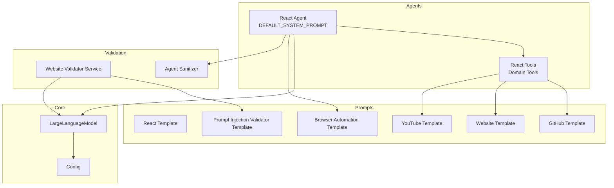
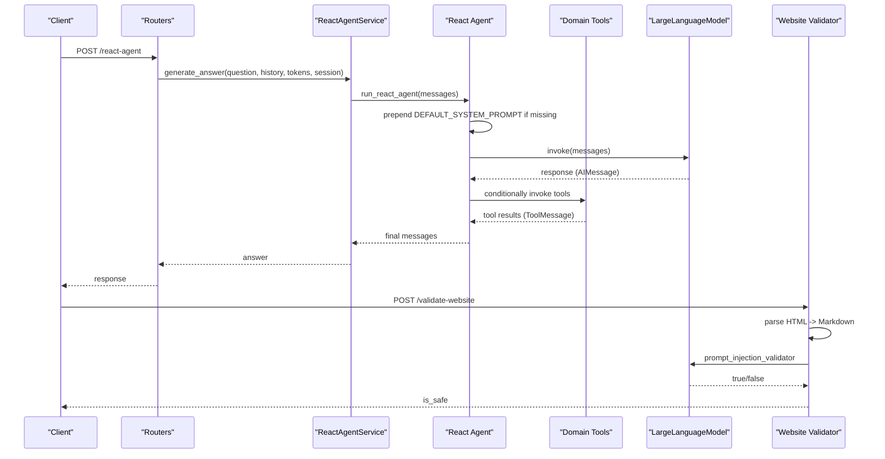
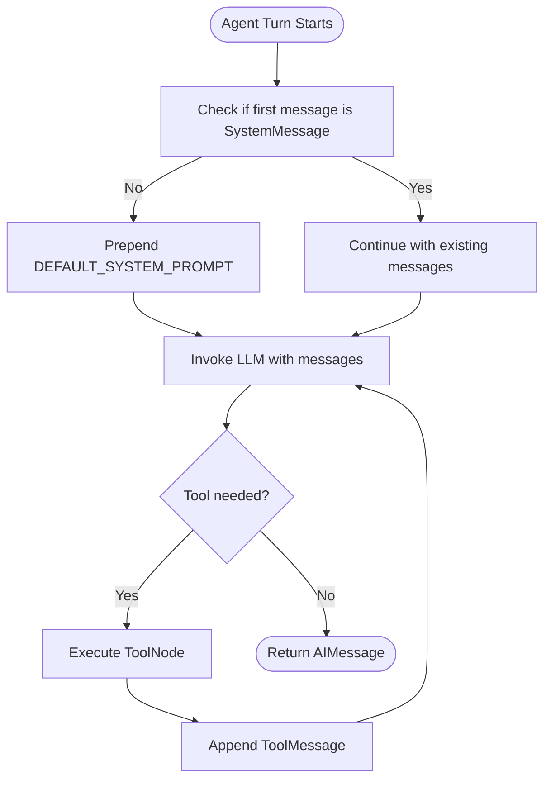
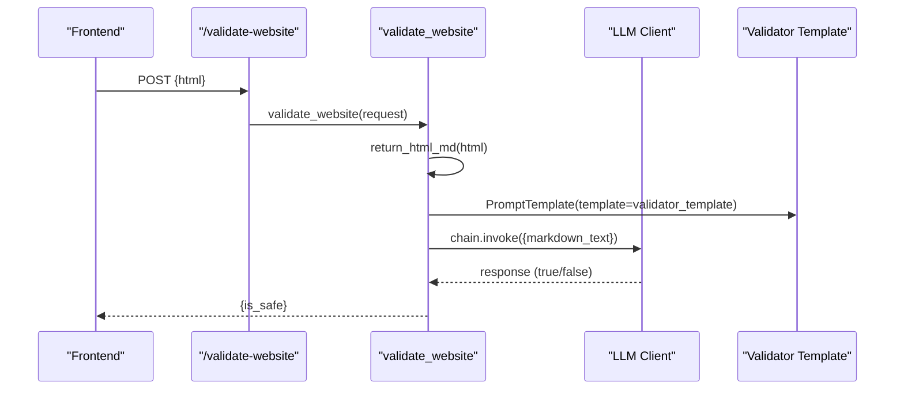
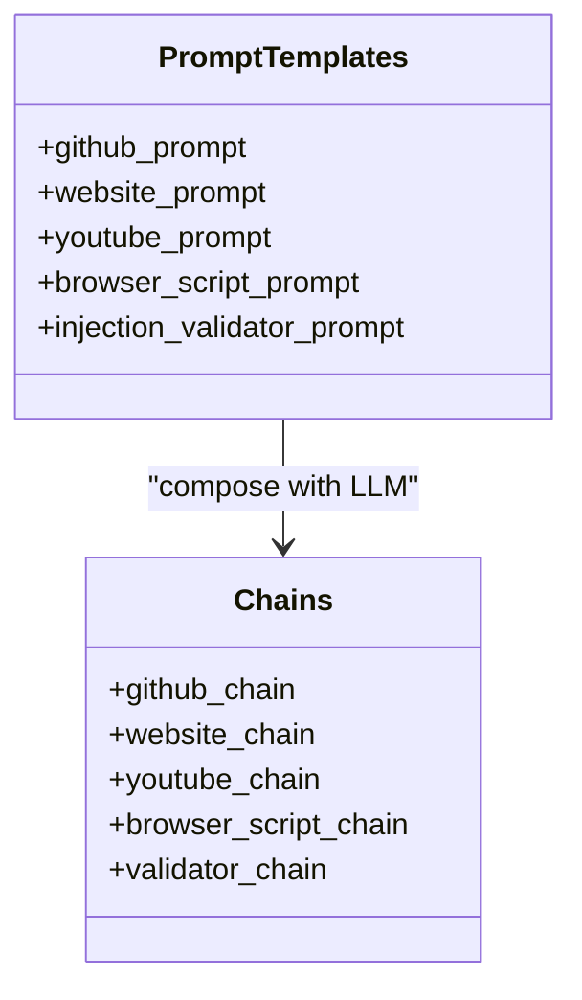
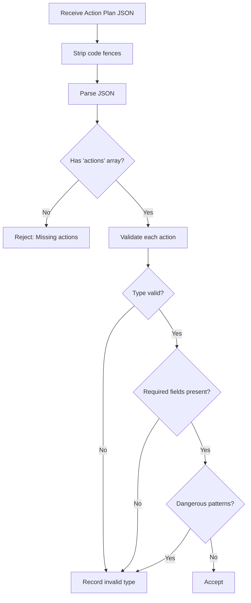
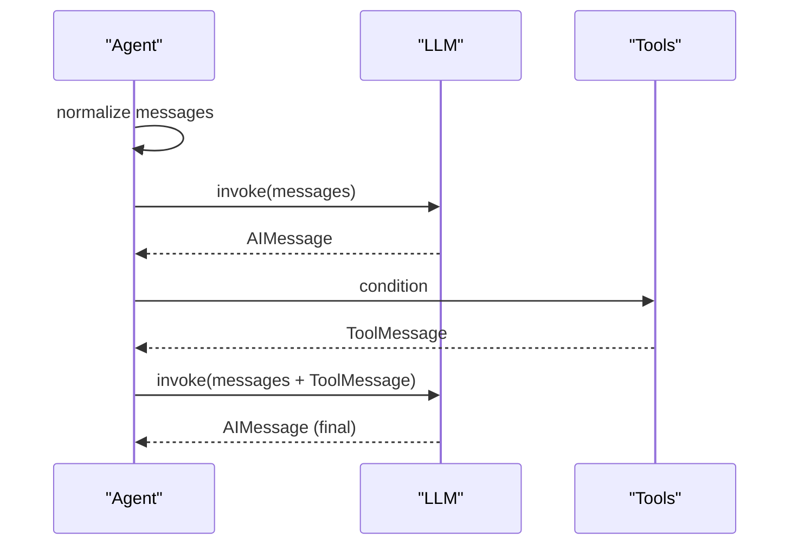
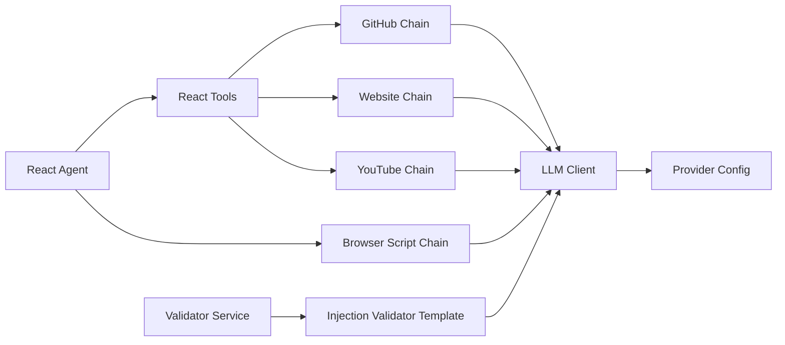

# Prompt Engineering System

<cite>
**Referenced Files in This Document**
- [react_agent.py](file://agents/react_agent.py)
- [react_tools.py](file://agents/react_tools.py)
- [prompt_injection_validator.py](file://prompts/prompt_injection_validator.py)
- [react.py](file://prompts/react.py)
- [browser_use.py](file://prompts/browser_use.py)
- [github.py](file://prompts/github.py)
- [website.py](file://prompts/website.py)
- [youtube.py](file://prompts/youtube.py)
- [agent_sanitizer.py](file://utils/agent_sanitizer.py)
- [llm.py](file://core/llm.py)
- [config.py](file://core/config.py)
- [website_validator_service.py](file://services/website_validator_service.py)
- [website_validator.py](file://routers/website_validator.py)
- [react_agent.py](file://routers/react_agent.py)
</cite>

## Table of Contents
1. [Introduction](#introduction)
2. [Project Structure](#project-structure)
3. [Core Components](#core-components)
4. [Architecture Overview](#architecture-overview)
5. [Detailed Component Analysis](#detailed-component-analysis)
6. [Dependency Analysis](#dependency-analysis)
7. [Performance Considerations](#performance-considerations)
8. [Troubleshooting Guide](#troubleshooting-guide)
9. [Conclusion](#conclusion)
10. [Appendices](#appendices)

## Introduction
This document explains the prompt engineering system powering the agentic assistant. It covers the DEFAULT_SYSTEM_PROMPT structure and how it steers agent behavior across domains, the prompt injection validation pipeline, the prompt template architecture, and how domain-specific prompts are organized. It also documents prompt customization, context injection, dynamic prompt generation, and the interplay among system prompts, user messages, and tool responses that maintains coherent conversation flow. Finally, it outlines optimization techniques, testing strategies, and best practices for prompt engineering in agentic systems.

## Project Structure
The prompt engineering system spans several modules:
- Agents orchestrate conversational loops and tool use, with a DEFAULT_SYSTEM_PROMPT guiding behavior.
- Prompts define domain-specific templates for GitHub repositories, websites, YouTube videos, and browser automation.
- Validation services detect prompt injection risks in website content.
- Utilities sanitize generated JSON action plans for browser automation.
- Core LLM configuration supports multiple providers and runtime selection.

**Diagram sources**
- [react_agent.py](file://agents/react_agent.py#L25-L37)
- [react_tools.py](file://agents/react_tools.py#L13-L21)
- [github.py](file://prompts/github.py#L54-L63)
- [website.py](file://prompts/website.py#L73-L81)
- [youtube.py](file://prompts/youtube.py#L121-L128)
- [browser_use.py](file://prompts/browser_use.py#L5-L123)
- [prompt_injection_validator.py](file://prompts/prompt_injection_validator.py#L1-L16)
- [website_validator_service.py](file://services/website_validator_service.py#L17-L37)
- [agent_sanitizer.py](file://utils/agent_sanitizer.py#L20-L96)
- [llm.py](file://core/llm.py#L78-L169)
- [config.py](file://core/config.py#L1-L26)

**Section sources**
- [react_agent.py](file://agents/react_agent.py#L25-L37)
- [llm.py](file://core/llm.py#L78-L169)
- [config.py](file://core/config.py#L1-L26)

## Core Components
- DEFAULT_SYSTEM_PROMPT: Defines agent persona, memory of user-provided credentials, and explicit tool invocation policies for sensitive domains (e.g., JIIT attendance).
- Domain-specific prompt templates: GitHub, Website, YouTube, and Browser Automation templates encapsulate context framing and response formatting.
- Prompt injection validator: A dedicated template and service to flag potentially malicious website content.
- Agent sanitizer: Validates and sanitizes JSON action plans produced by the browser automation agent.
- LLM provider abstraction: Centralized configuration supporting multiple providers and runtime overrides.

**Section sources**
- [react_agent.py](file://agents/react_agent.py#L25-L37)
- [github.py](file://prompts/github.py#L10-L52)
- [website.py](file://prompts/website.py#L12-L71)
- [youtube.py](file://prompts/youtube.py#L77-L119)
- [browser_use.py](file://prompts/browser_use.py#L5-L123)
- [prompt_injection_validator.py](file://prompts/prompt_injection_validator.py#L1-L16)
- [agent_sanitizer.py](file://utils/agent_sanitizer.py#L20-L96)
- [llm.py](file://core/llm.py#L78-L169)

## Architecture Overview
The system composes prompts with LLM clients and orchestrates tool use through a LangGraph workflow. The DEFAULT_SYSTEM_PROMPT is prepended to conversation turns when absent, ensuring consistent grounding. Domain-specific chains inject context and enforce response formatting. Validation and sanitization occur at boundaries to mitigate risk.

**Diagram sources**
- [react_agent.py](file://agents/react_agent.py#L183-L191)
- [react_tools.py](file://agents/react_tools.py#L609-L702)
- [llm.py](file://core/llm.py#L197-L205)
- [website_validator_service.py](file://services/website_validator_service.py#L17-L37)
- [react_agent.py](file://routers/react_agent.py#L18-L38)

## Detailed Component Analysis

### DEFAULT_SYSTEM_PROMPT and Agent Behavior
- Purpose: Establishes agent persona, context retention, credential handling policy, and explicit tool invocation rules for sensitive domains.
- Behavior cues:
  - Maintain conversation context and remember user-provided information.
  - Automatically use available tools when beneficial; otherwise respond directly.
  - Credentials (e.g., Google access tokens, JIIT sessions) are handled automatically; do not ask users for them.
  - For JIIT attendance, call the dedicated tool immediately using existing session; if it fails, report expiration and instruct secure refresh without requesting credentials.

**Diagram sources**
- [react_agent.py](file://agents/react_agent.py#L128-L135)
- [react_agent.py](file://agents/react_agent.py#L25-L37)

**Section sources**
- [react_agent.py](file://agents/react_agent.py#L25-L37)
- [react_agent.py](file://agents/react_agent.py#L128-L135)

### Prompt Injection Validation System
- Validator template: Requires a binary safety assessment (“true” or “false”) after analyzing website markdown for prompt injection attempts.
- Service flow:
  - Convert HTML to Markdown.
  - Compose a validation chain using the validator template and the configured LLM.
  - Evaluate the model’s response and return a boolean safety flag.

**Diagram sources**
- [website_validator.py](file://routers/website_validator.py#L12-L14)
- [website_validator_service.py](file://services/website_validator_service.py#L17-L37)
- [prompt_injection_validator.py](file://prompts/prompt_injection_validator.py#L1-L16)
- [llm.py](file://core/llm.py#L197-L205)

**Section sources**
- [prompt_injection_validator.py](file://prompts/prompt_injection_validator.py#L1-L16)
- [website_validator_service.py](file://services/website_validator_service.py#L17-L37)
- [website_validator.py](file://routers/website_validator.py#L12-L14)

### Prompt Template Architecture and Domain Organization
- GitHub template:
  - Inputs: repository summary, file tree, relevant file content, question, optional chat history.
  - Guidelines emphasize reliance on provided context, concise answers, Markdown formatting, and code block usage.
- Website template:
  - Inputs: server-fetched context, client-rendered context, question, optional chat history.
  - Guidelines prioritize client context for dynamic content, structured summaries, headings-based TOC, and precise quoting of metadata.
- YouTube template:
  - Inputs: processed transcript/context, question, optional chat history.
  - Guidelines focus on duration conversion, statistics quoting, thematic analysis, and avoiding out-of-scope claims.
- Browser automation template:
  - Inputs: DOM and tab control actions, with explicit JSON schema and examples.
  - Rules govern selector specificity, preferred direct search URLs, and constraints on unsafe actions.

**Diagram sources**
- [github.py](file://prompts/github.py#L54-L78)
- [website.py](file://prompts/website.py#L73-L93)
- [youtube.py](file://prompts/youtube.py#L121-L138)
- [browser_use.py](file://prompts/browser_use.py#L5-L137)
- [prompt_injection_validator.py](file://prompts/prompt_injection_validator.py#L1-L16)

**Section sources**
- [github.py](file://prompts/github.py#L10-L52)
- [website.py](file://prompts/website.py#L12-L71)
- [youtube.py](file://prompts/youtube.py#L77-L119)
- [browser_use.py](file://prompts/browser_use.py#L5-L123)

### Security Measures Against Malicious Input
- Prompt injection detection:
  - Dedicated validator template and service to assess website content safety.
  - Returns a boolean flag enabling downstream decisions (e.g., block or sanitize).
- Browser automation safeguards:
  - Strict JSON schema validation for action plans.
  - Disallows unsafe patterns (e.g., eval, innerHTML assignment).
  - Enforces required fields per action type (e.g., url for OPEN_TAB/NAVIGATE, selector/value for DOM actions).

**Diagram sources**
- [agent_sanitizer.py](file://utils/agent_sanitizer.py#L20-L96)

**Section sources**
- [prompt_injection_validator.py](file://prompts/prompt_injection_validator.py#L1-L16)
- [website_validator_service.py](file://services/website_validator_service.py#L17-L37)
- [agent_sanitizer.py](file://utils/agent_sanitizer.py#L20-L96)

### Prompt Customization, Context Injection, and Dynamic Generation
- Customization anchors:
  - DEFAULT_SYSTEM_PROMPT: Adjust persona, credential handling, and tool invocation policies.
  - Domain templates: Modify guidelines, response formatting, and context framing.
- Context injection:
  - GitHub: Inject repository summary, file tree, and relevant file content.
  - Website: Inject server-fetched and client-rendered markdown contexts.
  - YouTube: Inject processed transcript/context derived from video metadata.
  - Browser automation: Inject DOM structure and action examples to guide JSON plans.
- Dynamic generation:
  - Chains assemble prompt templates with LLM clients and parsers.
  - Provider configuration enables runtime selection and parameterization.

**Section sources**
- [react_agent.py](file://agents/react_agent.py#L25-L37)
- [github.py](file://prompts/github.py#L64-L78)
- [website.py](file://prompts/website.py#L84-L93)
- [youtube.py](file://prompts/youtube.py#L130-L138)
- [browser_use.py](file://prompts/browser_use.py#L5-L137)
- [llm.py](file://core/llm.py#L78-L169)

### Relationship Between System Prompts, User Messages, and Tool Responses
- Conversation flow:
  - System message is prepended when missing to anchor behavior.
  - User messages are appended; tool responses are converted to ToolMessages and re-enter the loop.
  - ToolNode executes selected tools; results feed back into the LLM for grounded responses.
- Coherence:
  - DEFAULT_SYSTEM_PROMPT ensures consistent persona and policies.
  - Domain templates frame context precisely, reducing ambiguity.
  - Tool responses provide verifiable facts, anchoring further reasoning.

**Diagram sources**
- [react_agent.py](file://agents/react_agent.py#L183-L191)
- [react_agent.py](file://agents/react_agent.py#L128-L135)
- [react_tools.py](file://agents/react_tools.py#L19-L21)

**Section sources**
- [react_agent.py](file://agents/react_agent.py#L183-L191)
- [react_agent.py](file://agents/react_agent.py#L128-L135)
- [react_tools.py](file://agents/react_tools.py#L19-L21)

## Dependency Analysis
- Agent-to-tool coupling:
  - The React Agent builds a toolset from context and invokes them conditionally.
  - Tools depend on domain-specific prompt chains and external services.
- Template-to-provider coupling:
  - All prompt chains bind to the configured LLM client.
  - Provider configuration is centralized and validated at runtime.
- Validation-to-template coupling:
  - Validator service composes the injection template with the LLM client.

**Diagram sources**
- [react_agent.py](file://agents/react_agent.py#L138-L170)
- [react_tools.py](file://agents/react_tools.py#L609-L702)
- [github.py](file://prompts/github.py#L75-L78)
- [website.py](file://prompts/website.py#L93-L93)
- [youtube.py](file://prompts/youtube.py#L138-L138)
- [browser_use.py](file://prompts/browser_use.py#L129-L133)
- [prompt_injection_validator.py](file://prompts/prompt_injection_validator.py#L1-L16)
- [llm.py](file://core/llm.py#L78-L169)
- [config.py](file://core/config.py#L1-L26)

**Section sources**
- [react_agent.py](file://agents/react_agent.py#L138-L170)
- [react_tools.py](file://agents/react_tools.py#L609-L702)
- [llm.py](file://core/llm.py#L78-L169)
- [config.py](file://core/config.py#L1-L26)

## Performance Considerations
- Prompt composition overhead:
  - Reuse compiled prompt chains and cached LLM clients to minimize repeated construction.
- Tool latency:
  - Asynchronous tool execution prevents blocking; batch and limit concurrent tool calls where appropriate.
- Validation cost:
  - Apply validator selectively to untrusted website content; cache results when feasible.
- Provider tuning:
  - Adjust temperature and model selection per task; use smaller models for validation and larger ones for synthesis.

[No sources needed since this section provides general guidance]

## Troubleshooting Guide
- Prompt injection flagged as unsafe:
  - Verify website content; if legitimate, adjust validator template or thresholds.
  - Ensure HTML-to-Markdown parsing is intact.
- Browser automation failures:
  - Validate JSON action plan structure and required fields.
  - Review disallowed patterns and selector specificity.
- Tool invocation errors:
  - Confirm context availability (tokens, session payloads).
  - Inspect tool argument schemas and bounds.
- LLM initialization issues:
  - Check provider configuration, API keys, and base URLs.

**Section sources**
- [website_validator_service.py](file://services/website_validator_service.py#L17-L37)
- [agent_sanitizer.py](file://utils/agent_sanitizer.py#L20-L96)
- [react_tools.py](file://agents/react_tools.py#L609-L702)
- [llm.py](file://core/llm.py#L121-L155)

## Conclusion
The prompt engineering system integrates a robust DEFAULT_SYSTEM_PROMPT, domain-specific templates, and layered validation to maintain safety and coherence. By composing templates with configurable LLM clients, injecting rich context, and enforcing strict sanitization, the system supports reliable agentic behavior across diverse domains. Adopting the recommended optimization and testing strategies will further enhance reliability and performance.

[No sources needed since this section summarizes without analyzing specific files]

## Appendices

### Best Practices for Prompt Engineering in Agentic Systems
- Keep system prompts concise yet explicit about roles, constraints, and credential handling.
- Frame domain templates with clear input schemas and response formatting rules.
- Inject only verified, minimal context to reduce noise and hallucinations.
- Use validators and sanitizers at boundaries to mitigate prompt injection and unsafe actions.
- Test prompts across representative scenarios and iterate with small, targeted changes.

[No sources needed since this section provides general guidance]