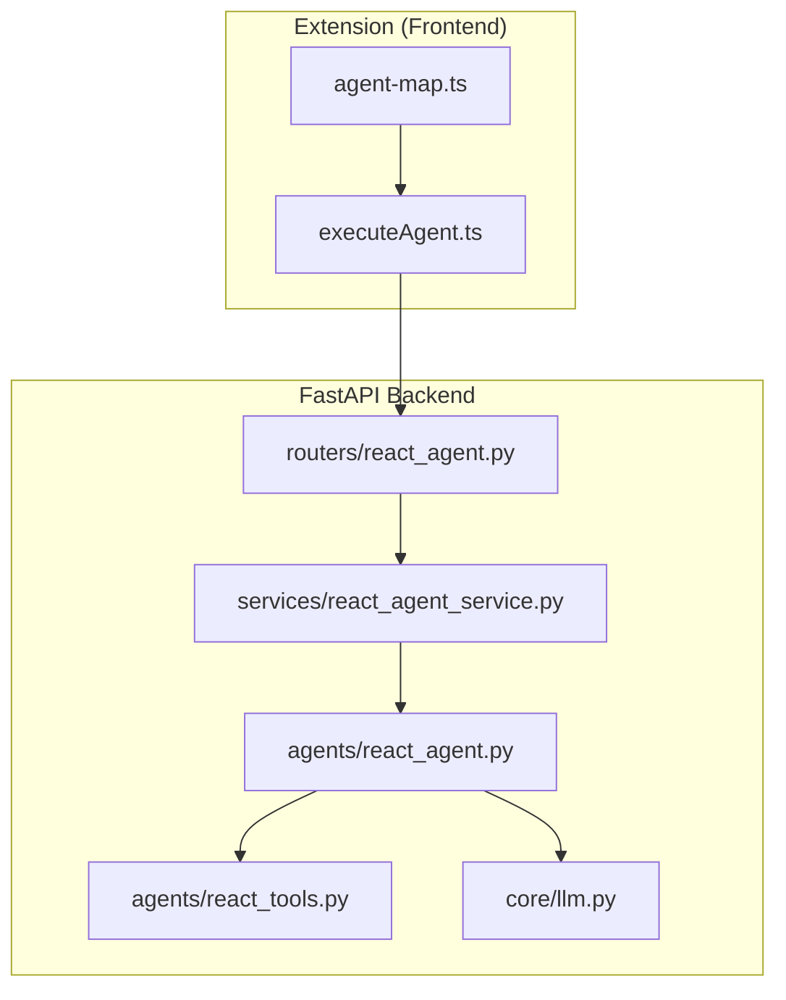
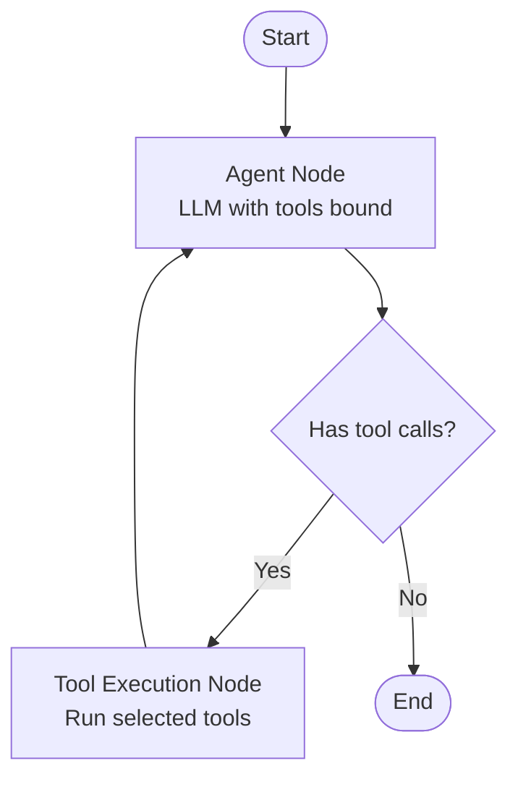
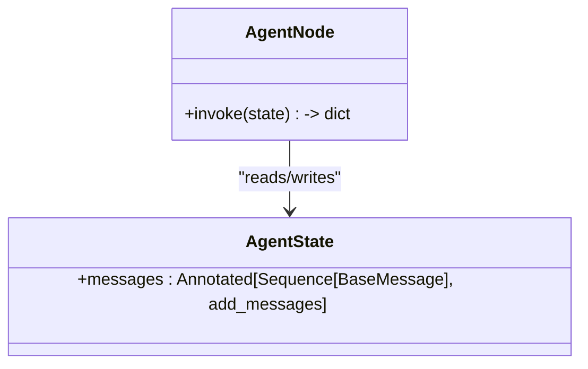
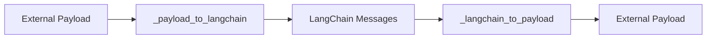
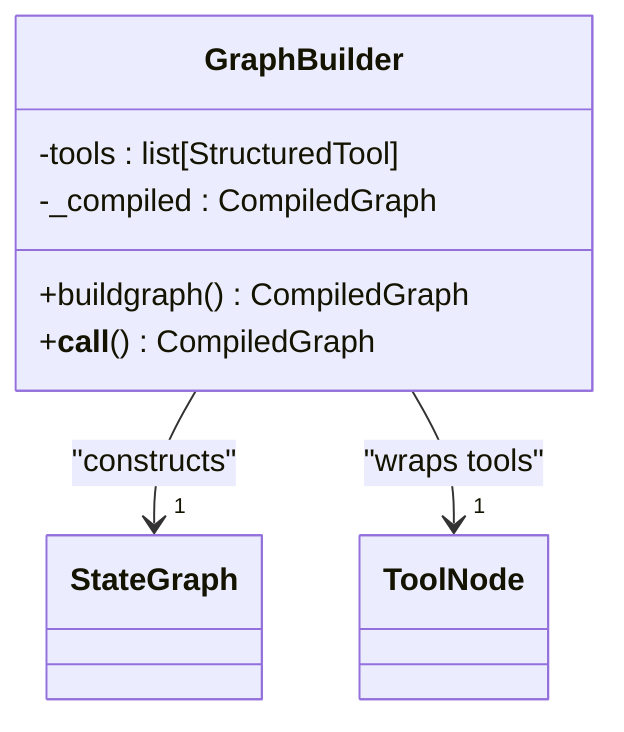
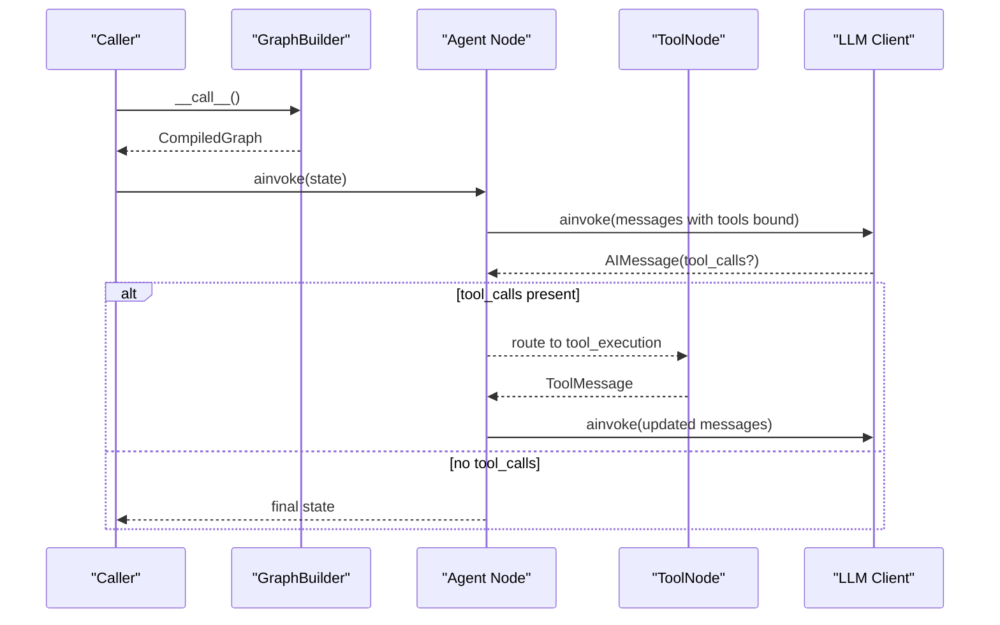
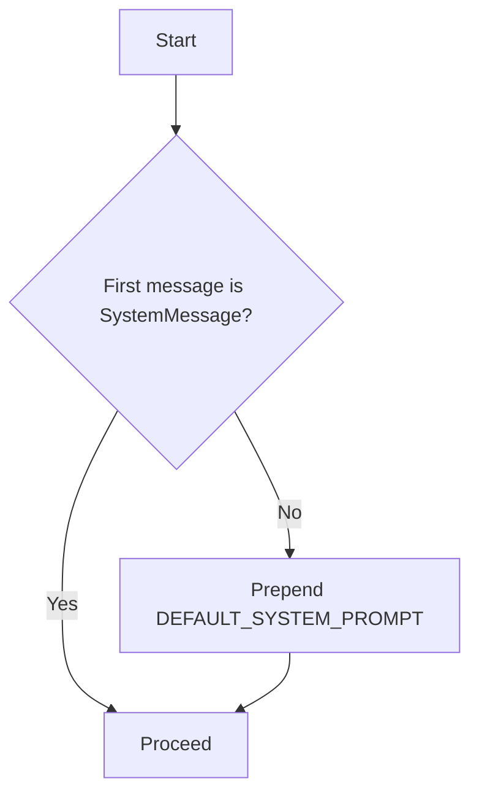
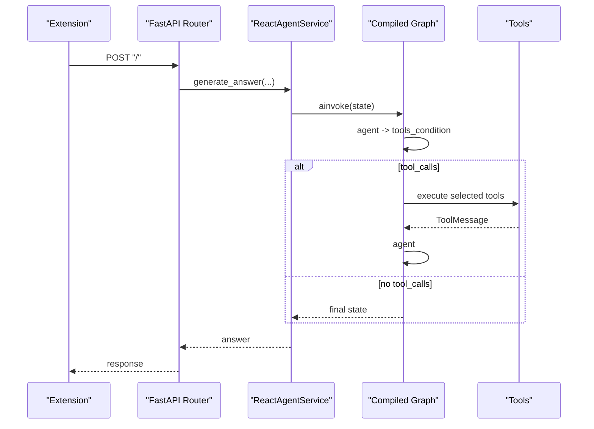
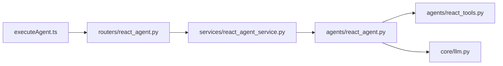

# Reactive agent architecture

## Introduction
This page explains the reactive agent architecture built on LangGraph. It focuses on the state machine design, message handling, the reactive loop, the GraphBuilder workflow construction and caching, normalization functions for cross-format compatibility, system prompt configuration, and performance optimizations. It also illustrates agent state transitions, conditional edges, and the end-to-end execution pattern from API to tool invocation.

## Project structure
The reactive agent spans Python backend services and TypeScript frontend orchestration:
- Backend: LangGraph workflow, agent state, message normalization, tool registry, and service/router layers.
- Frontend: Extension utilities that prepare payloads and invoke backend endpoints.

```mermaid
graph TB
subgraph "Extension (Frontend)"
EXTSVC["executeAgent.ts"]
MAP["agent-map.ts"]
end
subgraph "FastAPI Backend"
ROUTER["routers/react_agent.py"]
SERVICE["services/react_agent_service.py"]
AGENT["agents/react_agent.py"]
TOOLS["agents/react_tools.py"]
LLM["core/llm.py"]
end
EXTSVC --> ROUTER
MAP --> EXTSVC
ROUTER --> SERVICE
SERVICE --> AGENT
AGENT --> TOOLS
AGENT --> LLM
```

## Core components
- AgentState: TypedDict representing the conversation state with an annotated messages field that accumulates LangChain messages.
- Message normalization: Bidirectional converters between external payloads and LangChain message types.
- GraphBuilder: Constructs and compiles the LangGraph workflow, caching the compiled graph.
- Tool registry: Centralized collection of structured tools, optionally augmented with contextual tokens/session data.
- System prompt: A default system message injected at the start of the message sequence when absent.

Key responsibilities:
- State machine: Agent node produces an LLM response; conditional edges route to tool execution when tool calls are detected; tool execution returns ToolMessages; loop continues until no tool calls remain.
- Payload conversion: Ensures consistent message roles, content, and tool call/tool call IDs across boundaries.
- Tool binding: The agent node binds available tools to the LLM to enable tool-use prompting.

## Architecture overview
The reactive loop is a LangGraph StateGraph with:
- Nodes: agent and tool_execution.
- Edges: START → agent; agent → tool_execution if tool calls; tool_execution → agent; agent → END when no tool calls.

```mermaid
flowchart TD
START(["Start"]) --> AgentNode["Agent Node<br/>LLM with tools bound"]
AgentNode --> Decision{"Has tool calls?"}
Decision --> |Yes| ToolExec["Tool Execution Node<br/>Run selected tools"]
ToolExec --> AgentNode
Decision --> |No| End(["End"])
```

## Detailed component analysis

### LangGraph state machine and AgentState typing
- AgentState defines a single key messages with an annotation that merges incoming messages into the state.
- The agent node ensures a system message is present at the head of the sequence before invoking the LLM.

```mermaid
classDiagram
class AgentState {
+messages : Annotated[Sequence[BaseMessage], add_messages]
}
class AgentNode {
+invoke(state) -> dict
}
AgentNode --> AgentState : "reads/writes"
```

### Message normalization functions
Normalization bridges external payloads and LangChain message types:
- _payload_to_langchain: Converts external role/content/tool_call_id/tool_calls into SystemMessage, AIMessage, ToolMessage, or HumanMessage.
- _langchain_to_payload: Serializes LangChain messages back to external payloads, preserving tool_calls and tool_call_id.

```mermaid
flowchart LR
P["External Payload"] --> N1["_payload_to_langchain"]
N1 --> LC["LangChain Messages"]
LC --> N2["_langchain_to_payload"]
N2 --> P2["External Payload"]
```

### GraphBuilder: workflow construction and caching
- Builds a StateGraph with agent and tool_execution nodes.
- Uses tools_condition to decide routing after agent inference.
- Compiles the graph once and caches it for reuse.
- Supports dynamic tool sets via context or explicit tool lists.

```mermaid
classDiagram
class GraphBuilder {
-tools : list[StructuredTool]
-_compiled : CompiledGraph
+buildgraph() CompiledGraph
+__call__() CompiledGraph
}
GraphBuilder --> "1" StateGraph : "constructs"
GraphBuilder --> "1" ToolNode : "wraps tools"
```

### Tool registry and dynamic tool binding
- Tools are assembled centrally, optionally enriched with contextual tokens/session data.
- The agent node binds the tool list to the LLM to enable tool-use prompting.

```mermaid
sequenceDiagram
participant Caller as "Caller"
participant GB as "GraphBuilder"
participant AG as "Agent Node"
participant TN as "ToolNode"
participant LLM as "LLM Client"
Caller->>GB : __call__()
GB-->>Caller : CompiledGraph
Caller->>AG : ainvoke(state)
AG->>LLM : ainvoke(messages with tools bound)
LLM-->>AG : AIMessage(tool_calls?)
alt tool_calls present
AG-->>TN : route to tool_execution
TN-->>AG : ToolMessage
AG->>LLM : ainvoke(updated messages)
else no tool_calls
AG-->>Caller : final state
end
```

### System prompt configuration
- A default system message is constructed and prepended to the message sequence if none exists.
- This ensures consistent behavior and role context for the agent.

```mermaid
flowchart TD
S["Start"] --> CheckSys{"First message is SystemMessage?"}
CheckSys --> |No| Inject["Prepend DEFAULT_SYSTEM_PROMPT"]
CheckSys --> |Yes| Continue["Proceed"]
Inject --> Continue
```

### End-to-End execution pattern
- Frontend composes a request payload and invokes the FastAPI endpoint.
- Router validates inputs and delegates to the service.
- Service builds the state (optionally injecting page context) and invokes the compiled graph.
- Graph executes the reactive loop and returns the final state.

```mermaid
sequenceDiagram
participant Ext as "Extension"
participant API as "FastAPI Router"
participant Svc as "ReactAgentService"
participant G as "Compiled Graph"
participant Tools as "Tools"
Ext->>API : POST "/"
API->>Svc : generate_answer(...)
Svc->>G : ainvoke(state)
G->>G : agent -> tools_condition
alt tool_calls
G->>Tools : execute selected tools
Tools-->>G : ToolMessage
G->>G : agent
else no tool_calls
G-->>Svc : final state
end
Svc-->>API : answer
API-->>Ext : response
```

## Dependency analysis
- agents/react_agent.py depends on core/llm.py for the LLM client and agents/react_tools.py for the tool registry.
- services/react_agent_service.py orchestrates request preparation and invokes the compiled graph.
- routers/react_agent.py exposes the API endpoint.
- Frontend extension utilities construct payloads and call the backend.

```mermaid
graph LR
EXT["executeAgent.ts"] --> RTR["routers/react_agent.py"]
RTR --> SVC["services/react_agent_service.py"]
SVC --> AG["agents/react_agent.py"]
AG --> TL["agents/react_tools.py"]
AG --> LM["core/llm.py"]
```

## Performance considerations
- Graph compilation and caching:
  - GraphBuilder compiles the workflow once and stores it for reuse.
  - A process-level LRU cache wraps GraphBuilder to avoid repeated compilation.
- Tool execution offloading:
  - Long-running tools are executed asynchronously and often offloaded to threads to prevent blocking the LLM invocation loop.
- Payload normalization:
  - Content normalization avoids serialization errors and reduces downstream parsing overhead.
- System prompt injection:
  - Ensures consistent initial context without recomputation.

Recommendations:
- Keep the tool list stable across invocations to maximize cache hits.
- Prefer streaming responses at the API boundary if needed, while retaining synchronous graph execution semantics.
- Monitor tool latency and consider batching where appropriate.

## Troubleshooting guide
Common issues and mitigations:
- Missing system message:
  - Symptom: Unexpected behavior at start.
  - Resolution: The agent node automatically prepends the default system message if the first message is not a SystemMessage.
- Tool call parsing failures:
  - Symptom: Tool execution not triggered or malformed ToolMessage.
  - Resolution: Ensure tool_calls are properly serialized and tool_call_id is preserved during normalization.
- Tool execution errors:
  - Symptom: Exceptions raised inside tools.
  - Resolution: Tools already wrap exceptions and return error strings; ensure upstream handlers surface these gracefully.
- LLM initialization problems:
  - Symptom: Runtime errors when constructing the LLM client.
  - Resolution: Verify provider configuration, API keys, and base URLs.

Operational tips:
- Log intermediate states and messages to diagnose routing loops or missing tool calls.
- Validate request payloads against the request/response models to prevent runtime mismatches.

## Conclusion
The reactive agent uses LangGraph's StateGraph to implement a reliable, tool-augmented reasoning loop. AgentState encapsulates conversation context, normalization functions maintain cross-format consistency, and GraphBuilder's compilation and caching minimize overhead. The system prompt guides behavior, while conditional edges ensure smooth transitions between reasoning and tool execution. Together, these components deliver a scalable, extensible agent architecture suitable for browser-centric tasks and beyond.
