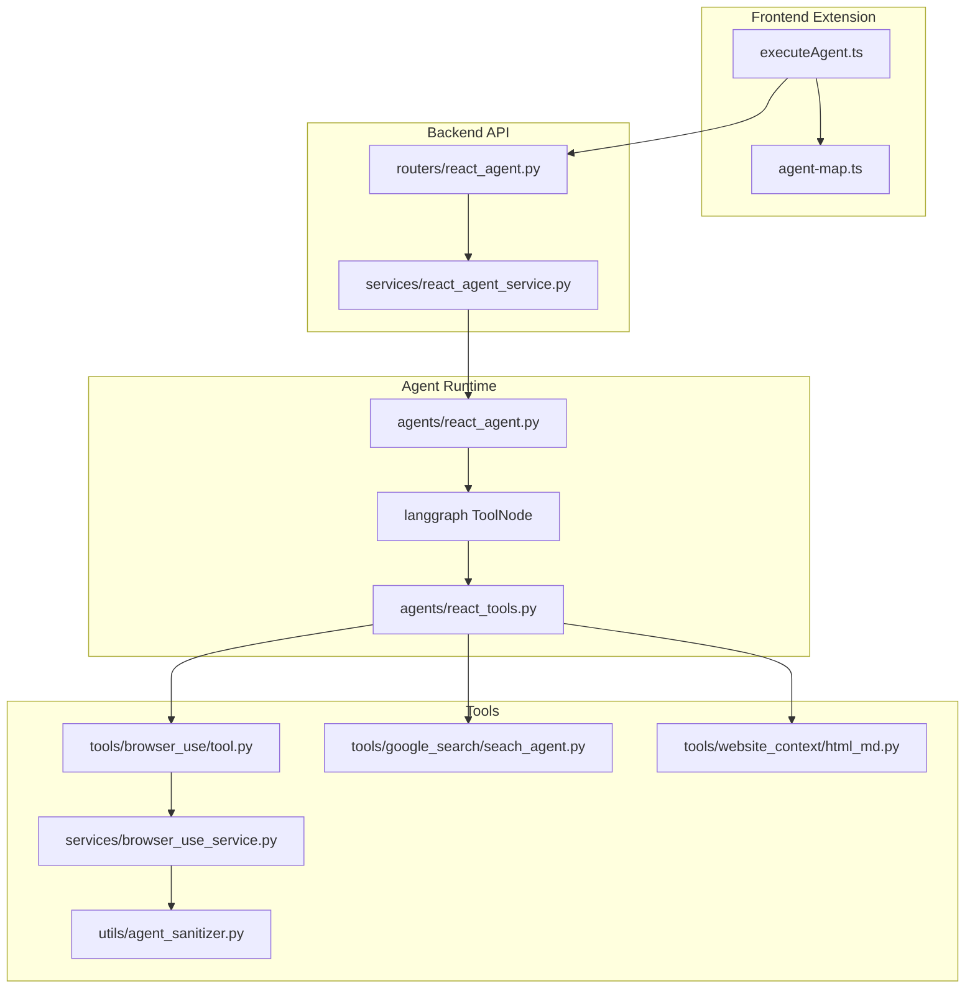
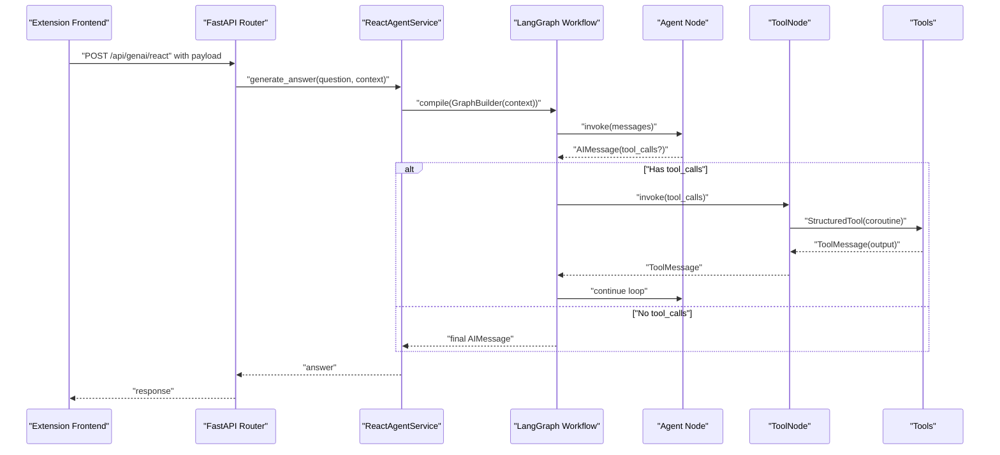
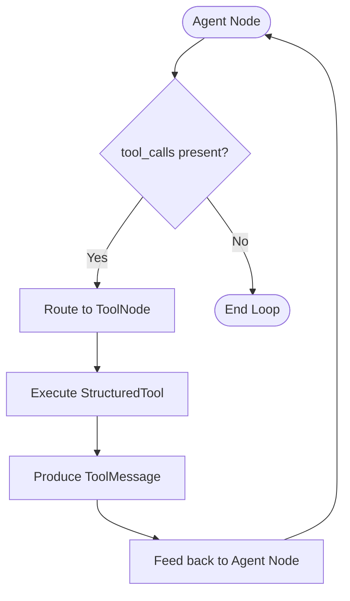
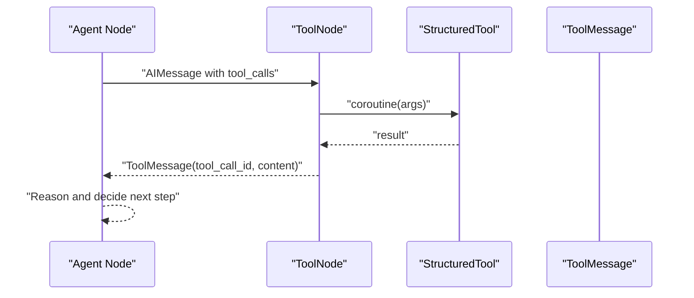
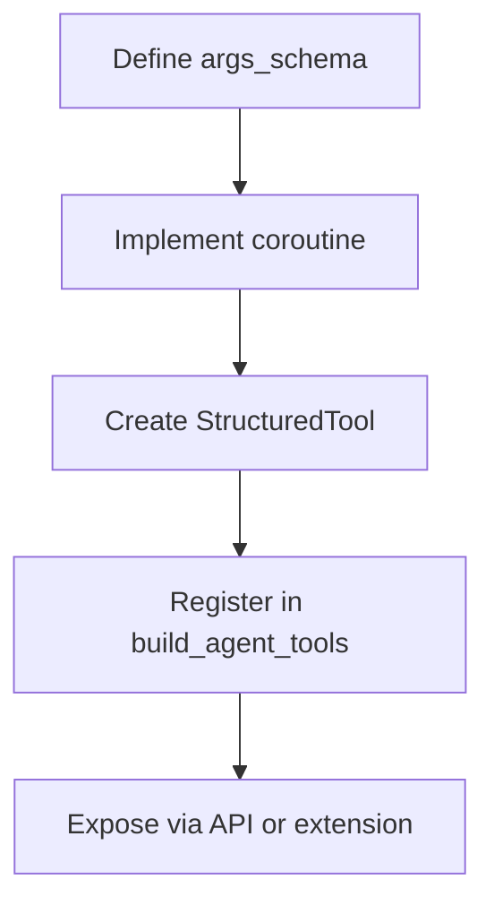
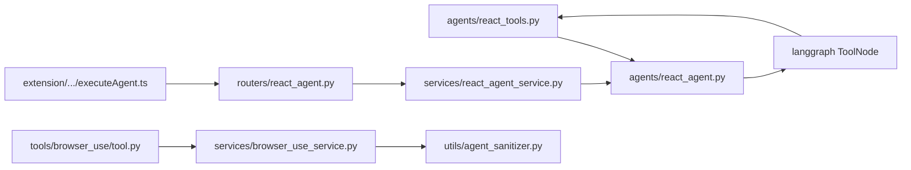

# Tool Integration System

<cite>
**Referenced Files in This Document**
- [react_tools.py](file://agents/react_tools.py)
- [react_agent.py](file://agents/react_agent.py)
- [tool.py](file://tools/browser_use/tool.py)
- [executeAgent.ts](file://extension/entrypoints/utils/executeAgent.ts)
- [agent-map.ts](file://extension/entrypoints/sidepanel/lib/agent-map.ts)
- [react_agent.py](file://routers/react_agent.py)
- [react_agent_service.py](file://services/react_agent_service.py)
- [seach_agent.py](file://tools/google_search/seach_agent.py)
- [html_md.py](file://tools/website_context/html_md.py)
- [browser_use_service.py](file://services/browser_use_service.py)
- [agent-sanitizer.py](file://utils/agent_sanitizer.py)
</cite>

## Table of Contents
1. [Introduction](#introduction)
2. [Project Structure](#project-structure)
3. [Core Components](#core-components)
4. [Architecture Overview](#architecture-overview)
5. [Detailed Component Analysis](#detailed-component-analysis)
6. [Dependency Analysis](#dependency-analysis)
7. [Performance Considerations](#performance-considerations)
8. [Troubleshooting Guide](#troubleshooting-guide)
9. [Conclusion](#conclusion)

## Introduction
This document explains the tool integration system within the AI agent framework. It focuses on how tools are defined as StructuredTool instances, how the AGENT_TOOLS registry is constructed, how tools are selected and invoked via tools_condition, and how tool outputs are integrated back into the agent’s message flow. It also covers tool registration, parameter validation, error handling, context management, and how to add new tools to the ecosystem.

## Project Structure
The tool integration spans several layers:
- Agent orchestration and graph definition live in the agents module.
- Tools are defined in agents/react_tools.py and individual tool modules under tools/.
- The browser action tool bridges the agent to the extension’s automation capabilities.
- The frontend extension constructs payloads and routes commands to backend APIs.
- Backend services compile the agent graph and execute tool workflows.

**Diagram sources**
- [executeAgent.ts](file://extension/entrypoints/utils/executeAgent.ts#L1-L299)
- [agent-map.ts](file://extension/entrypoints/sidepanel/lib/agent-map.ts#L1-L80)
- [react_agent.py](file://routers/react_agent.py#L1-L57)
- [react_agent_service.py](file://services/react_agent_service.py#L1-L154)
- [react_agent.py](file://agents/react_agent.py#L1-L191)
- [react_tools.py](file://agents/react_tools.py#L1-L721)
- [tool.py](file://tools/browser_use/tool.py#L1-L49)
- [seach_agent.py](file://tools/google_search/seach_agent.py#L1-L84)
- [html_md.py](file://tools/website_context/html_md.py#L1-L27)
- [browser_use_service.py](file://services/browser_use_service.py#L1-L96)
- [agent-sanitizer.py](file://utils/agent_sanitizer.py#L51-L118)

**Section sources**
- [react_tools.py](file://agents/react_tools.py#L1-L721)
- [react_agent.py](file://agents/react_agent.py#L1-L191)
- [tool.py](file://tools/browser_use/tool.py#L1-L49)
- [executeAgent.ts](file://extension/entrypoints/utils/executeAgent.ts#L1-L299)
- [agent-map.ts](file://extension/entrypoints/sidepanel/lib/agent-map.ts#L1-L80)
- [react_agent.py](file://routers/react_agent.py#L1-L57)
- [react_agent_service.py](file://services/react_agent_service.py#L1-L154)
- [seach_agent.py](file://tools/google_search/seach_agent.py#L1-L84)
- [html_md.py](file://tools/website_context/html_md.py#L1-L27)
- [browser_use_service.py](file://services/browser_use_service.py#L1-L96)
- [agent-sanitizer.py](file://utils/agent_sanitizer.py#L51-L118)

## Core Components
- AGENT_TOOLS registry: A list of StructuredTool instances built dynamically from context. It includes core tools plus contextual tools (e.g., Gmail, Calendar, PyJIIT) when credentials are provided.
- Tool definitions: Each tool is a StructuredTool with a coroutine and a Pydantic args_schema for parameter validation.
- ToolNode execution pattern: LangGraph ToolNode executes tools and returns ToolMessage outputs that feed back into the agent.
- tools_condition: Conditional edge that routes the agent to ToolNode when tool_calls are predicted or when the agent decides to use tools.
- Context propagation: The agent receives credentials and optional page context via the service layer and passes them to the tool builder.

**Section sources**
- [react_tools.py](file://agents/react_tools.py#L609-L702)
- [react_agent.py](file://agents/react_agent.py#L154-L170)

## Architecture Overview
The system integrates frontend commands, backend orchestration, and tool execution into a cohesive pipeline.

**Diagram sources**
- [executeAgent.ts](file://extension/entrypoints/utils/executeAgent.ts#L116-L127)
- [react_agent.py](file://routers/react_agent.py#L18-L38)
- [react_agent_service.py](file://services/react_agent_service.py#L16-L145)
- [react_agent.py](file://agents/react_agent.py#L123-L170)
- [react_tools.py](file://agents/react_tools.py#L609-L702)

## Detailed Component Analysis

### AGENT_TOOLS Registry and StructuredTool Instances
- The registry is built by build_agent_tools(context) which:
  - Loads default tools (GitHub, web search, website, YouTube, browser action).
  - Conditionally adds Gmail and Calendar tools when a Google access token is present.
  - Conditionally adds PyJIIT tool when a login session payload is present.
- Each tool is a StructuredTool with:
  - name and description for LLM tool selection.
  - args_schema (Pydantic model) for input validation.
  - coroutine implementing the tool logic.

Examples of tool registration and validation:
- GitHub tool: Validates URL and question, converts repository to markdown, and queries a chain.
- Web search tool: Validates query and max_results bounds, runs Tavily search, and formats results.
- Website tool: Fetches page markdown and answers questions.
- YouTube tool: Uses transcript and metadata to answer questions.
- Gmail tools: Validate access tokens and enforce max result bounds; handle errors gracefully.
- Calendar tools: Validate time ranges and access tokens; handle errors gracefully.
- PyJIIT tool: Validates session payload and handles mapping of registration codes to IDs.
- Browser action tool: Accepts goal, target_url, DOM structure, and constraints; generates an action plan.

**Section sources**
- [react_tools.py](file://agents/react_tools.py#L609-L702)
- [react_tools.py](file://agents/react_tools.py#L524-L606)
- [react_tools.py](file://agents/react_tools.py#L217-L231)
- [react_tools.py](file://agents/react_tools.py#L233-L247)
- [react_tools.py](file://agents/react_tools.py#L250-L262)
- [react_tools.py](file://agents/react_tools.py#L265-L276)
- [react_tools.py](file://agents/react_tools.py#L279-L301)
- [react_tools.py](file://agents/react_tools.py#L303-L332)
- [react_tools.py](file://agents/react_tools.py#L334-L356)
- [react_tools.py](file://agents/react_tools.py#L358-L376)
- [react_tools.py](file://agents/react_tools.py#L378-L400)
- [react_tools.py](file://agents/react_tools.py#L402-L436)
- [react_tools.py](file://agents/react_tools.py#L438-L522)
- [tool.py](file://tools/browser_use/tool.py#L12-L48)

### Tool Selection Mechanism and Agent Decision Flow
- The agent node binds the LLM to the available tools and generates an AIMessage that may include tool_calls.
- tools_condition routes to ToolNode when tool_calls are detected; otherwise it ends the loop.
- The ToolNode executes tools and returns ToolMessage outputs that include tool_call_id, enabling the agent to continue reasoning.

**Diagram sources**
- [react_agent.py](file://agents/react_agent.py#L161-L169)
- [react_agent.py](file://agents/react_agent.py#L123-L135)

**Section sources**
- [react_agent.py](file://agents/react_agent.py#L123-L170)

### ToolNode Execution Pattern and Message Integration
- ToolNode executes the registered StructuredTool coroutines.
- Tool outputs are normalized to ToolMessage with tool_call_id so the agent can correlate tool results with the original tool_calls.
- The agent continues the loop until no further tool_calls are generated.

**Diagram sources**
- [react_agent.py](file://agents/react_agent.py#L159-L169)
- [react_tools.py](file://agents/react_tools.py#L524-L606)

**Section sources**
- [react_agent.py](file://agents/react_agent.py#L159-L169)
- [react_tools.py](file://agents/react_tools.py#L524-L606)

### Tool Registration, Parameter Validation, and Error Handling
- Registration:
  - Tools are declared as StructuredTool instances with args_schema.
  - build_agent_tools dynamically augments tools based on context (tokens, session payloads).
- Parameter validation:
  - Pydantic models define required fields, types, and constraints (e.g., URL formats, numeric ranges).
- Error handling:
  - Tools wrap external calls in try/except and return informative error strings.
  - Some tools enforce bounds (e.g., max_results) and normalize inputs.
  - Action plan generation includes sanitization to prevent unsafe patterns.

**Section sources**
- [react_tools.py](file://agents/react_tools.py#L609-L702)
- [react_tools.py](file://agents/react_tools.py#L61-L209)
- [react_tools.py](file://agents/react_tools.py#L279-L301)
- [react_tools.py](file://agents/react_tools.py#L303-L332)
- [react_tools.py](file://agents/react_tools.py#L334-L356)
- [react_tools.py](file://agents/react_tools.py#L358-L376)
- [react_tools.py](file://agents/react_tools.py#L378-L400)
- [react_tools.py](file://agents/react_tools.py#L402-L436)
- [react_tools.py](file://agents/react_tools.py#L438-L522)
- [agent-sanitizer.py](file://utils/agent_sanitizer.py#L51-L118)

### Tool Execution Context Management and State Preservation
- Context injection:
  - ReactAgentService builds a context dictionary from incoming request fields (e.g., google_access_token, pyjiit_login_response, client_html).
  - GraphBuilder(context) passes this context to build_agent_tools, enabling conditional tool availability.
- Page context:
  - When client_html is provided, the service converts it to markdown and injects it as a SystemMessage to guide the agent.
- State preservation:
  - The agent maintains a messages list; ToolMessage preserves tool_call_id to correlate tool outputs with tool_calls.

**Section sources**
- [react_agent_service.py](file://services/react_agent_service.py#L67-L118)
- [react_agent.py](file://agents/react_agent.py#L40-L121)

### Relationship Between Agent Tools and the Broader Tool Ecosystem
- Tool modules encapsulate domain-specific logic:
  - Web search via Tavily.
  - Website context conversion to markdown.
  - Browser automation via an LLM-generated action plan.
- The browser action tool bridges the agent to the extension’s automation:
  - It accepts goal, target_url, DOM structure, and constraints.
  - It delegates to AgentService to generate a validated action plan.

**Section sources**
- [seach_agent.py](file://tools/google_search/seach_agent.py#L14-L63)
- [html_md.py](file://tools/website_context/html_md.py#L5-L11)
- [tool.py](file://tools/browser_use/tool.py#L27-L48)
- [browser_use_service.py](file://services/browser_use_service.py#L11-L96)
- [agent-sanitizer.py](file://utils/agent_sanitizer.py#L51-L118)

### Adding New Tools to the Ecosystem
To add a new tool:
1. Define a Pydantic args_schema for input validation.
2. Implement a coroutine that performs the tool logic and returns a string or structured output.
3. Wrap it as a StructuredTool with name, description, args_schema, and coroutine.
4. Register it in build_agent_tools(context) to make it available when appropriate.
5. Optionally, add frontend routing and payload construction in the extension if the tool needs UI integration.

**Diagram sources**
- [react_tools.py](file://agents/react_tools.py#L609-L702)
- [react_tools.py](file://agents/react_tools.py#L524-L606)

**Section sources**
- [react_tools.py](file://agents/react_tools.py#L609-L702)
- [react_tools.py](file://agents/react_tools.py#L524-L606)

## Dependency Analysis
- Agents depend on:
  - LangGraph ToolNode and tools_condition for execution control.
  - AGENT_TOOLS registry for available tools.
- Tools depend on:
  - External services (e.g., Tavily, Gmail, Calendar APIs).
  - Internal services (e.g., AgentService for browser automation).
- Frontend depends on:
  - AgentMap to route commands to backend endpoints.
  - executeAgent to construct payloads and handle responses.

**Diagram sources**
- [react_tools.py](file://agents/react_tools.py#L1-L721)
- [react_agent.py](file://agents/react_agent.py#L1-L191)
- [executeAgent.ts](file://extension/entrypoints/utils/executeAgent.ts#L1-L299)
- [react_agent.py](file://routers/react_agent.py#L1-L57)
- [react_agent_service.py](file://services/react_agent_service.py#L1-L154)
- [tool.py](file://tools/browser_use/tool.py#L1-L49)
- [browser_use_service.py](file://services/browser_use_service.py#L1-L96)
- [agent-sanitizer.py](file://utils/agent_sanitizer.py#L51-L118)

**Section sources**
- [react_tools.py](file://agents/react_tools.py#L1-L721)
- [react_agent.py](file://agents/react_agent.py#L1-L191)
- [executeAgent.ts](file://extension/entrypoints/utils/executeAgent.ts#L1-L299)
- [react_agent.py](file://routers/react_agent.py#L1-L57)
- [react_agent_service.py](file://services/react_agent_service.py#L1-L154)
- [tool.py](file://tools/browser_use/tool.py#L1-L49)
- [browser_use_service.py](file://services/browser_use_service.py#L1-L96)
- [agent-sanitizer.py](file://utils/agent_sanitizer.py#L51-L118)

## Performance Considerations
- Async execution: Tools use asyncio.to_thread for blocking operations to avoid blocking the event loop.
- Bounds enforcement: Tools cap max_results and similar parameters to control resource usage.
- Payload minimization: Tools return concise summaries or structured outputs; avoid returning overly large documents.
- Caching: GraphBuilder uses caching to avoid recompiling the workflow.

[No sources needed since this section provides general guidance]

## Troubleshooting Guide
Common issues and resolutions:
- Missing credentials:
  - Symptom: Tools return messages indicating missing tokens or session data.
  - Resolution: Ensure google_access_token and/or pyjiit_login_response are provided in the request context.
- Tool execution errors:
  - Symptom: Tool outputs include error strings.
  - Resolution: Inspect tool-specific error handling and logs; verify external API keys and scopes.
- Action plan validation failures:
  - Symptom: Generated action plans are rejected due to missing fields or unsafe patterns.
  - Resolution: Review agent-sanitizer validations and adjust action plan generation logic.
- Frontend routing:
  - Symptom: Commands do not reach the intended backend endpoint.
  - Resolution: Verify agent-map entries and executeAgent payload construction.

**Section sources**
- [react_tools.py](file://agents/react_tools.py#L279-L301)
- [react_tools.py](file://agents/react_tools.py#L303-L332)
- [react_tools.py](file://agents/react_tools.py#L334-L356)
- [react_tools.py](file://agents/react_tools.py#L358-L376)
- [react_tools.py](file://agents/react_tools.py#L378-L400)
- [react_tools.py](file://agents/react_tools.py#L402-L436)
- [react_tools.py](file://agents/react_tools.py#L438-L522)
- [agent-sanitizer.py](file://utils/agent_sanitizer.py#L51-L118)
- [executeAgent.ts](file://extension/entrypoints/utils/executeAgent.ts#L1-L299)
- [agent-map.ts](file://extension/entrypoints/sidepanel/lib/agent-map.ts#L1-L80)

## Conclusion
The tool integration system combines a robust AGENT_TOOLS registry, strict parameter validation, and resilient error handling to enable reliable agent-driven workflows. Tools are structured as LangGraph-compatible StructuredTool instances, selected via tools_condition, and executed through ToolNode. Context is propagated from frontend to backend and injected into the agent runtime, while tool outputs are integrated back into the message flow. The system supports easy addition of new tools and safe automation via validated action plans.