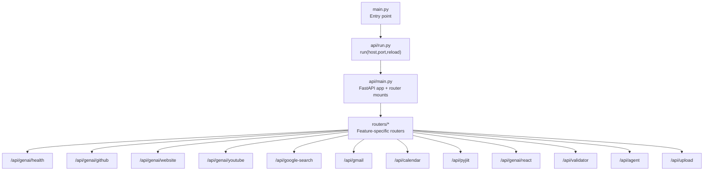
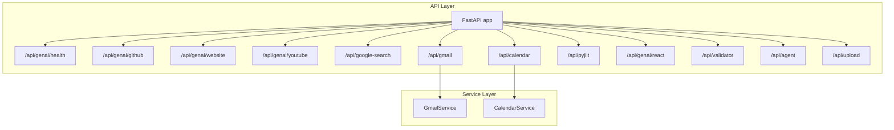
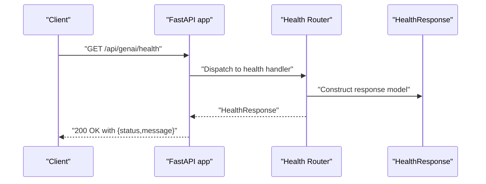
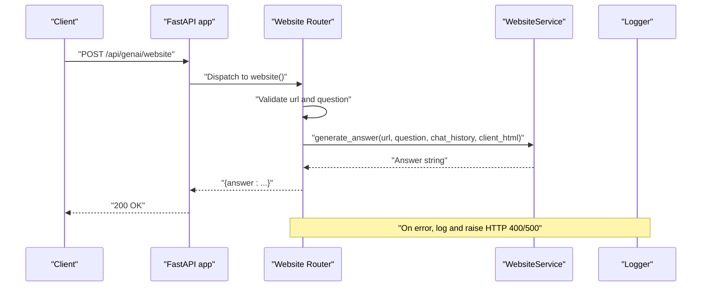
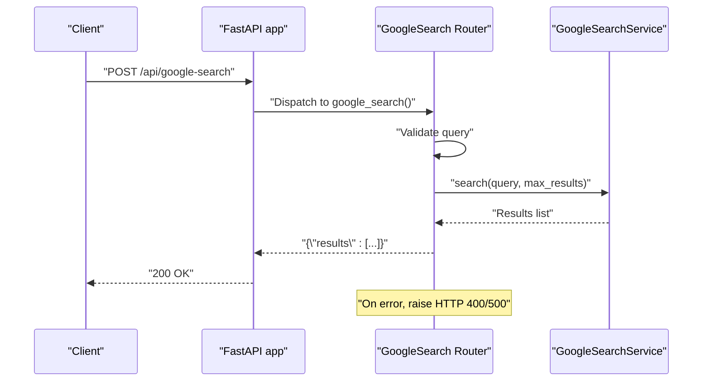
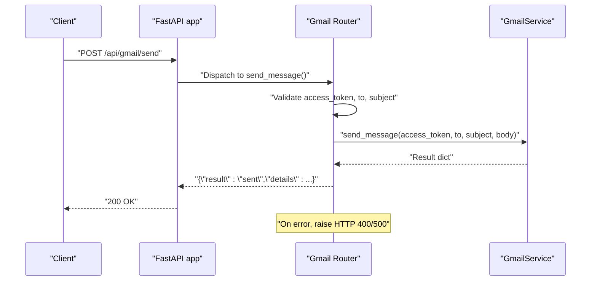
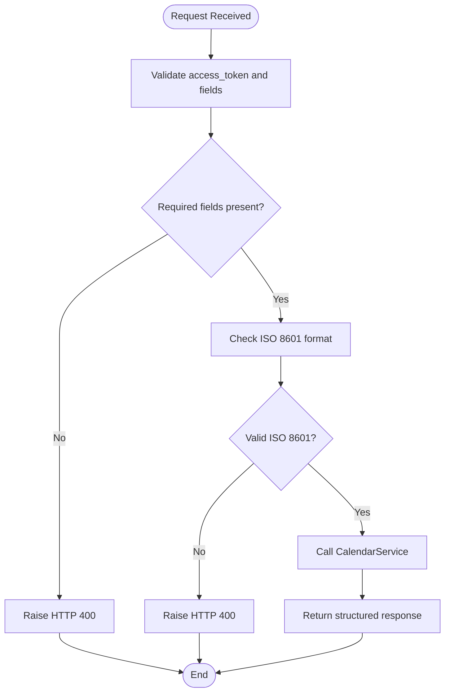
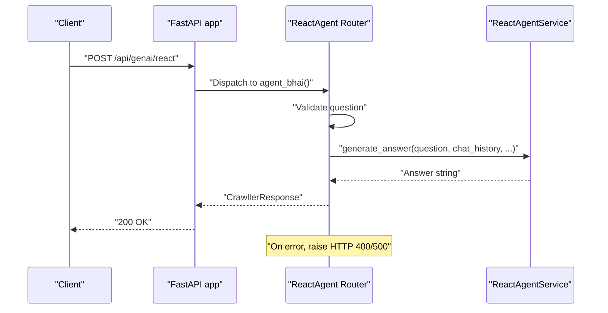
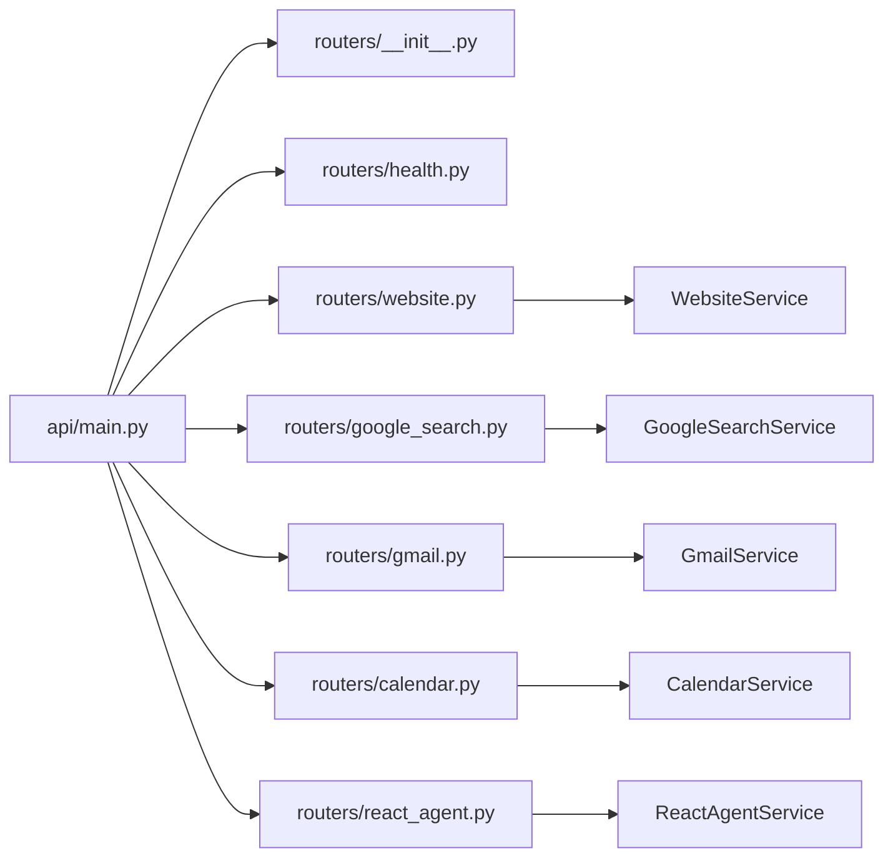

# API Overview

<cite>
**Referenced Files in This Document**
- [api/main.py](file://api/main.py)
- [api/run.py](file://api/run.py)
- [main.py](file://main.py)
- [core/config.py](file://core/config.py)
- [routers/__init__.py](file://routers/__init__.py)
- [routers/health.py](file://routers/health.py)
- [routers/website.py](file://routers/website.py)
- [routers/google_search.py](file://routers/google_search.py)
- [routers/gmail.py](file://routers/gmail.py)
- [routers/calendar.py](file://routers/calendar.py)
- [routers/react_agent.py](file://routers/react_agent.py)
- [models/response/health.py](file://models/response/health.py)
- [services/gmail_service.py](file://services/gmail_service.py)
- [services/calendar_service.py](file://services/calendar_service.py)
</cite>

## Table of Contents
1. [Introduction](#introduction)
2. [Project Structure](#project-structure)
3. [Core Components](#core-components)
4. [Architecture Overview](#architecture-overview)
5. [Detailed Component Analysis](#detailed-component-analysis)
6. [Dependency Analysis](#dependency-analysis)
7. [Performance Considerations](#performance-considerations)
8. [Troubleshooting Guide](#troubleshooting-guide)
9. [Conclusion](#conclusion)
10. [Appendices](#appendices)

## Introduction
This document provides a comprehensive API overview for the FastAPI server. It explains the overall architecture, endpoint organization, routing structure, and how base URL patterns map to distinct service areas. It also covers application initialization, startup modes, logging configuration, and error handling strategies. Authentication mechanisms are documented in terms of access tokens passed via request bodies, and CORS configuration is noted as not being explicitly configured in the provided code. Health checks and monitoring interfaces are described, along with practical usage patterns and integration scenarios.

## Project Structure
The API server is organized around a FastAPI application that aggregates multiple routers under distinct base prefixes. Each router corresponds to a functional area (e.g., GenAI, Google Search, Gmail, Calendar, PyJiit, React Agent, Website, Validator, Upload). The application can be started either as the API server or as an MCP server via a top-level entry point.

**Diagram sources**
- [main.py](file://main.py#L1-L58)
- [api/run.py](file://api/run.py#L1-L15)
- [api/main.py](file://api/main.py#L1-L47)
- [routers/__init__.py](file://routers/__init__.py#L1-L32)

**Section sources**
- [api/main.py](file://api/main.py#L12-L40)
- [routers/__init__.py](file://routers/__init__.py#L1-L32)
- [main.py](file://main.py#L11-L54)
- [api/run.py](file://api/run.py#L4-L10)

## Core Components
- Application factory and router mounts: The FastAPI app is created and routers are included under base prefixes to segment functionality by domain.
- Startup orchestration: A top-level script chooses between running the API server or the MCP server, delegating to the API runner.
- Configuration and logging: Environment variables drive runtime behavior and logging level; a shared logger getter is used across modules.
- Health endpoint: A dedicated router exposes a simple health check returning a structured response model.

Key implementation references:
- Application creation and router mounts: [api/main.py](file://api/main.py#L12-L40)
- Startup selection and API runner: [main.py](file://main.py#L11-L54), [api/run.py](file://api/run.py#L4-L10)
- Configuration and logging: [core/config.py](file://core/config.py#L8-L25), [core/config.py](file://core/config.py#L22-L25)
- Health response model: [models/response/health.py](file://models/response/health.py#L4-L7)
- Health handler: [routers/health.py](file://routers/health.py#L7-L12)

**Section sources**
- [api/main.py](file://api/main.py#L12-L40)
- [main.py](file://main.py#L11-L54)
- [api/run.py](file://api/run.py#L4-L10)
- [core/config.py](file://core/config.py#L8-L25)
- [models/response/health.py](file://models/response/health.py#L4-L7)
- [routers/health.py](file://routers/health.py#L7-L12)

## Architecture Overview
The API follows a modular FastAPI architecture:
- Central app definition and router composition
- Feature-based routers grouped under base prefixes
- Request validation via Pydantic models
- Service-layer delegation per router
- Global exception handling returning standardized HTTP errors
- Optional root endpoint returning app metadata

**Diagram sources**
- [api/main.py](file://api/main.py#L29-L40)
- [routers/gmail.py](file://routers/gmail.py#L34-L35)
- [routers/calendar.py](file://routers/calendar.py#L28-L29)
- [services/gmail_service.py](file://services/gmail_service.py#L10-L56)
- [services/calendar_service.py](file://services/calendar_service.py#L8-L38)

## Detailed Component Analysis

### Endpoint Organization and Base URL Patterns
Routers are mounted under the following base prefixes to separate service domains:
- GenAI family: /api/genai/health, /api/genai/github, /api/genai/website, /api/genai/youtube, /api/genai/react
- Google family: /api/google-search
- Productivity: /api/gmail, /api/calendar, /api/pyjiit
- Validation and utilities: /api/validator, /api/agent, /api/upload

These mounts are defined in the central app file and exported via the routers package.

**Section sources**
- [api/main.py](file://api/main.py#L29-L40)
- [routers/__init__.py](file://routers/__init__.py#L18-L31)

### Health Check Endpoint
- Path: GET /api/genai/health
- Handler: Returns a structured response indicating service health
- Response model: HealthResponse with status and message fields

**Diagram sources**
- [routers/health.py](file://routers/health.py#L7-L12)
- [models/response/health.py](file://models/response/health.py#L4-L7)

**Section sources**
- [routers/health.py](file://routers/health.py#L7-L12)
- [models/response/health.py](file://models/response/health.py#L4-L7)

### Website Answer Endpoint
- Path: POST /api/genai/website
- Request model: WebsiteRequest (validated in router)
- Service: WebsiteService injected via dependency
- Behavior: Validates presence of URL and question; delegates to service; returns answer in a dictionary
- Error handling: Raises HTTP 400 for missing fields; wraps unexpected errors as HTTP 500

**Diagram sources**
- [routers/website.py](file://routers/website.py#L14-L42)

**Section sources**
- [routers/website.py](file://routers/website.py#L14-L42)

### Google Search Endpoint
- Path: POST /api/google-search
- Request model: SearchRequest with query and optional max_results
- Service: GoogleSearchService injected via dependency
- Behavior: Validates query; calls service.search; returns results in a dictionary
- Error handling: Raises HTTP 400 for invalid input; wraps unexpected errors as HTTP 500

**Diagram sources**
- [routers/google_search.py](file://routers/google_search.py#L20-L38)

**Section sources**
- [routers/google_search.py](file://routers/google_search.py#L11-L38)

### Gmail Endpoints
- Paths:
  - POST /api/gmail/unread
  - POST /api/gmail/latest
  - POST /api/gmail/mark_read
  - POST /api/gmail/send
- Request models: UnreadRequest, LatestRequest, MarkReadRequest, SendEmailRequest (all require access_token)
- Service: GmailService injected via dependency
- Behavior: Validates required fields; calls appropriate service methods; returns structured results
- Error handling: Raises HTTP 400 for missing fields; wraps unexpected errors as HTTP 500

**Diagram sources**
- [routers/gmail.py](file://routers/gmail.py#L122-L148)
- [services/gmail_service.py](file://services/gmail_service.py#L44-L55)

**Section sources**
- [routers/gmail.py](file://routers/gmail.py#L38-L148)
- [services/gmail_service.py](file://services/gmail_service.py#L10-L56)

### Calendar Endpoints
- Paths:
  - POST /api/calendar/events
  - POST /api/calendar/create
- Request models: EventsRequest (requires access_token), CreateEventRequest (requires access_token, summary, start_time, end_time)
- Service: CalendarService injected via dependency
- Behavior: Validates required fields and ISO 8601 timestamps; calls service methods; returns structured results
- Error handling: Raises HTTP 400 for invalid input; wraps unexpected errors as HTTP 500

**Diagram sources**
- [routers/calendar.py](file://routers/calendar.py#L69-L112)

**Section sources**
- [routers/calendar.py](file://routers/calendar.py#L32-L112)
- [services/calendar_service.py](file://services/calendar_service.py#L8-L38)

### React Agent Endpoint
- Path: POST /api/genai/react
- Request model: CrawlerRequest (validated in router)
- Service: ReactAgentService injected via dependency
- Behavior: Validates question; delegates to service.generate_answer; returns CrawllerResponse
- Error handling: Raises HTTP 400 for missing question; wraps unexpected errors as HTTP 500

**Diagram sources**
- [routers/react_agent.py](file://routers/react_agent.py#L18-L56)

**Section sources**
- [routers/react_agent.py](file://routers/react_agent.py#L18-L56)

### Application Initialization, Middleware, and Global Settings
- Application creation: FastAPI app is instantiated with title and version.
- Router mounts: Routers are imported from the routers package and mounted under base prefixes.
- Root endpoint: Optional GET "/" returns app metadata.
- No explicit middleware or CORS configuration is present in the provided code.
- Logging: Centralized logger getter is used across modules; environment variables control debug level and backend host/port.

**Section sources**
- [api/main.py](file://api/main.py#L12-L46)
- [core/config.py](file://core/config.py#L8-L25)

### Authentication Mechanisms
- Access tokens are passed via request bodies for sensitive operations:
  - Gmail: access_token required for all endpoints
  - Calendar: access_token required for all endpoints
  - Website: no token required in the endpoint shown
  - Google Search: no token required in the endpoint shown
- The code does not implement bearer token middleware or route guards; token validation occurs inside each endpoint’s request model and service invocation.

**Section sources**
- [routers/gmail.py](file://routers/gmail.py#L12-L32)
- [routers/calendar.py](file://routers/calendar.py#L13-L26)
- [routers/website.py](file://routers/website.py#L14-L32)
- [routers/google_search.py](file://routers/google_search.py#L11-L18)

### CORS Configuration
- No explicit CORS configuration is present in the provided code. If cross-origin requests are needed, configure CORS in the FastAPI app before including routers.

[No sources needed since this section provides general guidance]

### Error Handling Strategies
- Centralized try/catch blocks in each endpoint:
  - Raise HTTP 400 for invalid input (missing fields, malformed data)
  - Wrap unexpected exceptions as HTTP 500 with sanitized details
- Services log exceptions internally; endpoints re-raise as HTTP exceptions to maintain consistent error responses.

**Section sources**
- [routers/website.py](file://routers/website.py#L23-L42)
- [routers/google_search.py](file://routers/google_search.py#L26-L38)
- [routers/gmail.py](file://routers/gmail.py#L42-L65)
- [routers/calendar.py](file://routers/calendar.py#L36-L56)
- [routers/react_agent.py](file://routers/react_agent.py#L43-L56)

### Monitoring Interfaces
- Health endpoint: GET /api/genai/health provides a simple readiness/liveness indicator.
- Logging: Centralized logger is used across modules; environment controls verbosity.

**Section sources**
- [routers/health.py](file://routers/health.py#L7-L12)
- [core/config.py](file://core/config.py#L17-L25)

### Basic API Usage Patterns and Integration Scenarios
- Start the API server:
  - Run the top-level script and choose API mode, or pass the --api flag.
  - The API listens on host and port configured via environment variables.
- Example flows:
  - Website QA: POST to /api/genai/website with a URL and question; receive an answer.
  - Google Search: POST to /api/google-search with a query and optional max_results; receive results.
  - Gmail operations: Use access_token in request bodies to list unread messages, fetch latest messages, mark read, or send emails.
  - Calendar operations: Use access_token to list events or create events with ISO 8601 start/end times.
  - Health check: GET /api/genai/health to verify service availability.

**Section sources**
- [main.py](file://main.py#L41-L42)
- [api/run.py](file://api/run.py#L4-L10)
- [core/config.py](file://core/config.py#L10-L11)
- [routers/website.py](file://routers/website.py#L14-L32)
- [routers/google_search.py](file://routers/google_search.py#L20-L31)
- [routers/gmail.py](file://routers/gmail.py#L38-L148)
- [routers/calendar.py](file://routers/calendar.py#L32-L112)
- [routers/health.py](file://routers/health.py#L7-L12)

## Dependency Analysis
The API module composes routers and services with clear separation of concerns. Routers depend on service classes, which encapsulate tool integrations. The central app depends on the routers package for imports and mounts.

**Diagram sources**
- [api/main.py](file://api/main.py#L14-L27)
- [routers/__init__.py](file://routers/__init__.py#L5-L16)

**Section sources**
- [api/main.py](file://api/main.py#L14-L27)
- [routers/__init__.py](file://routers/__init__.py#L5-L16)

## Performance Considerations
- Keep request payloads minimal; avoid unnecessary fields to reduce parsing overhead.
- Validate inputs early in routers to fail fast and reduce downstream processing.
- Reuse injected services per request to minimize initialization costs.
- Monitor logs and adjust logging level via environment variables for production deployments.

[No sources needed since this section provides general guidance]

## Troubleshooting Guide
- Health check failures:
  - Verify GET /api/genai/health returns the expected status and message.
- 400 Bad Request errors:
  - Ensure required fields are present (e.g., query, access_token, question).
- 500 Internal Server Errors:
  - Inspect logs for exception traces; services already log exceptions internally.
- Startup issues:
  - Confirm environment variables for host/port and debug level are set appropriately.
  - Use the top-level script to select API mode and run the server.

**Section sources**
- [routers/health.py](file://routers/health.py#L7-L12)
- [routers/website.py](file://routers/website.py#L23-L27)
- [routers/google_search.py](file://routers/google_search.py#L26-L27)
- [routers/gmail.py](file://routers/gmail.py#L43-L44)
- [core/config.py](file://core/config.py#L17-L25)
- [main.py](file://main.py#L46-L53)

## Conclusion
The FastAPI server organizes functionality into clearly separated routers under distinct base prefixes, enabling modular development and clear ownership of features. The application initializes cleanly, exposes a health endpoint, and handles errors consistently. Authentication is token-based and validated at the router level. While CORS and middleware are not configured in the provided code, the architecture supports easy addition of such features. The documented endpoints and usage patterns provide a solid foundation for integrating clients and extending functionality.

## Appendices
- Startup command and mode selection are handled by the top-level script, which delegates to the API runner.

**Section sources**
- [main.py](file://main.py#L11-L54)
- [api/run.py](file://api/run.py#L4-L10)