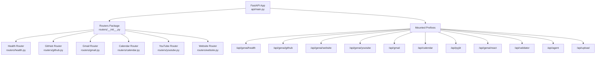
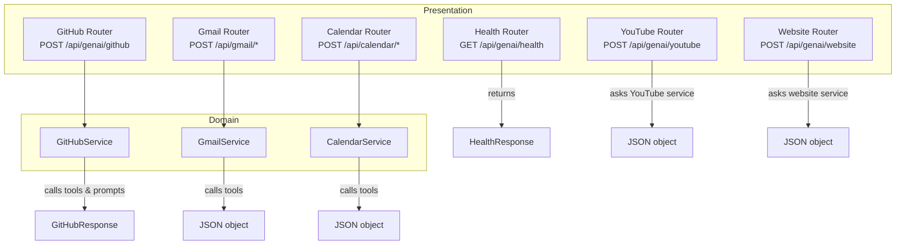
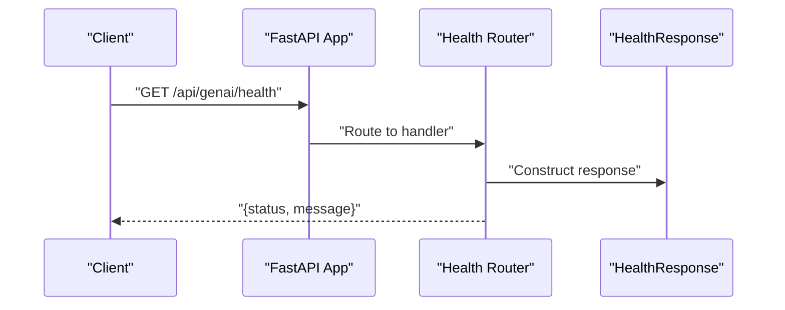
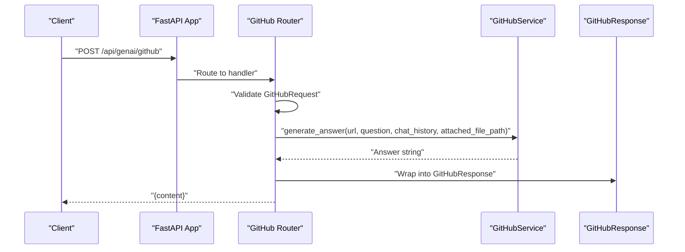
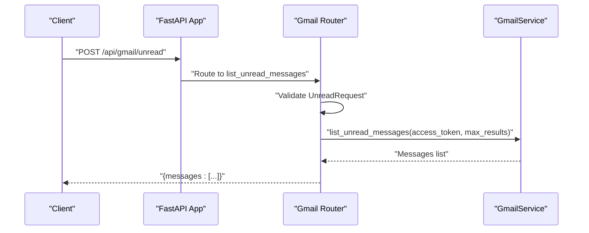
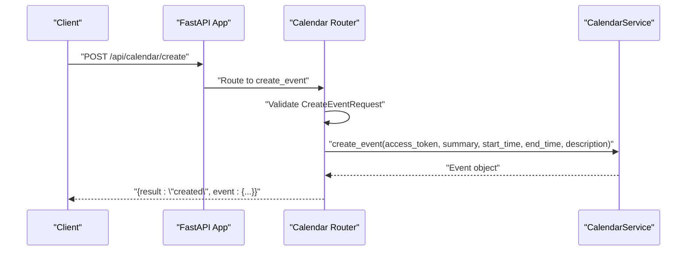
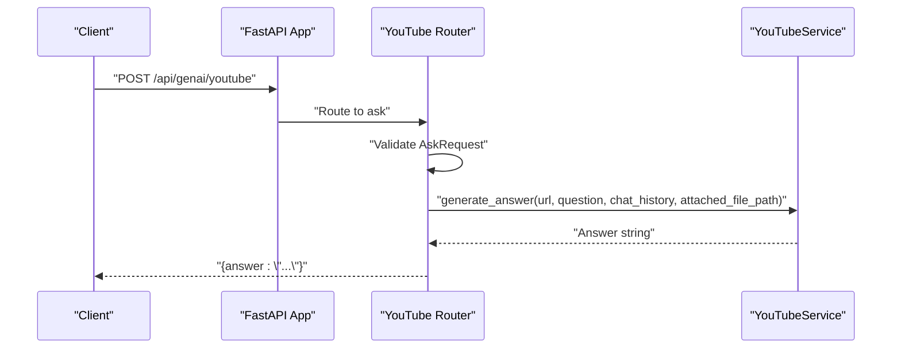
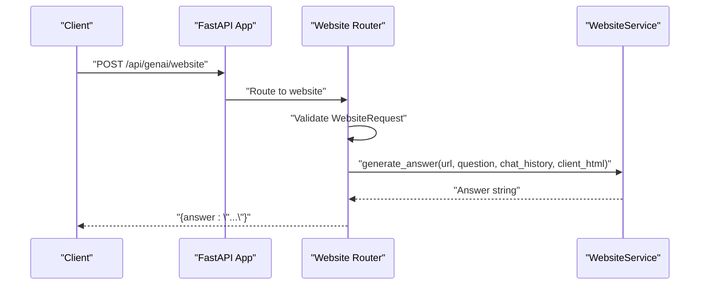
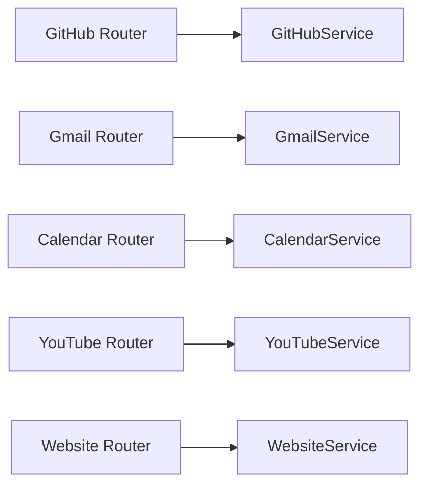

# API Server

<cite>
**Referenced Files in This Document**
- [api/main.py](file://api/main.py)
- [routers/__init__.py](file://routers/__init__.py)
- [routers/health.py](file://routers/health.py)
- [routers/github.py](file://routers/github.py)
- [routers/gmail.py](file://routers/gmail.py)
- [routers/calendar.py](file://routers/calendar.py)
- [routers/youtube.py](file://routers/youtube.py)
- [routers/website.py](file://routers/website.py)
- [models/requests/github.py](file://models/requests/github.py)
- [models/response/gihub.py](file://models/response/gihub.py)
- [models/requests/ask.py](file://models/requests/ask.py)
- [models/requests/website.py](file://models/requests/website.py)
- [models/response/health.py](file://models/response/health.py)
- [services/github_service.py](file://services/github_service.py)
- [services/gmail_service.py](file://services/gmail_service.py)
- [services/calendar_service.py](file://services/calendar_service.py)
</cite>

## Table of Contents
1. [Introduction](#introduction)
2. [Project Structure](#project-structure)
3. [Core Components](#core-components)
4. [Architecture Overview](#architecture-overview)
5. [Detailed Component Analysis](#detailed-component-analysis)
6. [Dependency Analysis](#dependency-analysis)
7. [Performance Considerations](#performance-considerations)
8. [Troubleshooting Guide](#troubleshooting-guide)
9. [Conclusion](#conclusion)
10. [Appendices](#appendices)

## Introduction
This document describes the FastAPI server component that exposes REST endpoints for multiple services: GitHub, Gmail, Calendar, YouTube, Website, and Health. It covers endpoint routing, request/response schemas, validation rules, error handling, authentication requirements, and operational guidance. The API follows a modular structure with routers grouped by service and models defined under a shared models namespace.

## Project Structure
The API server is initialized in a central module and mounts routers under prefixed paths. Routers define endpoints and request/response models, while services encapsulate business logic.

**Diagram sources**
- [api/main.py](file://api/main.py#L12-L40)
- [routers/__init__.py](file://routers/__init__.py#L18-L31)

**Section sources**
- [api/main.py](file://api/main.py#L12-L40)
- [routers/__init__.py](file://routers/__init__.py#L1-L32)

## Core Components
- FastAPI Application: Initializes the server with metadata and mounts routers under service-specific prefixes.
- Routers: Define endpoints per service, handle request validation, and delegate to services.
- Services: Encapsulate external integrations and business logic.
- Models: Pydantic models define request/response schemas and validation.

Key initialization and mounting points:
- Application creation and router inclusion are defined in the main API module.
- Routers are exported via the routers package for centralized imports.

**Section sources**
- [api/main.py](file://api/main.py#L12-L40)
- [routers/__init__.py](file://routers/__init__.py#L1-L32)

## Architecture Overview
The API follows a layered architecture:
- Presentation Layer: FastAPI routes and request validation.
- Domain Layer: Services orchestrate tool integrations.
- Data Contracts: Pydantic models enforce schema and validation.

**Diagram sources**
- [api/main.py](file://api/main.py#L29-L40)
- [routers/health.py](file://routers/health.py#L7-L12)
- [routers/github.py](file://routers/github.py#L16-L48)
- [routers/gmail.py](file://routers/gmail.py#L38-L148)
- [routers/calendar.py](file://routers/calendar.py#L32-L112)
- [routers/youtube.py](file://routers/youtube.py#L15-L58)
- [routers/website.py](file://routers/website.py#L14-L42)
- [services/github_service.py](file://services/github_service.py#L11-L109)
- [services/gmail_service.py](file://services/gmail_service.py#L10-L55)
- [services/calendar_service.py](file://services/calendar_service.py#L8-L37)

## Detailed Component Analysis

### Health Endpoint
- Method: GET
- Path: /api/genai/health
- Authentication: Not required
- Request: No body
- Response: HealthResponse
  - Fields: status (string), message (string)
- Error Handling: None defined; returns success payload

**Diagram sources**
- [api/main.py](file://api/main.py#L29)
- [routers/health.py](file://routers/health.py#L7-L12)
- [models/response/health.py](file://models/response/health.py#L4-L6)

**Section sources**
- [routers/health.py](file://routers/health.py#L7-L12)
- [models/response/health.py](file://models/response/health.py#L4-L6)

### GitHub Endpoint
- Method: POST
- Path: /api/genai/github
- Authentication: Not required
- Request Model: GitHubRequest
  - Fields:
    - url: HttpUrl (required)
    - question: string (required)
    - chat_history: array of dicts (optional, default [])
    - attached_file_path: string or null (optional)
- Response Model: GitHubResponse
  - Fields:
    - content: string
- Validation Rules:
  - url must be a valid HTTP(S) URL
  - question must be present
- Error Handling:
  - Returns HTTP 400 if required fields are missing
  - Returns HTTP 500 for internal errors; logs error details

**Diagram sources**
- [api/main.py](file://api/main.py#L30)
- [routers/github.py](file://routers/github.py#L16-L48)
- [models/requests/github.py](file://models/requests/github.py#L4-L8)
- [models/response/gihub.py](file://models/response/gihub.py#L4-L5)
- [services/github_service.py](file://services/github_service.py#L12-L109)

**Section sources**
- [routers/github.py](file://routers/github.py#L16-L48)
- [models/requests/github.py](file://models/requests/github.py#L4-L8)
- [models/response/gihub.py](file://models/response/gihub.py#L4-L5)
- [services/github_service.py](file://services/github_service.py#L12-L109)

### Gmail Endpoints
- Method: POST
- Paths:
  - /api/gmail/unread
  - /api/gmail/latest
  - /api/gmail/mark_read
  - /api/gmail/send
- Authentication: Requires access_token in request body for all endpoints
- Request Models:
  - UnreadRequest: access_token (required), max_results (optional, default 10)
  - LatestRequest: access_token (required), max_results (optional, default 5)
  - MarkReadRequest: access_token (required), message_id (required)
  - SendEmailRequest: access_token (required), to (required), subject (required), body (optional)
- Response Models:
  - All endpoints return JSON objects with service-specific keys
- Validation Rules:
  - access_token is required for all endpoints
  - max_results must be positive; defaults applied if omitted or invalid
  - mark_read requires message_id
  - send requires to and subject
- Error Handling:
  - Returns HTTP 400 for missing required fields
  - Returns HTTP 500 for unexpected errors; logs exception details

**Diagram sources**
- [api/main.py](file://api/main.py#L34)
- [routers/gmail.py](file://routers/gmail.py#L38-L148)
- [services/gmail_service.py](file://services/gmail_service.py#L10-L55)

**Section sources**
- [routers/gmail.py](file://routers/gmail.py#L12-L148)
- [services/gmail_service.py](file://services/gmail_service.py#L10-L55)

### Calendar Endpoints
- Method: POST
- Paths:
  - /api/calendar/events
  - /api/calendar/create
- Authentication: Requires access_token in request body for both endpoints
- Request Models:
  - EventsRequest: access_token (required), max_results (optional, default 10)
  - CreateEventRequest: access_token (required), summary (required), start_time (required, ISO 8601 string), end_time (required, ISO 8601 string), description (optional, default)
- Validation Rules:
  - access_token is required
  - max_results must be positive; defaults applied if omitted or invalid
  - start_time and end_time must be valid ISO 8601 strings
- Error Handling:
  - Returns HTTP 400 for missing or invalid fields
  - Returns HTTP 500 for unexpected errors; logs exception details

**Diagram sources**
- [api/main.py](file://api/main.py#L35)
- [routers/calendar.py](file://routers/calendar.py#L69-L112)
- [services/calendar_service.py](file://services/calendar_service.py#L19-L37)

**Section sources**
- [routers/calendar.py](file://routers/calendar.py#L13-L112)
- [services/calendar_service.py](file://services/calendar_service.py#L8-L37)

### YouTube Endpoint
- Method: POST
- Path: /api/genai/youtube
- Authentication: Not required
- Request Model: AskRequest
  - Fields:
    - url: string (required)
    - question: string (required)
    - chat_history: array of dicts (optional, default [])
    - attached_file_path: string or null (optional)
- Response: JSON object containing an answer field
- Validation Rules:
  - url and question are required
- Error Handling:
  - Returns HTTP 400 for missing required fields
  - Returns HTTP 500 for internal errors; logs error details

**Diagram sources**
- [api/main.py](file://api/main.py#L32)
- [routers/youtube.py](file://routers/youtube.py#L15-L58)
- [models/requests/ask.py](file://models/requests/ask.py#L5-L9)

**Section sources**
- [routers/youtube.py](file://routers/youtube.py#L15-L58)
- [models/requests/ask.py](file://models/requests/ask.py#L5-L9)

### Website Endpoint
- Method: POST
- Path: /api/genai/website
- Authentication: Not required
- Request Model: WebsiteRequest
  - Fields:
    - url: string (required)
    - question: string (required)
    - chat_history: array of dicts (optional, default [])
    - client_html: string or null (optional)
    - attached_file_path: string or null (optional)
- Response: JSON object containing an answer field
- Validation Rules:
  - url and question are required
- Error Handling:
  - Returns HTTP 400 for missing required fields
  - Returns HTTP 500 for internal errors; logs error details

**Diagram sources**
- [api/main.py](file://api/main.py#L31)
- [routers/website.py](file://routers/website.py#L14-L42)
- [models/requests/website.py](file://models/requests/website.py#L5-L10)

**Section sources**
- [routers/website.py](file://routers/website.py#L14-L42)
- [models/requests/website.py](file://models/requests/website.py#L5-L10)

## Dependency Analysis
- Router-to-Service Coupling:
  - Each router depends on a dedicated service class injected via FastAPI Depends.
  - Services depend on tool modules for external integrations.
- Cross-Router Cohesion:
  - Routers are cohesive by domain and share minimal cross-dependencies.
- External Dependencies:
  - Services rely on external APIs/tools; errors propagate as HTTP 500 with logged details.

**Diagram sources**
- [routers/github.py](file://routers/github.py#L12-L13)
- [routers/gmail.py](file://routers/gmail.py#L34-L35)
- [routers/calendar.py](file://routers/calendar.py#L28-L29)
- [routers/youtube.py](file://routers/youtube.py#L10-L11)
- [routers/website.py](file://routers/website.py#L10-L11)

**Section sources**
- [routers/github.py](file://routers/github.py#L12-L13)
- [routers/gmail.py](file://routers/gmail.py#L34-L35)
- [routers/calendar.py](file://routers/calendar.py#L28-L29)
- [routers/youtube.py](file://routers/youtube.py#L10-L11)
- [routers/website.py](file://routers/website.py#L10-L11)

## Performance Considerations
- Validation Early Exit: Routers validate required fields and return HTTP 400 promptly to avoid unnecessary work.
- Defaults for Pagination: Endpoints default max_results to safe values when omitted or invalid.
- Logging: Routers and services log errors; ensure structured logging is configured for production observability.
- Asynchronous Workflows: GitHub endpoint supports async processing; ensure the underlying tooling is efficient and consider timeouts.

[No sources needed since this section provides general guidance]

## Troubleshooting Guide
- Common HTTP 400 Errors:
  - Missing access_token or message_id in Gmail/Calendar endpoints.
  - Missing url or question in YouTube/Website/GitHub endpoints.
  - Invalid ISO 8601 timestamps in Calendar create endpoint.
- Internal HTTP 500 Errors:
  - Unexpected exceptions are caught and returned as HTTP 500 with a generic message; check server logs for stack traces.
- Authentication Notes:
  - Access tokens are passed in request bodies for Gmail and Calendar endpoints; ensure clients supply valid tokens.
- Debugging Tips:
  - Enable server-side logging to capture request validation failures and service exceptions.
  - Use curl or Postman to test endpoints with minimal payloads to isolate issues.

**Section sources**
- [routers/gmail.py](file://routers/gmail.py#L42-L65)
- [routers/calendar.py](file://routers/calendar.py#L74-L91)
- [routers/youtube.py](file://routers/youtube.py#L34-L38)
- [routers/website.py](file://routers/website.py#L23-L27)
- [routers/github.py](file://routers/github.py#L24-L35)

## Conclusion
The API server provides a clear, modular set of endpoints for health checks, GitHub crawling, Gmail operations, Calendar operations, YouTube Q&A, and Website Q&A. Requests are validated using Pydantic models, and services encapsulate external integrations. Authentication is explicit where required (Gmail/Calendar) and implicit otherwise. The design supports straightforward client integration and future enhancements such as rate limiting, versioning, and expanded error schemas.

[No sources needed since this section summarizes without analyzing specific files]

## Appendices

### API Versioning and Compatibility
- Current Version: The application declares a version in the FastAPI metadata.
- Recommendations:
  - Add a version prefix to router paths (e.g., /api/v1/...) to support multiple versions concurrently.
  - Introduce deprecation headers and a changelog for breaking changes.
  - Maintain backward compatibility windows with clear deprecation timelines.

**Section sources**
- [api/main.py](file://api/main.py#L12)

### Security Considerations
- Token Handling:
  - Gmail and Calendar endpoints require access_token in request bodies; treat them as sensitive credentials.
  - Avoid logging raw tokens; sanitize logs and consider token masking.
- Transport Security:
  - Deploy behind HTTPS termination; enforce TLS in production.
- Input Sanitization:
  - Validate and sanitize inputs; consider rate limiting and request size caps.
- Authorization:
  - For endpoints requiring broader authorization, integrate middleware or API keys at the gateway level.

[No sources needed since this section provides general guidance]

### Rate Limiting
- Recommendation:
  - Implement rate limiting at the gateway or via middleware to protect downstream tools.
  - Use sliding window or token bucket algorithms; expose quota headers when possible.

[No sources needed since this section provides general guidance]

### Monitoring Endpoints
- Health Endpoint:
  - Use the existing health endpoint for liveness/readiness probes.
- Metrics:
  - Expose metrics via a separate endpoint or middleware for latency, error rates, and throughput.

**Section sources**
- [routers/health.py](file://routers/health.py#L7-L12)

### Administrative Interfaces
- Recommendations:
  - Provide admin endpoints for diagnostics, queue inspection, and configuration updates.
  - Secure admin endpoints with authentication and authorization controls.

[No sources needed since this section provides general guidance]

### Client Implementation Guidelines
- Base URL:
  - Use the mounted router prefixes as base paths for each service.
- Request Bodies:
  - Supply required fields as defined by each endpoint’s request model.
- Error Handling:
  - Clients should parse HTTP 400 responses for validation errors and HTTP 500 for server errors.
- Example Patterns:
  - For YouTube/Website/GitHub: send url and question; optionally include chat_history and attached_file_path.
  - For Gmail/Calendar: include access_token and any additional required fields.

**Section sources**
- [routers/youtube.py](file://routers/youtube.py#L15-L58)
- [routers/website.py](file://routers/website.py#L14-L42)
- [routers/github.py](file://routers/github.py#L16-L48)
- [routers/gmail.py](file://routers/gmail.py#L38-L148)
- [routers/calendar.py](file://routers/calendar.py#L32-L112)