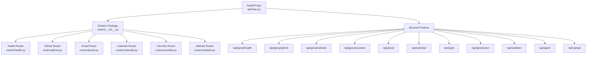
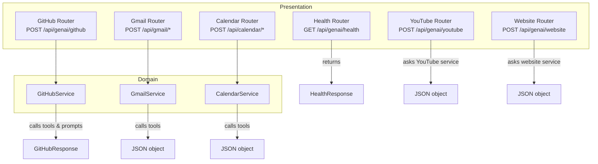
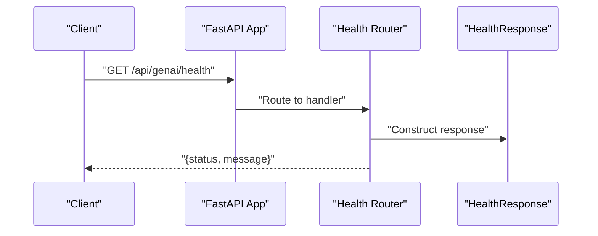
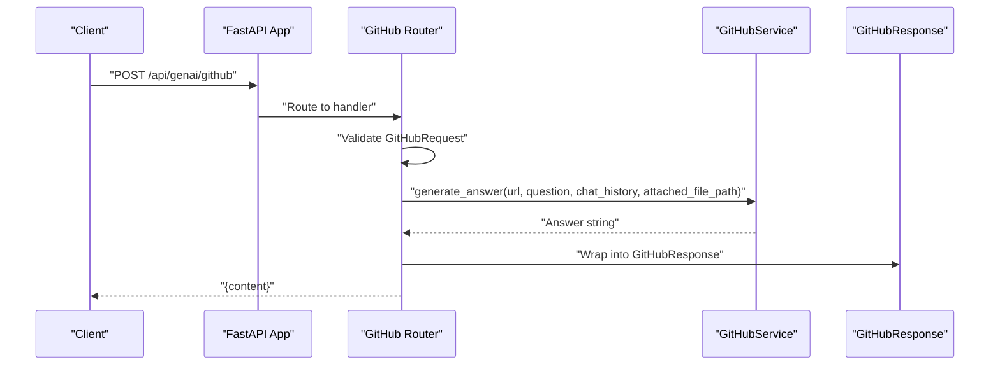
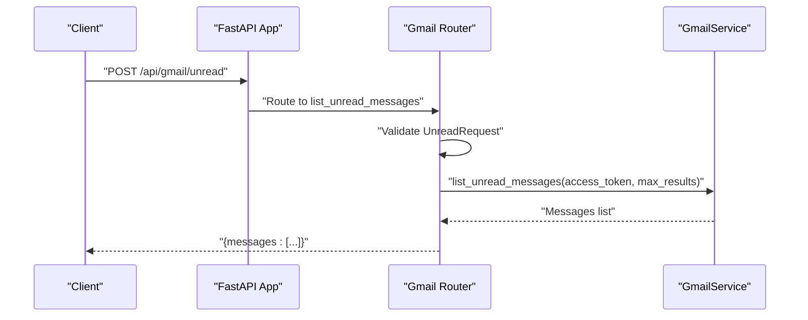
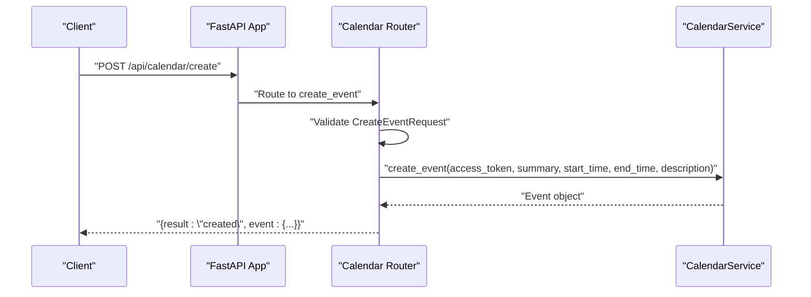
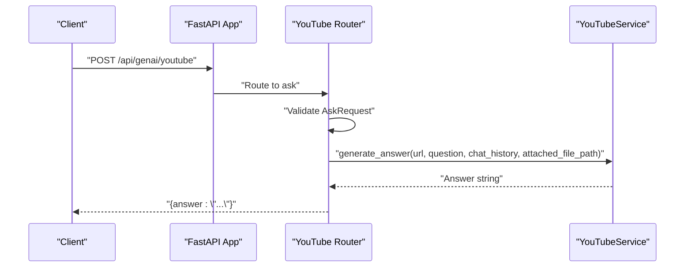
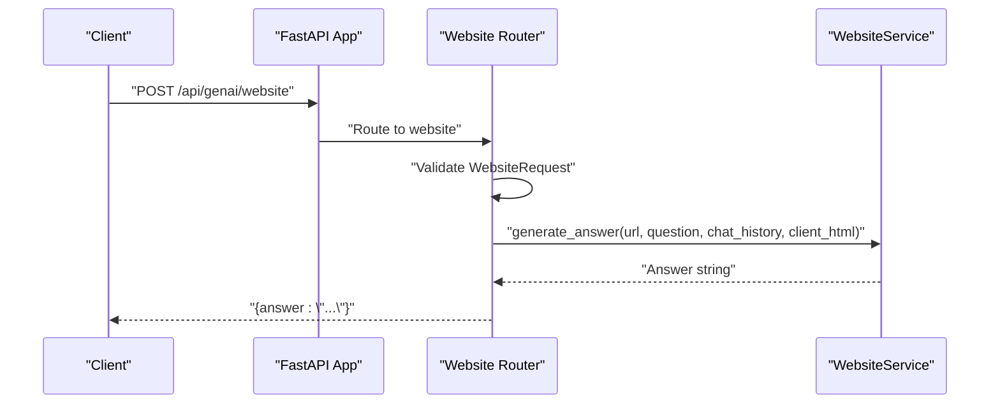
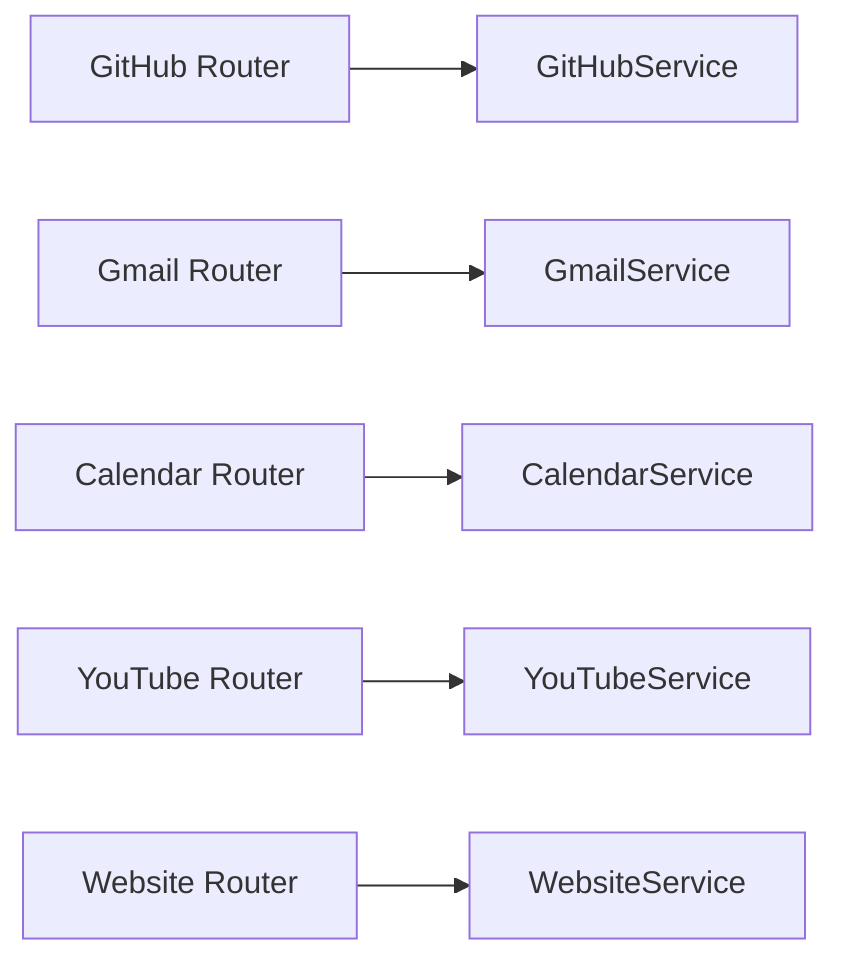

# API server

## Introduction
This page describes the FastAPI server component that exposes REST endpoints for multiple services: GitHub, Gmail, Calendar, YouTube, Website, and Health. It covers endpoint routing, request/response schemas, validation rules, error handling, authentication requirements, and operational guidance. The API follows a modular structure with routers grouped by service and models defined under a shared models namespace.

## Project structure
The API server is initialized in a central module and mounts routers under prefixed paths. Routers define endpoints and request/response models, while services encapsulate business logic.

```mermaid
graph TB
A["FastAPI App<br/>api/main.py"] --> B["Routers Package<br/>routers/__init__.py"]
B --> C["Health Router<br/>routers/health.py"]
B --> D["GitHub Router<br/>routers/github.py"]
B --> E["Gmail Router<br/>routers/gmail.py"]
B --> F["Calendar Router<br/>routers/calendar.py"]
B --> G["YouTube Router<br/>routers/youtube.py"]
B --> H["Website Router<br/>routers/website.py"]
A --> I["Mounted Prefixes"]
I --> J["/api/genai/health"]
I --> K["/api/genai/github"]
I --> L["/api/genai/website"]
I --> M["/api/genai/youtube"]
I --> N["/api/gmail"]
I --> O["/api/calendar"]
I --> P["/api/pyjiit"]
I --> Q["/api/genai/react"]
I --> R["/api/validator"]
I --> S["/api/agent"]
I --> T["/api/upload"]
```

## Core components
- FastAPI Application: Initializes the server with metadata and mounts routers under service-specific prefixes.
- Routers: Define endpoints per service, handle request validation, and delegate to services.
- Services: Encapsulate external integrations and business logic.
- Models: Pydantic models define request/response schemas and validation.

Key initialization and mounting points:
- Application creation and router inclusion are defined in the main API module.
- Routers are exported via the routers package for centralized imports.

## Architecture overview
The API follows a layered architecture:
- Presentation Layer: FastAPI routes and request validation.
- Domain Layer: Services orchestrate tool integrations.
- Data Contracts: Pydantic models enforce schema and validation.

```mermaid
graph TB
subgraph "Presentation"
R1["Health Router<br/>GET /api/genai/health"]
R2["GitHub Router<br/>POST /api/genai/github"]
R3["Gmail Router<br/>POST /api/gmail/*"]
R4["Calendar Router<br/>POST /api/calendar/*"]
R5["YouTube Router<br/>POST /api/genai/youtube"]
R6["Website Router<br/>POST /api/genai/website"]
end
subgraph "Domain"
S1["GitHubService"]
S2["GmailService"]
S3["CalendarService"]
end
R1 --> |"returns"| R1R["HealthResponse"]
R2 --> S1 --> |"calls tools & prompts"| R2R["GitHubResponse"]
R3 --> S2 --> |"calls tools"| R3R["JSON object"]
R4 --> S3 --> |"calls tools"| R4R["JSON object"]
R5 --> |"asks YouTube service"| R5R["JSON object"]
R6 --> |"asks website service"| R6R["JSON object"]
```

## Detailed component analysis

### Health endpoint
- Method: GET
- Path: /api/genai/health
- Authentication: Not required
- Request: No body
- Response: HealthResponse
  - Fields: status (string), message (string)
- Error Handling: None defined; returns success payload

```mermaid
sequenceDiagram
participant C as "Client"
participant A as "FastAPI App"
participant H as "Health Router"
participant M as "HealthResponse"
C->>A : "GET /api/genai/health"
A->>H : "Route to handler"
H->>M : "Construct response"
H-->>C : "{status, message}"
```

### GitHub endpoint
- Method: POST
- Path: /api/genai/github
- Authentication: Not required
- Request Model: GitHubRequest
  - Fields:
    - url: HttpUrl (required)
    - question: string (required)
    - chat_history: array of dicts (optional, default [])
    - attached_file_path: string or null (optional)
- Response Model: GitHubResponse
  - Fields:
    - content: string
- Validation Rules:
  - url must be a valid HTTP(S) URL
  - question must be present
- Error Handling:
  - Returns HTTP 400 if required fields are missing
  - Returns HTTP 500 for internal errors; logs error details

```mermaid
sequenceDiagram
participant C as "Client"
participant A as "FastAPI App"
participant G as "GitHub Router"
participant GS as "GitHubService"
participant M as "GitHubResponse"
C->>A : "POST /api/genai/github"
A->>G : "Route to handler"
G->>G : "Validate GitHubRequest"
G->>GS : "generate_answer(url, question, chat_history, attached_file_path)"
GS-->>G : "Answer string"
G->>M : "Wrap into GitHubResponse"
G-->>C : "{content}"
```

### Gmail endpoints
- Method: POST
- Paths:
  - /api/gmail/unread
  - /api/gmail/latest
  - /api/gmail/mark_read
  - /api/gmail/send
- Authentication: Requires access_token in request body for all endpoints
- Request Models:
  - UnreadRequest: access_token (required), max_results (optional, default 10)
  - LatestRequest: access_token (required), max_results (optional, default 5)
  - MarkReadRequest: access_token (required), message_id (required)
  - SendEmailRequest: access_token (required), to (required), subject (required), body (optional)
- Response Models:
  - All endpoints return JSON objects with service-specific keys
- Validation Rules:
  - access_token is required for all endpoints
  - max_results must be positive; defaults applied if omitted or invalid
  - mark_read requires message_id
  - send requires to and subject
- Error Handling:
  - Returns HTTP 400 for missing required fields
  - Returns HTTP 500 for unexpected errors; logs exception details

```mermaid
sequenceDiagram
participant C as "Client"
participant A as "FastAPI App"
participant GM as "Gmail Router"
participant GS as "GmailService"
C->>A : "POST /api/gmail/unread"
A->>GM : "Route to list_unread_messages"
GM->>GM : "Validate UnreadRequest"
GM->>GS : "list_unread_messages(access_token, max_results)"
GS-->>GM : "Messages list"
GM-->>C : "{messages : [...]}"
```

### Calendar endpoints
- Method: POST
- Paths:
  - /api/calendar/events
  - /api/calendar/create
- Authentication: Requires access_token in request body for both endpoints
- Request Models:
  - EventsRequest: access_token (required), max_results (optional, default 10)
  - CreateEventRequest: access_token (required), summary (required), start_time (required, ISO 8601 string), end_time (required, ISO 8601 string), description (optional, default)
- Validation Rules:
  - access_token is required
  - max_results must be positive; defaults applied if omitted or invalid
  - start_time and end_time must be valid ISO 8601 strings
- Error Handling:
  - Returns HTTP 400 for missing or invalid fields
  - Returns HTTP 500 for unexpected errors; logs exception details

```mermaid
sequenceDiagram
participant C as "Client"
participant A as "FastAPI App"
participant CA as "Calendar Router"
participant CS as "CalendarService"
C->>A : "POST /api/calendar/create"
A->>CA : "Route to create_event"
CA->>CA : "Validate CreateEventRequest"
CA->>CS : "create_event(access_token, summary, start_time, end_time, description)"
CS-->>CA : "Event object"
CA-->>C : "{result : \"created\", event : {...}}"
```

### YouTube endpoint
- Method: POST
- Path: /api/genai/youtube
- Authentication: Not required
- Request Model: AskRequest
  - Fields:
    - url: string (required)
    - question: string (required)
    - chat_history: array of dicts (optional, default [])
    - attached_file_path: string or null (optional)
- Response: JSON object containing an answer field
- Validation Rules:
  - url and question are required
- Error Handling:
  - Returns HTTP 400 for missing required fields
  - Returns HTTP 500 for internal errors; logs error details

```mermaid
sequenceDiagram
participant C as "Client"
participant A as "FastAPI App"
participant Y as "YouTube Router"
participant S as "YouTubeService"
C->>A : "POST /api/genai/youtube"
A->>Y : "Route to ask"
Y->>Y : "Validate AskRequest"
Y->>S : "generate_answer(url, question, chat_history, attached_file_path)"
S-->>Y : "Answer string"
Y-->>C : "{answer : \"...\"}"
```

### Website endpoint
- Method: POST
- Path: /api/genai/website
- Authentication: Not required
- Request Model: WebsiteRequest
  - Fields:
    - url: string (required)
    - question: string (required)
    - chat_history: array of dicts (optional, default [])
    - client_html: string or null (optional)
    - attached_file_path: string or null (optional)
- Response: JSON object containing an answer field
- Validation Rules:
  - url and question are required
- Error Handling:
  - Returns HTTP 400 for missing required fields
  - Returns HTTP 500 for internal errors; logs error details

```mermaid
sequenceDiagram
participant C as "Client"
participant A as "FastAPI App"
participant W as "Website Router"
participant S as "WebsiteService"
C->>A : "POST /api/genai/website"
A->>W : "Route to website"
W->>W : "Validate WebsiteRequest"
W->>S : "generate_answer(url, question, chat_history, client_html)"
S-->>W : "Answer string"
W-->>C : "{answer : \"...\"}"
```

## Dependency analysis
- Router-to-Service Coupling:
  - Each router depends on a dedicated service class injected via FastAPI Depends.
  - Services depend on tool modules for external integrations.
- Cross-Router Cohesion:
  - Routers are cohesive by domain and share minimal cross-dependencies.
- External Dependencies:
  - Services rely on external APIs/tools; errors propagate as HTTP 500 with logged details.

```mermaid
graph LR
GH["GitHub Router"] --> GHS["GitHubService"]
GM["Gmail Router"] --> GMS["GmailService"]
CA["Calendar Router"] --> CAS["CalendarService"]
YT["YouTube Router"] --> YTS["YouTubeService"]
WS["Website Router"] --> WSS["WebsiteService"]
```

## Performance considerations
- Validation Early Exit: Routers validate required fields and return HTTP 400 promptly to avoid unnecessary work.
- Defaults for Pagination: Endpoints default max_results to safe values when omitted or invalid.
- Logging: Routers and services log errors; ensure structured logging is configured for production observability.
- Asynchronous Workflows: GitHub endpoint supports async processing; ensure the underlying tooling is efficient and consider timeouts.

[No sources needed since this section provides general guidance]

## Troubleshooting guide
- Common HTTP 400 Errors:
  - Missing access_token or message_id in Gmail/Calendar endpoints.
  - Missing url or question in YouTube/Website/GitHub endpoints.
  - Invalid ISO 8601 timestamps in Calendar create endpoint.
- Internal HTTP 500 Errors:
  - Unexpected exceptions are caught and returned as HTTP 500 with a generic message; check server logs for stack traces.
- Authentication Notes:
  - Access tokens are passed in request bodies for Gmail and Calendar endpoints; ensure clients supply valid tokens.
- Debugging Tips:
  - Enable server-side logging to capture request validation failures and service exceptions.
  - Use curl or Postman to test endpoints with minimal payloads to isolate issues.

## Conclusion
The API server provides a clear, modular set of endpoints for health checks, GitHub crawling, Gmail operations, Calendar operations, YouTube Q&A, and Website Q&A. Requests are validated using Pydantic models, and services encapsulate external integrations. Authentication is explicit where required (Gmail/Calendar) and implicit otherwise. The design supports straightforward client integration and future enhancements such as rate limiting, versioning, and expanded error schemas.

[No sources needed since this section summarizes without analyzing specific files]

## Appendices

### API versioning and compatibility
- Current Version: The application declares a version in the FastAPI metadata.
- Recommendations:
  - Add a version prefix to router paths (e.g., /api/v1/...) to support multiple versions concurrently.
  - Introduce deprecation headers and a changelog for breaking changes.
  - Maintain backward compatibility windows with clear deprecation timelines.

### Security considerations
- Token Handling:
  - Gmail and Calendar endpoints require access_token in request bodies; treat them as sensitive credentials.
  - Avoid logging raw tokens; sanitize logs and consider token masking.
- Transport Security:
  - Deploy behind HTTPS termination; enforce TLS in production.
- Input Sanitization:
  - Validate and sanitize inputs; consider rate limiting and request size caps.
- Authorization:
  - For endpoints requiring broader authorization, integrate middleware or API keys at the gateway level.

[No sources needed since this section provides general guidance]

### Rate limiting
- Recommendation:
  - Implement rate limiting at the gateway or via middleware to protect downstream tools.
  - Use sliding window or token bucket algorithms; expose quota headers when possible.

[No sources needed since this section provides general guidance]

### Monitoring endpoints
- Health Endpoint:
  - Use the existing health endpoint for liveness/readiness probes.
- Metrics:
  - Expose metrics via a separate endpoint or middleware for latency, error rates, and throughput.

### Administrative interfaces
- Recommendations:
  - Provide admin endpoints for diagnostics, queue inspection, and configuration updates.
  - Secure admin endpoints with authentication and authorization controls.

[No sources needed since this section provides general guidance]

### Client implementation guidelines
- Base URL:
  - Use the mounted router prefixes as base paths for each service.
- Request Bodies:
  - Supply required fields as defined by each endpoint's request model.
- Error Handling:
  - Clients should parse HTTP 400 responses for validation errors and HTTP 500 for server errors.
- Example Patterns:
  - For YouTube/Website/GitHub: send url and question; optionally include chat_history and attached_file_path.
  - For Gmail/Calendar: include access_token and any additional required fields.
