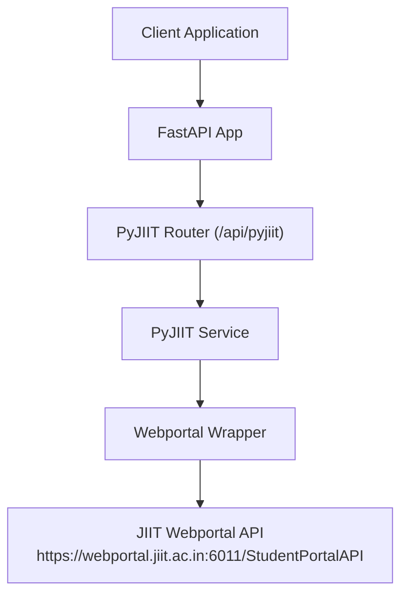
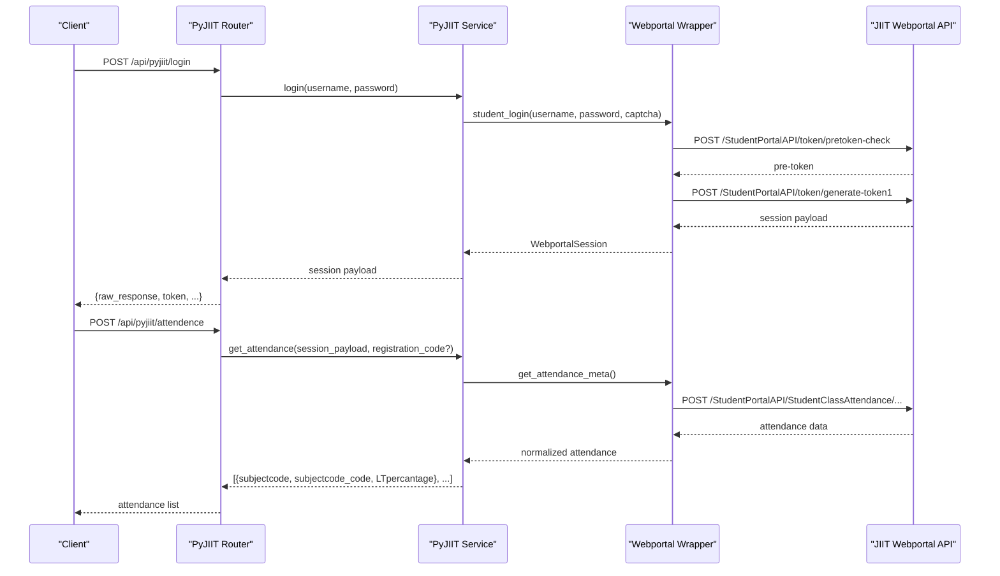
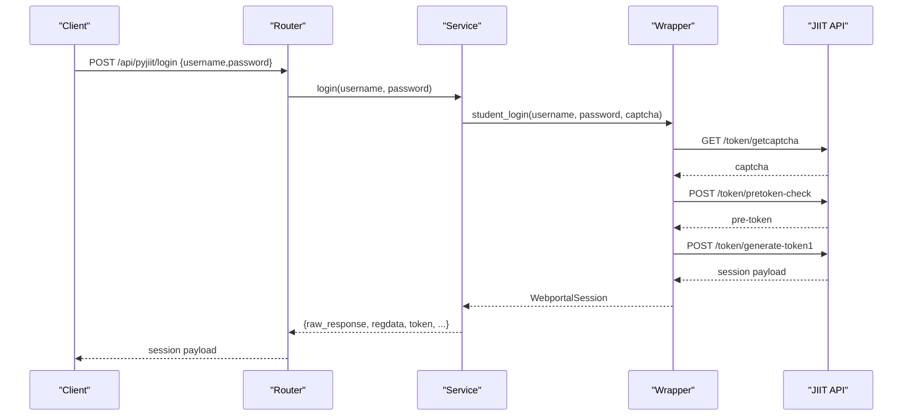
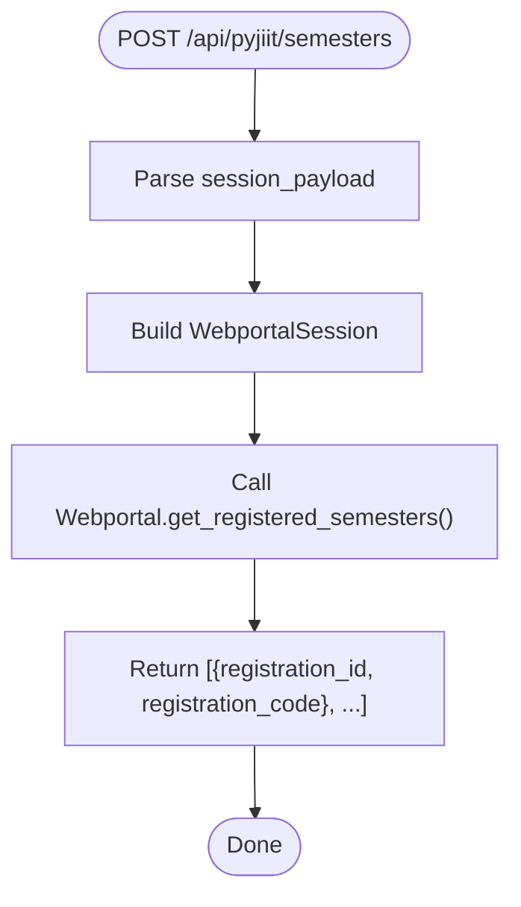
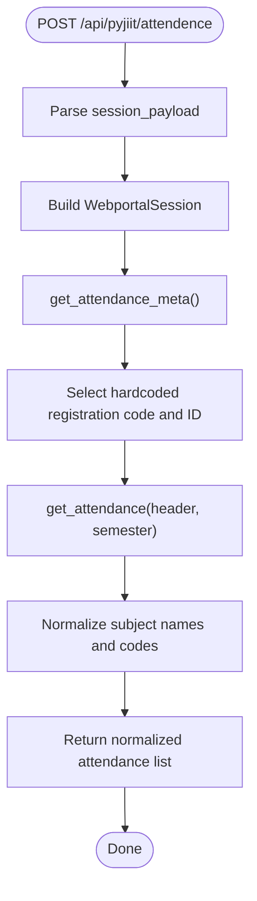
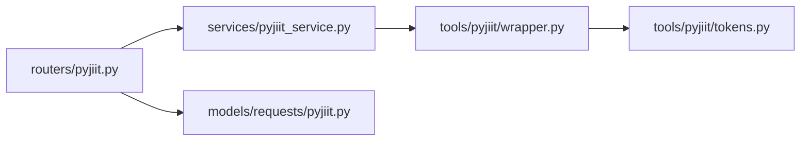

# Academic Portal API

<cite>
**Referenced Files in This Document**
- [api/main.py](file://api/main.py)
- [routers/pyjiit.py](file://routers/pyjiit.py)
- [services/pyjiit_service.py](file://services/pyjiit_service.py)
- [tools/pyjiit/wrapper.py](file://tools/pyjiit/wrapper.py)
- [tools/pyjiit/attendance.py](file://tools/pyjiit/attendance.py)
- [tools/pyjiit/exam.py](file://tools/pyjiit/exam.py)
- [tools/pyjiit/registration.py](file://tools/pyjiit/registration.py)
- [models/requests/pyjiit.py](file://models/requests/pyjiit.py)
- [tools/pyjiit/tokens.py](file://tools/pyjiit/tokens.py)
- [tools/pyjiit/default.py](file://tools/pyjiit/default.py)
</cite>

## Table of Contents
1. [Introduction](#introduction)
2. [Project Structure](#project-structure)
3. [Core Components](#core-components)
4. [Architecture Overview](#architecture-overview)
5. [Detailed Component Analysis](#detailed-component-analysis)
6. [Dependency Analysis](#dependency-analysis)
7. [Performance Considerations](#performance-considerations)
8. [Troubleshooting Guide](#troubleshooting-guide)
9. [Conclusion](#conclusion)
10. [Appendices](#appendices)

## Introduction
This document describes the Academic Portal API for integrating with the JIIT Webportal. It covers authentication, session lifecycle, and endpoints for retrieving academic data such as attendance, exam events and schedules, registered subjects, and grades. It also documents request/response schemas, authentication requirements, and practical integration patterns for educational automation.

## Project Structure
The Academic Portal API is implemented as a FastAPI application with a dedicated router for JIIT integration. The router exposes endpoints under the /api/pyjiit prefix. The service layer encapsulates the JIIT Webportal integration via a wrapper class that handles HTTP requests, session headers, and authentication.

**Diagram sources**
- [api/main.py](file://api/main.py#L37-L42)
- [routers/pyjiit.py](file://routers/pyjiit.py#L1-L93)
- [services/pyjiit_service.py](file://services/pyjiit_service.py#L13-L125)
- [tools/pyjiit/wrapper.py](file://tools/pyjiit/wrapper.py#L24-L200)

**Section sources**
- [api/main.py](file://api/main.py#L12-L42)
- [routers/pyjiit.py](file://routers/pyjiit.py#L1-L93)

## Core Components
- Router: Defines endpoints for login, semesters, and attendance.
- Service: Orchestrates session creation, data retrieval, and normalization.
- Wrapper: Encapsulates JIIT Webportal HTTP calls, session headers, and authentication.
- Models: Pydantic models for login responses and session payloads.

Key responsibilities:
- Authentication: Username/password login with a prevalidated captcha token.
- Session: Bearer token-based session with LocalName header.
- Data Retrieval: Attendance, exam events, schedules, registered subjects, and grades.

**Section sources**
- [routers/pyjiit.py](file://routers/pyjiit.py#L39-L93)
- [services/pyjiit_service.py](file://services/pyjiit_service.py#L13-L125)
- [tools/pyjiit/wrapper.py](file://tools/pyjiit/wrapper.py#L49-L117)
- [models/requests/pyjiit.py](file://models/requests/pyjiit.py#L54-L91)

## Architecture Overview
The API follows a layered architecture:
- Presentation: FastAPI router defines endpoints and request/response models.
- Application: Service translates API requests into Webportal operations.
- Domain: Wrapper abstracts JIIT Webportal specifics and session management.
- External System: JIIT Webportal API accessed over HTTPS.

**Diagram sources**
- [routers/pyjiit.py](file://routers/pyjiit.py#L39-L93)
- [services/pyjiit_service.py](file://services/pyjiit_service.py#L14-L124)
- [tools/pyjiit/wrapper.py](file://tools/pyjiit/wrapper.py#L162-L282)

## Detailed Component Analysis

### Authentication and Session Management
- Endpoint: POST /api/pyjiit/login
- Purpose: Authenticate student credentials against the JIIT Webportal and return a session payload.
- Request body:
  - username: string
  - password: string
- Response body:
  - raw_response: includes regdata and client identifiers
  - regdata: top-level copy of registration data
  - institute, instituteid, memberid, userid, token, expiry, clientid, membertype, name
- Authentication requirements:
  - Uses a prevalidated captcha token for login.
  - On success, the response includes a JWT-like token and session metadata.
- Notes:
  - The wrapper constructs Authorization headers with a Bearer token and LocalName.

**Diagram sources**
- [routers/pyjiit.py](file://routers/pyjiit.py#L39-L51)
- [services/pyjiit_service.py](file://services/pyjiit_service.py#L14-L22)
- [tools/pyjiit/wrapper.py](file://tools/pyjiit/wrapper.py#L162-L199)
- [tools/pyjiit/tokens.py](file://tools/pyjiit/tokens.py#L14-L30)
- [tools/pyjiit/default.py](file://tools/pyjiit/default.py#L4-L8)

**Section sources**
- [routers/pyjiit.py](file://routers/pyjiit.py#L39-L51)
- [services/pyjiit_service.py](file://services/pyjiit_service.py#L14-L22)
- [tools/pyjiit/wrapper.py](file://tools/pyjiit/wrapper.py#L162-L199)
- [tools/pyjiit/tokens.py](file://tools/pyjiit/tokens.py#L14-L30)
- [tools/pyjiit/default.py](file://tools/pyjiit/default.py#L4-L8)
- [models/requests/pyjiit.py](file://models/requests/pyjiit.py#L54-L91)

### Semesters Discovery
- Endpoint: POST /api/pyjiit/semesters
- Purpose: Retrieve the list of semesters registered for the authenticated student.
- Request body: session_payload (full login response or raw response dict)
- Response body: array of objects with registration_id and registration_code
- Authentication: Requires a valid session (Bearer token and LocalName header).
- Notes: Accepts either the full login response or the raw response dict.

**Diagram sources**
- [routers/pyjiit.py](file://routers/pyjiit.py#L54-L72)
- [services/pyjiit_service.py](file://services/pyjiit_service.py#L24-L44)
- [tools/pyjiit/wrapper.py](file://tools/pyjiit/wrapper.py#L309-L330)

**Section sources**
- [routers/pyjiit.py](file://routers/pyjiit.py#L54-L72)
- [services/pyjiit_service.py](file://services/pyjiit_service.py#L24-L44)
- [tools/pyjiit/wrapper.py](file://tools/pyjiit/wrapper.py#L309-L330)

### Attendance Retrieval
- Endpoint: POST /api/pyjiit/attendence
- Purpose: Fetch attendance for a specific semester.
- Request body:
  - session_payload: session payload (wrapper or raw)
  - registration_code: optional string (e.g., "2025ODDSEM"); if omitted, a hardcoded value is used
- Response body: array of objects with subject details and attendance percentage
- Authentication: Requires a valid session.
- Notes:
  - The implementation hardcodes a specific registration code and ID mapping.
  - Normalizes subject names by removing bracketed codes.

**Diagram sources**
- [routers/pyjiit.py](file://routers/pyjiit.py#L75-L92)
- [services/pyjiit_service.py](file://services/pyjiit_service.py#L46-L124)
- [tools/pyjiit/wrapper.py](file://tools/pyjiit/wrapper.py#L234-L282)
- [tools/pyjiit/attendance.py](file://tools/pyjiit/attendance.py#L42-L53)

**Section sources**
- [routers/pyjiit.py](file://routers/pyjiit.py#L75-L92)
- [services/pyjiit_service.py](file://services/pyjiit_service.py#L46-L124)
- [tools/pyjiit/wrapper.py](file://tools/pyjiit/wrapper.py#L234-L282)
- [tools/pyjiit/attendance.py](file://tools/pyjiit/attendance.py#L42-L53)

### Exam Schedules and Academic Data
While the primary router endpoints focus on login, semesters, and attendance, the underlying wrapper supports additional academic data retrieval. These capabilities are available for integration but are not exposed via the current router endpoints.

Available operations (not exposed by router):
- Registered subjects and faculties for a semester
- Exam events discovery
- Exam schedule retrieval
- Marks download (PDF)
- Grade card retrieval
- SGPA/CGPA data
- Fee summary and pending charges
- Subject choices

These operations rely on authenticated sessions and use the same header scheme (Bearer token + LocalName).

**Section sources**
- [tools/pyjiit/wrapper.py](file://tools/pyjiit/wrapper.py#L332-L646)
- [tools/pyjiit/exam.py](file://tools/pyjiit/exam.py#L4-L23)
- [tools/pyjiit/registration.py](file://tools/pyjiit/registration.py#L37-L44)

## Dependency Analysis
The API components depend on each other as follows:
- Router depends on PyJIIT Service for business logic.
- Service depends on Webportal Wrapper for external API calls.
- Wrapper depends on shared models for captcha and session headers.
- Models define the shapes of login responses and session payloads.

**Diagram sources**
- [routers/pyjiit.py](file://routers/pyjiit.py#L1-L93)
- [services/pyjiit_service.py](file://services/pyjiit_service.py#L1-L125)
- [tools/pyjiit/wrapper.py](file://tools/pyjiit/wrapper.py#L1-L646)
- [models/requests/pyjiit.py](file://models/requests/pyjiit.py#L1-L91)
- [tools/pyjiit/tokens.py](file://tools/pyjiit/tokens.py#L1-L30)

**Section sources**
- [routers/pyjiit.py](file://routers/pyjiit.py#L1-L93)
- [services/pyjiit_service.py](file://services/pyjiit_service.py#L1-L125)
- [tools/pyjiit/wrapper.py](file://tools/pyjiit/wrapper.py#L1-L646)
- [models/requests/pyjiit.py](file://models/requests/pyjiit.py#L1-L91)
- [tools/pyjiit/tokens.py](file://tools/pyjiit/tokens.py#L1-L30)

## Performance Considerations
- Network latency dominates performance; minimize round-trips by batching related operations where feasible.
- Reuse sessions: avoid repeated logins; persist and reuse the session payload.
- Caching: cache normalized attendance lists and semesters for short intervals to reduce load.
- Rate limiting: respect external API rate limits; implement retries with exponential backoff.
- Streaming: for large downloads (e.g., marks PDF), stream responses to reduce memory usage.

## Troubleshooting Guide
Common issues and resolutions:
- Session expired or unauthorized:
  - Symptom: 401 Unauthorized or session expiration errors.
  - Action: Re-authenticate using /api/pyjiit/login and obtain a fresh session payload.
- Invalid or missing session payload:
  - Symptom: Errors when calling semesters or attendance endpoints.
  - Action: Ensure the session_payload is passed correctly (full login response or raw response dict).
- Attendance not returned:
  - Symptom: Empty attendance list.
  - Action: Verify the hardcoded registration code mapping and that the student has attendance records for the selected semester.
- Captcha-related login failures:
  - Symptom: Login errors during token generation.
  - Action: Confirm the prevalidated captcha token is included in the login flow.

**Section sources**
- [tools/pyjiit/wrapper.py](file://tools/pyjiit/wrapper.py#L27-L46)
- [services/pyjiit_service.py](file://services/pyjiit_service.py#L14-L22)
- [tools/pyjiit/wrapper.py](file://tools/pyjiit/wrapper.py#L153-L160)

## Conclusion
The Academic Portal API provides a focused interface for JIIT Webportal integration, enabling secure session-based access to academic data. By centralizing authentication and normalizing responses, it simplifies client integrations for attendance monitoring, exam scheduling, and broader academic workflows. Extending the router to expose additional endpoints (e.g., exam schedules, registered subjects) would further enable comprehensive automation scenarios.

## Appendices

### Endpoint Reference

- POST /api/pyjiit/login
  - Description: Authenticate and return a session payload.
  - Request: { username: string, password: string }
  - Response: { raw_response, regdata, token, expiry, ... }

- POST /api/pyjiit/semesters
  - Description: List registered semesters for the authenticated student.
  - Request: { session_payload: object }
  - Response: [{ registration_id: string, registration_code: string }]

- POST /api/pyjiit/attendence
  - Description: Retrieve attendance for a semester.
  - Request: { session_payload: object, registration_code?: string }
  - Response: [{ subjectcode: string, subjectcode_code: string, LTpercantage: string }]

Notes:
- The attendance endpoint intentionally uses the misspelled "attendence" to match user expectations.
- The semesters endpoint accepts either the full login response or the raw response dict.

**Section sources**
- [routers/pyjiit.py](file://routers/pyjiit.py#L39-L92)
- [models/requests/pyjiit.py](file://models/requests/pyjiit.py#L54-L91)

### Authentication Details
- Header scheme:
  - Authorization: Bearer <token>
  - LocalName: generated value
- Token parsing:
  - The session payload includes a JWT-like token; the service extracts expiry from the payload when available.

**Section sources**
- [tools/pyjiit/wrapper.py](file://tools/pyjiit/wrapper.py#L109-L117)
- [services/pyjiit_service.py](file://services/pyjiit_service.py#L78-L107)

### Data Privacy and Limitations
- Privacy:
  - Credentials and tokens are transmitted over HTTPS; handle tokens securely and avoid logging sensitive data.
  - Minimize retention of session payloads; invalidate on logout or after use.
- Limitations:
  - The attendance endpoint currently uses a hardcoded registration code mapping; adjust as needed for different semesters.
  - Some endpoints require a valid session; ensure proper error handling for unauthorized or expired sessions.

**Section sources**
- [services/pyjiit_service.py](file://services/pyjiit_service.py#L65-L90)
- [tools/pyjiit/wrapper.py](file://tools/pyjiit/wrapper.py#L27-L46)

### Client Integration Patterns
- Automated attendance monitoring:
  - Periodically call /api/pyjiit/login to refresh session, then /api/pyjiit/attendence to retrieve and compare attendance lists.
- Academic workflow automation:
  - Use /api/pyjiit/semesters to discover semesters, then integrate with additional wrapper operations (e.g., exam events, schedules) to build a dashboard.
- Error resilience:
  - Implement retry logic for transient network errors and handle 401 responses by re-authenticating.

[No sources needed since this section provides general guidance]