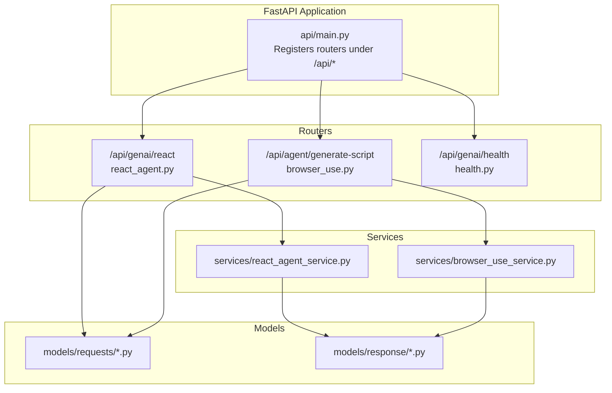
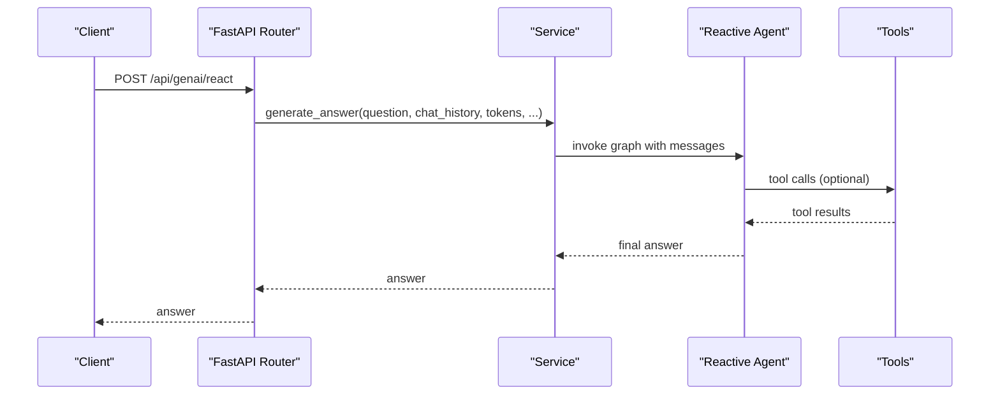
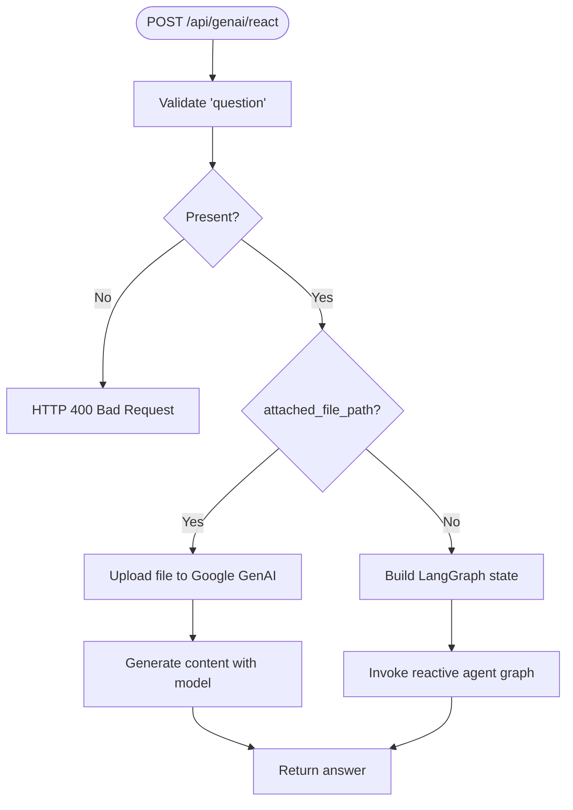
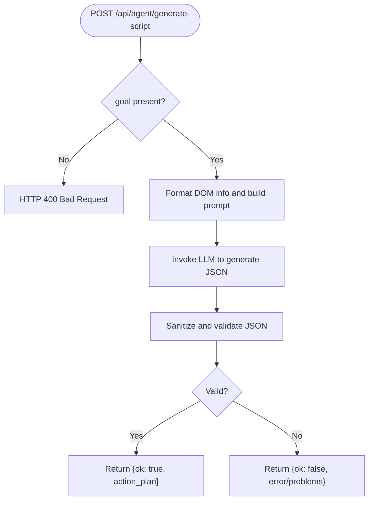
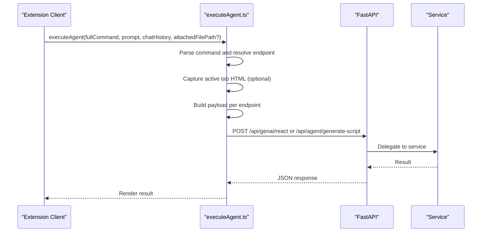
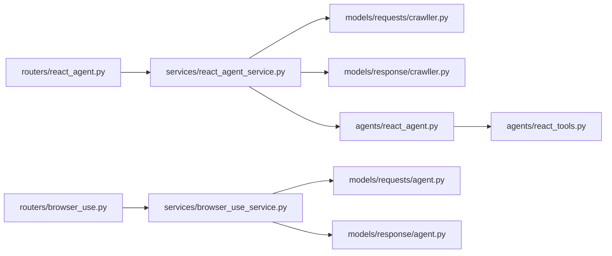

# Agent System API

<cite>
**Referenced Files in This Document**
- [api/main.py](file://api/main.py)
- [routers/react_agent.py](file://routers/react_agent.py)
- [routers/browser_use.py](file://routers/browser_use.py)
- [services/react_agent_service.py](file://services/react_agent_service.py)
- [services/browser_use_service.py](file://services/browser_use_service.py)
- [models/requests/agent.py](file://models/requests/agent.py)
- [models/response/agent.py](file://models/response/agent.py)
- [models/requests/react_agent.py](file://models/requests/react_agent.py)
- [models/response/react_agent.py](file://models/response/react_agent.py)
- [models/requests/crawller.py](file://models/requests/crawller.py)
- [models/response/crawller.py](file://models/response/crawller.py)
- [models/requests/pyjiit.py](file://models/requests/pyjiit.py)
- [routers/health.py](file://routers/health.py)
- [agents/react_agent.py](file://agents/react_agent.py)
- [agents/react_tools.py](file://agents/react_tools.py)
- [extension/entrypoints/utils/executeAgent.ts](file://extension/entrypoints/utils/executeAgent.ts)
</cite>

## Table of Contents
1. [Introduction](#introduction)
2. [Project Structure](#project-structure)
3. [Core Components](#core-components)
4. [Architecture Overview](#architecture-overview)
5. [Detailed Component Analysis](#detailed-component-analysis)
6. [Dependency Analysis](#dependency-analysis)
7. [Performance Considerations](#performance-considerations)
8. [Troubleshooting Guide](#troubleshooting-guide)
9. [Conclusion](#conclusion)
10. [Appendices](#appendices)

## Introduction
This document describes the Agent System API that powers reactive AI agents, browser automation commands, and integrated execution workflows. It covers endpoint definitions, request/response schemas, authentication requirements, and practical usage patterns for AI-driven automation. It also documents agent-specific request formatting, response handling, error recovery, and client integration examples for browser extensions and external clients.

## Project Structure
The API is implemented as a FastAPI application that mounts multiple routers under standardized prefixes. The routers delegate to service classes that orchestrate agent workflows and tool integrations.

**Diagram sources**
- [api/main.py](file://api/main.py#L14-L42)
- [routers/react_agent.py](file://routers/react_agent.py#L1-L57)
- [routers/browser_use.py](file://routers/browser_use.py#L1-L51)
- [routers/health.py](file://routers/health.py#L1-L13)
- [services/react_agent_service.py](file://services/react_agent_service.py#L1-L154)
- [services/browser_use_service.py](file://services/browser_use_service.py#L1-L96)
- [models/requests/agent.py](file://models/requests/agent.py#L1-L10)
- [models/response/agent.py](file://models/response/agent.py#L1-L11)
- [models/requests/react_agent.py](file://models/requests/react_agent.py#L1-L45)
- [models/response/react_agent.py](file://models/response/react_agent.py#L1-L15)
- [models/requests/crawller.py](file://models/requests/crawller.py#L1-L35)
- [models/response/crawller.py](file://models/response/crawller.py#L1-L6)

**Section sources**
- [api/main.py](file://api/main.py#L14-L42)

## Core Components
- Reactive Agent Endpoint: Processes natural language queries with optional chat history, Google access tokens, PyJIIT login payloads, client HTML context, and optional file attachments. Returns a plain text answer.
- Browser Automation Script Generator: Accepts a goal, optional target URL, DOM structure, and constraints. Returns a validated JSON action plan or structured errors.
- Health Endpoint: Lightweight health check returning a simple status object.

**Section sources**
- [routers/react_agent.py](file://routers/react_agent.py#L18-L57)
- [routers/browser_use.py](file://routers/browser_use.py#L16-L51)
- [routers/health.py](file://routers/health.py#L7-L12)

## Architecture Overview
The system follows a layered architecture:
- API Layer: FastAPI routers expose endpoints and handle request validation.
- Service Layer: Business logic orchestrates agent workflows and tool integrations.
- Agent Layer: LangGraph-based reactive agent with tool invocation.
- Tools Layer: Structured tools for web search, websites, GitHub, YouTube, Gmail, Calendar, PyJIIT, and browser actions.
- Client Layer: Extension and external clients send requests and receive responses.

**Diagram sources**
- [routers/react_agent.py](file://routers/react_agent.py#L18-L57)
- [services/react_agent_service.py](file://services/react_agent_service.py#L17-L154)
- [agents/react_agent.py](file://agents/react_agent.py#L138-L191)
- [agents/react_tools.py](file://agents/react_tools.py#L611-L726)

## Detailed Component Analysis

### Reactive Agent Endpoint
- Method: POST
- URL: /api/genai/react
- Purpose: Answer natural language questions with optional chat history, Google access tokens, PyJIIT session, client HTML context, and optional file attachments.
- Authentication: Not enforced at the API level; however, optional tokens enable richer tool usage.
- Request Schema: [models/requests/crawller.py](file://models/requests/crawller.py#L8-L35)
  - question: Required string
  - chat_history: Optional list of {role, content}
  - google_access_token: Optional string
  - pyjiit_login_response: Optional PyJIIT login payload
  - client_html: Optional raw HTML from the active browser tab
  - attached_file_path: Optional absolute path to a file to process via Google GenAI SDK
- Response Schema: [models/response/crawller.py](file://models/response/crawller.py#L4-L6)
  - answer: Plain text string
- Behavior:
  - Validates presence of question.
  - Optionally attaches a file via Google GenAI SDK and returns model-generated text.
  - Builds a LangGraph state with system, human, and optional page-context messages.
  - Executes the reactive agent graph and returns the final assistant message content.
- Error Handling:
  - Raises HTTP 400 for missing question.
  - Raises HTTP 500 for unhandled exceptions during processing.
- Example Usage:
  - Client composes a request payload with question, optional chat_history, and optional tokens.
  - Client sends POST to /api/genai/react.
  - Server responds with answer.

**Diagram sources**
- [routers/react_agent.py](file://routers/react_agent.py#L18-L57)
- [services/react_agent_service.py](file://services/react_agent_service.py#L17-L154)

**Section sources**
- [routers/react_agent.py](file://routers/react_agent.py#L18-L57)
- [models/requests/crawller.py](file://models/requests/crawller.py#L8-L35)
- [models/response/crawller.py](file://models/response/crawller.py#L4-L6)
- [services/react_agent_service.py](file://services/react_agent_service.py#L17-L154)

### Browser Automation Script Generator
- Method: POST
- URL: /api/agent/generate-script
- Purpose: Generate a JSON action plan for automating browser tasks based on a goal, optional target URL, DOM structure, and constraints.
- Authentication: Not enforced at the API level.
- Request Schema: [models/requests/agent.py](file://models/requests/agent.py#L5-L10)
  - goal: Required string
  - target_url: Optional string
  - dom_structure: Optional dict with keys: url, title, interactive[]
  - constraints: Optional dict
- Response Schema: [models/response/agent.py](file://models/response/agent.py#L5-L11)
  - ok: Boolean
  - action_plan: Optional dict
  - error: Optional string
  - problems: Optional list of validation problem strings
  - raw_response: Optional raw LLM output snippet
- Behavior:
  - Formats DOM info and constructs a prompt for the LLM.
  - Invokes the LLM to produce a JSON action plan.
  - Sanitizes and validates the JSON action plan.
  - Returns either ok=true with action_plan or ok=false with error/problems/raw_response.
- Error Handling:
  - Returns structured error fields when validation fails.
  - Returns HTTP 500 for unexpected exceptions.

**Diagram sources**
- [routers/browser_use.py](file://routers/browser_use.py#L16-L51)
- [services/browser_use_service.py](file://services/browser_use_service.py#L12-L96)
- [models/requests/agent.py](file://models/requests/agent.py#L5-L10)
- [models/response/agent.py](file://models/response/agent.py#L5-L11)

**Section sources**
- [routers/browser_use.py](file://routers/browser_use.py#L16-L51)
- [models/requests/agent.py](file://models/requests/agent.py#L5-L10)
- [models/response/agent.py](file://models/response/agent.py#L5-L11)
- [services/browser_use_service.py](file://services/browser_use_service.py#L12-L96)

### Health Endpoint
- Method: GET
- URL: /api/genai/health
- Purpose: Verify service availability.
- Authentication: Not enforced.
- Response Schema: [models/response/health.py](file://models/response/health.py#L1-L12)
  - status: String
  - message: String

**Section sources**
- [routers/health.py](file://routers/health.py#L7-L12)

### Agent Execution Workflow (Extension Client)
The extension composes requests for various agents and executes them. It captures active tab HTML, resolves URLs, and builds payloads tailored to each endpoint.

**Diagram sources**
- [extension/entrypoints/utils/executeAgent.ts](file://extension/entrypoints/utils/executeAgent.ts#L17-L318)

**Section sources**
- [extension/entrypoints/utils/executeAgent.ts](file://extension/entrypoints/utils/executeAgent.ts#L17-L318)

## Dependency Analysis
The API depends on routers, services, and models. The reactive agent integrates with LangGraph and a set of structured tools.

**Diagram sources**
- [routers/react_agent.py](file://routers/react_agent.py#L1-L57)
- [routers/browser_use.py](file://routers/browser_use.py#L1-L51)
- [services/react_agent_service.py](file://services/react_agent_service.py#L1-L154)
- [services/browser_use_service.py](file://services/browser_use_service.py#L1-L96)
- [models/requests/crawller.py](file://models/requests/crawller.py#L1-L35)
- [models/response/crawller.py](file://models/response/crawller.py#L1-L6)
- [models/requests/agent.py](file://models/requests/agent.py#L1-L10)
- [models/response/agent.py](file://models/response/agent.py#L1-L11)
- [agents/react_agent.py](file://agents/react_agent.py#L1-L191)
- [agents/react_tools.py](file://agents/react_tools.py#L1-L726)

**Section sources**
- [routers/react_agent.py](file://routers/react_agent.py#L1-L57)
- [routers/browser_use.py](file://routers/browser_use.py#L1-L51)
- [services/react_agent_service.py](file://services/react_agent_service.py#L1-L154)
- [services/browser_use_service.py](file://services/browser_use_service.py#L1-L96)
- [agents/react_agent.py](file://agents/react_agent.py#L1-L191)
- [agents/react_tools.py](file://agents/react_tools.py#L1-L726)

## Performance Considerations
- Token Limits: The script generator limits interactive DOM elements to reduce prompt size and avoid excessive tokens.
- Async I/O: Services use async LLM invocation and thread pools for tool operations to prevent blocking.
- Caching: The reactive agent graph is cached to avoid repeated compilation overhead.
- Validation Early Exit: Script generation validates and sanitizes JSON early to fail fast on malformed plans.

[No sources needed since this section provides general guidance]

## Troubleshooting Guide
- HTTP 400 Bad Request
  - Cause: Missing required field (e.g., question or goal).
  - Resolution: Ensure the payload includes the required fields.
- HTTP 500 Internal Server Error
  - Cause: Unexpected exception in service or agent execution.
  - Resolution: Inspect server logs; the service returns a generic error message to the client.
- Validation Failures for Script Generation
  - Cause: Generated JSON action plan fails validation.
  - Resolution: Review problems list in the response and adjust goal/target URL/DOM structure.
- Missing Tokens for Tool Access
  - Cause: Tools requiring Google access tokens or PyJIIT sessions are not usable without proper context.
  - Resolution: Provide google_access_token or pyjiit_login_response in the request.

**Section sources**
- [routers/react_agent.py](file://routers/react_agent.py#L27-L28)
- [routers/browser_use.py](file://routers/browser_use.py#L22-L23)
- [services/browser_use_service.py](file://services/browser_use_service.py#L82-L91)

## Conclusion
The Agent System API provides two primary capabilities: answering natural language queries with a reactive agent and generating browser automation scripts from goals and DOM context. The design emphasizes structured request/response schemas, robust validation, and extensible tooling. Clients can integrate via direct HTTP calls or through the extension’s command executor.

[No sources needed since this section summarizes without analyzing specific files]

## Appendices

### Endpoint Reference

- POST /api/genai/react
  - Request: [models/requests/crawller.py](file://models/requests/crawller.py#L8-L35)
  - Response: [models/response/crawller.py](file://models/response/crawller.py#L4-L6)
  - Notes: Supports optional Google access token, PyJIIT session, client HTML, and file attachment.

- POST /api/agent/generate-script
  - Request: [models/requests/agent.py](file://models/requests/agent.py#L5-L10)
  - Response: [models/response/agent.py](file://models/response/agent.py#L5-L11)
  - Notes: Returns ok=true with action_plan or ok=false with error and problems.

- GET /api/genai/health
  - Response: [models/response/health.py](file://models/response/health.py#L1-L12)

### Agent Message Payload Model
- Request: [models/requests/react_agent.py](file://models/requests/react_agent.py#L10-L45)
- Response: [models/response/react_agent.py](file://models/response/react_agent.py#L10-L15)

### PyJIIT Login Payload Model
- Request: [models/requests/pyjiit.py](file://models/requests/pyjiit.py#L54-L91)

### Client Integration Patterns
- Extension Client: See [extension/entrypoints/utils/executeAgent.ts](file://extension/entrypoints/utils/executeAgent.ts#L17-L318) for command parsing, tab context capture, and endpoint routing.

**Section sources**
- [models/requests/react_agent.py](file://models/requests/react_agent.py#L10-L45)
- [models/response/react_agent.py](file://models/response/react_agent.py#L10-L15)
- [models/requests/pyjiit.py](file://models/requests/pyjiit.py#L54-L91)
- [extension/entrypoints/utils/executeAgent.ts](file://extension/entrypoints/utils/executeAgent.ts#L17-L318)