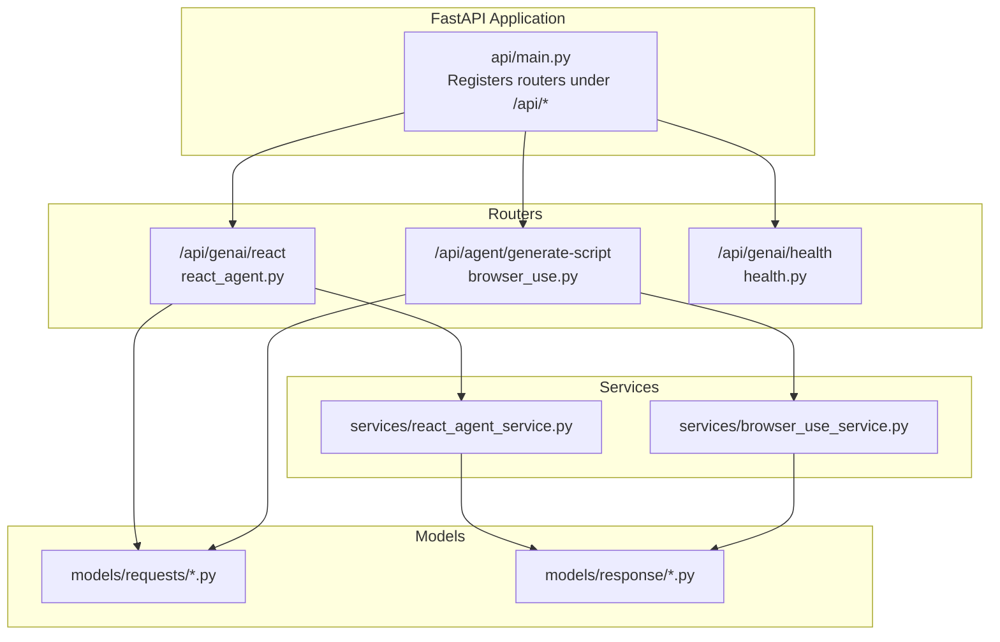
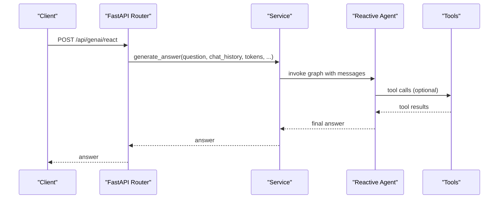
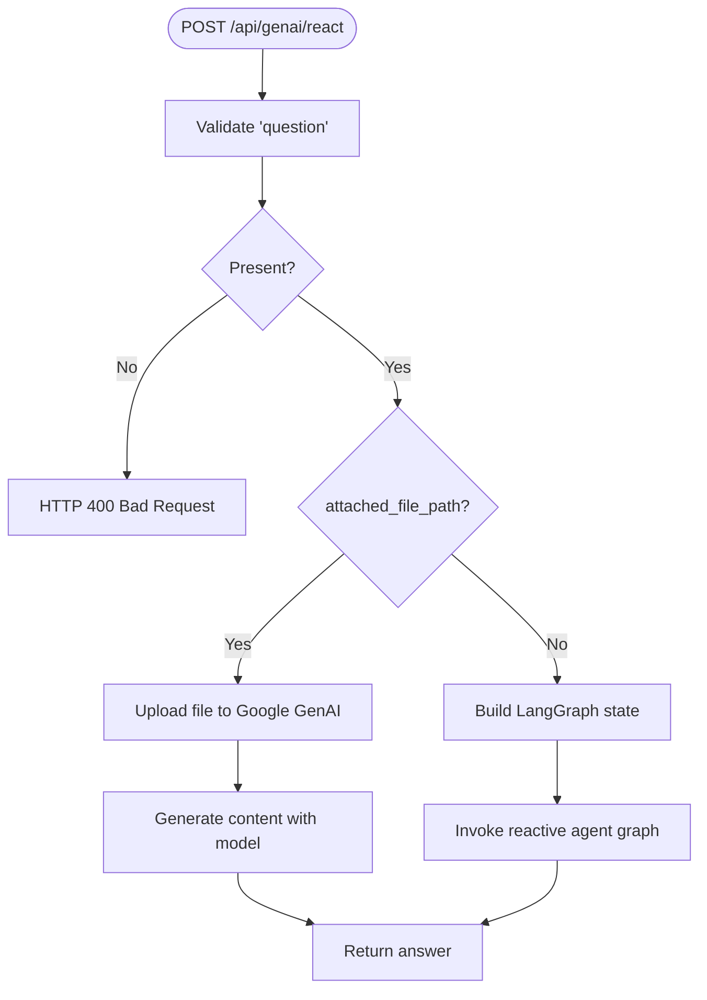
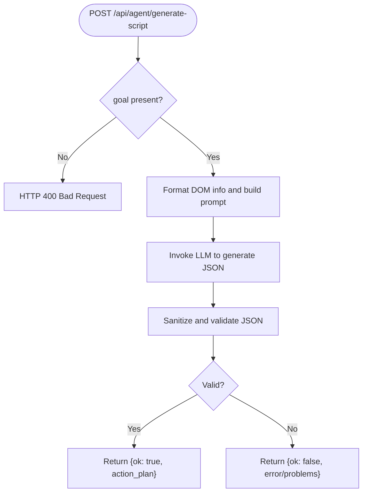
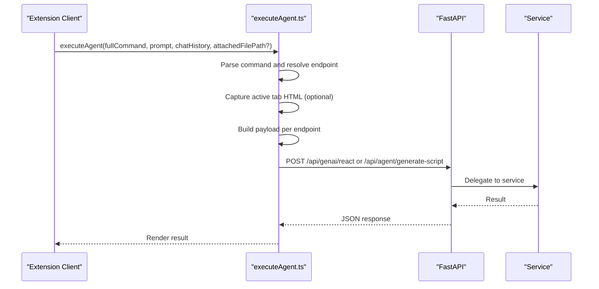
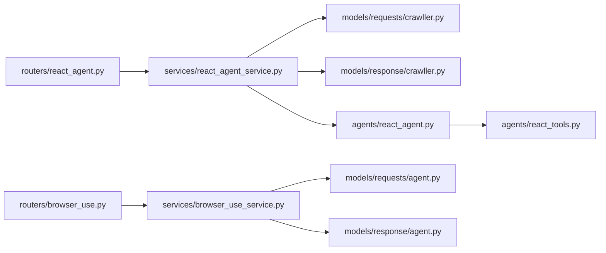

# Agent system API

## Introduction
This page describes the Agent System API that powers reactive AI agents, browser automation commands, and integrated execution workflows. It covers endpoint definitions, request/response schemas, authentication requirements, and practical usage patterns for AI-driven automation. It also documents agent-specific request formatting, response handling, error recovery, and client integration examples for browser extensions and external clients.

## Project structure
The API is implemented as a FastAPI application that mounts multiple routers under standardized prefixes. The routers delegate to service classes that orchestrate agent workflows and tool integrations.

```mermaid
graph TB
subgraph "FastAPI Application"
A["api/main.py<br/>Registers routers under /api/*"]
end
subgraph "Routers"
R1["/api/genai/react<br/>react_agent.py"]
R2["/api/agent/generate-script<br/>browser_use.py"]
R3["/api/genai/health<br/>health.py"]
end
subgraph "Services"
S1["services/react_agent_service.py"]
S2["services/browser_use_service.py"]
end
subgraph "Models"
M1["models/requests/*.py"]
M2["models/response/*.py"]
end
A --> R1
A --> R2
A --> R3
R1 --> S1
R2 --> S2
R1 --> M1
R2 --> M1
S1 --> M2
S2 --> M2
```

## Core components
- Reactive Agent Endpoint: Processes natural language queries with optional chat history, Google access tokens, PyJIIT login payloads, client HTML context, and optional file attachments. Returns a plain text answer.
- Browser Automation Script Generator: Accepts a goal, optional target URL, DOM structure, and constraints. Returns a validated JSON action plan or structured errors.
- Health Endpoint: Lightweight health check returning a simple status object.

## Architecture overview
The system follows a layered architecture:
- API Layer: FastAPI routers expose endpoints and handle request validation.
- Service Layer: Business logic orchestrates agent workflows and tool integrations.
- Agent Layer: LangGraph-based reactive agent with tool invocation.
- Tools Layer: Structured tools for web search, websites, GitHub, YouTube, Gmail, Calendar, PyJIIT, and browser actions.
- Client Layer: Extension and external clients send requests and receive responses.

```mermaid
sequenceDiagram
participant Client as "Client"
participant API as "FastAPI Router"
participant Service as "Service"
participant Agent as "Reactive Agent"
participant Tools as "Tools"
Client->>API : POST /api/genai/react
API->>Service : generate_answer(question, chat_history, tokens, ...)
Service->>Agent : invoke graph with messages
Agent->>Tools : tool calls (optional)
Tools-->>Agent : tool results
Agent-->>Service : final answer
Service-->>API : answer
API-->>Client : answer
```

## Detailed component analysis

### Reactive agent endpoint
- Method: POST
- URL: /api/genai/react
- Purpose: Answer natural language questions with optional chat history, Google access tokens, PyJIIT session, client HTML context, and optional file attachments.
- Authentication: Not enforced at the API level; however, optional tokens enable richer tool usage.
- Request Schema: `models/requests/crawller.py`
  - question: Required string
  - chat_history: Optional list of {role, content}
  - google_access_token: Optional string
  - pyjiit_login_response: Optional PyJIIT login payload
  - client_html: Optional raw HTML from the active browser tab
  - attached_file_path: Optional absolute path to a file to process via Google GenAI SDK
- Response Schema: `models/response/crawller.py`
  - answer: Plain text string
- Behavior:
  - Validates presence of question.
  - Optionally attaches a file via Google GenAI SDK and returns model-generated text.
  - Builds a LangGraph state with system, human, and optional page-context messages.
  - Executes the reactive agent graph and returns the final assistant message content.
- Error Handling:
  - Raises HTTP 400 for missing question.
  - Raises HTTP 500 for unhandled exceptions during processing.
- Example Usage:
  - Client composes a request payload with question, optional chat_history, and optional tokens.
  - Client sends POST to /api/genai/react.
  - Server responds with answer.

```mermaid
flowchart TD
Start(["POST /api/genai/react"]) --> Validate["Validate 'question'"]
Validate --> QuestionOK{"Present?"}
QuestionOK -- No --> Err400["HTTP 400 Bad Request"]
QuestionOK -- Yes --> FileCheck{"attached_file_path?"}
FileCheck -- Yes --> Upload["Upload file to Google GenAI"]
Upload --> GenText["Generate content with model"]
GenText --> ReturnAnswer["Return answer"]
FileCheck -- No --> BuildState["Build LangGraph state"]
BuildState --> Invoke["Invoke reactive agent graph"]
Invoke --> ReturnAnswer
```

### Browser automation script generator
- Method: POST
- URL: /api/agent/generate-script
- Purpose: Generate a JSON action plan for automating browser tasks based on a goal, optional target URL, DOM structure, and constraints.
- Authentication: Not enforced at the API level.
- Request Schema: `models/requests/agent.py`
  - goal: Required string
  - target_url: Optional string
  - dom_structure: Optional dict with keys: url, title, interactive[]
  - constraints: Optional dict
- Response Schema: `models/response/agent.py`
  - ok: Boolean
  - action_plan: Optional dict
  - error: Optional string
  - problems: Optional list of validation problem strings
  - raw_response: Optional raw LLM output snippet
- Behavior:
  - Formats DOM info and constructs a prompt for the LLM.
  - Invokes the LLM to produce a JSON action plan.
  - Sanitizes and validates the JSON action plan.
  - Returns either ok=true with action_plan or ok=false with error/problems/raw_response.
- Error Handling:
  - Returns structured error fields when validation fails.
  - Returns HTTP 500 for unexpected exceptions.

```mermaid
flowchart TD
Start(["POST /api/agent/generate-script"]) --> CheckGoal{"goal present?"}
CheckGoal -- No --> Err400["HTTP 400 Bad Request"]
CheckGoal -- Yes --> BuildPrompt["Format DOM info and build prompt"]
BuildPrompt --> CallLLM["Invoke LLM to generate JSON"]
CallLLM --> Sanitize["Sanitize and validate JSON"]
Sanitize --> Valid{"Valid?"}
Valid -- Yes --> OkResp["Return {ok: true, action_plan}"]
Valid -- No --> ErrResp["Return {ok: false, error/problems}"]
```

### Health endpoint
- Method: GET
- URL: /api/genai/health
- Purpose: Verify service availability.
- Authentication: Not enforced.
- Response Schema: `models/response/health.py`
  - status: String
  - message: String

### Agent execution workflow (extension client)
The extension composes requests for various agents and executes them. It captures active tab HTML, resolves URLs, and builds payloads tailored to each endpoint.

```mermaid
sequenceDiagram
participant Ext as "Extension Client"
participant Exec as "executeAgent.ts"
participant API as "FastAPI"
participant Svc as "Service"
Ext->>Exec : executeAgent(fullCommand, prompt, chatHistory, attachedFilePath?)
Exec->>Exec : Parse command and resolve endpoint
Exec->>Exec : Capture active tab HTML (optional)
Exec->>Exec : Build payload per endpoint
Exec->>API : POST /api/genai/react or /api/agent/generate-script
API->>Svc : Delegate to service
Svc-->>API : Result
API-->>Exec : JSON response
Exec-->>Ext : Render result
```

## Dependency analysis
The API depends on routers, services, and models. The reactive agent integrates with LangGraph and a set of structured tools.

```mermaid
graph LR
RAct["routers/react_agent.py"] --> SAct["services/react_agent_service.py"]
RBot["routers/browser_use.py"] --> SBot["services/browser_use_service.py"]
SAct --> MReqCrawl["models/requests/crawller.py"]
SAct --> MResCrawl["models/response/crawller.py"]
SBot --> MReqAgent["models/requests/agent.py"]
SBot --> MResAgent["models/response/agent.py"]
SAct --> ARaw["agents/react_agent.py"]
ARaw --> ATools["agents/react_tools.py"]
```

## Performance considerations
- Token Limits: The script generator limits interactive DOM elements to reduce prompt size and avoid excessive tokens.
- Async I/O: Services use async LLM invocation and thread pools for tool operations to prevent blocking.
- Caching: The reactive agent graph is cached to avoid repeated compilation overhead.
- Validation Early Exit: Script generation validates and sanitizes JSON early to fail fast on malformed plans.

[No sources needed since this section provides general guidance]

## Troubleshooting guide
- HTTP 400 Bad Request
  - Cause: Missing required field (e.g., question or goal).
  - Resolution: Ensure the payload includes the required fields.
- HTTP 500 Internal Server Error
  - Cause: Unexpected exception in service or agent execution.
  - Resolution: Inspect server logs; the service returns a generic error message to the client.
- Validation Failures for Script Generation
  - Cause: Generated JSON action plan fails validation.
  - Resolution: Review problems list in the response and adjust goal/target URL/DOM structure.
- Missing Tokens for Tool Access
  - Cause: Tools requiring Google access tokens or PyJIIT sessions are not usable without proper context.
  - Resolution: Provide google_access_token or pyjiit_login_response in the request.

## Conclusion
The Agent System API provides two primary capabilities: answering natural language queries with a reactive agent and generating browser automation scripts from goals and DOM context. The design emphasizes structured request/response schemas, reliable validation, and extensible tooling. Clients can integrate via direct HTTP calls or through the extension's command executor.

[No sources needed since this section summarizes without analyzing specific files]

## Appendices

### Endpoint reference

- POST /api/genai/react
  - Request: `models/requests/crawller.py`
  - Response: `models/response/crawller.py`
  - Notes: Supports optional Google access token, PyJIIT session, client HTML, and file attachment.

- POST /api/agent/generate-script
  - Request: `models/requests/agent.py`
  - Response: `models/response/agent.py`
  - Notes: Returns ok=true with action_plan or ok=false with error and problems.

- GET /api/genai/health
  - Response: `models/response/health.py`

### Agent message payload model
- Request: `models/requests/react_agent.py`
- Response: `models/response/react_agent.py`

### PyJIIT login payload model
- Request: `models/requests/pyjiit.py`

### Client integration patterns
- Extension Client: See `extension/entrypoints/utils/executeAgent.ts` for command parsing, tab context capture, and endpoint routing.
