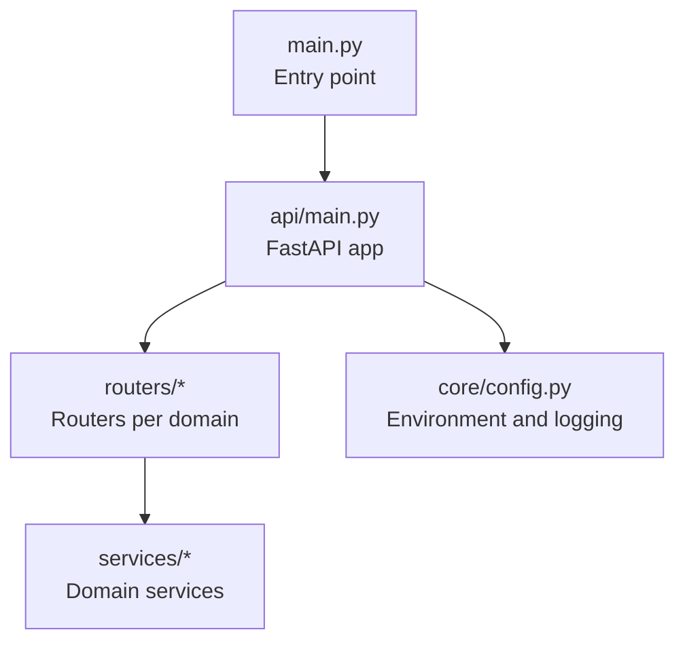
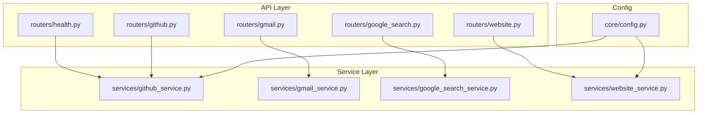
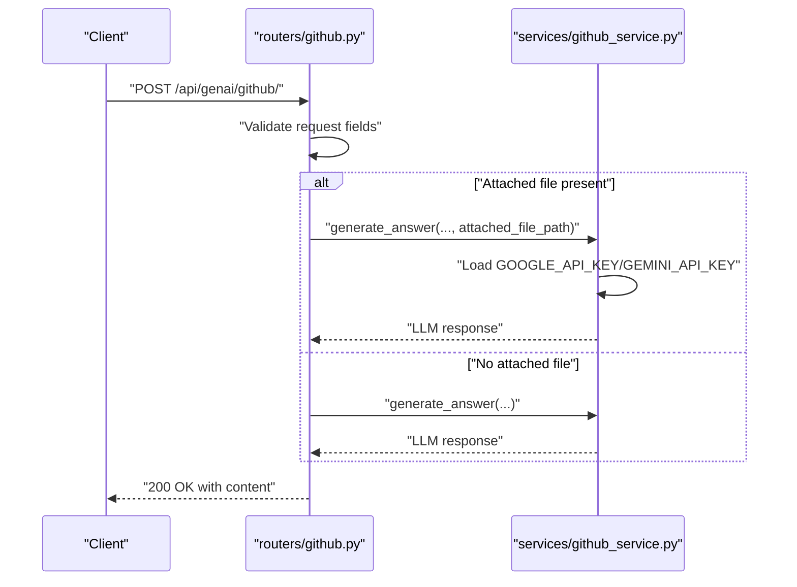
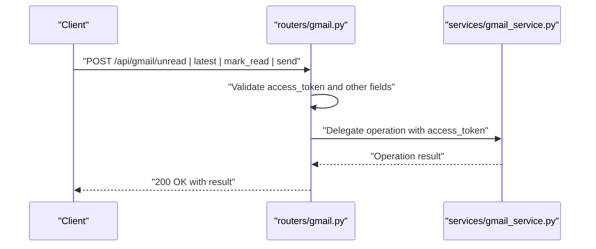
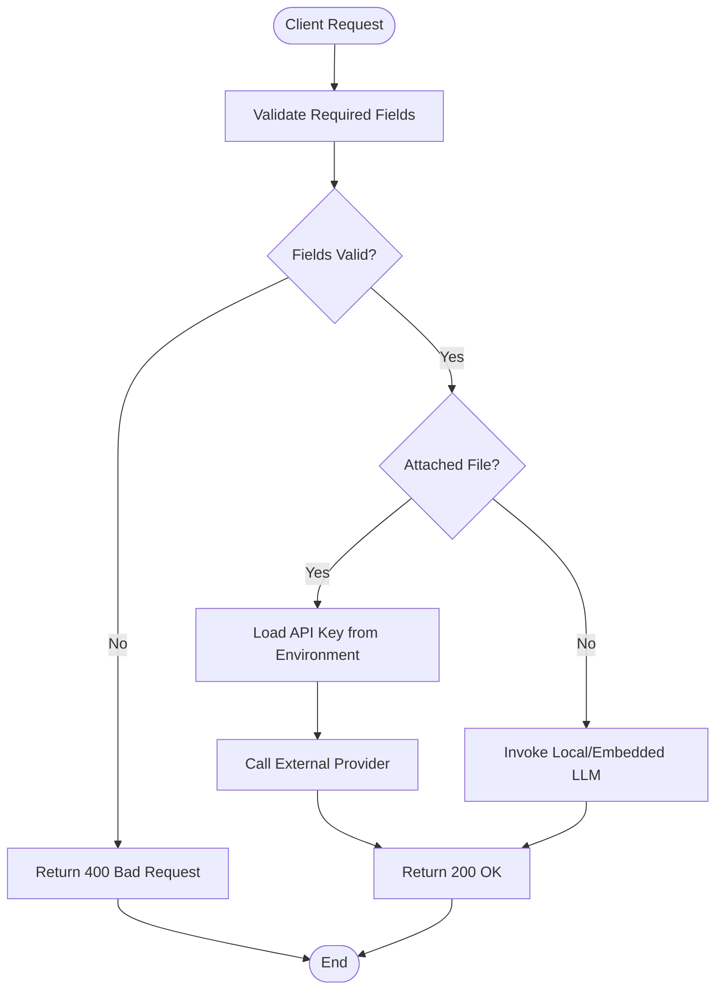
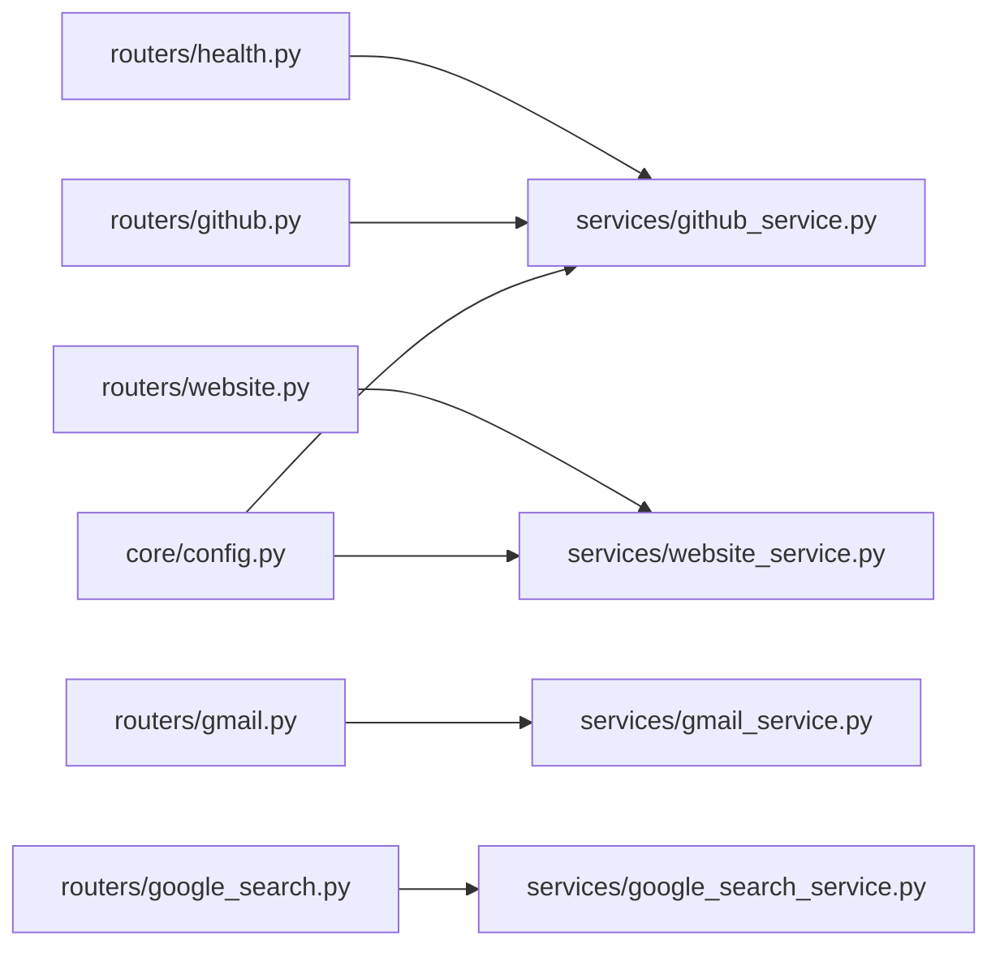

# Authentication and Security

<cite>
**Referenced Files in This Document**
- [main.py](file://main.py)
- [api/main.py](file://api/main.py)
- [core/config.py](file://core/config.py)
- [routers/__init__.py](file://routers/__init__.py)
- [routers/health.py](file://routers/health.py)
- [routers/github.py](file://routers/github.py)
- [routers/gmail.py](file://routers/gmail.py)
- [routers/google_search.py](file://routers/google_search.py)
- [routers/website.py](file://routers/website.py)
- [services/github_service.py](file://services/github_service.py)
- [services/gmail_service.py](file://services/gmail_service.py)
- [services/google_search_service.py](file://services/google_search_service.py)
- [services/website_service.py](file://services/website_service.py)
- [tools/pyjiit/exceptions.py](file://tools/pyjiit/exceptions.py)
- [extension/entrypoints/sidepanel/App.tsx](file://extension/entrypoints/sidepanel/App.tsx)
- [extension/entrypoints/sidepanel/components/UnifiedSettingsMenu.tsx](file://extension/entrypoints/sidepanel/components/UnifiedSettingsMenu.tsx)
- [extension/entrypoints/utils/executeAgent.ts](file://extension/entrypoints/utils/executeAgent.ts)
</cite>

## Table of Contents
1. [Introduction](#introduction)
2. [Project Structure](#project-structure)
3. [Core Components](#core-components)
4. [Architecture Overview](#architecture-overview)
5. [Detailed Component Analysis](#detailed-component-analysis)
6. [Dependency Analysis](#dependency-analysis)
7. [Performance Considerations](#performance-considerations)
8. [Security Controls and Best Practices](#security-controls-and-best-practices)
9. [Troubleshooting Guide](#troubleshooting-guide)
10. [Conclusion](#conclusion)

## Introduction
This document provides comprehensive authentication and security documentation for the API server. It explains how authentication is applied across routers, documents the use of API keys, OAuth flows, session management, security headers, CORS policies, rate limiting strategies, JWT token handling, credential storage, and secure communication protocols. It also outlines security best practices, vulnerability prevention measures, and compliance considerations, along with mitigation strategies for common security threats across service integrations.

## Project Structure
The API server is implemented using FastAPI and exposes multiple routers under a unified application. Routers are grouped by functional domains (e.g., health, GitHub, Gmail, Google Search, website, YouTube, PyjIIT, React Agent, website validator, browser use, file upload). Each router defines endpoints and delegates business logic to dedicated services. Environment variables are loaded via a configuration module, and the application entrypoint supports selecting between API and MCP modes.

**Diagram sources**
- [main.py](file://main.py#L1-L58)
- [api/main.py](file://api/main.py#L1-L47)
- [core/config.py](file://core/config.py#L1-L26)

**Section sources**
- [main.py](file://main.py#L1-L58)
- [api/main.py](file://api/main.py#L1-L47)
- [core/config.py](file://core/config.py#L1-L26)

## Core Components
- API Application: Initializes the FastAPI app, registers routers, and exposes endpoints under standardized prefixes.
- Routers: Define request validation, error handling, and route-specific behaviors. They depend on services for business logic.
- Services: Encapsulate integration with external APIs and tools, including credential handling and error propagation.
- Configuration: Loads environment variables and sets logging levels.

Key observations:
- No global authentication middleware is present in the API application.
- Some endpoints accept credentials directly in request bodies (e.g., access tokens).
- Environment variables are used for API keys and runtime configuration.

**Section sources**
- [api/main.py](file://api/main.py#L1-L47)
- [routers/github.py](file://routers/github.py#L1-L49)
- [routers/gmail.py](file://routers/gmail.py#L1-L149)
- [routers/google_search.py](file://routers/google_search.py#L1-L39)
- [routers/website.py](file://routers/website.py#L1-L43)
- [services/github_service.py](file://services/github_service.py#L1-L109)
- [services/gmail_service.py](file://services/gmail_service.py#L1-L56)
- [services/google_search_service.py](file://services/google_search_service.py#L1-L31)
- [services/website_service.py](file://services/website_service.py#L1-L97)
- [core/config.py](file://core/config.py#L1-L26)

## Architecture Overview
The API server architecture separates concerns into routers, services, and configuration. Routers handle HTTP requests and validation, services encapsulate integrations, and configuration manages environment-driven behavior.

**Diagram sources**
- [api/main.py](file://api/main.py#L1-L47)
- [routers/health.py](file://routers/health.py#L1-L13)
- [routers/github.py](file://routers/github.py#L1-L49)
- [routers/gmail.py](file://routers/gmail.py#L1-L149)
- [routers/google_search.py](file://routers/google_search.py#L1-L39)
- [routers/website.py](file://routers/website.py#L1-L43)
- [services/github_service.py](file://services/github_service.py#L1-L109)
- [services/gmail_service.py](file://services/gmail_service.py#L1-L56)
- [services/google_search_service.py](file://services/google_search_service.py#L1-L31)
- [services/website_service.py](file://services/website_service.py#L1-L97)
- [core/config.py](file://core/config.py#L1-L26)

## Detailed Component Analysis

### Health Endpoint
- Purpose: Lightweight health check without authentication.
- Behavior: Returns a simple health status object.
- Security: Public endpoint; no authentication or authorization enforced.

**Section sources**
- [routers/health.py](file://routers/health.py#L1-L13)

### GitHub Router
- Purpose: Processes GitHub repository queries and optional file attachments.
- Authentication: Accepts a URL and question; no explicit authentication enforced at router level.
- Credential Handling: When an attached file is present, the service uses an API key retrieved from environment variables to communicate with an external provider.
- Error Handling: Validates presence of required fields and returns structured errors.

**Diagram sources**
- [routers/github.py](file://routers/github.py#L1-L49)
- [services/github_service.py](file://services/github_service.py#L1-L109)

**Section sources**
- [routers/github.py](file://routers/github.py#L1-L49)
- [services/github_service.py](file://services/github_service.py#L1-L109)

### Gmail Router
- Purpose: Provides operations against Gmail using an access token supplied in the request body.
- Authentication: Requires an access token for all endpoints; validated at router level.
- Endpoints:
  - List unread messages
  - Fetch latest messages
  - Mark message read
  - Send email
- Error Handling: Enforces required fields and returns structured errors.

**Diagram sources**
- [routers/gmail.py](file://routers/gmail.py#L1-L149)
- [services/gmail_service.py](file://services/gmail_service.py#L1-L56)

**Section sources**
- [routers/gmail.py](file://routers/gmail.py#L1-L149)
- [services/gmail_service.py](file://services/gmail_service.py#L1-L56)

### Google Search Router
- Purpose: Executes web search queries via a pipeline.
- Authentication: No authentication enforced at router level.
- Behavior: Validates query presence and returns results.

**Section sources**
- [routers/google_search.py](file://routers/google_search.py#L1-L39)
- [services/google_search_service.py](file://services/google_search_service.py#L1-L31)

### Website Router
- Purpose: Generates answers based on website content and optional client-provided HTML.
- Authentication: No authentication enforced at router level.
- Credential Handling: When an attached file is present, the service uses an API key retrieved from environment variables to communicate with an external provider.

**Section sources**
- [routers/website.py](file://routers/website.py#L1-L43)
- [services/website_service.py](file://services/website_service.py#L1-L97)

### API Key Validation and Credential Storage
- API Keys: The GitHub and Website services load an API key from environment variables to interact with external providers when processing attached files.
- Credential Storage: Credentials are not stored server-side; access tokens are passed in request bodies and used immediately by services.
- Frontend Settings: The extension allows users to store API keys locally and manage tokens, including refresh flows.

**Diagram sources**
- [routers/github.py](file://routers/github.py#L1-L49)
- [routers/website.py](file://routers/website.py#L1-L43)
- [services/github_service.py](file://services/github_service.py#L1-L109)
- [services/website_service.py](file://services/website_service.py#L1-L97)

**Section sources**
- [services/github_service.py](file://services/github_service.py#L1-L109)
- [services/website_service.py](file://services/website_service.py#L1-L97)
- [extension/entrypoints/sidepanel/components/UnifiedSettingsMenu.tsx](file://extension/entrypoints/sidepanel/components/UnifiedSettingsMenu.tsx#L542-L575)
- [extension/entrypoints/sidepanel/App.tsx](file://extension/entrypoints/sidepanel/App.tsx#L161-L165)

### OAuth Flows and Session Management
- OAuth Access Tokens: The Gmail router requires an access token in the request body for all operations.
- Session Management: There is no persistent session management or refresh token handling in the API server. The extension indicates support for refresh tokens and manual refresh actions, suggesting client-side token lifecycle management.
- JWT Handling: No JWT tokens are processed by the API server; authentication relies on bearer-style access tokens passed in request bodies.

**Section sources**
- [routers/gmail.py](file://routers/gmail.py#L1-L149)
- [extension/entrypoints/sidepanel/components/UnifiedSettingsMenu.tsx](file://extension/entrypoints/sidepanel/components/UnifiedSettingsMenu.tsx#L1007-L1015)
- [extension/entrypoints/sidepanel/components/ProfileSidebar.tsx](file://extension/entrypoints/sidepanel/components/ProfileSidebar.tsx#L166-L174)

### Security Headers, CORS Policies, and Rate Limiting
- Security Headers: Not configured in the API application.
- CORS: Not configured in the API application.
- Rate Limiting: Not configured in the API application.
Recommendations:
- Add CORS middleware to restrict origins and methods.
- Add security headers (e.g., Content-Security-Policy, Strict-Transport-Security).
- Implement rate limiting at the router or application level.

**Section sources**
- [api/main.py](file://api/main.py#L1-L47)

### Secure Communication Protocols
- Transport Security: The extension demonstrates local HTTP usage for internal services, which is acceptable for development. Production deployments should enforce HTTPS/TLS termination at ingress/load balancer.
- Internal Communication: The extension’s fetch calls target localhost endpoints; ensure network isolation and consider loopback security boundaries.

**Section sources**
- [extension/entrypoints/utils/executeAgent.ts](file://extension/entrypoints/utils/executeAgent.ts#L273-L295)

## Dependency Analysis
Routers depend on services for business logic. Services depend on configuration for environment variables and on external tools. There is no central authentication dependency injected into the application.

**Diagram sources**
- [routers/health.py](file://routers/health.py#L1-L13)
- [routers/github.py](file://routers/github.py#L1-L49)
- [routers/gmail.py](file://routers/gmail.py#L1-L149)
- [routers/google_search.py](file://routers/google_search.py#L1-L39)
- [routers/website.py](file://routers/website.py#L1-L43)
- [services/github_service.py](file://services/github_service.py#L1-L109)
- [services/gmail_service.py](file://services/gmail_service.py#L1-L56)
- [services/google_search_service.py](file://services/google_search_service.py#L1-L31)
- [services/website_service.py](file://services/website_service.py#L1-L97)
- [core/config.py](file://core/config.py#L1-L26)

**Section sources**
- [routers/__init__.py](file://routers/__init__.py#L1-L32)
- [api/main.py](file://api/main.py#L1-L47)

## Performance Considerations
- Avoid unnecessary external calls when no attached file is present.
- Cache or reuse external client instances where appropriate to reduce overhead.
- Validate and sanitize inputs early to fail fast and reduce downstream processing.

## Security Controls and Best Practices

### Authentication Mechanisms
- API Key Validation
  - Use environment variables to store API keys.
  - Restrict API key scopes and rotate keys periodically.
  - Avoid logging sensitive values.
- OAuth Flows
  - Accept access tokens in request bodies for endpoints requiring third-party authorization.
  - Validate token audience and expiration when possible.
- Session Management
  - No server-side sessions; rely on client-managed tokens.
  - Implement token refresh logic in the client and avoid long-lived tokens.

### Security Headers, CORS, and Rate Limiting
- Configure CORS to allowlist trusted origins and methods.
- Apply security headers to mitigate common attacks (X-Content-Type-Options, X-Frame-Options, Referrer-Policy).
- Implement rate limiting per endpoint or globally to prevent abuse.

### JWT Token Handling
- Not applicable in current implementation; if introduced, use short-lived access tokens and long-lived refresh tokens with secure storage and transport.

### Credential Storage
- Store secrets in environment variables or secret managers.
- Never persist tokens or API keys in plaintext logs or databases.
- Use encrypted storage for sensitive settings in the extension.

### Secure Communication Protocols
- Enforce TLS termination at ingress for production.
- Use HTTPS for all internal and external communications.

### Compliance Considerations
- Data minimization: Only collect and process necessary data.
- Privacy controls: Respect user privacy and provide opt-out mechanisms.
- Logging hygiene: Avoid logging PII or secrets.

### Vulnerability Prevention Measures
- Input validation and sanitization at router level.
- Principle of least privilege for external API keys.
- Timeout and retry policies for external calls.
- Circuit breaker patterns to protect downstream systems.

### Threat Mitigation Strategies
- Injection Attacks: Validate and sanitize inputs; avoid dynamic evaluation.
- Information Disclosure: Avoid exposing stack traces; return generic error messages.
- Abuse and DoS: Implement rate limiting and request size limits.
- Man-in-the-Middle: Enforce TLS and certificate pinning where applicable.

## Troubleshooting Guide
- Missing Access Token (Gmail): Ensure the request includes a valid access token; otherwise, the router returns a 400 error.
- Invalid or Expired Access Token (Gmail): The underlying service may raise exceptions; wrap and translate to user-friendly errors.
- Session Errors (PyjIIT): Exceptions indicate session-related issues; surface actionable messages to users.
- Health Endpoint: Use the health endpoint to confirm service availability.

**Section sources**
- [routers/gmail.py](file://routers/gmail.py#L43-L44)
- [tools/pyjiit/exceptions.py](file://tools/pyjiit/exceptions.py#L1-L22)
- [routers/health.py](file://routers/health.py#L7-L12)

## Conclusion
The API server currently relies on request-time validation and environment-based API keys for external integrations, with no global authentication middleware. To harden the system, deploy CORS and security headers, implement rate limiting, and adopt robust token management practices. The extension’s token management capabilities complement server-side improvements to deliver a secure and compliant solution.