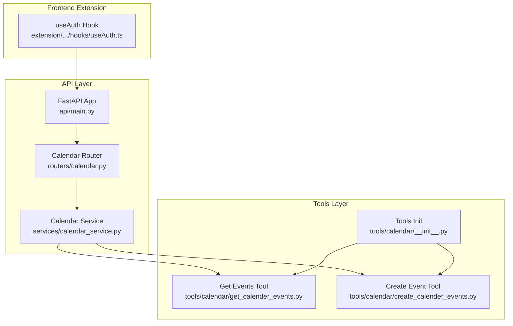
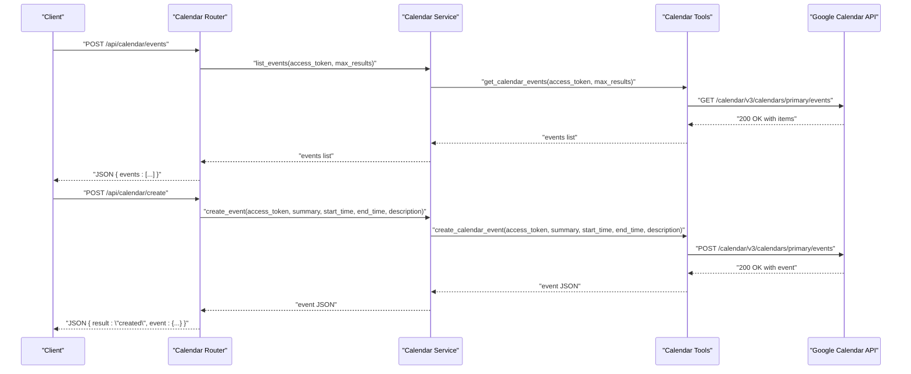
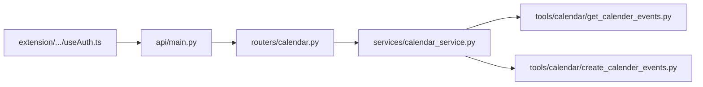

# Calendar Integration API

<cite>
**Referenced Files in This Document**
- [api/main.py](file://api/main.py)
- [routers/calendar.py](file://routers/calendar.py)
- [services/calendar_service.py](file://services/calendar_service.py)
- [tools/calendar/__init__.py](file://tools/calendar/__init__.py)
- [tools/calendar/create_calender_events.py](file://tools/calendar/create_calender_events.py)
- [tools/calendar/get_calender_events.py](file://tools/calendar/get_calender_events.py)
- [extension/entrypoints/sidepanel/hooks/useAuth.ts](file://extension/entrypoints/sidepanel/hooks/useAuth.ts)
- [core/config.py](file://core/config.py)
</cite>

## Table of Contents
1. [Introduction](#introduction)
2. [Project Structure](#project-structure)
3. [Core Components](#core-components)
4. [Architecture Overview](#architecture-overview)
5. [Detailed Component Analysis](#detailed-component-analysis)
6. [Dependency Analysis](#dependency-analysis)
7. [Performance Considerations](#performance-considerations)
8. [Troubleshooting Guide](#troubleshooting-guide)
9. [Conclusion](#conclusion)
10. [Appendices](#appendices)

## Introduction
This document describes the Google Calendar integration API endpoints exposed by the application. It covers calendar event management capabilities including listing upcoming events and creating new events. The documentation specifies HTTP methods, URL patterns, request/response schemas, authentication requirements, and practical usage examples for automation and synchronization scenarios. It also explains calendar-specific authentication, timezone handling, and recurring event management considerations.

## Project Structure
The calendar integration is implemented as a FastAPI application with a dedicated router and service layer. Tools encapsulate direct Google Calendar API interactions. The frontend extension manages OAuth-based authentication and token lifecycle.

**Diagram sources**
- [api/main.py](file://api/main.py#L14-L42)
- [routers/calendar.py](file://routers/calendar.py#L1-L113)
- [services/calendar_service.py](file://services/calendar_service.py#L1-L38)
- [tools/calendar/get_calender_events.py](file://tools/calendar/get_calender_events.py#L1-L52)
- [tools/calendar/create_calender_events.py](file://tools/calendar/create_calender_events.py#L1-L70)
- [tools/calendar/__init__.py](file://tools/calendar/__init__.py#L1-L8)
- [extension/entrypoints/sidepanel/hooks/useAuth.ts](file://extension/entrypoints/sidepanel/hooks/useAuth.ts#L128-L208)

**Section sources**
- [api/main.py](file://api/main.py#L12-L42)
- [routers/calendar.py](file://routers/calendar.py#L1-L113)
- [services/calendar_service.py](file://services/calendar_service.py#L1-L38)
- [tools/calendar/__init__.py](file://tools/calendar/__init__.py#L1-L8)

## Core Components
- Calendar Router: Exposes two endpoints under /api/calendar:
  - POST /events: Lists upcoming events for the authenticated user.
  - POST /create: Creates a new calendar event for the authenticated user.
- Calendar Service: Orchestrates event listing and creation by delegating to tools.
- Tools:
  - Get Events Tool: Calls the Google Calendar API to fetch upcoming events.
  - Create Event Tool: Calls the Google Calendar API to create a new event.
- Frontend Authentication Hook: Manages OAuth with Google scopes including calendar access and exchanges authorization code for tokens.

**Section sources**
- [routers/calendar.py](file://routers/calendar.py#L32-L113)
- [services/calendar_service.py](file://services/calendar_service.py#L8-L38)
- [tools/calendar/get_calender_events.py](file://tools/calendar/get_calender_events.py#L6-L23)
- [tools/calendar/create_calender_events.py](file://tools/calendar/create_calender_events.py#L6-L40)
- [extension/entrypoints/sidepanel/hooks/useAuth.ts](file://extension/entrypoints/sidepanel/hooks/useAuth.ts#L136-L145)

## Architecture Overview
The API follows a layered architecture:
- API Router validates requests and delegates to the Calendar Service.
- Calendar Service invokes tools that call the Google Calendar API.
- Frontend extension handles OAuth and token storage, providing access tokens to the API.

**Diagram sources**
- [routers/calendar.py](file://routers/calendar.py#L32-L113)
- [services/calendar_service.py](file://services/calendar_service.py#L8-L38)
- [tools/calendar/get_calender_events.py](file://tools/calendar/get_calender_events.py#L6-L23)
- [tools/calendar/create_calender_events.py](file://tools/calendar/create_calender_events.py#L6-L40)

## Detailed Component Analysis

### Calendar Router Endpoints
- Base Path: /api/calendar
- Authentication: Access token passed in request body for both endpoints.

Endpoints:
- POST /events
  - Purpose: Retrieve upcoming events for the authenticated user.
  - Request Body Schema:
    - access_token: string (required)
    - max_results: integer (optional, default 10)
  - Response Schema:
    - events: array of event objects returned by Google Calendar API
  - Validation:
    - Returns HTTP 400 if access_token is missing.
    - Defaults max_results to 10 if not provided or invalid.
  - Error Handling:
    - Propagates HTTP exceptions; wraps unexpected errors as HTTP 500.

- POST /create
  - Purpose: Create a new calendar event.
  - Request Body Schema:
    - access_token: string (required)
    - summary: string (required)
    - start_time: string (required, ISO 8601)
    - end_time: string (required, ISO 8601)
    - description: string (optional, default "Created via API")
  - Response Schema:
    - result: string "created"
    - event: event object returned by Google Calendar API
  - Validation:
    - Returns HTTP 400 if any required field is missing.
    - start_time and end_time must be valid ISO 8601 strings.
  - Error Handling:
    - Propagates HTTP exceptions; wraps unexpected errors as HTTP 500.

Notes:
- The router does not currently expose endpoints for updating or deleting events.
- The router does not currently enforce calendar-specific scopes; it relies on the presence of access_token.

**Section sources**
- [routers/calendar.py](file://routers/calendar.py#L13-L113)

### Calendar Service
- list_events(access_token, max_results):
  - Delegates to get_calendar_events and returns the items array.
- create_event(access_token, summary, start_time, end_time, description):
  - Delegates to create_calendar_event and returns the created event.

**Section sources**
- [services/calendar_service.py](file://services/calendar_service.py#L8-L38)

### Tools: Google Calendar API Interactions
- get_calendar_events(access_token, max_results):
  - Calls Google Calendar API to list upcoming events.
  - Uses Authorization header with Bearer token.
  - Parameters include maxResults, orderBy, singleEvents, and timeMin.
  - Returns items array or raises an exception on non-200 responses.

- create_calendar_event(access_token, summary, start_time, end_time, description):
  - Calls Google Calendar API to create a new event.
  - Uses Authorization header with Bearer token and Content-Type: application/json.
  - Event payload includes summary, description, and start/end with dateTime and timeZone.
  - Returns the created event JSON or raises an exception on non-200 responses.

**Section sources**
- [tools/calendar/get_calender_events.py](file://tools/calendar/get_calender_events.py#L6-L23)
- [tools/calendar/create_calender_events.py](file://tools/calendar/create_calender_events.py#L6-L40)

### Frontend Authentication and Token Management
- OAuth Scopes:
  - Includes calendar scope for calendar access.
  - Uses browser.identity APIs to launch web auth flow and exchange authorization code for tokens.
- Token Exchange:
  - Sends authorization code and redirect URI to backend endpoint /exchange-code.
  - Receives access_token, refresh_token, and expires_in.
- Token Lifecycle:
  - Stores user info and tokens in browser storage.
  - Provides manual refresh capability when refresh_token is available.

**Section sources**
- [extension/entrypoints/sidepanel/hooks/useAuth.ts](file://extension/entrypoints/sidepanel/hooks/useAuth.ts#L136-L145)
- [extension/entrypoints/sidepanel/hooks/useAuth.ts](file://extension/entrypoints/sidepanel/hooks/useAuth.ts#L156-L170)
- [extension/entrypoints/sidepanel/hooks/useAuth.ts](file://extension/entrypoints/sidepanel/hooks/useAuth.ts#L271-L295)

## Dependency Analysis

**Diagram sources**
- [api/main.py](file://api/main.py#L14-L42)
- [routers/calendar.py](file://routers/calendar.py#L1-L113)
- [services/calendar_service.py](file://services/calendar_service.py#L1-L38)
- [tools/calendar/get_calender_events.py](file://tools/calendar/get_calender_events.py#L1-L52)
- [tools/calendar/create_calender_events.py](file://tools/calendar/create_calender_events.py#L1-L70)
- [extension/entrypoints/sidepanel/hooks/useAuth.ts](file://extension/entrypoints/sidepanel/hooks/useAuth.ts#L128-L208)

**Section sources**
- [api/main.py](file://api/main.py#L14-L42)
- [routers/calendar.py](file://routers/calendar.py#L1-L113)
- [services/calendar_service.py](file://services/calendar_service.py#L1-L38)
- [tools/calendar/__init__.py](file://tools/calendar/__init__.py#L1-L8)

## Performance Considerations
- Timeout Settings:
  - GET events: timeout 8 seconds.
  - POST create: timeout 10 seconds.
- Concurrency:
  - The service layer uses synchronous tool functions. For high-throughput scenarios, consider asynchronous I/O or thread/process pools.
- Pagination:
  - The events endpoint supports max_results; tune this value to balance latency and payload size.
- Network Reliability:
  - Implement retries with exponential backoff for transient failures when integrating external Google Calendar API calls.

[No sources needed since this section provides general guidance]

## Troubleshooting Guide
Common Issues and Resolutions:
- Missing access_token:
  - Symptom: HTTP 400 on both /events and /create.
  - Resolution: Ensure access_token is present in request body.
- Invalid ISO 8601 timestamps:
  - Symptom: HTTP 400 on /create with validation error.
  - Resolution: Provide start_time and end_time in valid ISO 8601 format.
- Non-200 responses from Google Calendar API:
  - Symptom: HTTP 500 from API with error details.
  - Resolution: Inspect underlying exception messages and verify scopes and token validity.
- Authentication failures:
  - Symptom: Token exchange fails or user info fetch fails.
  - Resolution: Verify OAuth flow, scopes, and backend /exchange-code endpoint availability.

**Section sources**
- [routers/calendar.py](file://routers/calendar.py#L37-L38)
- [routers/calendar.py](file://routers/calendar.py#L80-L84)
- [routers/calendar.py](file://routers/calendar.py#L86-L91)
- [tools/calendar/get_calender_events.py](file://tools/calendar/get_calender_events.py#L19-L22)
- [tools/calendar/create_calender_events.py](file://tools/calendar/create_calender_events.py#L35-L38)
- [extension/entrypoints/sidepanel/hooks/useAuth.ts](file://extension/entrypoints/sidepanel/hooks/useAuth.ts#L162-L165)

## Conclusion
The Calendar Integration API provides a focused interface for listing upcoming events and creating new events using Google Calendar’s REST API. It leverages a clean separation of concerns across router, service, and tool layers, while the frontend extension manages OAuth and token lifecycle. Future enhancements could include update/delete endpoints, improved timezone handling, and support for recurring events.

[No sources needed since this section summarizes without analyzing specific files]

## Appendices

### API Reference

- Base URL
  - /api/calendar

- Authentication
  - Access token must be provided in the request body for both endpoints.
  - Frontend extension obtains tokens via OAuth with calendar scope.

- Endpoints

  - POST /events
    - Description: List upcoming calendar events.
    - Request Body:
      - access_token: string (required)
      - max_results: integer (optional, default 10)
    - Response:
      - events: array of event objects
    - Example Request:
      - POST /api/calendar/events
      - Body: {"access_token": "<your-access-token>", "max_results": 10}
    - Example Response:
      - {"events": [...]}
    - Notes:
      - Validates presence of access_token; defaults max_results to 10 if missing or invalid.

  - POST /create
    - Description: Create a new calendar event.
    - Request Body:
      - access_token: string (required)
      - summary: string (required)
      - start_time: string (required, ISO 8601)
      - end_time: string (required, ISO 8601)
      - description: string (optional, default "Created via API")
    - Response:
      - result: "created"
      - event: created event object
    - Example Request:
      - POST /api/calendar/create
      - Body: {"access_token": "<your-access-token>", "summary": "Meeting", "start_time": "2025-06-15T10:00:00Z", "end_time": "2025-06-15T11:00:00Z"}
    - Example Response:
      - {"result": "created", "event": {...}}

- Timezone Handling
  - The create event tool sets timeZone to UTC in the request payload.
  - Consider passing a specific timezone if your use case requires local or user-specific timezones.

- Recurring Events
  - The current implementation does not include recurring event fields in the request schema.
  - To support recurring events, extend the request schema to include recurrence rules and update the tool to include recurrence fields in the payload.

- Client Implementation Patterns
  - Frontend Integration:
    - Use the extension’s OAuth flow to obtain and refresh tokens.
    - Store tokens securely and pass access_token with each API call.
  - Backend Integration:
    - Validate access_token presence and enforce rate limits.
    - Wrap tool calls with structured error handling and logging.
  - Automation Scenarios:
    - Event Scheduling Automation: Trigger POST /create with computed start_time and end_time.
    - Calendar Synchronization: Periodically call POST /events to sync events and reconcile duplicates.

**Section sources**
- [routers/calendar.py](file://routers/calendar.py#L32-L113)
- [tools/calendar/create_calender_events.py](file://tools/calendar/create_calender_events.py#L23-L31)
- [tools/calendar/get_calender_events.py](file://tools/calendar/get_calender_events.py#L11-L16)
- [extension/entrypoints/sidepanel/hooks/useAuth.ts](file://extension/entrypoints/sidepanel/hooks/useAuth.ts#L136-L145)