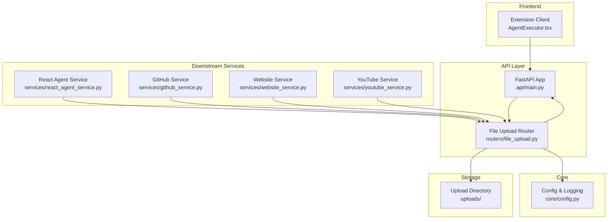
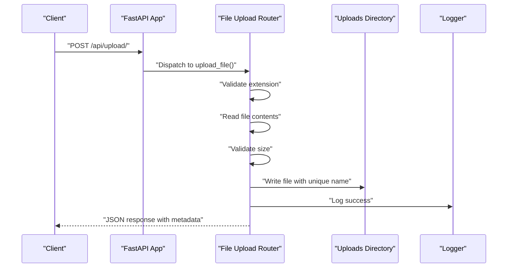
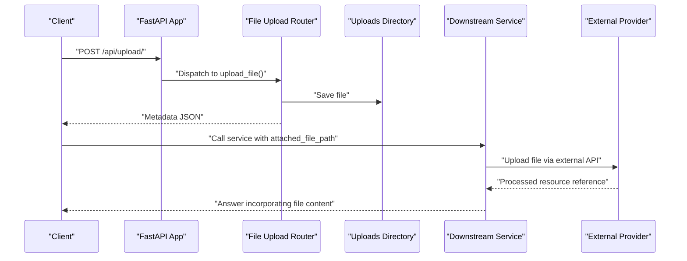
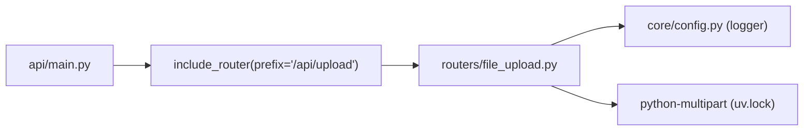

# File Upload API

<cite>
**Referenced Files in This Document**
- [routers/file_upload.py](file://routers/file_upload.py)
- [api/main.py](file://api/main.py)
- [routers/__init__.py](file://routers/__init__.py)
- [core/config.py](file://core/config.py)
- [pyproject.toml](file://pyproject.toml)
- [uv.lock](file://uv.lock)
- [extension/entrypoints/sidepanel/AgentExecutor.tsx](file://extension/entrypoints/sidepanel/AgentExecutor.tsx)
- [models/requests/crawller.py](file://models/requests/crawller.py)
- [services/react_agent_service.py](file://services/react_agent_service.py)
- [services/github_service.py](file://services/github_service.py)
- [services/website_service.py](file://services/website_service.py)
- [services/youtube_service.py](file://services/youtube_service.py)
</cite>

## Table of Contents
1. [Introduction](#introduction)
2. [Project Structure](#project-structure)
3. [Core Components](#core-components)
4. [Architecture Overview](#architecture-overview)
5. [Detailed Component Analysis](#detailed-component-analysis)
6. [Dependency Analysis](#dependency-analysis)
7. [Performance Considerations](#performance-considerations)
8. [Troubleshooting Guide](#troubleshooting-guide)
9. [Conclusion](#conclusion)
10. [Appendices](#appendices)

## Introduction
This document provides comprehensive API documentation for the file upload and processing endpoints. It covers:
- Endpoint definition and usage
- Multipart form handling
- File validation rules
- Storage behavior
- Integration patterns with downstream services
- Client implementation examples
- Security and performance considerations

The file upload capability is implemented as a dedicated FastAPI router and integrated into the main application under the "/api/upload" prefix. Uploaded files are validated by extension and size, persisted to disk, and returned with metadata for subsequent processing.

## Project Structure
The file upload feature spans several modules:
- Router module defines the upload endpoint and validation logic
- Application wiring registers the router under a specific prefix
- Frontend extension demonstrates client-side usage with multipart/form-data
- Downstream services show how uploaded file paths can be consumed for advanced processing

**Diagram sources**
- [api/main.py](file://api/main.py#L40-L42)
- [routers/file_upload.py](file://routers/file_upload.py#L11-L12)
- [core/config.py](file://core/config.py#L16-L25)
- [extension/entrypoints/sidepanel/AgentExecutor.tsx](file://extension/entrypoints/sidepanel/AgentExecutor.tsx#L666-L687)
- [services/react_agent_service.py](file://services/react_agent_service.py#L27-L65)
- [services/github_service.py](file://services/github_service.py#L39-L79)
- [services/website_service.py](file://services/website_service.py#L52-L79)
- [services/youtube_service.py](file://services/youtube_service.py#L20-L52)

**Section sources**
- [api/main.py](file://api/main.py#L40-L42)
- [routers/file_upload.py](file://routers/file_upload.py#L11-L12)
- [core/config.py](file://core/config.py#L16-L25)

## Core Components
- File Upload Router: Implements a single POST endpoint that validates file extensions and sizes, saves the file with a unique name, and returns metadata.
- Application Registration: The router is included under the "/api/upload" prefix.
- Validation Rules:
  - Allowed file extensions include images, documents, and code files.
  - Maximum file size is enforced.
- Storage Behavior:
  - Files are written to a local directory named "uploads".
  - A unique filename is generated to prevent collisions.
- Logging:
  - Successful uploads and errors are logged.

Key implementation references:
- Router and validation: [routers/file_upload.py](file://routers/file_upload.py#L26-L66)
- Application routing: [api/main.py](file://api/main.py#L40-L42)
- Router export: [routers/__init__.py](file://routers/__init__.py#L16)

**Section sources**
- [routers/file_upload.py](file://routers/file_upload.py#L26-L66)
- [api/main.py](file://api/main.py#L40-L42)
- [routers/__init__.py](file://routers/__init__.py#L16)

## Architecture Overview
The file upload workflow integrates client-side multipart/form-data submission with server-side validation and persistence, followed by optional downstream processing.

**Diagram sources**
- [api/main.py](file://api/main.py#L40-L42)
- [routers/file_upload.py](file://routers/file_upload.py#L26-L66)

## Detailed Component Analysis

### Endpoint Definition
- Method: POST
- URL Pattern: /api/upload/
- Request Type: multipart/form-data
- Form Field: file (required)
- Response Schema (success):
  - ok: boolean
  - filename: string
  - saved_as: string (unique filename)
  - path: string (absolute path to saved file)
  - size: integer (bytes)
  - content_type: string (original content-type or default)
- Response Schema (error):
  - detail: string (error message)
  - Additional HTTP status indicates failure (e.g., 400 or 500)

Validation Rules:
- Allowed Extensions: png, jpg, jpeg, gif, webp, svg, pdf, txt, md, csv, json, xml, py, js, ts, html, css, java, c, cpp, go, rs
- Max Size: 10 MB

Behavior:
- On success, returns metadata including the unique filename and absolute path.
- On invalid extension or oversized file, returns 400 with a descriptive message.
- On unexpected errors, returns 500 with a generic message.

**Section sources**
- [routers/file_upload.py](file://routers/file_upload.py#L26-L66)

### Client Implementation Examples
- Frontend Example (React/TSX): Demonstrates constructing FormData and sending a POST request to /api/upload/.
  - Appends a single file field named "file".
  - Handles non-OK responses by reading the body and raising an error.
  - On success, reads JSON and stores filename, path, and size.
- Integration Notes:
  - Ensure the base URL is configured (environment variable).
  - The frontend expects a JSON response containing the metadata fields described above.

**Section sources**
- [extension/entrypoints/sidepanel/AgentExecutor.tsx](file://extension/entrypoints/sidepanel/AgentExecutor.tsx#L666-L687)

### Downstream Processing Workflows
Uploaded files can be referenced by downstream services for advanced processing. These services accept an attached file path and upload it to an external provider for analysis.

**Diagram sources**
- [routers/file_upload.py](file://routers/file_upload.py#L26-L66)
- [services/react_agent_service.py](file://services/react_agent_service.py#L27-L65)
- [services/github_service.py](file://services/github_service.py#L39-L79)
- [services/website_service.py](file://services/website_service.py#L52-L79)
- [services/youtube_service.py](file://services/youtube_service.py#L20-L52)

#### React Agent Service
- Accepts an attached file path alongside other inputs.
- If present, uploads the file to an external provider and includes it in the generation context along with optional HTML context and the question.

**Section sources**
- [services/react_agent_service.py](file://services/react_agent_service.py#L27-L65)

#### GitHub Service
- Accepts an attached file path and, when provided, uploads it to an external provider and incorporates repository content and chat history into the generation context.

**Section sources**
- [services/github_service.py](file://services/github_service.py#L39-L79)

#### Website Service
- Accepts an attached file path and, when provided, uploads it to an external provider and incorporates server/client content and chat history into the generation context.

**Section sources**
- [services/website_service.py](file://services/website_service.py#L52-L79)

#### YouTube Service
- Accepts an attached file path and, when provided, uploads it to an external provider and incorporates transcript and chat history into the generation context.

**Section sources**
- [services/youtube_service.py](file://services/youtube_service.py#L20-L52)

### Model Integration
- The crawler request model includes an optional field for an attached file path, enabling clients to pass the saved file path received from the upload endpoint to downstream processing.

**Section sources**
- [models/requests/crawller.py](file://models/requests/crawller.py#L29-L32)

## Dependency Analysis
- Router Registration:
  - The router is exported and included in the main application under the "/api/upload" prefix.
- External Dependencies:
  - python-multipart is used for multipart parsing.
  - FastAPI provides UploadFile/File handling.
- Logging:
  - Centralized logger is used for upload events and errors.

**Diagram sources**
- [api/main.py](file://api/main.py#L40-L42)
- [routers/file_upload.py](file://routers/file_upload.py#L5)
- [core/config.py](file://core/config.py#L22-L25)
- [uv.lock](file://uv.lock#L1960-L1967)

**Section sources**
- [api/main.py](file://api/main.py#L40-L42)
- [routers/__init__.py](file://routers/__init__.py#L16)
- [uv.lock](file://uv.lock#L1960-L1967)

## Performance Considerations
- File Size Limit: 10 MB enforced at runtime; larger files will be rejected.
- Disk I/O: Writes occur synchronously; consider asynchronous storage or streaming for very large files.
- Concurrency: The endpoint does not implement concurrency controls; ensure appropriate deployment scaling.
- Memory: Entire file contents are read into memory during validation; this is acceptable for the size limit but should be considered for future scaling.

[No sources needed since this section provides general guidance]

## Troubleshooting Guide
Common issues and resolutions:
- 400 Bad Request: Occurs when the file extension is not allowed or exceeds the size limit. Verify the file type and size against the allowed set and the 10 MB cap.
- 500 Internal Server Error: Indicates an unexpected error during processing. Check server logs for details.
- Client-Side Upload Failures: Ensure the FormData includes a field named "file" and that the base URL is correctly configured.

Operational checks:
- Confirm the upload directory exists and is writable.
- Verify router registration under "/api/upload".

**Section sources**
- [routers/file_upload.py](file://routers/file_upload.py#L30-L44)
- [routers/file_upload.py](file://routers/file_upload.py#L64-L66)
- [api/main.py](file://api/main.py#L40-L42)

## Conclusion
The file upload API provides a straightforward, validated mechanism for accepting multipart/form-data, persisting files securely under a controlled directory, and returning metadata for downstream consumption. Combined with downstream services that accept an attached file path, it enables robust file-based automation scenarios across browsing, repository, website, and YouTube contexts.

[No sources needed since this section summarizes without analyzing specific files]

## Appendices

### Endpoint Reference
- Method: POST
- URL: /api/upload/
- Request Body: multipart/form-data
  - file: binary (required)
- Success Response: 200 OK with JSON object containing:
  - ok: boolean
  - filename: string
  - saved_as: string
  - path: string
  - size: integer
  - content_type: string
- Error Responses:
  - 400 Bad Request: Invalid extension or oversized file
  - 500 Internal Server Error: Unexpected error

**Section sources**
- [routers/file_upload.py](file://routers/file_upload.py#L26-L66)

### Supported Formats and Limits
- Allowed Extensions: png, jpg, jpeg, gif, webp, svg, pdf, txt, md, csv, json, xml, py, js, ts, html, css, java, c, cpp, go, rs
- Maximum File Size: 10 MB

**Section sources**
- [routers/file_upload.py](file://routers/file_upload.py#L14-L23)

### Security Considerations
- Input Validation: Only whitelisted extensions are accepted.
- Size Limits: Prevents excessive resource consumption.
- Unique Filenames: Reduces collision risks and improves traceability.
- Logging: Errors and successful uploads are logged for monitoring.

**Section sources**
- [routers/file_upload.py](file://routers/file_upload.py#L30-L49)
- [routers/file_upload.py](file://routers/file_upload.py#L51-L51)
- [routers/file_upload.py](file://routers/file_upload.py#L64-L66)