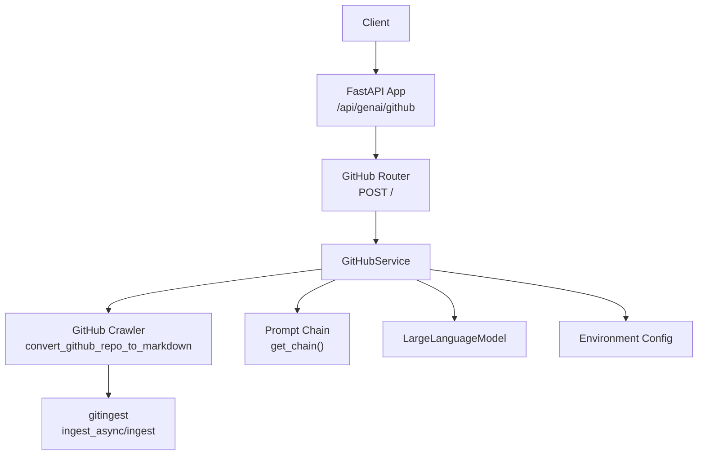
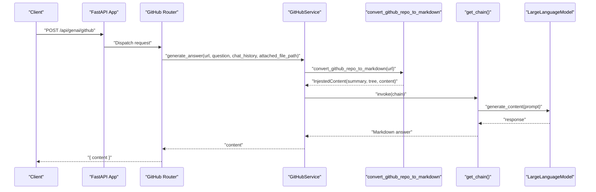
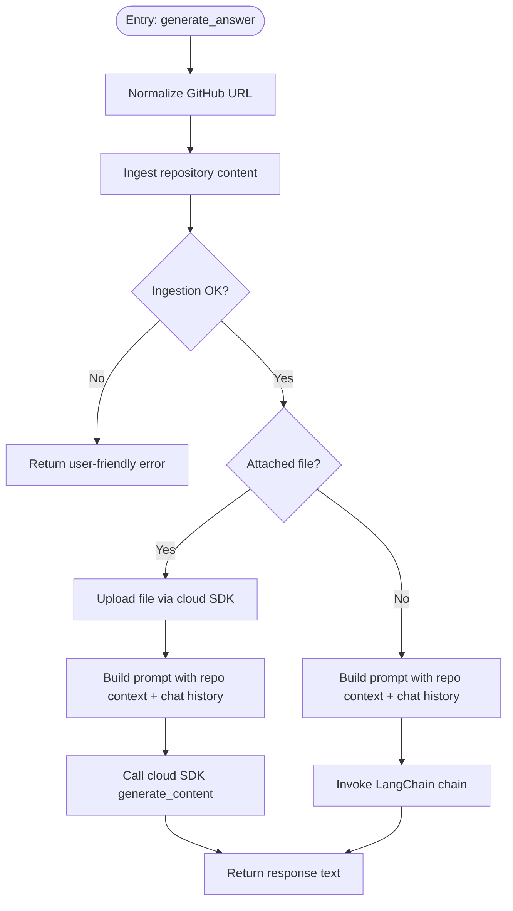
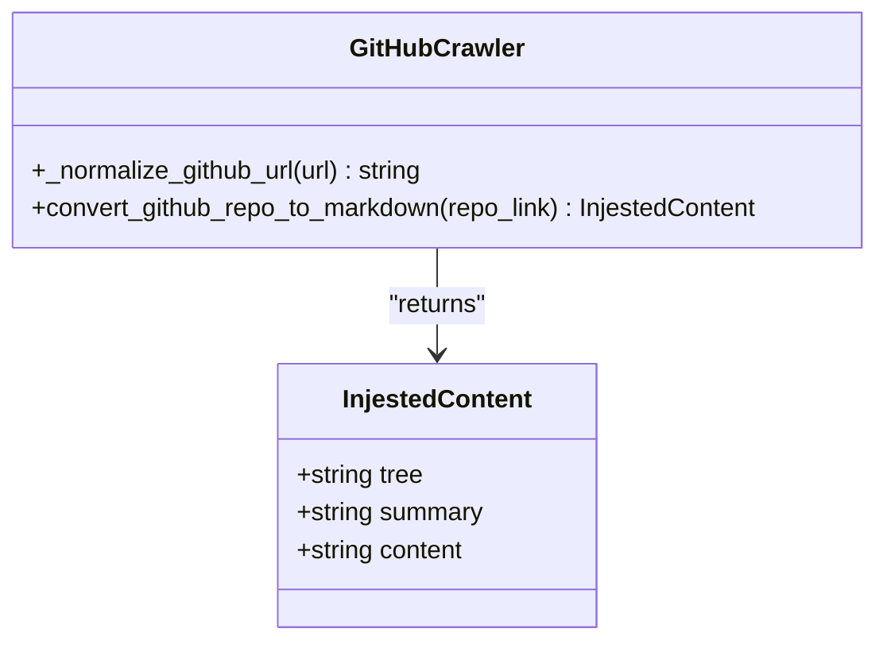
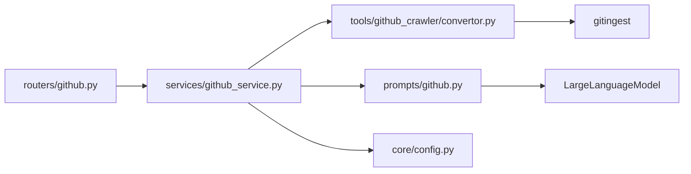

# GitHub Integration API

<cite>
**Referenced Files in This Document**
- [api/main.py](file://api/main.py)
- [routers/github.py](file://routers/github.py)
- [services/github_service.py](file://services/github_service.py)
- [models/requests/github.py](file://models/requests/github.py)
- [models/response/gihub.py](file://models/response/gihub.py)
- [prompts/github.py](file://prompts/github.py)
- [tools/github_crawler/convertor.py](file://tools/github_crawler/convertor.py)
- [core/config.py](file://core/config.py)
</cite>

## Table of Contents
1. [Introduction](#introduction)
2. [Project Structure](#project-structure)
3. [Core Components](#core-components)
4. [Architecture Overview](#architecture-overview)
5. [Detailed Component Analysis](#detailed-component-analysis)
6. [Dependency Analysis](#dependency-analysis)
7. [Performance Considerations](#performance-considerations)
8. [Troubleshooting Guide](#troubleshooting-guide)
9. [Conclusion](#conclusion)
10. [Appendices](#appendices)

## Introduction
This document describes the GitHub integration API that enables repository analysis and contextual Q&A powered by a large language model. It supports:
- Repository ingestion via a normalized GitHub URL
- Context-aware question answering using repository summary, file tree, and content
- Optional file attachment processing via a cloud generative AI SDK
- Chat history integration for conversational context
- Robust error handling and user-friendly messages for common failure modes

The API exposes a single endpoint that accepts a GitHub repository URL and a question, returning a Markdown-formatted answer derived from the repository context.

## Project Structure
The GitHub integration spans several modules:
- API router: defines the endpoint and request/response models
- Service layer: orchestrates ingestion, optional file attachment processing, and LLM invocation
- Prompt pipeline: constructs a structured prompt with repository context and guidelines
- Tooling: converts a GitHub repository into a unified markdown-like context
- Configuration: loads environment variables and logging

**Diagram sources**
- [api/main.py](file://api/main.py#L29-L30)
- [routers/github.py](file://routers/github.py#L16-L44)
- [services/github_service.py](file://services/github_service.py#L11-L109)
- [prompts/github.py](file://prompts/github.py#L75-L82)
- [tools/github_crawler/convertor.py](file://tools/github_crawler/convertor.py#L62-L86)
- [core/config.py](file://core/config.py#L13-L14)

**Section sources**
- [api/main.py](file://api/main.py#L12-L41)
- [routers/github.py](file://routers/github.py#L1-L49)
- [services/github_service.py](file://services/github_service.py#L1-L109)
- [prompts/github.py](file://prompts/github.py#L1-L110)
- [tools/github_crawler/convertor.py](file://tools/github_crawler/convertor.py#L1-L99)
- [core/config.py](file://core/config.py#L1-L26)

## Core Components
- Endpoint: POST /api/genai/github
- Request body: GitHubRequest (URL, question, optional chat history, optional attached file path)
- Response body: GitHubResponse (content)
- Authentication: Not enforced by the endpoint; clients should secure access as appropriate for their deployment
- Rate limiting: Not implemented in the endpoint; consider upstream rate limiting and retries

**Section sources**
- [routers/github.py](file://routers/github.py#L16-L44)
- [models/requests/github.py](file://models/requests/github.py#L4-L8)
- [models/response/gihub.py](file://models/response/gihub.py#L4-L5)
- [api/main.py](file://api/main.py#L29-L30)

## Architecture Overview
The request lifecycle:
1. Client sends a POST request with a GitHub URL and question
2. Router validates presence of required fields and delegates to the service
3. Service normalizes the URL, ingests repository content, optionally attaches a file, and invokes the prompt chain
4. The prompt chain builds a structured prompt and queries the LLM
5. The response is returned as a Markdown-formatted string

**Diagram sources**
- [routers/github.py](file://routers/github.py#L16-L44)
- [services/github_service.py](file://services/github_service.py#L12-L109)
- [tools/github_crawler/convertor.py](file://tools/github_crawler/convertor.py#L62-L86)
- [prompts/github.py](file://prompts/github.py#L75-L82)

## Detailed Component Analysis

### Endpoint Definition
- Method: POST
- Path: /api/genai/github
- Request JSON schema:
  - url: string (HTTP URL; must resolve to a GitHub repository)
  - question: string (required)
  - chat_history: array of objects (optional)
  - attached_file_path: string (optional; absolute path to a local file)
- Response JSON schema:
  - content: string (Markdown-formatted answer)

Behavior highlights:
- Validates presence of question and url
- Returns structured error messages for invalid inputs or ingestion failures
- Supports optional file attachment processing via a cloud generative AI SDK

**Section sources**
- [routers/github.py](file://routers/github.py#L16-L44)
- [models/requests/github.py](file://models/requests/github.py#L4-L8)
- [models/response/gihub.py](file://models/response/gihub.py#L4-L5)

### Service Layer
Responsibilities:
- Normalize GitHub URL to repository root
- Ingest repository content (summary, tree, content)
- Optionally attach a file and query a cloud generative AI SDK
- Build and execute the prompt chain with repository context
- Return user-friendly error messages for common failure modes

Key logic:
- URL normalization strips non-repository path segments (e.g., commits, issues, pulls, tree, blob)
- Repository content is truncated to a maximum character limit to fit within LLM context windows
- Error handling differentiates between invalid URLs, inaccessible repositories, and token limit exceeded scenarios

**Diagram sources**
- [services/github_service.py](file://services/github_service.py#L12-L109)
- [tools/github_crawler/convertor.py](file://tools/github_crawler/convertor.py#L35-L86)
- [prompts/github.py](file://prompts/github.py#L75-L82)

**Section sources**
- [services/github_service.py](file://services/github_service.py#L11-L109)

### Prompt Pipeline
The prompt pipeline composes:
- A system message instructing the model to answer solely from repository context
- Repository summary, file tree, and relevant content
- Optional chat history
- A user question
- Formatting guidelines for Markdown responses

The pipeline uses a LangChain chain with a prompt template and an LLM client, returning a string response.

**Section sources**
- [prompts/github.py](file://prompts/github.py#L10-L72)
- [prompts/github.py](file://prompts/github.py#L75-L82)

### GitHub Crawler Tool
The crawler:
- Normalizes GitHub URLs to repository root
- Uses asynchronous ingestion when available, otherwise falls back to synchronous ingestion
- Truncates repository content to a maximum length to fit within LLM context windows
- Returns a structured content object containing summary, tree, and content

**Diagram sources**
- [tools/github_crawler/convertor.py](file://tools/github_crawler/convertor.py#L29-L33)
- [tools/github_crawler/convertor.py](file://tools/github_crawler/convertor.py#L62-L86)

**Section sources**
- [tools/github_crawler/convertor.py](file://tools/github_crawler/convertor.py#L1-L99)

### Configuration and Environment
- Google API key is loaded from environment variables for optional file attachment processing
- Logging level is configurable via environment variables

**Section sources**
- [core/config.py](file://core/config.py#L13-L14)
- [core/config.py](file://core/config.py#L16-L25)

## Dependency Analysis
The GitHub integration depends on:
- FastAPI router for endpoint definition
- Pydantic models for request/response validation
- LangChain for prompt composition and LLM invocation
- gitingest for repository ingestion
- Optional cloud generative AI SDK for file attachment processing

**Diagram sources**
- [routers/github.py](file://routers/github.py#L1-L6)
- [services/github_service.py](file://services/github_service.py#L1-L8)
- [prompts/github.py](file://prompts/github.py#L1-L4)
- [tools/github_crawler/convertor.py](file://tools/github_crawler/convertor.py#L1-L12)

**Section sources**
- [routers/github.py](file://routers/github.py#L1-L6)
- [services/github_service.py](file://services/github_service.py#L1-L8)
- [prompts/github.py](file://prompts/github.py#L1-L4)
- [tools/github_crawler/convertor.py](file://tools/github_crawler/convertor.py#L1-L12)

## Performance Considerations
- Repository content truncation: The crawler enforces a maximum content length to prevent exceeding LLM context windows. This preserves the tree and summary for navigation and structure while limiting large file content.
- Asynchronous ingestion: When available, asynchronous ingestion reduces latency in the request path.
- Optional file attachments: Uploading and processing attached files adds overhead; use judiciously and ensure the file size remains within SDK limits.

[No sources needed since this section provides general guidance]

## Troubleshooting Guide
Common issues and resolutions:
- Invalid or non-repository URL:
  - Symptom: Error indicating the URL does not point to a valid repository root
  - Resolution: Navigate to the main repository page (e.g., github.com/owner/repo)
- Repository access errors:
  - Symptom: Could not access the repository; ensure the URL is correct and the repository is public
  - Resolution: Verify repository visibility and URL correctness
- Repository too large:
  - Symptom: Token limit exceeded even after truncation
  - Resolution: Ask about a specific file or directory instead of the entire repository
- Attached file processing errors:
  - Symptom: Failure to process the attached file
  - Resolution: Confirm the file path exists and the environment has a valid Google API key configured

**Section sources**
- [services/github_service.py](file://services/github_service.py#L27-L37)
- [services/github_service.py](file://services/github_service.py#L103-L107)
- [core/config.py](file://core/config.py#L13-L14)

## Conclusion
The GitHub integration API provides a streamlined pathway to analyze repositories and answer contextual questions. By normalizing URLs, truncating content, and leveraging a structured prompt pipeline, it delivers reliable, Markdown-formatted answers. Optional file attachment support extends capabilities for multimodal workflows. For production deployments, consider adding authentication, rate limiting, and observability around ingestion and LLM calls.

[No sources needed since this section summarizes without analyzing specific files]

## Appendices

### API Reference

- Base URL: /api/genai/github
- Method: POST
- Path: /
- Headers:
  - Content-Type: application/json
- Request body schema:
  - url: string (HTTP URL; must resolve to a GitHub repository)
  - question: string (required)
  - chat_history: array of objects (optional)
  - attached_file_path: string (optional; absolute path to a local file)
- Response body schema:
  - content: string (Markdown-formatted answer)

Example request payload:
- url: "https://github.com/example/repo"
- question: "Explain the main entry point"
- chat_history: [] or [{"role": "user", "content": "..."}, ...]
- attached_file_path: null or "/absolute/path/to/file"

Example response payload:
- content: "Markdown-formatted answer..."

Authentication:
- Not enforced by the endpoint; secure access according to your deployment needs

Rate limiting:
- Not implemented in the endpoint; implement upstream controls as needed

Webhook integration:
- Not implemented in this API; integrate external webhooks at the application boundary if required

Repository context extraction:
- The service normalizes the URL to the repository root and truncates content to fit within LLM context windows

**Section sources**
- [routers/github.py](file://routers/github.py#L16-L44)
- [models/requests/github.py](file://models/requests/github.py#L4-L8)
- [models/response/gihub.py](file://models/response/gihub.py#L4-L5)
- [tools/github_crawler/convertor.py](file://tools/github_crawler/convertor.py#L35-L86)