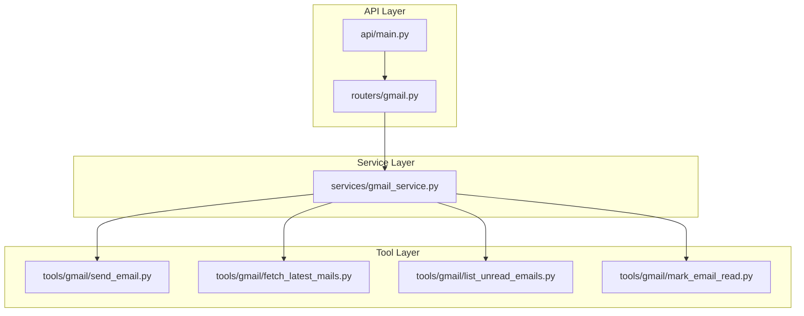
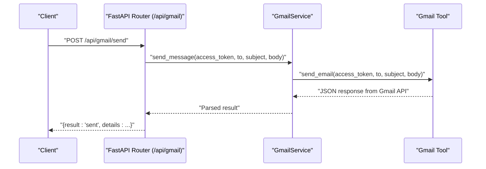
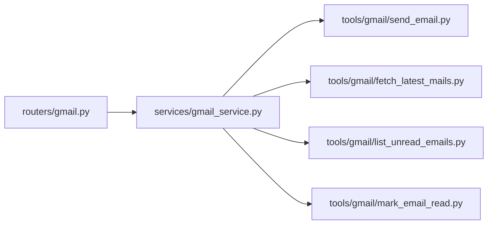

# Gmail Integration API

<cite>
**Referenced Files in This Document**
- [main.py](file://main.py)
- [api/main.py](file://api/main.py)
- [api/run.py](file://api/run.py)
- [core/config.py](file://core/config.py)
- [routers/gmail.py](file://routers/gmail.py)
- [services/gmail_service.py](file://services/gmail_service.py)
- [tools/gmail/send_email.py](file://tools/gmail/send_email.py)
- [tools/gmail/fetch_latest_mails.py](file://tools/gmail/fetch_latest_mails.py)
- [tools/gmail/list_unread_emails.py](file://tools/gmail/list_unread_emails.py)
- [tools/gmail/mark_email_read.py](file://tools/gmail/mark_email_read.py)
- [agents/react_tools.py](file://agents/react_tools.py)
- [README.md](file://README.md)
</cite>

## Table of Contents
1. [Introduction](#introduction)
2. [Project Structure](#project-structure)
3. [Core Components](#core-components)
4. [Architecture Overview](#architecture-overview)
5. [Detailed Component Analysis](#detailed-component-analysis)
6. [Dependency Analysis](#dependency-analysis)
7. [Performance Considerations](#performance-considerations)
8. [Troubleshooting Guide](#troubleshooting-guide)
9. [Conclusion](#conclusion)
10. [Appendices](#appendices)

## Introduction
This document provides API documentation for the Gmail integration endpoints exposed by the application. It covers email management operations including sending emails, fetching messages, marking messages as read/unread, and managing email threads. For each endpoint, you will find HTTP methods, URL patterns, request/response schemas, and authentication requirements. Additionally, it includes practical examples of Gmail API usage, email parsing, automated email workflows, Gmail-specific authentication, quota limits, API restrictions, and client implementation patterns for email automation scenarios.

## Project Structure
The Gmail integration is implemented as part of a FastAPI application with a layered architecture:
- API Layer: Defines routes and request/response models.
- Service Layer: Orchestrates tool invocations and handles errors.
- Tool Layer: Implements direct Gmail API calls using OAuth access tokens.
- Agent Layer: Provides agent-facing tools that wrap the same functionality.

**Diagram sources**
- [api/main.py](file://api/main.py#L12-L42)
- [routers/gmail.py](file://routers/gmail.py#L1-L149)
- [services/gmail_service.py](file://services/gmail_service.py#L10-L56)
- [tools/gmail/send_email.py](file://tools/gmail/send_email.py#L20-L31)
- [tools/gmail/fetch_latest_mails.py](file://tools/gmail/fetch_latest_mails.py#L4-L42)
- [tools/gmail/list_unread_emails.py](file://tools/gmail/list_unread_emails.py#L10-L48)
- [tools/gmail/mark_email_read.py](file://tools/gmail/mark_email_read.py#L10-L28)

**Section sources**
- [api/main.py](file://api/main.py#L12-L42)
- [routers/gmail.py](file://routers/gmail.py#L1-L149)
- [services/gmail_service.py](file://services/gmail_service.py#L10-L56)
- [tools/gmail/send_email.py](file://tools/gmail/send_email.py#L20-L31)
- [tools/gmail/fetch_latest_mails.py](file://tools/gmail/fetch_latest_mails.py#L4-L42)
- [tools/gmail/list_unread_emails.py](file://tools/gmail/list_unread_emails.py#L10-L48)
- [tools/gmail/mark_email_read.py](file://tools/gmail/mark_email_read.py#L10-L28)

## Core Components
- API Router: Exposes four endpoints under /api/gmail for listing unread messages, fetching latest messages, marking a message as read, and sending emails.
- Service Layer: Wraps tool functions and centralizes error logging and exception propagation.
- Tools: Implement direct Gmail API calls using Bearer token authentication and appropriate Gmail API endpoints.

Key operational characteristics:
- Authentication: All endpoints require an OAuth access token with appropriate Gmail scopes.
- Request Validation: Routes validate presence and type of required fields and normalize optional parameters.
- Response Envelope: Responses include a result field and a details object or list of messages.

**Section sources**
- [routers/gmail.py](file://routers/gmail.py#L38-L149)
- [services/gmail_service.py](file://services/gmail_service.py#L10-L56)

## Architecture Overview
The API follows a clear separation of concerns:
- FastAPI router validates requests and delegates to a service.
- Service invokes tools that call the Gmail API directly.
- Tools construct proper requests with Authorization headers and handle HTTP responses.

**Diagram sources**
- [api/main.py](file://api/main.py#L35-L35)
- [routers/gmail.py](file://routers/gmail.py#L123-L139)
- [services/gmail_service.py](file://services/gmail_service.py#L44-L51)
- [tools/gmail/send_email.py](file://tools/gmail/send_email.py#L20-L31)

## Detailed Component Analysis

### Endpoint Catalog

#### List Unread Messages
- Method: POST
- Path: /api/gmail/unread
- Authentication: access_token (required)
- Request Schema:
  - access_token: string
  - max_results: integer (optional, default 10)
- Response Schema:
  - messages: array of objects containing id, subject, from, date, snippet
- Behavior:
  - Calls the service method to list unread messages.
  - Normalizes max_results to a positive value if missing or invalid.
- Example Usage:
  - curl -X POST http://localhost:5454/api/gmail/unread -H "Content-Type: application/json" -d '{"access_token":"<YOUR_ACCESS_TOKEN>","max_results":10}'

**Section sources**
- [routers/gmail.py](file://routers/gmail.py#L38-L66)
- [services/gmail_service.py](file://services/gmail_service.py#L11-L17)
- [tools/gmail/list_unread_emails.py](file://tools/gmail/list_unread_emails.py#L10-L48)

#### Fetch Latest Messages
- Method: POST
- Path: /api/gmail/latest
- Authentication: access_token (required)
- Request Schema:
  - access_token: string
  - max_results: integer (optional, default 5)
- Response Schema:
  - messages: array of objects containing id, subject, from, date, snippet
- Behavior:
  - Retrieves the latest messages from the inbox.
  - Normalizes max_results to a positive value if missing or invalid.
- Example Usage:
  - curl -X POST http://localhost:5454/api/gmail/latest -H "Content-Type: application/json" -d '{"access_token":"<YOUR_ACCESS_TOKEN>","max_results":5}'

**Section sources**
- [routers/gmail.py](file://routers/gmail.py#L68-L94)
- [services/gmail_service.py](file://services/gmail_service.py#L22-L27)
- [tools/gmail/fetch_latest_mails.py](file://tools/gmail/fetch_latest_mails.py#L4-L42)

#### Mark Message Read
- Method: POST
- Path: /api/gmail/mark_read
- Authentication: access_token (required), message_id (required)
- Request Schema:
  - access_token: string
  - message_id: string
- Response Schema:
  - result: string ("ok")
  - details: object returned by Gmail API modify endpoint
- Behavior:
  - Removes the UNREAD label from the specified message.
- Example Usage:
  - curl -X POST http://localhost:5454/api/gmail/mark_read -H "Content-Type: application/json" -d '{"access_token":"<YOUR_ACCESS_TOKEN>","message_id":"<MESSAGE_ID>"}'

**Section sources**
- [routers/gmail.py](file://routers/gmail.py#L97-L121)
- [services/gmail_service.py](file://services/gmail_service.py#L33-L38)
- [tools/gmail/mark_email_read.py](file://tools/gmail/mark_email_read.py#L10-L28)

#### Send Email
- Method: POST
- Path: /api/gmail/send
- Authentication: access_token (required), to (required), subject (required), body (required)
- Request Schema:
  - access_token: string
  - to: string (email address)
  - subject: string
  - body: string
- Response Schema:
  - result: string ("sent")
  - details: object returned by Gmail API send endpoint
- Behavior:
  - Constructs a raw MIME message and sends it via the Gmail API.
- Example Usage:
  - curl -X POST http://localhost:5454/api/gmail/send -H "Content-Type: application/json" -d '{"access_token":"<YOUR_ACCESS_TOKEN>","to":"recipient@example.com","subject":"Hello","body":"Hi there"}'

**Section sources**
- [routers/gmail.py](file://routers/gmail.py#L123-L149)
- [services/gmail_service.py](file://services/gmail_service.py#L44-L51)
- [tools/gmail/send_email.py](file://tools/gmail/send_email.py#L20-L31)

### Authentication and Scopes
- Access Token Requirement: All endpoints require a valid OAuth access token passed as access_token in the request body.
- Required Scopes (as indicated by the extension's authentication flow):
  - openid, email, profile
  - https://www.googleapis.com/auth/gmail.modify
  - https://www.googleapis.com/auth/gmail.readonly
  - https://www.googleapis.com/auth/gmail.send
  - https://www.googleapis.com/auth/gmail.labels
- Token Handling:
  - Tokens can be provided per-request or configured globally for agent usage.
  - The agent tools layer supports a default token fallback mechanism.

**Section sources**
- [routers/gmail.py](file://routers/gmail.py#L38-L149)
- [agents/react_tools.py](file://agents/react_tools.py#L100-L157)
- [README.md](file://README.md#L168-L169)

### Request and Response Models
- Base Request: TokenRequest with access_token.
- UnreadRequest: TokenRequest plus max_results.
- LatestRequest: TokenRequest plus max_results.
- MarkReadRequest: TokenRequest plus message_id.
- SendEmailRequest: TokenRequest plus to, subject, body.
- Response Envelope: Each endpoint returns a dictionary with a result field and a details field.

**Section sources**
- [routers/gmail.py](file://routers/gmail.py#L12-L32)

### Email Parsing and Thread Management
- Parsing:
  - Latest and unread endpoints extract subject, from, date, and snippet from message headers.
  - The tools layer parses message headers and builds a simplified envelope for consumption.
- Threads:
  - The current endpoints operate on individual messages. Thread-level operations (e.g., retrieving thread members) are not exposed by the current API.

**Section sources**
- [tools/gmail/fetch_latest_mails.py](file://tools/gmail/fetch_latest_mails.py#L27-L40)
- [tools/gmail/list_unread_emails.py](file://tools/gmail/list_unread_emails.py#L37-L47)

### Automated Email Workflows
Common automation patterns supported by the API:
- Monitoring: Poll unread messages periodically and trigger downstream actions.
- Onboarding: Send welcome emails after user registration.
- Notifications: Dispatch alerts based on external triggers.
- Cleanup: Mark processed messages as read to reduce noise.

Integration patterns:
- Use the unread endpoint to batch-process messages and then call mark_read to archive them.
- Combine latest with send to respond to incoming emails programmatically.

**Section sources**
- [routers/gmail.py](file://routers/gmail.py#L38-L149)
- [services/gmail_service.py](file://services/gmail_service.py#L10-L56)

## Dependency Analysis
The following diagram shows how the API routes depend on the service layer and tools:

**Diagram sources**
- [routers/gmail.py](file://routers/gmail.py#L1-L149)
- [services/gmail_service.py](file://services/gmail_service.py#L1-L56)
- [tools/gmail/send_email.py](file://tools/gmail/send_email.py#L1-L52)
- [tools/gmail/fetch_latest_mails.py](file://tools/gmail/fetch_latest_mails.py#L1-L61)
- [tools/gmail/list_unread_emails.py](file://tools/gmail/list_unread_emails.py#L1-L75)
- [tools/gmail/mark_email_read.py](file://tools/gmail/mark_email_read.py#L1-L49)

**Section sources**
- [routers/gmail.py](file://routers/gmail.py#L1-L149)
- [services/gmail_service.py](file://services/gmail_service.py#L1-L56)

## Performance Considerations
- Timeout: All tool functions set a short timeout for Gmail API calls to prevent blocking.
- Pagination: max_results parameters limit the number of messages retrieved per request.
- Concurrency: The service layer uses synchronous tool calls; consider asynchronous execution for higher throughput.
- Rate Limits: Respect Gmail API quotas and implement retry/backoff strategies in clients.

[No sources needed since this section provides general guidance]

## Troubleshooting Guide
Common issues and resolutions:
- Missing access_token:
  - Ensure the access_token is present and valid.
  - Verify the token has the required scopes.
- Invalid max_results:
  - The API normalizes invalid values; however, clients should pass sensible values within supported ranges.
- Network Errors:
  - Check network connectivity and timeouts.
  - Retry transient failures with exponential backoff.
- Gmail API Errors:
  - Inspect the details field in responses for error codes and messages.
  - Validate message IDs for mark_read operations.

**Section sources**
- [routers/gmail.py](file://routers/gmail.py#L42-L65)
- [tools/gmail/send_email.py](file://tools/gmail/send_email.py#L28-L31)
- [tools/gmail/list_unread_emails.py](file://tools/gmail/list_unread_emails.py#L18-L19)
- [tools/gmail/fetch_latest_mails.py](file://tools/gmail/fetch_latest_mails.py#L12-L13)
- [tools/gmail/mark_email_read.py](file://tools/gmail/mark_email_read.py#L24-L27)

## Conclusion
The Gmail integration API provides a focused set of endpoints for common email management tasks. By leveraging OAuth access tokens and the Gmail API, clients can automate workflows such as monitoring, responding, and organizing emails. The layered architecture ensures maintainability and testability, while the agent tools layer enables broader automation scenarios within the application ecosystem.

[No sources needed since this section summarizes without analyzing specific files]

## Appendices

### API Endpoints Reference
- POST /api/gmail/unread
  - Request: {access_token, max_results}
  - Response: {messages: [...]}
- POST /api/gmail/latest
  - Request: {access_token, max_results}
  - Response: {messages: [...]}
- POST /api/gmail/mark_read
  - Request: {access_token, message_id}
  - Response: {result: "ok", details: {...}}
- POST /api/gmail/send
  - Request: {access_token, to, subject, body}
  - Response: {result: "sent", details: {...}}

**Section sources**
- [routers/gmail.py](file://routers/gmail.py#L38-L149)

### Client Implementation Patterns
- Basic Client Setup:
  - Obtain an OAuth access token with required Gmail scopes.
  - Send requests with Content-Type: application/json.
- Retry Strategy:
  - Implement exponential backoff for transient failures.
- Idempotency:
  - For mark_read, repeated calls are safe since removing UNREAD is idempotent.
- Error Handling:
  - Parse the details field for actionable error information.

**Section sources**
- [tools/gmail/send_email.py](file://tools/gmail/send_email.py#L20-L31)
- [tools/gmail/mark_email_read.py](file://tools/gmail/mark_email_read.py#L10-L28)

### Application Startup and Configuration
- The application can be started as an API server or MCP server.
- The API server binds to a configurable host and port.
- Environment variables control logging and runtime behavior.

**Section sources**
- [main.py](file://main.py#L11-L54)
- [api/run.py](file://api/run.py#L4-L10)
- [core/config.py](file://core/config.py#L8-L18)