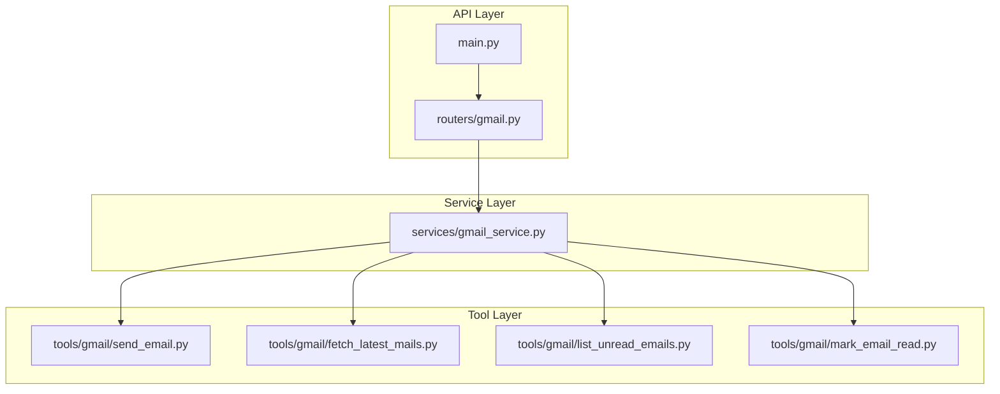
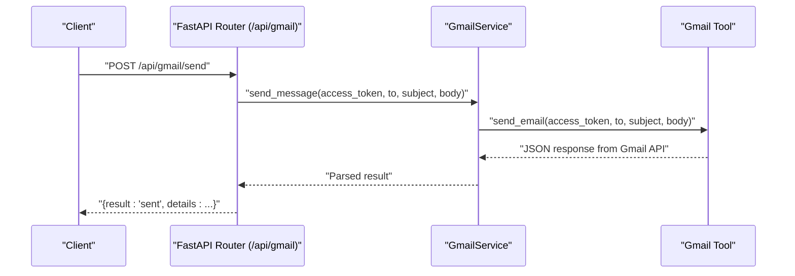
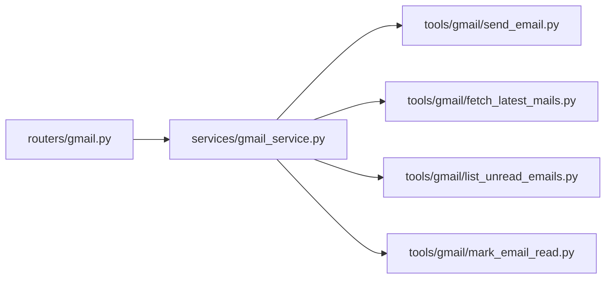

# Gmail integration API

## Introduction
Gmail endpoints for send, fetch, read/unread, and threads. Schemas, OAuth access tokens, quotas, and client patterns.

## Project structure
Gmail sits in the FastAPI app as:
- API Layer: Defines routes and request/response models.
- Service Layer: Orchestrates tool invocations and handles errors.
- Tool Layer: Implements direct Gmail API calls using OAuth access tokens.
- Agent Layer: Provides agent-facing tools that wrap the same functionality.

```mermaid
graph TB
subgraph "API Layer"
R["routers/gmail.py"]
M["main.py"]
end
subgraph "Service Layer"
S["services/gmail_service.py"]
end
subgraph "Tool Layer"
T1["tools/gmail/send_email.py"]
T2["tools/gmail/fetch_latest_mails.py"]
T3["tools/gmail/list_unread_emails.py"]
T4["tools/gmail/mark_email_read.py"]
end
M --> R
R --> S
S --> T1
S --> T2
S --> T3
S --> T4
```

## Core components
- API Router: Exposes four endpoints under /api/gmail for listing unread messages, fetching latest messages, marking a message as read, and sending emails.
- Service Layer: Wraps tool functions and centralizes error logging and exception propagation.
- Tools: Implement direct Gmail API calls using Bearer token authentication and appropriate Gmail API endpoints.

Key operational characteristics:
- Authentication: All endpoints require an OAuth access token with appropriate Gmail scopes.
- Request Validation: Routes validate presence and type of required fields and normalize optional parameters.
- Response Envelope: Responses include a result field and a details object or list of messages.

## Architecture overview
The API keeps layers apart:
- FastAPI router validates requests and delegates to a service.
- Service invokes tools that call the Gmail API directly.
- Tools construct proper requests with Authorization headers and handle HTTP responses.

```mermaid
sequenceDiagram
participant C as "Client"
participant F as "FastAPI Router (/api/gmail)"
participant SVC as "GmailService"
participant T as "Gmail Tool"
C->>F : "POST /api/gmail/send"
F->>SVC : "send_message(access_token, to, subject, body)"
SVC->>T : "send_email(access_token, to, subject, body)"
T-->>SVC : "JSON response from Gmail API"
SVC-->>F : "Parsed result"
F-->>C : "{result : 'sent', details : ...}"
```

## Detailed component analysis

### Endpoint catalog

#### List unread messages
- Method: POST
- Path: /api/gmail/unread
- Authentication: access_token (required)
- Request Schema:
 - access_token: string
 - max_results: integer (optional, default 10)
- Response Schema:
 - messages: array of objects containing id, subject, from, date, snippet
- Behavior:
 - Calls the service method to list unread messages.
 - Normalizes max_results to a positive value if missing or invalid.
- Example Usage:
 - curl -X POST http://localhost:5454/api/gmail/unread -H "Content-Type: application/json" -d '{"access_token":"<YOUR_ACCESS_TOKEN>","max_results":10}'

#### Fetch latest messages
- Method: POST
- Path: /api/gmail/latest
- Authentication: access_token (required)
- Request Schema:
 - access_token: string
 - max_results: integer (optional, default 5)
- Response Schema:
 - messages: array of objects containing id, subject, from, date, snippet
- Behavior:
 - Retrieves the latest messages from the inbox.
 - Normalizes max_results to a positive value if missing or invalid.
- Example Usage:
 - curl -X POST http://localhost:5454/api/gmail/latest -H "Content-Type: application/json" -d '{"access_token":"<YOUR_ACCESS_TOKEN>","max_results":5}'

#### Mark message read
- Method: POST
- Path: /api/gmail/mark_read
- Authentication: access_token (required), message_id (required)
- Request Schema:
 - access_token: string
 - message_id: string
- Response Schema:
 - result: string ("ok")
 - details: object returned by Gmail API modify endpoint
- Behavior:
 - Removes the UNREAD label from the specified message.
- Example Usage:
 - curl -X POST http://localhost:5454/api/gmail/mark_read -H "Content-Type: application/json" -d '{"access_token":"<YOUR_ACCESS_TOKEN>","message_id":"<MESSAGE_ID>"}'

#### Send email
- Method: POST
- Path: /api/gmail/send
- Authentication: access_token (required), to (required), subject (required), body (required)
- Request Schema:
 - access_token: string
 - to: string (email address)
 - subject: string
 - body: string
- Response Schema:
 - result: string ("sent")
 - details: object returned by Gmail API send endpoint
- Behavior:
 - Constructs a raw MIME message and sends it via the Gmail API.
- Example Usage:
 - curl -X POST http://localhost:5454/api/gmail/send -H "Content-Type: application/json" -d '{"access_token":"<YOUR_ACCESS_TOKEN>","to":"recipient@example.com","subject":"Hello","body":"Hi there"}'

### Authentication and scopes
- Access Token Requirement: All endpoints require a valid OAuth access token passed as access_token in the request body.
- Required Scopes (as indicated by the extension's authentication flow):
 - openid, email, profile
 - https://www.googleapis.com/auth/gmail.modify
 - https://www.googleapis.com/auth/gmail.readonly
 - https://www.googleapis.com/auth/gmail.send
 - https://www.googleapis.com/auth/gmail.labels
- Token Handling:
 - Tokens can be provided per-request or configured globally for agent usage.
 - The agent tools layer supports a default token fallback mechanism.

### Request and response models
- Base Request: TokenRequest with access_token.
- UnreadRequest: TokenRequest plus max_results.
- LatestRequest: TokenRequest plus max_results.
- MarkReadRequest: TokenRequest plus message_id.
- SendEmailRequest: TokenRequest plus to, subject, body.
- Response Envelope: Each endpoint returns a dictionary with a result field and a details field.

### Email parsing and thread management
- Parsing:
 - Latest and unread endpoints extract subject, from, date, and snippet from message headers.
 - The tools layer parses message headers and builds a simplified envelope for consumption.
- Threads:
 - The current endpoints operate on individual messages. Thread-level operations (e.g., retrieving thread members) are not exposed by the current API.

### Automated email workflows
Common automation patterns supported by the API:
- Monitoring: Poll unread messages periodically and trigger downstream actions.
- Onboarding: Send welcome emails after user registration.
- Notifications: Dispatch alerts based on external triggers.
- Cleanup: Mark processed messages as read to reduce noise.

Integration patterns:
- Use the unread endpoint to batch-process messages and then call mark_read to archive them.
- Combine latest with send to respond to incoming emails programmatically.

## Dependency analysis
The following diagram shows how the API routes depend on the service layer and tools:

```mermaid
graph LR
R1["routers/gmail.py"] --> S["services/gmail_service.py"]
S --> T1["tools/gmail/send_email.py"]
S --> T2["tools/gmail/fetch_latest_mails.py"]
S --> T3["tools/gmail/list_unread_emails.py"]
S --> T4["tools/gmail/mark_email_read.py"]
```

## Performance considerations
- Timeout: All tool functions set a short timeout for Gmail API calls to prevent blocking.
- Pagination: max_results parameters limit the number of messages retrieved per request.
- Concurrency: The service layer uses synchronous tool calls; consider asynchronous execution for higher throughput.
- Rate Limits: Respect Gmail API quotas and implement retry/backoff strategies in clients.

## Troubleshooting guide
Common issues and resolutions:
- Missing access_token:
 - Ensure the access_token is present and valid.
 - Verify the token has the required scopes.
- Invalid max_results:
 - The API normalizes invalid values; however, clients should pass sensible values within supported ranges.
- Network Errors:
 - Check network connectivity and timeouts.
 - Retry transient failures with exponential backoff.
- Gmail API Errors:
 - Inspect the details field in responses for error codes and messages.
 - Validate message IDs for mark_read operations.

## Conclusion
Pass a live OAuth token, respect Gmail quotas, and keep batching modest. Keeping router, service, and tool as separate layers is intentional.

## Appendices

### API endpoints reference
- POST /api/gmail/unread
 - Request: {access_token, max_results}
 - Response: {messages: [.]}
- POST /api/gmail/latest
 - Request: {access_token, max_results}
 - Response: {messages: [.]}
- POST /api/gmail/mark_read
 - Request: {access_token, message_id}
 - Response: {result: "ok", details: {.}}
- POST /api/gmail/send
 - Request: {access_token, to, subject, body}
 - Response: {result: "sent", details: {.}}

### Client implementation patterns
- Basic Client Setup:
 - Obtain an OAuth access token with required Gmail scopes.
 - Send requests with Content-Type: application/json.
- Retry Strategy:
 - Implement exponential backoff for transient failures.
- Idempotency:
 - For mark_read, repeated calls are safe since removing UNREAD is idempotent.
- Error Handling:
 - Parse the details field for actionable error information.

### Application startup and configuration
- The application can be started as an API server or MCP server.
- The API server binds to a configurable host and port.
- Environment variables control logging and runtime behavior.
