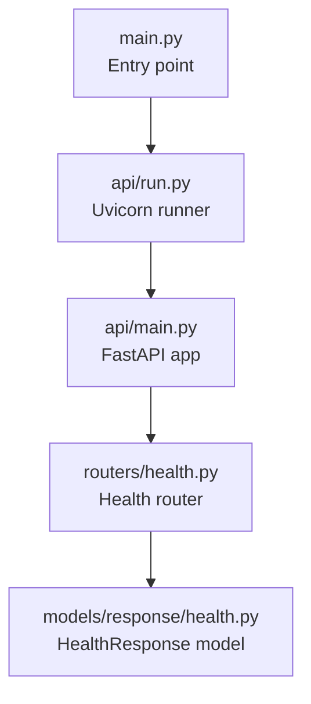
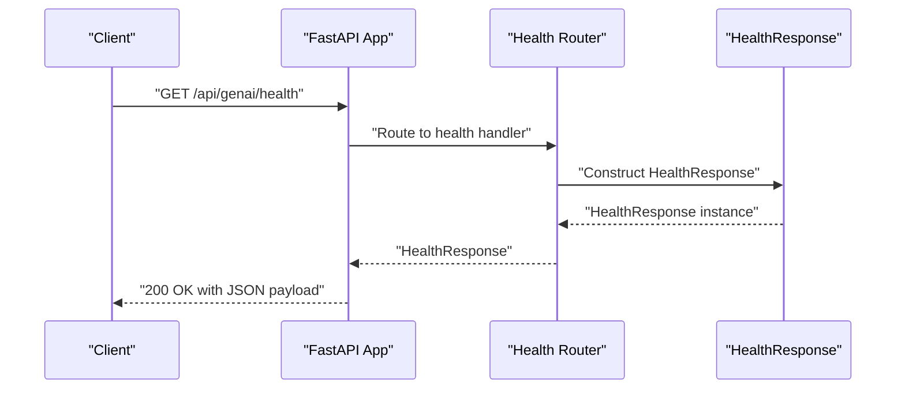
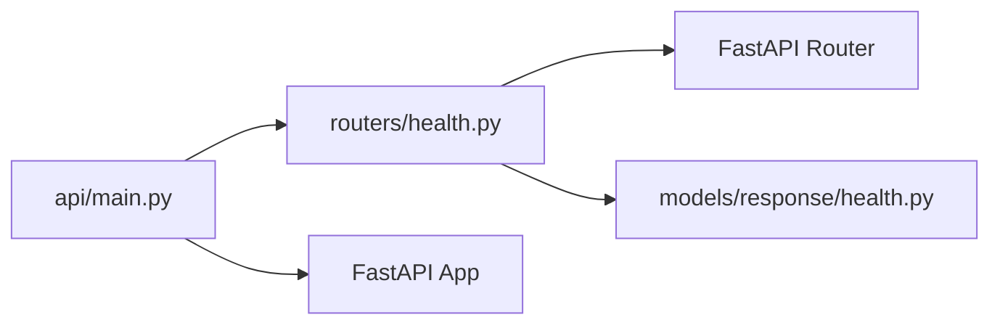

# Health and Monitoring API

<cite>
**Referenced Files in This Document**
- [api/main.py](file://api/main.py)
- [api/run.py](file://api/run.py)
- [routers/health.py](file://routers/health.py)
- [models/response/health.py](file://models/response/health.py)
- [core/config.py](file://core/config.py)
- [main.py](file://main.py)
</cite>

## Table of Contents
1. [Introduction](#introduction)
2. [Project Structure](#project-structure)
3. [Core Components](#core-components)
4. [Architecture Overview](#architecture-overview)
5. [Detailed Component Analysis](#detailed-component-analysis)
6. [Dependency Analysis](#dependency-analysis)
7. [Performance Considerations](#performance-considerations)
8. [Troubleshooting Guide](#troubleshooting-guide)
9. [Conclusion](#conclusion)

## Introduction
This document provides comprehensive API documentation for the health check and monitoring endpoints of the Agentic Browser API. It covers the single health endpoint, its response format, operational usage, and integration patterns for system monitoring and observability. The document also outlines recommended monitoring thresholds, alerting strategies, and client implementation approaches for reliable service health verification.

## Project Structure
The health endpoint is implemented as part of the FastAPI application and registered under a dedicated router. The API server is configured via the main application module and can be started using the provided runner script.

**Diagram sources**
- [main.py](file://main.py#L1-L58)
- [api/run.py](file://api/run.py#L1-L15)
- [api/main.py](file://api/main.py#L1-L48)
- [routers/health.py](file://routers/health.py#L1-L13)
- [models/response/health.py](file://models/response/health.py#L1-L7)

**Section sources**
- [api/main.py](file://api/main.py#L1-L48)
- [api/run.py](file://api/run.py#L1-L15)
- [routers/health.py](file://routers/health.py#L1-L13)
- [models/response/health.py](file://models/response/health.py#L1-L7)
- [main.py](file://main.py#L1-L58)

## Core Components
- Health endpoint: Provides a quick service availability check with a standardized JSON response.
- Response model: Defines the structure of the health response payload.
- Application registration: The health router is mounted under the "/api/genai/health" prefix.

Key facts:
- Endpoint: GET /api/genai/health
- Response model: HealthResponse with fields "status" and "message"
- Typical response: {"status": "healthy", "message": "Agentic Browser API is running smoothly."}

**Section sources**
- [routers/health.py](file://routers/health.py#L1-L13)
- [models/response/health.py](file://models/response/health.py#L1-L7)
- [api/main.py](file://api/main.py#L29-L30)

## Architecture Overview
The health endpoint follows a minimal design pattern: a GET handler returns a static health payload. The endpoint is integrated into the FastAPI application and exposed under the "/api/genai/health" route.

**Diagram sources**
- [api/main.py](file://api/main.py#L29-L30)
- [routers/health.py](file://routers/health.py#L7-L12)
- [models/response/health.py](file://models/response/health.py#L4-L6)

## Detailed Component Analysis

### Health Endpoint
- Method: GET
- Path: /api/genai/health
- Authentication: Not required (no authentication decorator present)
- Response: JSON object conforming to HealthResponse schema
- Success code: 200 OK

Response schema:
- status: string
- message: string

Typical successful response:
- status: "healthy"
- message: "Agentic Browser API is running smoothly."

Operational notes:
- The handler returns a fixed healthy state and message.
- No dynamic checks are performed (e.g., database connectivity, external service liveness).
- Suitable for basic Kubernetes readiness/liveness probes and simple monitoring setups.

Usage examples:
- cURL: curl -s http://localhost:5454/api/genai/health
- Python requests: requests.get("http://localhost:5454/api/genai/health").json()

Integration patterns:
- Probes: Configure Kubernetes readiness and liveness probes against this endpoint.
- Alerting: Trigger alerts if the endpoint becomes unavailable or returns non-200 status.
- Dashboards: Display service status in monitoring dashboards.

**Section sources**
- [routers/health.py](file://routers/health.py#L7-L12)
- [models/response/health.py](file://models/response/health.py#L4-L6)
- [api/main.py](file://api/main.py#L29-L30)

### Health Response Model
The HealthResponse Pydantic model defines the shape of the health check response. It ensures consistent serialization and validation of the health payload.

Fields:
- status: string value indicating health state
- message: human-readable status description

Validation behavior:
- Strict field typing enforced by Pydantic
- No additional constraints applied in the current implementation

**Section sources**
- [models/response/health.py](file://models/response/health.py#L4-L6)

### Application Registration and Startup
The health router is included in the main FastAPI application with a specific URL prefix. The server can be started programmatically or via the provided runner.

Key points:
- Router registration: app.include_router(health_router, prefix="/api/genai/health")
- Default host/port: configurable via environment variables
- Entry point: main.py supports switching between API and MCP modes

**Section sources**
- [api/main.py](file://api/main.py#L29-L30)
- [api/run.py](file://api/run.py#L4-L10)
- [core/config.py](file://core/config.py#L8-L11)
- [main.py](file://main.py#L11-L53)

## Dependency Analysis
The health endpoint has minimal dependencies and relies on the FastAPI framework and Pydantic model validation.

**Diagram sources**
- [routers/health.py](file://routers/health.py#L1-L13)
- [models/response/health.py](file://models/response/health.py#L1-L7)
- [api/main.py](file://api/main.py#L12-L30)

**Section sources**
- [routers/health.py](file://routers/health.py#L1-L13)
- [models/response/health.py](file://models/response/health.py#L1-L7)
- [api/main.py](file://api/main.py#L12-L30)

## Performance Considerations
- The health endpoint performs no I/O operations or external service calls.
- Response generation is CPU-bound but trivial in cost.
- Ideal for frequent polling in monitoring systems without impacting performance.
- For production deployments, configure appropriate probe intervals and timeouts to balance responsiveness and overhead.

## Troubleshooting Guide
Common issues and resolutions:
- Endpoint returns 404: Verify the correct base URL and path prefix. Ensure the health router is included in the application.
- Unexpected non-200 status: Confirm the server is running and reachable on the configured host and port.
- Environment configuration: Adjust BACKEND_HOST and BACKEND_PORT via environment variables if the default values do not match your deployment.

Operational checks:
- Confirm the server startup logs indicate successful router registration.
- Validate network connectivity to the host and port.
- Use a simple HTTP client to test the endpoint and inspect response headers.

**Section sources**
- [api/main.py](file://api/main.py#L29-L30)
- [core/config.py](file://core/config.py#L8-L11)
- [api/run.py](file://api/run.py#L4-L10)

## Conclusion
The Agentic Browser API exposes a straightforward health endpoint suitable for basic service monitoring and containerized deployments. While the current implementation provides a static "healthy" response, it serves as a reliable foundation for readiness and liveness checks. For advanced monitoring needs, consider extending the endpoint with dynamic checks and metrics collection in future iterations.