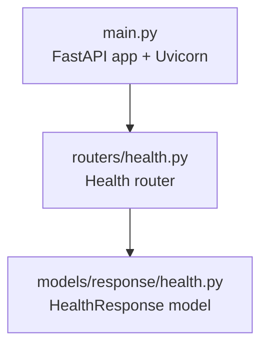
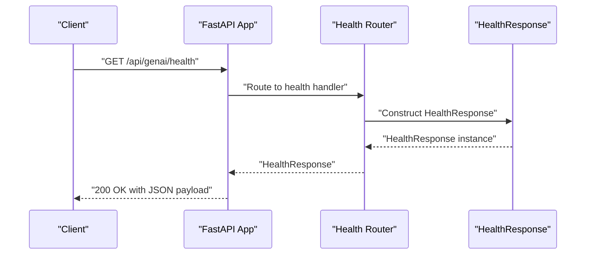
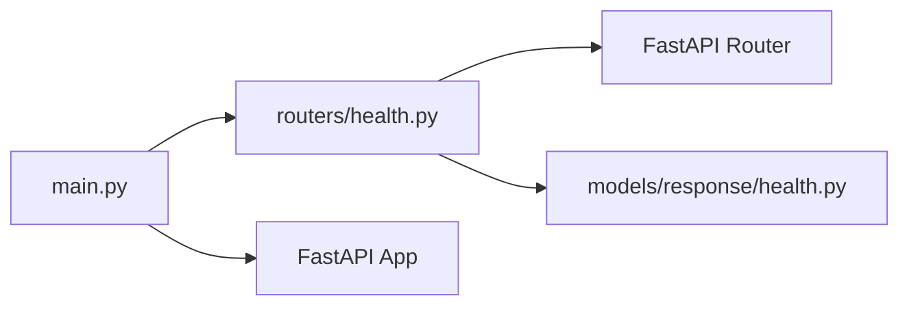

# Health and monitoring API

## Introduction
Single health endpoint and how to use it for liveness in containers or simple uptime checks.

## Project structure
The health endpoint is implemented as part of the FastAPI application and registered under a dedicated router. The API server is configured via the main application module and can be started using the provided runner script.

```mermaid
graph TB
A["main.py<br/>FastAPI app + Uvicorn"] --> D["routers/health.py<br/>Health router"]
D --> E["models/response/health.py<br/>HealthResponse model"]
```

## Core components
- Health endpoint: Provides a quick service availability check with a standardized JSON response.
- Response model: Defines the structure of the health response payload.
- Application registration: The health router is mounted under the "/api/genai/health" prefix.

Key facts:
- Endpoint: GET /api/genai/health
- Response model: HealthResponse with fields "status" and "message"
- Typical response: {"status": "healthy", "message": "Agentic Browser API is running smoothly."}

## Architecture overview
The health endpoint follows a minimal design pattern: a GET handler returns a static health payload. The endpoint is integrated into the FastAPI application and exposed under the "/api/genai/health" route.

```mermaid
sequenceDiagram
participant Client as "Client"
participant API as "FastAPI App"
participant Router as "Health Router"
participant Model as "HealthResponse"
Client->>API : "GET /api/genai/health"
API->>Router : "Route to health handler"
Router->>Model : "Construct HealthResponse"
Model-->>Router : "HealthResponse instance"
Router-->>API : "HealthResponse"
API-->>Client : "200 OK with JSON payload"
```

## Detailed component analysis

### Health endpoint
- Method: GET
- Path: /api/genai/health
- Authentication: Not required (no authentication decorator present)
- Response: JSON object conforming to HealthResponse schema
- Success code: 200 OK

Response schema:
- status: string
- message: string

Typical successful response:
- status: "healthy"
- message: "Agentic Browser API is running smoothly."

Operational notes:
- The handler returns a fixed healthy state and message.
- No dynamic checks are performed (e.g., database connectivity, external service liveness).
- Suitable for basic Kubernetes readiness/liveness probes and simple monitoring setups.

Usage examples:
- cURL: curl -s http://localhost:5454/api/genai/health
- Python requests: requests.get("http://localhost:5454/api/genai/health") .json()

Integration patterns:
- Probes: Configure Kubernetes readiness and liveness probes against this endpoint.
- Alerting: Trigger alerts if the endpoint becomes unavailable or returns non-200 status.
- Dashboards: Display service status in monitoring dashboards.

### Health response model
The HealthResponse Pydantic model defines the shape of the health check response. It ensures consistent serialization and validation of the health payload.

Fields:
- status: string value indicating health state
- message: human-readable status description

Validation behavior:
- Strict field typing enforced by Pydantic
- No additional constraints applied in the current implementation

### Application registration and startup
The health router is included in the main FastAPI application with a specific URL prefix. The server can be started programmatically or via the provided runner.

Key points:
- Router registration: app.include_router(health_router, prefix="/api/genai/health")
- Default host/port: configurable via environment variables
- Entry point: `python main.py` or `agentic-api-run` starts FastAPI; MCP is mounted at `/mcp`

## Dependency analysis
The health endpoint has minimal dependencies and relies on the FastAPI framework and Pydantic model validation.

```mermaid
graph LR
A["routers/health.py"] --> B["FastAPI Router"]
A --> C["models/response/health.py"]
D["main.py"] --> A
D --> E["FastAPI App"]
```

## Performance considerations
- The health endpoint performs no I/O operations or external service calls.
- Response generation is CPU-bound but trivial in cost.
- Ideal for frequent polling in monitoring systems without impacting performance.
- For production deployments, configure appropriate probe intervals and timeouts to balance responsiveness and overhead.

## Troubleshooting guide
Common issues and resolutions:
- Endpoint returns 404: Verify the correct base URL and path prefix. Ensure the health router is included in the application.
- Unexpected non-200 status: Confirm the server is running and reachable on the configured host and port.
- Environment configuration: Adjust BACKEND_HOST and BACKEND_PORT via environment variables if the default values do not match your deployment.

Operational checks:
- Confirm the server startup logs indicate successful router registration.
- Validate network connectivity to the host and port.
- Use a simple HTTP client to test the endpoint and inspect response headers.

## Conclusion
It returns a static healthy payload today. Fine for basic probes. Add dependency checks when you need real readiness.

