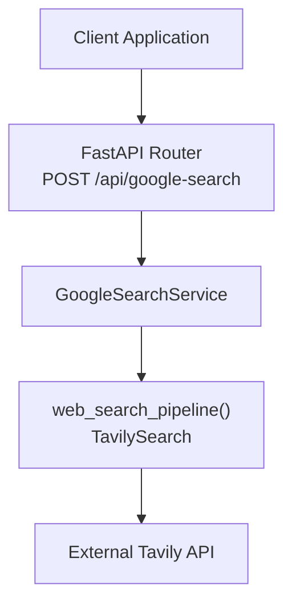
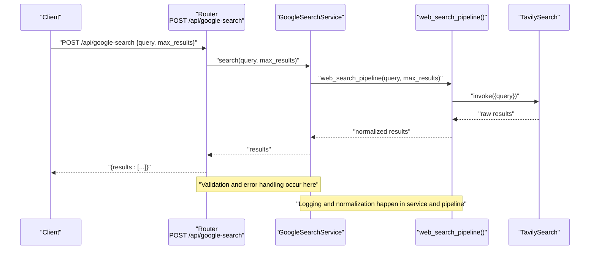
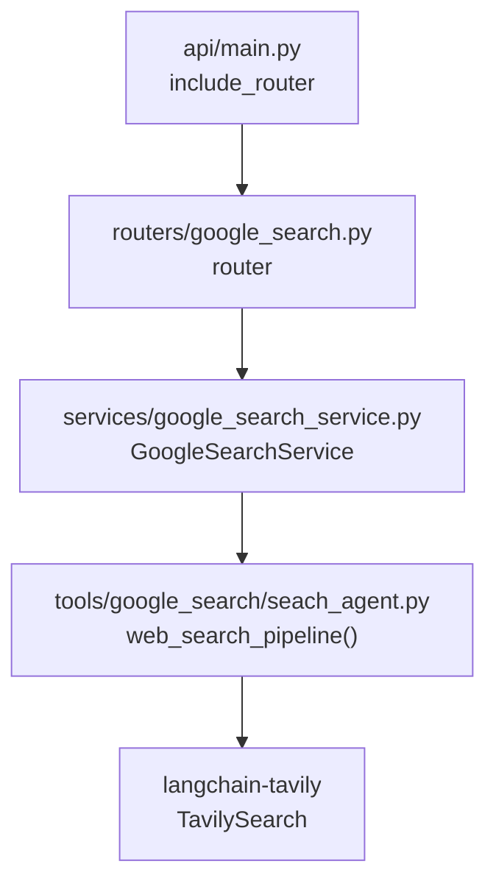

# Search Integration API

<cite>
**Referenced Files in This Document**
- [api/main.py](file://api/main.py)
- [routers/google_search.py](file://routers/google_search.py)
- [services/google_search_service.py](file://services/google_search_service.py)
- [tools/google_search/seach_agent.py](file://tools/google_search/seach_agent.py)
- [core/config.py](file://core/config.py)
- [pyproject.toml](file://pyproject.toml)
</cite>

## Table of Contents
1. [Introduction](#introduction)
2. [Project Structure](#project-structure)
3. [Core Components](#core-components)
4. [Architecture Overview](#architecture-overview)
5. [Detailed Component Analysis](#detailed-component-analysis)
6. [Dependency Analysis](#dependency-analysis)
7. [Performance Considerations](#performance-considerations)
8. [Troubleshooting Guide](#troubleshooting-guide)
9. [Conclusion](#conclusion)
10. [Appendices](#appendices)

## Introduction
This document describes the Google Search integration API endpoints that enable web search operations, query processing, and result management. It covers HTTP method and URL patterns, request/response schemas, authentication requirements, and practical examples for search automation. The system integrates FastAPI routes, a service layer, and a Tavily-powered search pipeline to deliver structured search results suitable for downstream processing.

## Project Structure
The search integration spans three primary layers:
- API routing: Defines the endpoint and request validation
- Service layer: Orchestrates search execution and logging
- Tool layer: Implements the Tavily-backed search pipeline

**Diagram sources**
- [api/main.py](file://api/main.py#L34-L34)
- [routers/google_search.py](file://routers/google_search.py#L20-L38)
- [services/google_search_service.py](file://services/google_search_service.py#L7-L30)
- [tools/google_search/seach_agent.py](file://tools/google_search/seach_agent.py#L14-L62)

**Section sources**
- [api/main.py](file://api/main.py#L12-L42)
- [routers/google_search.py](file://routers/google_search.py#L1-L39)
- [services/google_search_service.py](file://services/google_search_service.py#L1-L31)
- [tools/google_search/seach_agent.py](file://tools/google_search/seach_agent.py#L1-L84)

## Core Components
- Endpoint: POST /api/google-search
- Request body: SearchRequest with query and max_results
- Response body: Dictionary containing results array
- Authentication: Not enforced by the endpoint; however, external search provider credentials are required

Key implementation references:
- Route definition and dependency injection: [routers/google_search.py](file://routers/google_search.py#L20-L38)
- Service orchestration and logging: [services/google_search_service.py](file://services/google_search_service.py#L7-L30)
- Search pipeline using Tavily: [tools/google_search/seach_agent.py](file://tools/google_search/seach_agent.py#L14-L62)

**Section sources**
- [routers/google_search.py](file://routers/google_search.py#L11-L38)
- [services/google_search_service.py](file://services/google_search_service.py#L7-L30)
- [tools/google_search/seach_agent.py](file://tools/google_search/seach_agent.py#L14-L62)

## Architecture Overview
The search flow begins at the FastAPI route, which validates the request, delegates to the service layer, and executes the Tavily-backed pipeline. Results are normalized into a consistent structure and returned to the caller.

**Diagram sources**
- [routers/google_search.py](file://routers/google_search.py#L20-L38)
- [services/google_search_service.py](file://services/google_search_service.py#L7-L30)
- [tools/google_search/seach_agent.py](file://tools/google_search/seach_agent.py#L14-L62)

## Detailed Component Analysis

### Endpoint Definition
- Method: POST
- Path: /api/google-search
- Request body: SearchRequest
  - query: string (required)
  - max_results: integer (optional, default 5)
- Response body: Dictionary with results array
  - results: array of objects with keys:
    - url: string
    - md_body_content: string
    - title: string

Behavior:
- Validates presence of query; returns 400 on missing query
- Delegates to service layer for execution
- Wraps results in a standardized dictionary
- Converts unexpected errors to 500 with logged details

**Section sources**
- [routers/google_search.py](file://routers/google_search.py#L11-L38)

### Service Layer
Responsibilities:
- Accepts query and max_results
- Logs incoming request and outcomes
- Invokes the search pipeline
- Normalizes empty/no results to an empty list
- Propagates exceptions after logging

**Section sources**
- [services/google_search_service.py](file://services/google_search_service.py#L7-L30)

### Search Pipeline (Tavily)
- Initializes a TavilySearch tool with a default topic
- Updates max_results per invocation
- Executes a query and normalizes results
- Maps external fields to internal schema:
  - url → url
  - content → md_body_content
  - title → title (when present)
- Handles both dict and list response formats from the underlying tool
- Returns an empty list on unexpected formats or exceptions

**Section sources**
- [tools/google_search/seach_agent.py](file://tools/google_search/seach_agent.py#L14-L62)

### Authentication and Configuration
- Endpoint-level authentication: Not enforced by the route
- External provider credentials:
  - GOOGLE_API_KEY environment variable is loaded via configuration
  - TavilySearch tool is initialized in the pipeline
- Provider library: langchain-tavily is declared as a dependency

Note: Ensure environment variables are configured for the external search provider to function correctly.

**Section sources**
- [core/config.py](file://core/config.py#L13-L14)
- [pyproject.toml](file://pyproject.toml#L25-L25)
- [tools/google_search/seach_agent.py](file://tools/google_search/seach_agent.py#L10-L11)

## Dependency Analysis
The search integration depends on:
- FastAPI router registration under /api/google-search
- GoogleSearchService for orchestration
- web_search_pipeline for Tavily integration
- langchain-tavily for external search capabilities

**Diagram sources**
- [api/main.py](file://api/main.py#L34-L34)
- [routers/google_search.py](file://routers/google_search.py#L1-L8)
- [services/google_search_service.py](file://services/google_search_service.py#L1-L4)
- [tools/google_search/seach_agent.py](file://tools/google_search/seach_agent.py#L5-L11)
- [pyproject.toml](file://pyproject.toml#L25-L25)

**Section sources**
- [api/main.py](file://api/main.py#L14-L42)
- [pyproject.toml](file://pyproject.toml#L7-L29)

## Performance Considerations
- Result limit: max_results controls the number of items returned; tune for latency vs. comprehensiveness trade-offs
- Logging overhead: Each request logs at info level; adjust logging level in production environments
- External dependency: Tavily response time and rate limits apply; implement retries and circuit-breaking as needed
- Memory footprint: Results are materialized as lists; avoid excessively large max_results for constrained environments

## Troubleshooting Guide
Common issues and resolutions:
- Missing query parameter: Returns 400; ensure query is provided
- Empty results: Verify external provider credentials and query correctness
- Unexpected response format: Pipeline normalizes to empty list; check provider output format
- Provider errors: Exceptions are logged; inspect service logs for stack traces

Operational checks:
- Confirm endpoint registration under /api/google-search
- Validate GOOGLE_API_KEY environment variable is set
- Review service logs for info/warning/error entries

**Section sources**
- [routers/google_search.py](file://routers/google_search.py#L25-L38)
- [services/google_search_service.py](file://services/google_search_service.py#L10-L30)
- [tools/google_search/seach_agent.py](file://tools/google_search/seach_agent.py#L32-L62)

## Conclusion
The Google Search integration provides a streamlined POST endpoint for web search queries, with a service layer that logs and orchestrates a Tavily-backed pipeline. Requests are validated, results are normalized, and the system is designed for straightforward automation. Ensure proper configuration of external provider credentials and monitor logs for operational insights.

## Appendices

### API Reference

- Base URL
  - http://localhost:5454 (default development host/port)
- Endpoint
  - POST /api/google-search
- Request JSON Schema
  - query: string (required)
  - max_results: integer (optional, default 5)
- Response JSON Schema
  - results: array of objects
    - url: string
    - md_body_content: string
    - title: string

Example request:
- POST /api/google-search
- Body: {"query": "example search", "max_results": 5}

Example response:
- Status: 200 OK
- Body: {"results": [{"url": "...", "md_body_content": "...", "title": "..."}, ...]}

Error responses:
- 400 Bad Request: Missing query
- 500 Internal Server Error: Unhandled exception in pipeline/service

**Section sources**
- [api/main.py](file://api/main.py#L10-L12)
- [api/main.py](file://api/main.py#L34-L34)
- [routers/google_search.py](file://routers/google_search.py#L11-L38)
- [services/google_search_service.py](file://services/google_search_service.py#L7-L30)
- [tools/google_search/seach_agent.py](file://tools/google_search/seach_agent.py#L14-L62)

### Client Implementation Patterns
- Direct HTTP client
  - Send POST to /api/google-search with JSON body
  - Parse results array for downstream processing
- Automation workflows
  - Chain multiple queries with varying max_results
  - Filter results by title/url/content criteria
  - Persist results to storage or cache
- Retry and timeout strategies
  - Implement exponential backoff for transient failures
  - Apply timeouts to external provider calls

[No sources needed since this section provides general guidance]