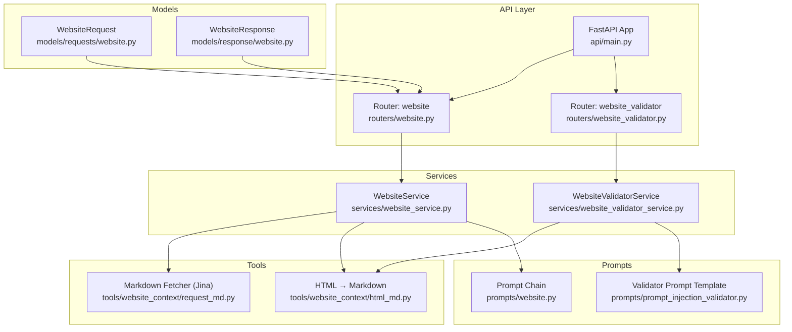
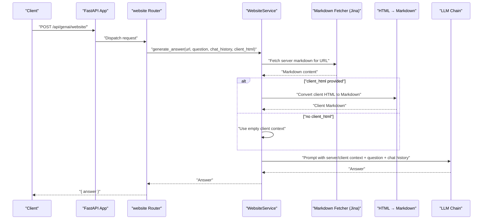
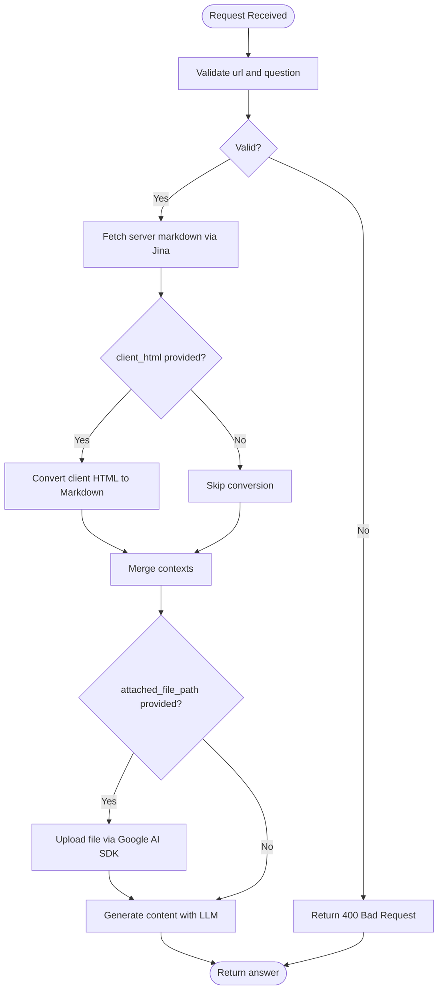
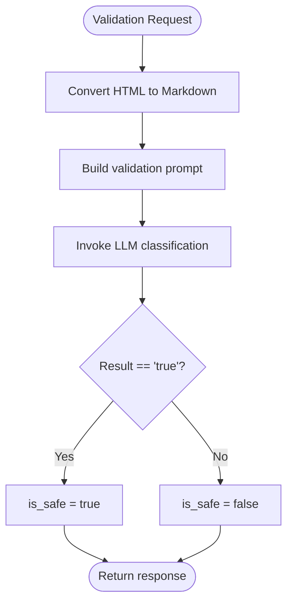
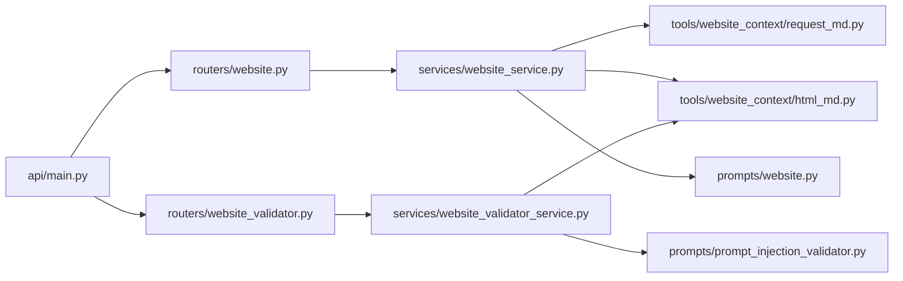

# Website Processing API

<cite>
**Referenced Files in This Document**
- [api/main.py](file://api/main.py)
- [routers/website.py](file://routers/website.py)
- [routers/website_validator.py](file://routers/website_validator.py)
- [models/requests/website.py](file://models/requests/website.py)
- [models/response/website.py](file://models/response/website.py)
- [services/website_service.py](file://services/website_service.py)
- [services/website_validator_service.py](file://services/website_validator_service.py)
- [prompts/website.py](file://prompts/website.py)
- [prompts/prompt_injection_validator.py](file://prompts/prompt_injection_validator.py)
- [tools/website_context/request_md.py](file://tools/website_context/request_md.py)
- [tools/website_context/html_md.py](file://tools/website_context/html_md.py)
- [core/config.py](file://core/config.py)
</cite>

## Table of Contents
1. [Introduction](#introduction)
2. [Project Structure](#project-structure)
3. [Core Components](#core-components)
4. [Architecture Overview](#architecture-overview)
5. [Detailed Component Analysis](#detailed-component-analysis)
6. [Dependency Analysis](#dependency-analysis)
7. [Performance Considerations](#performance-considerations)
8. [Troubleshooting Guide](#troubleshooting-guide)
9. [Conclusion](#conclusion)
10. [Appendices](#appendices)

## Introduction
This document describes the Website Processing API, focusing on:
- Website content extraction via server-side fetching and client-provided HTML
- HTML-to-Markdown conversion
- Website content validation against prompt injection risks
- Request/response schemas and validation requirements
- End-to-end workflows for scraping, content analysis, and validation
- Practical client integration patterns and limitations

Endpoints:
- POST /api/genai/website/ — Process website content and answer questions
- POST /api/validator/validate-website — Validate website HTML for safety

## Project Structure
The Website Processing API is implemented as a FastAPI application with modular routers, services, models, prompts, and tools.

**Diagram sources**
- [api/main.py](file://api/main.py#L12-L42)
- [routers/website.py](file://routers/website.py#L1-L43)
- [routers/website_validator.py](file://routers/website_validator.py#L1-L15)
- [services/website_service.py](file://services/website_service.py#L1-L97)
- [services/website_validator_service.py](file://services/website_validator_service.py#L1-L38)
- [models/requests/website.py](file://models/requests/website.py#L1-L11)
- [models/response/website.py](file://models/response/website.py#L1-L6)
- [prompts/website.py](file://prompts/website.py#L1-L115)
- [prompts/prompt_injection_validator.py](file://prompts/prompt_injection_validator.py#L1-L16)
- [tools/website_context/request_md.py](file://tools/website_context/request_md.py#L1-L30)
- [tools/website_context/html_md.py](file://tools/website_context/html_md.py#L1-L27)

**Section sources**
- [api/main.py](file://api/main.py#L12-L42)

## Core Components
- Website Processing Endpoint
  - Method: POST
  - Path: /api/genai/website/
  - Purpose: Accept a URL and a question, optionally include client HTML and chat history, and return a synthesized answer using both server-fetched and client-rendered contexts.
- Website Validation Endpoint
  - Method: POST
  - Path: /api/validator/validate-website
  - Purpose: Validate HTML content for prompt injection risks by converting to Markdown and evaluating with a language model.

**Section sources**
- [routers/website.py](file://routers/website.py#L14-L42)
- [routers/website_validator.py](file://routers/website_validator.py#L12-L14)

## Architecture Overview
End-to-end flow for website processing and validation:

**Diagram sources**
- [routers/website.py](file://routers/website.py#L14-L32)
- [services/website_service.py](file://services/website_service.py#L13-L92)
- [tools/website_context/request_md.py](file://tools/website_context/request_md.py#L7-L29)
- [tools/website_context/html_md.py](file://tools/website_context/html_md.py#L5-L11)
- [prompts/website.py](file://prompts/website.py#L100-L114)

## Detailed Component Analysis

### Website Processing Endpoint
- URL: POST /api/genai/website/
- Request Schema (WebsiteRequest)
  - url: string (required)
  - question: string (required)
  - chat_history: array of objects (optional; default: empty)
  - client_html: string (optional; if provided, converted to Markdown)
  - attached_file_path: string (optional; if provided, uses Google AI SDK to process)
- Response Schema (WebsiteResponse)
  - answer: string
- Processing Logic
  - Server-side markdown fetch via Jina AI
  - Optional client HTML to Markdown conversion
  - Chat history aggregation into a string
  - Optional file upload and generation via Google AI SDK
  - Prompt composition and LLM invocation
  - Answer returned as plain text
- Validation Requirements
  - url and question are required; otherwise returns 400
  - Errors are logged and surfaced as 500 with details
- Rate Limiting and Content Filtering
  - No explicit rate limiting in code
  - Jina AI service may apply limits; consider retries/backoff in clients
  - Content filtering is implicit via prompt instructions and validator endpoint

**Diagram sources**
- [routers/website.py](file://routers/website.py#L18-L32)
- [services/website_service.py](file://services/website_service.py#L13-L92)
- [tools/website_context/request_md.py](file://tools/website_context/request_md.py#L7-L29)
- [tools/website_context/html_md.py](file://tools/website_context/html_md.py#L5-L11)
- [prompts/website.py](file://prompts/website.py#L100-L114)

**Section sources**
- [routers/website.py](file://routers/website.py#L14-L42)
- [models/requests/website.py](file://models/requests/website.py#L5-L10)
- [models/response/website.py](file://models/response/website.py#L4-L6)
- [services/website_service.py](file://services/website_service.py#L13-L92)

### Website Validation Endpoint
- URL: POST /api/validator/validate-website
- Request Schema (WebsiteValidatorRequest)
  - html: string (required)
- Response Schema (WebsiteValidatorResponse)
  - is_safe: boolean (default: false)
- Processing Logic
  - Convert HTML to Markdown
  - Build a validation prompt with the Markdown content
  - Invoke LLM to classify as safe or unsafe
  - Return boolean flag indicating safety
- Validation Requirements
  - html is required; ensure proper HTML payload
- Security Notes
  - Designed to detect prompt injection attempts by analyzing Markdown representation of HTML

**Diagram sources**
- [routers/website_validator.py](file://routers/website_validator.py#L12-L14)
- [services/website_validator_service.py](file://services/website_validator_service.py#L17-L37)
- [prompts/prompt_injection_validator.py](file://prompts/prompt_injection_validator.py#L1-L16)
- [tools/website_context/html_md.py](file://tools/website_context/html_md.py#L5-L11)

**Section sources**
- [routers/website_validator.py](file://routers/website_validator.py#L12-L14)
- [services/website_validator_service.py](file://services/website_validator_service.py#L9-L37)

### Supporting Tools and Prompts
- Server-side Markdown Fetcher (Jina AI)
  - Converts a URL into clean Markdown via an external service
  - Returns raw text/markdown or an error message string
- HTML to Markdown Converter
  - Parses HTML and converts to Markdown for downstream processing
- Prompt Chains
  - Website prompt composes server and client contexts with question and chat history
  - Validator prompt checks for prompt injection indicators

**Section sources**
- [tools/website_context/request_md.py](file://tools/website_context/request_md.py#L7-L29)
- [tools/website_context/html_md.py](file://tools/website_context/html_md.py#L5-L11)
- [prompts/website.py](file://prompts/website.py#L12-L114)
- [prompts/prompt_injection_validator.py](file://prompts/prompt_injection_validator.py#L1-L16)

## Dependency Analysis
- API Registration
  - Routers mounted under specific prefixes:
    - /api/genai/website (website router)
    - /api/validator (website validator router)
- Service Dependencies
  - WebsiteService depends on:
    - Markdown fetcher (Jina)
    - HTML-to-Markdown converter
    - Prompt chain (LangChain)
  - WebsiteValidatorService depends on:
    - HTML-to-Markdown converter
    - Validator prompt template
    - LLM client
- External Integrations
  - Jina AI service for server-side markdown fetching
  - Optional Google AI SDK for file processing when attached_file_path is provided

**Diagram sources**
- [api/main.py](file://api/main.py#L14-L42)
- [routers/website.py](file://routers/website.py#L1-L43)
- [routers/website_validator.py](file://routers/website_validator.py#L1-L15)
- [services/website_service.py](file://services/website_service.py#L1-L97)
- [services/website_validator_service.py](file://services/website_validator_service.py#L1-L38)
- [tools/website_context/request_md.py](file://tools/website_context/request_md.py#L1-L30)
- [tools/website_context/html_md.py](file://tools/website_context/html_md.py#L1-L27)
- [prompts/website.py](file://prompts/website.py#L1-L115)
- [prompts/prompt_injection_validator.py](file://prompts/prompt_injection_validator.py#L1-L16)

**Section sources**
- [api/main.py](file://api/main.py#L14-L42)

## Performance Considerations
- Latency Factors
  - Network latency to Jina AI service for server-side markdown fetching
  - Optional Google AI SDK file upload and generation
  - LLM inference time for prompt evaluation
- Recommendations
  - Cache server markdown for repeated queries to the same URL
  - Compress or truncate very large client_html payloads
  - Implement client-side retry/backoff for transient failures from external services
  - Consider batching multiple requests when feasible

[No sources needed since this section provides general guidance]

## Troubleshooting Guide
- Common HTTP Errors
  - 400 Bad Request: Missing url or question in request
  - 500 Internal Server Error: Unhandled exceptions during processing
- Error Handling Behavior
  - Website endpoint logs errors and returns a structured 500 response
  - Validation endpoint returns a deterministic boolean; ensure input HTML is well-formed
- Environment and Configuration
  - Ensure environment variables for logging and optional Google API keys are set appropriately
- Client-Side Tips
  - Validate request payloads before sending
  - Handle network timeouts and retry logic for external services
  - Normalize chat_history entries to dictionaries with role/content fields

**Section sources**
- [routers/website.py](file://routers/website.py#L23-L42)
- [core/config.py](file://core/config.py#L13-L25)

## Conclusion
The Website Processing API provides a robust pipeline for extracting, converting, and analyzing website content, while offering a dedicated validation endpoint to mitigate prompt injection risks. By combining server-side and client-side contexts, it delivers comprehensive answers grounded in both static and dynamic page content. Clients should implement appropriate retries, payload normalization, and error handling to integrate smoothly with the API.

[No sources needed since this section summarizes without analyzing specific files]

## Appendices

### API Reference

- Website Processing
  - Method: POST
  - URL: /api/genai/website/
  - Request Body Fields
    - url: string (required)
    - question: string (required)
    - chat_history: array of objects (optional)
    - client_html: string (optional)
    - attached_file_path: string (optional)
  - Response Body Fields
    - answer: string

- Website Validation
  - Method: POST
  - URL: /api/validator/validate-website
  - Request Body Fields
    - html: string (required)
  - Response Body Fields
    - is_safe: boolean

**Section sources**
- [routers/website.py](file://routers/website.py#L14-L32)
- [routers/website_validator.py](file://routers/website_validator.py#L12-L14)
- [models/requests/website.py](file://models/requests/website.py#L5-L10)
- [models/response/website.py](file://models/response/website.py#L4-L6)

### Example Workflows

- Website Scraping and Analysis
  - Steps
    - Send POST to /api/genai/website/ with url and question
    - Optionally include client_html to capture client-rendered content
    - Optionally include chat_history for conversational context
    - Receive answer synthesized from both server and client contexts
  - Notes
    - If attached_file_path is provided, the service uploads the file and generates content using the Google AI SDK

- Content Validation
  - Steps
    - Send POST to /api/validator/validate-website with html payload
    - Receive is_safe boolean indicating whether the content is considered safe

**Section sources**
- [services/website_service.py](file://services/website_service.py#L52-L79)
- [services/website_validator_service.py](file://services/website_validator_service.py#L17-L37)

### Client Implementation Patterns
- Basic Client Call Pattern
  - Construct request payload with url and question
  - Set Content-Type to application/json
  - Handle non-OK responses and parse JSON on success
- Integration Tips
  - For dynamic pages, capture client HTML in the browser and pass client_html
  - For multi-turn conversations, accumulate chat_history entries
  - For sensitive documents, consider uploading files via the attached_file_path path when supported

**Section sources**
- [routers/website.py](file://routers/website.py#L14-L32)
- [services/website_service.py](file://services/website_service.py#L13-L92)