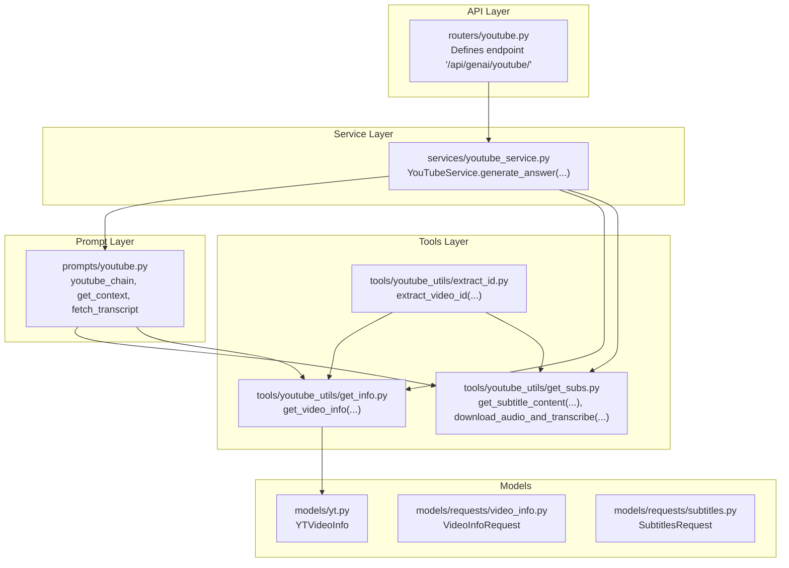
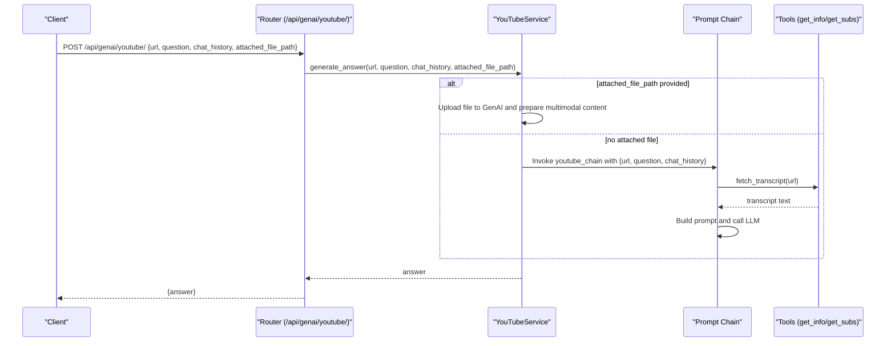
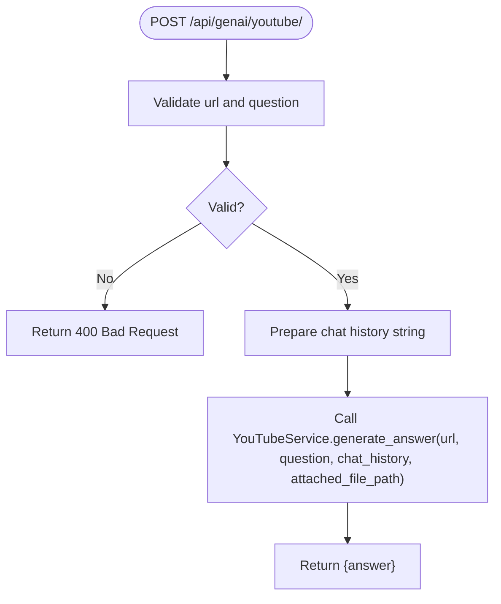
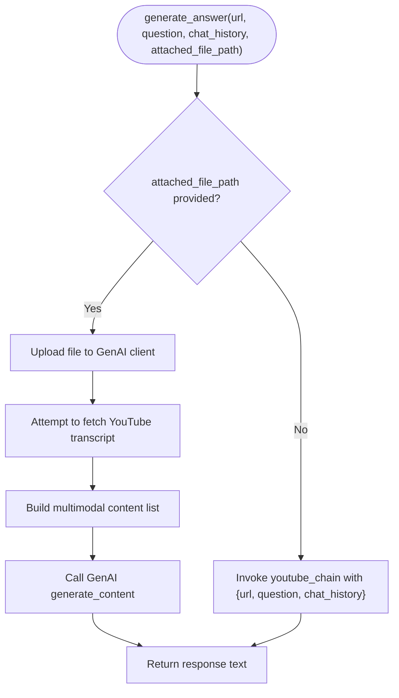
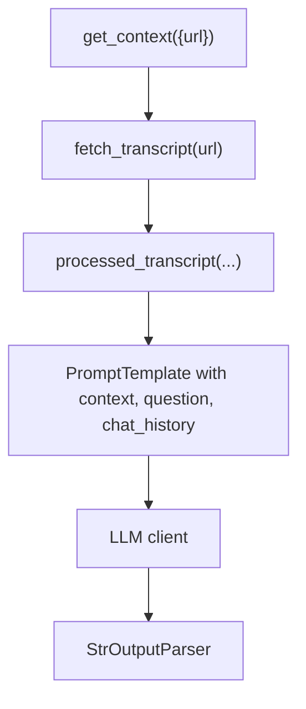
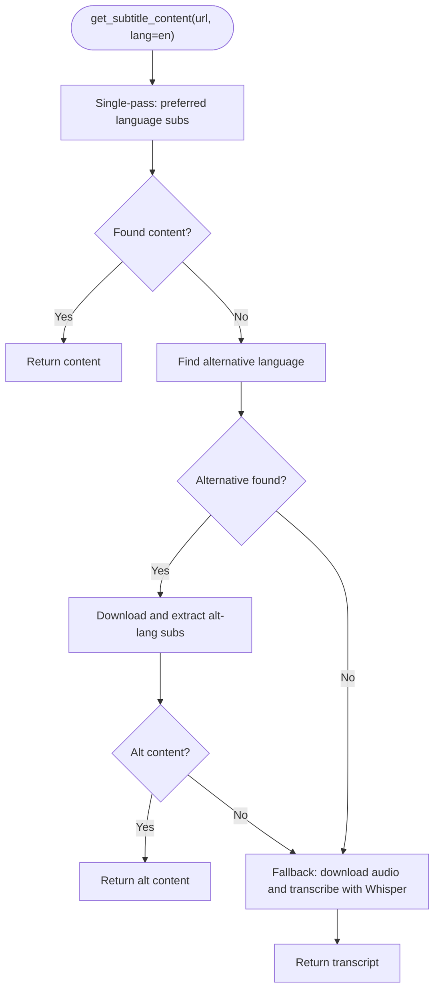
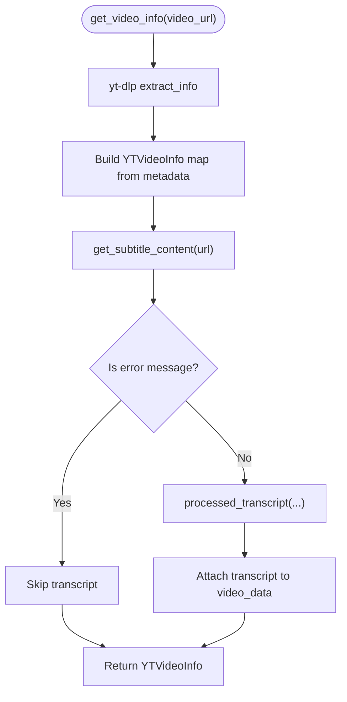
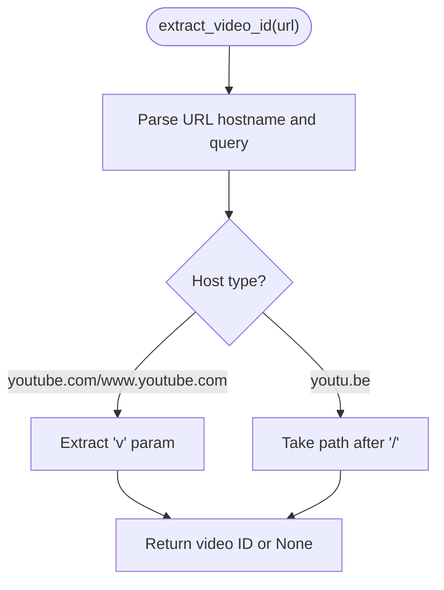
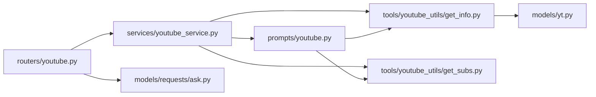

# YouTube Integration API

<cite>
**Referenced Files in This Document**
- [routers/youtube.py](file://routers/youtube.py)
- [services/youtube_service.py](file://services/youtube_service.py)
- [prompts/youtube.py](file://prompts/youtube.py)
- [tools/youtube_utils/get_info.py](file://tools/youtube_utils/get_info.py)
- [tools/youtube_utils/get_subs.py](file://tools/youtube_utils/get_subs.py)
- [tools/youtube_utils/extract_id.py](file://tools/youtube_utils/extract_id.py)
- [models/yt.py](file://models/yt.py)
- [models/requests/video_info.py](file://models/requests/video_info.py)
- [models/requests/subtitles.py](file://models/requests/subtitles.py)
- [api/main.py](file://api/main.py)
- [routers/__init__.py](file://routers/__init__.py)
</cite>

## Table of Contents
1. [Introduction](#introduction)
2. [Project Structure](#project-structure)
3. [Core Components](#core-components)
4. [Architecture Overview](#architecture-overview)
5. [Detailed Component Analysis](#detailed-component-analysis)
6. [Dependency Analysis](#dependency-analysis)
7. [Performance Considerations](#performance-considerations)
8. [Troubleshooting Guide](#troubleshooting-guide)
9. [Conclusion](#conclusion)
10. [Appendices](#appendices)

## Introduction
This document describes the YouTube integration API endpoints for video processing operations. It covers video information retrieval, subtitle extraction, transcript generation, and video analysis workflows. For each endpoint, it specifies HTTP methods, URL patterns, request/response schemas, and authentication requirements. It also documents YouTube-specific authentication, quota management considerations, and processing limitations, along with client implementation examples and integration patterns for automating video content scenarios.

## Project Structure
The YouTube integration is implemented as a FastAPI application with modular components:
- Router: Defines the API endpoint(s) for YouTube operations.
- Service: Orchestrates processing logic and integrates with LLMs and YouTube utilities.
- Tools: Provides YouTube utilities for video info extraction, subtitle retrieval, and transcript generation.
- Prompts: Implements a prompt chain to contextualize LLM responses with YouTube content.
- Models: Defines request/response schemas for YouTube-related operations.

**Diagram sources**
- [routers/youtube.py](file://routers/youtube.py#L1-L59)
- [services/youtube_service.py](file://services/youtube_service.py#L1-L71)
- [prompts/youtube.py](file://prompts/youtube.py#L1-L158)
- [tools/youtube_utils/get_info.py](file://tools/youtube_utils/get_info.py#L1-L77)
- [tools/youtube_utils/get_subs.py](file://tools/youtube_utils/get_subs.py#L1-L276)
- [tools/youtube_utils/extract_id.py](file://tools/youtube_utils/extract_id.py#L1-L24)
- [models/yt.py](file://models/yt.py#L1-L17)
- [models/requests/video_info.py](file://models/requests/video_info.py#L1-L7)
- [models/requests/subtitles.py](file://models/requests/subtitles.py#L1-L8)

**Section sources**
- [routers/youtube.py](file://routers/youtube.py#L1-L59)
- [services/youtube_service.py](file://services/youtube_service.py#L1-L71)
- [prompts/youtube.py](file://prompts/youtube.py#L1-L158)
- [tools/youtube_utils/get_info.py](file://tools/youtube_utils/get_info.py#L1-L77)
- [tools/youtube_utils/get_subs.py](file://tools/youtube_utils/get_subs.py#L1-L276)
- [tools/youtube_utils/extract_id.py](file://tools/youtube_utils/extract_id.py#L1-L24)
- [models/yt.py](file://models/yt.py#L1-L17)
- [models/requests/video_info.py](file://models/requests/video_info.py#L1-L7)
- [models/requests/subtitles.py](file://models/requests/subtitles.py#L1-L8)
- [api/main.py](file://api/main.py#L23-L32)
- [routers/__init__.py](file://routers/__init__.py#L13-L22)

## Core Components
- YouTube Endpoint
  - Method: POST
  - Path: /api/genai/youtube/
  - Purpose: Answer questions about a YouTube video using video metadata and transcript.
  - Authentication: Not enforced by the endpoint; however, downstream operations may require credentials for external APIs.
  - Request Schema: See [AskRequest](file://models/requests/ask.py#L1-L50) (referenced by router).
  - Response Schema: JSON object containing an answer string.
  - Example Request Body:
    - url: string (required)
    - question: string (required)
    - chat_history: array of entries (optional)
    - attached_file_path: string (optional)
  - Example Response:
    - answer: string

- Video Info Retrieval
  - Functionality: Extracts video metadata via yt-dlp and optionally attaches a cleaned transcript.
  - Implementation: [get_video_info](file://tools/youtube_utils/get_info.py#L11-L77)
  - Model: [YTVideoInfo](file://models/yt.py#L5-L17)

- Subtitle Extraction and Transcript Generation
  - Functionality: Retrieves subtitles for a preferred language, falls back to alternative languages, and finally to audio transcription using Whisper if needed.
  - Implementation: [get_subtitle_content](file://tools/youtube_utils/get_subs.py#L8-L106) and [download_audio_and_transcribe](file://tools/youtube_utils/get_subs.py#L201-L276)
  - Request Schema: [SubtitlesRequest](file://models/requests/subtitles.py#L5-L8)

- Video ID Extraction
  - Functionality: Parses YouTube URLs to extract the video ID.
  - Implementation: [extract_video_id](file://tools/youtube_utils/extract_id.py#L8-L24)

**Section sources**
- [routers/youtube.py](file://routers/youtube.py#L14-L59)
- [services/youtube_service.py](file://services/youtube_service.py#L8-L71)
- [tools/youtube_utils/get_info.py](file://tools/youtube_utils/get_info.py#L11-L77)
- [models/yt.py](file://models/yt.py#L5-L17)
- [tools/youtube_utils/get_subs.py](file://tools/youtube_utils/get_subs.py#L8-L106)
- [models/requests/subtitles.py](file://models/requests/subtitles.py#L5-L8)
- [tools/youtube_utils/extract_id.py](file://tools/youtube_utils/extract_id.py#L8-L24)

## Architecture Overview
The YouTube integration follows a layered architecture:
- API Router receives requests and delegates to the YouTube Service.
- YouTube Service orchestrates:
  - Optional direct GenAI processing when an attached file is provided.
  - Prompt chain processing for question answering using video context.
- Prompt Chain:
  - Fetches transcript via tools.
  - Builds a structured prompt and invokes the LLM client.
- Tools:
  - Retrieve video info and subtitles.
  - Generate transcripts via Whisper fallback.

**Diagram sources**
- [routers/youtube.py](file://routers/youtube.py#L15-L59)
- [services/youtube_service.py](file://services/youtube_service.py#L8-L71)
- [prompts/youtube.py](file://prompts/youtube.py#L37-L75)
- [tools/youtube_utils/get_subs.py](file://tools/youtube_utils/get_subs.py#L8-L106)

## Detailed Component Analysis

### Endpoint: POST /api/genai/youtube/
- Purpose: Answer questions about a YouTube video using video metadata and transcript.
- Authentication: Not enforced at the endpoint level.
- Request Validation:
  - url and question are required; otherwise returns 400.
- Processing:
  - Converts chat history to a string.
  - Calls YouTubeService.generate_answer.
- Response:
  - JSON with answer field.

**Diagram sources**
- [routers/youtube.py](file://routers/youtube.py#L15-L59)

**Section sources**
- [routers/youtube.py](file://routers/youtube.py#L14-L59)

### YouTubeService: generate_answer
- Behavior:
  - If attached_file_path is provided, uploads the file to GenAI and constructs multimodal content including optional transcript and chat history.
  - Otherwise, uses the prompt chain to answer the question based on video context.
- Error Handling:
  - Returns a user-friendly message on failures.

**Diagram sources**
- [services/youtube_service.py](file://services/youtube_service.py#L8-L71)
- [prompts/youtube.py](file://prompts/youtube.py#L130-L139)

**Section sources**
- [services/youtube_service.py](file://services/youtube_service.py#L8-L71)

### Prompt Chain: youtube_chain
- Context Retrieval:
  - fetch_transcript(url): Downloads subtitles, cleans them, and returns a processed transcript string.
- Prompt Construction:
  - Uses a structured prompt template that instructs the LLM to answer questions strictly from the provided context and schema.
- Execution:
  - Composed pipeline: get_context → prompt → LLM → parser.

**Diagram sources**
- [prompts/youtube.py](file://prompts/youtube.py#L37-L75)
- [prompts/youtube.py](file://prompts/youtube.py#L121-L139)

**Section sources**
- [prompts/youtube.py](file://prompts/youtube.py#L37-L75)
- [prompts/youtube.py](file://prompts/youtube.py#L121-L139)

### Subtitle Extraction and Transcript Generation
- Priority:
  1) Preferred language subtitles (manual + auto-generated + auto-translated) in a single pass.
  2) Alternative language from available tracks.
  3) Whisper audio transcription fallback.
- Error Handling:
  - Handles rate limits, unavailable videos, and subtitle errors gracefully.
  - Cleans up temporary directories after processing.

**Diagram sources**
- [tools/youtube_utils/get_subs.py](file://tools/youtube_utils/get_subs.py#L8-L106)
- [tools/youtube_utils/get_subs.py](file://tools/youtube_utils/get_subs.py#L201-L276)

**Section sources**
- [tools/youtube_utils/get_subs.py](file://tools/youtube_utils/get_subs.py#L8-L106)
- [tools/youtube_utils/get_subs.py](file://tools/youtube_utils/get_subs.py#L201-L276)

### Video Info Retrieval
- Uses yt-dlp to extract metadata and optionally attach a cleaned transcript.
- Known error detection prevents returning error messages as valid transcripts.

**Diagram sources**
- [tools/youtube_utils/get_info.py](file://tools/youtube_utils/get_info.py#L11-L77)
- [models/yt.py](file://models/yt.py#L5-L17)

**Section sources**
- [tools/youtube_utils/get_info.py](file://tools/youtube_utils/get_info.py#L11-L77)
- [models/yt.py](file://models/yt.py#L5-L17)

### Video ID Extraction
- Supports youtube.com and youtu.be domains.
- Parses query parameters or path to extract the video ID.

**Diagram sources**
- [tools/youtube_utils/extract_id.py](file://tools/youtube_utils/extract_id.py#L8-L24)

**Section sources**
- [tools/youtube_utils/extract_id.py](file://tools/youtube_utils/extract_id.py#L8-L24)

## Dependency Analysis
- Router depends on YouTubeService.
- YouTubeService depends on:
  - Prompt chain (youtube_chain) for non-file processing.
  - Tools for subtitle and video info retrieval.
- Prompt chain depends on:
  - Tools for transcript fetching and processing.
- Models define request/response schemas used across components.

**Diagram sources**
- [routers/youtube.py](file://routers/youtube.py#L1-L59)
- [services/youtube_service.py](file://services/youtube_service.py#L1-L71)
- [prompts/youtube.py](file://prompts/youtube.py#L1-L158)
- [tools/youtube_utils/get_info.py](file://tools/youtube_utils/get_info.py#L1-L77)
- [tools/youtube_utils/get_subs.py](file://tools/youtube_utils/get_subs.py#L1-L276)
- [models/yt.py](file://models/yt.py#L1-L17)

**Section sources**
- [routers/youtube.py](file://routers/youtube.py#L1-L59)
- [services/youtube_service.py](file://services/youtube_service.py#L1-L71)
- [prompts/youtube.py](file://prompts/youtube.py#L1-L158)
- [tools/youtube_utils/get_info.py](file://tools/youtube_utils/get_info.py#L1-L77)
- [tools/youtube_utils/get_subs.py](file://tools/youtube_utils/get_subs.py#L1-L276)
- [models/yt.py](file://models/yt.py#L1-L17)

## Performance Considerations
- Subtitle Retrieval:
  - Single-pass retrieval minimizes API calls and avoids rate limiting.
  - Fallback to Whisper transcription adds latency; consider caching results.
- Whisper Transcription:
  - Uses a lightweight model by default; adjust model size/device for accuracy/performance trade-offs.
- Temporary Files:
  - Ensure cleanup of temporary directories to prevent disk pressure.
- Rate Limits:
  - yt-dlp and external services may throttle; implement retries with exponential backoff and circuit breaker patterns.

[No sources needed since this section provides general guidance]

## Troubleshooting Guide
- Common Issues:
  - Video unavailable: Returned when the video cannot be accessed.
  - Subtitles not available: Handled by falling back to Whisper transcription.
  - Rate limited (429): Detected and triggers Whisper fallback.
  - Unexpected errors: Logged and returned as user-friendly messages.
- Logging:
  - Extensive logging is used across tools and services to aid debugging.

**Section sources**
- [tools/youtube_utils/get_subs.py](file://tools/youtube_utils/get_subs.py#L80-L106)
- [tools/youtube_utils/get_subs.py](file://tools/youtube_utils/get_subs.py#L107-L116)
- [tools/youtube_utils/get_info.py](file://tools/youtube_utils/get_info.py#L43-L77)
- [services/youtube_service.py](file://services/youtube_service.py#L68-L71)

## Conclusion
The YouTube Integration API provides a robust foundation for video content automation. It supports question answering using video metadata and transcripts, with intelligent fallbacks to ensure resilience. By leveraging modular components and clear schemas, it enables flexible client integrations for diverse automation scenarios.

[No sources needed since this section summarizes without analyzing specific files]

## Appendices

### API Reference

- Endpoint: POST /api/genai/youtube/
  - Description: Answers questions about a YouTube video using video metadata and transcript.
  - Authentication: Not enforced at the endpoint.
  - Request JSON Schema:
    - url: string (required)
    - question: string (required)
    - chat_history: array of entries (optional)
    - attached_file_path: string (optional)
  - Response JSON Schema:
    - answer: string
  - Example Request:
    - {
      "url": "https://www.youtube.com/watch?v=...",
      "question": "What is this video about?",
      "chat_history": [],
      "attached_file_path": null
    }
  - Example Response:
    - {
      "answer": "This video is about..."
    }

**Section sources**
- [routers/youtube.py](file://routers/youtube.py#L15-L59)

### YouTube-Specific Authentication and Quota Management
- External API Credentials:
  - GenAI client requires an API key via environment variables.
  - Downstream tools may rely on yt-dlp and Whisper; ensure appropriate quotas and rate limits are respected.
- Recommendations:
  - Store API keys securely and rotate them periodically.
  - Implement retry logic and circuit breakers for rate-limited endpoints.
  - Monitor logs for frequent rate-limit or availability errors.

**Section sources**
- [services/youtube_service.py](file://services/youtube_service.py#L20-L52)

### Client Implementation Examples
- Basic Question Answering:
  - Send a POST request to /api/genai/youtube/ with url and question.
  - Use chat_history for conversational context.
- File-Attached Processing:
  - Provide attached_file_path to leverage multimodal GenAI capabilities.
  - Ensure the file is accessible to the server process.
- Subtitle Retrieval:
  - Use SubtitlesRequest schema to specify url and desired language.
  - Handle fallback to Whisper when subtitles are unavailable.

**Section sources**
- [models/requests/subtitles.py](file://models/requests/subtitles.py#L5-L8)
- [services/youtube_service.py](file://services/youtube_service.py#L20-L52)

### Integration Patterns
- Content Automation Scenarios:
  - Summarization: Use question templates to summarize video content.
  - Topic Extraction: Leverage tags, categories, and transcript for topic discovery.
  - Sentiment Analysis: Use transcript to infer sentiment.
  - Related Content Discovery: Use tags and categories to suggest related topics.
- Best Practices:
  - Cache video metadata and transcripts to reduce repeated downloads.
  - Validate YouTube URLs and extract IDs before processing.
  - Respect rate limits and implement graceful degradation to Whisper fallback.

**Section sources**
- [prompts/youtube.py](file://prompts/youtube.py#L77-L119)
- [tools/youtube_utils/extract_id.py](file://tools/youtube_utils/extract_id.py#L8-L24)