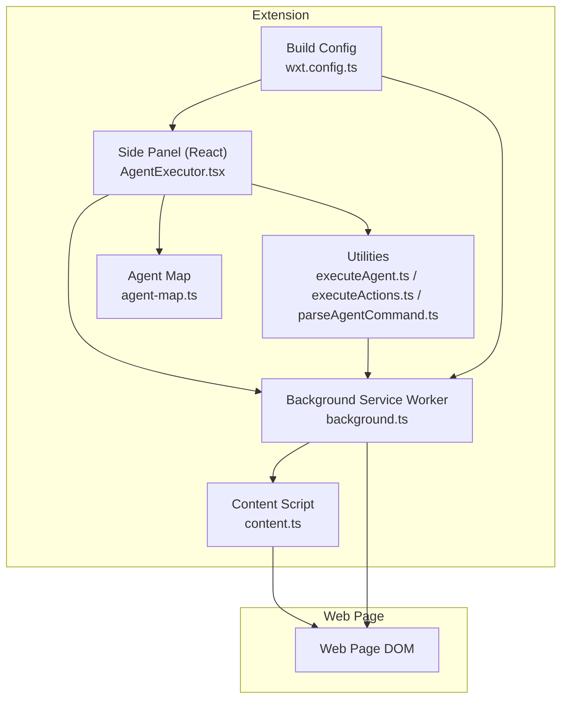
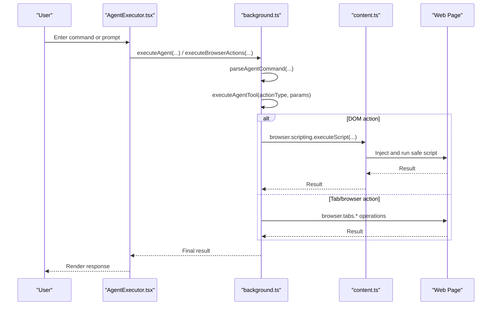
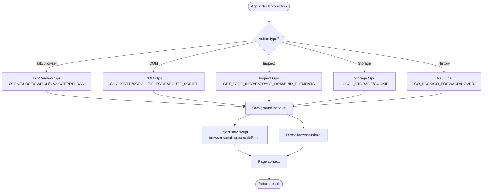
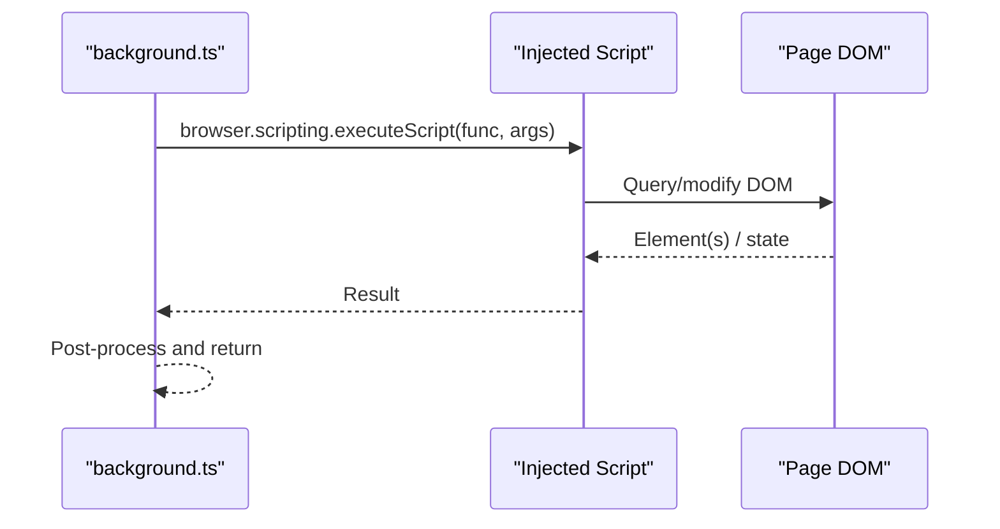
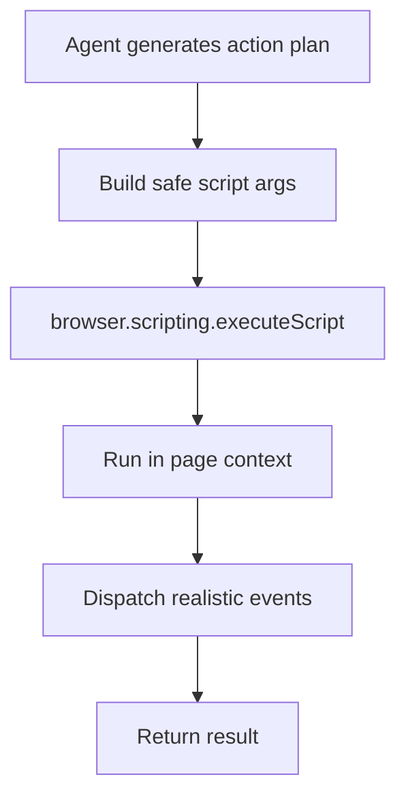
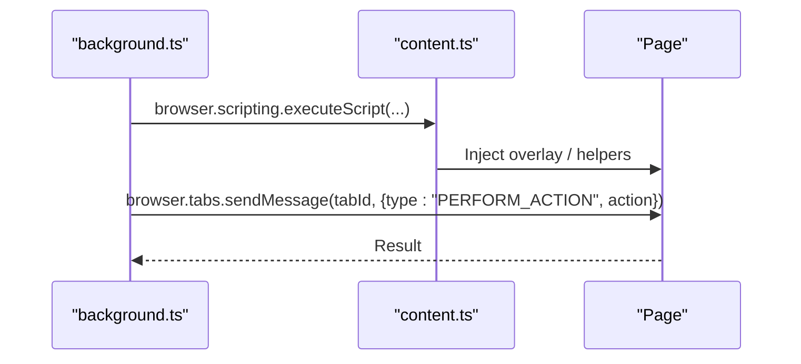
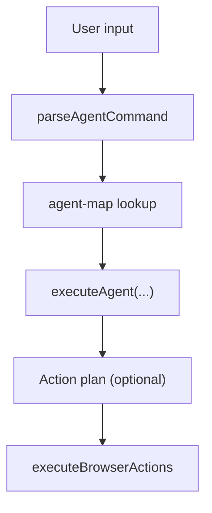
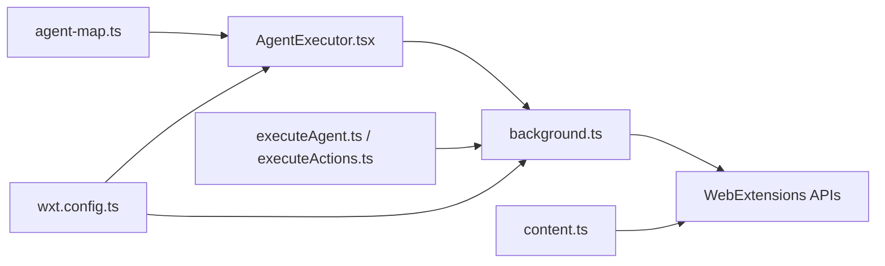

# Browser Automation

<cite>
**Referenced Files in This Document**
- [background.ts](file://extension/entrypoints/background.ts)
- [content.ts](file://extension/entrypoints/content.ts)
- [executeActions.ts](file://extension/entrypoints/utils/executeActions.ts)
- [executeAgent.ts](file://extension/entrypoints/utils/executeAgent.ts)
- [parseAgentCommand.ts](file://extension/entrypoints/utils/parseAgentCommand.ts)
- [AgentExecutor.tsx](file://extension/entrypoints/sidepanel/AgentExecutor.tsx)
- [agent-map.ts](file://extension/entrypoints/sidepanel/lib/agent-map.ts)
- [wxt.config.ts](file://extension/wxt.config.ts)
- [README.md](file://README.md)
- [agent_sanitizer.py](file://utils/agent_sanitizer.py)
</cite>

## Table of Contents
1. [Introduction](#introduction)
2. [Project Structure](#project-structure)
3. [Core Components](#core-components)
4. [Architecture Overview](#architecture-overview)
5. [Detailed Component Analysis](#detailed-component-analysis)
6. [Dependency Analysis](#dependency-analysis)
7. [Performance Considerations](#performance-considerations)
8. [Security Measures](#security-measures)
9. [Troubleshooting Guide](#troubleshooting-guide)
10. [Conclusion](#conclusion)

## Introduction
This document explains the Browser Automation system that powers declarative, model-driven web actions inside a browser extension. Agents declare high-level actions (such as clicking elements, filling forms, extracting DOM structures, and navigating), and the extension safely executes them within the active tab using injected scripts. The system integrates a content script architecture, a background service worker for coordination, and message passing between components. It also documents dynamic script generation for safe execution, security guardrails, and cross-browser compatibility considerations.

## Project Structure
The extension is organized into:
- Background service worker for tab control, tool dispatch, and message handling
- Content script for lightweight page-side actions and overlays
- Side panel React app for user interaction, agent orchestration, and command parsing
- Utility modules for action execution, agent command parsing, and agent mapping
- Build configuration for permissions and manifest

**Diagram sources**
- [background.ts](file://extension/entrypoints/background.ts#L17-L128)
- [content.ts](file://extension/entrypoints/content.ts#L1-L326)
- [AgentExecutor.tsx](file://extension/entrypoints/sidepanel/AgentExecutor.tsx#L1-L120)
- [executeAgent.ts](file://extension/entrypoints/utils/executeAgent.ts#L1-L60)
- [executeActions.ts](file://extension/entrypoints/utils/executeActions.ts#L1-L57)
- [parseAgentCommand.ts](file://extension/entrypoints/utils/parseAgentCommand.ts#L1-L86)
- [agent-map.ts](file://extension/entrypoints/sidepanel/lib/agent-map.ts#L1-L80)
- [wxt.config.ts](file://extension/wxt.config.ts#L1-L29)

**Section sources**
- [background.ts](file://extension/entrypoints/background.ts#L17-L128)
- [content.ts](file://extension/entrypoints/content.ts#L1-L326)
- [AgentExecutor.tsx](file://extension/entrypoints/sidepanel/AgentExecutor.tsx#L1-L120)
- [executeAgent.ts](file://extension/entrypoints/utils/executeAgent.ts#L1-L60)
- [executeActions.ts](file://extension/entrypoints/utils/executeActions.ts#L1-L57)
- [parseAgentCommand.ts](file://extension/entrypoints/utils/parseAgentCommand.ts#L1-L86)
- [agent-map.ts](file://extension/entrypoints/sidepanel/lib/agent-map.ts#L1-L80)
- [wxt.config.ts](file://extension/wxt.config.ts#L1-L29)

## Core Components
- Declarative Action System: Agents declare actions (e.g., OPEN_TAB, CLICK, TYPE, SCROLL, WAIT, SELECT, EXECUTE_SCRIPT). The background service worker routes these to specialized handlers that inject safe scripts into the active tab or operate at the browser/tab level.
- Dynamic Script Generation: For DOM-centric actions, the system generates and executes safe JavaScript within the page context using browser.scripting.executeScript. This ensures actions run with page privileges and visibility.
- Content Script Architecture: Provides optional page-side helpers and UI overlays. It listens for commands and performs simple actions directly in-page.
- Background Coordination: Manages tab lifecycle, navigation, cookie/localStorage access, and orchestrates complex multi-step automation plans returned by agents.
- Message Passing: React side panel communicates with the background via browser.runtime/onMessage and browser.tabs.sendMessage to coordinate actions and receive results.
- Agent Orchestration: The side panel parses slash commands, resolves endpoints, captures page context, and executes agent workflows that may include generated action plans.

**Section sources**
- [background.ts](file://extension/entrypoints/background.ts#L909-L1026)
- [content.ts](file://extension/entrypoints/content.ts#L197-L323)
- [executeAgent.ts](file://extension/entrypoints/utils/executeAgent.ts#L17-L298)
- [AgentExecutor.tsx](file://extension/entrypoints/sidepanel/AgentExecutor.tsx#L323-L516)
- [executeActions.ts](file://extension/entrypoints/utils/executeActions.ts#L1-L57)

## Architecture Overview
The system follows a layered architecture:
- UI Layer (Side Panel): Parses user intent, resolves agent actions, and triggers execution.
- Orchestration Layer: Executes agent workflows, captures page context, and coordinates action plans.
- Control Layer (Background): Dispatches tools/actions to appropriate handlers, manages tabs, and injects scripts.
- Execution Layer (Content/Injected Scripts): Performs DOM manipulation and page-level operations.

**Diagram sources**
- [AgentExecutor.tsx](file://extension/entrypoints/sidepanel/AgentExecutor.tsx#L323-L516)
- [executeAgent.ts](file://extension/entrypoints/utils/executeAgent.ts#L17-L298)
- [executeActions.ts](file://extension/entrypoints/utils/executeActions.ts#L1-L57)
- [background.ts](file://extension/entrypoints/background.ts#L909-L1026)
- [content.ts](file://extension/entrypoints/content.ts#L197-L323)

## Detailed Component Analysis

### Declarative Action System and Tool Dispatch
Agents declare actions that the extension converts into safe, executable operations. The background service worker routes these actions to dedicated handlers:
- Browser-level actions: OPEN_TAB, CLOSE_TAB, SWITCH_TAB, NAVIGATE, RELOAD_TAB, DUPLICATE_TAB
- DOM-level actions: CLICK, TYPE, SCROLL, SELECT, EXECUTE_SCRIPT
- Inspection actions: GET_PAGE_INFO, EXTRACT_DOM, FIND_ELEMENTS, GET_ELEMENT_TEXT, GET_ELEMENT_ATTRIBUTES
- Storage and cookies: GET/SET_LOCAL_STORAGE, GET/SET_COOKIE
- Navigation history: GO_BACK, GO_FORWARD
- Synchronization: WAIT, HOVER

**Diagram sources**
- [background.ts](file://extension/entrypoints/background.ts#L909-L1026)
- [background.ts](file://extension/entrypoints/background.ts#L1029-L1599)

**Section sources**
- [background.ts](file://extension/entrypoints/background.ts#L909-L1026)
- [background.ts](file://extension/entrypoints/background.ts#L1029-L1599)

### DOM Inspection and Manipulation
The system supports robust DOM inspection and manipulation:
- Element targeting: CLICK, TYPE, SELECT, GET_ELEMENT_TEXT, GET_ELEMENT_ATTRIBUTES, FIND_ELEMENTS
- Form filling: TYPE supports contenteditable and standard inputs; FILL_FORM supports multiple fields and optional submission
- Scrolling: SCROLL supports direction, amount, and scrolling to an element
- Visibility checks: WAIT_FOR_ELEMENT supports existence, visible, hidden conditions
- Dynamic script execution: EXECUTE_SCRIPT runs arbitrary scripts safely in page context

**Diagram sources**
- [background.ts](file://extension/entrypoints/background.ts#L1127-L1204)
- [background.ts](file://extension/entrypoints/background.ts#L1238-L1286)
- [background.ts](file://extension/entrypoints/background.ts#L1288-L1319)

**Section sources**
- [background.ts](file://extension/entrypoints/background.ts#L1108-L1204)
- [background.ts](file://extension/entrypoints/background.ts#L1238-L1286)
- [background.ts](file://extension/entrypoints/background.ts#L1288-L1319)

### Dynamic Script Generation for Safe Execution
The extension generates and executes safe JavaScript for DOM actions:
- Injection: browser.scripting.executeScript runs a function in the page context with provided arguments
- Safety: Actions validate selectors and dispatch realistic events (input/change/keydown/keyup) to mimic user interactions
- Flexibility: EXECUTE_SCRIPT allows running custom scripts with optional arguments

**Diagram sources**
- [background.ts](file://extension/entrypoints/background.ts#L1127-L1170)
- [background.ts](file://extension/entrypoints/background.ts#L1446-L1454)

**Section sources**
- [background.ts](file://extension/entrypoints/background.ts#L1127-L1170)
- [background.ts](file://extension/entrypoints/background.ts#L1446-L1454)

### Content Script Architecture and Message Passing
- Content script lifecycle: Loads on all URLs and can optionally create overlays or handle simple actions
- Message handling: Receives PERFORM_ACTION messages and executes lightweight actions directly in-page
- Background coordination: The background service worker injects content scripts when needed and forwards action messages

**Diagram sources**
- [content.ts](file://extension/entrypoints/content.ts#L1-L326)
- [background.ts](file://extension/entrypoints/background.ts#L428-L449)

**Section sources**
- [content.ts](file://extension/entrypoints/content.ts#L1-L326)
- [background.ts](file://extension/entrypoints/background.ts#L428-L449)

### Agent Orchestration and Command Parsing
- Slash command parsing: parseAgentCommand resolves agent and action, suggests completions, and validates inputs
- Agent mapping: agent-map defines endpoints for each agent/action pair
- Execution pipeline: AgentExecutor orchestrates execution, captures page context, and executes generated action plans

**Diagram sources**
- [parseAgentCommand.ts](file://extension/entrypoints/utils/parseAgentCommand.ts#L1-L86)
- [agent-map.ts](file://extension/entrypoints/sidepanel/lib/agent-map.ts#L1-L80)
- [AgentExecutor.tsx](file://extension/entrypoints/sidepanel/AgentExecutor.tsx#L323-L516)
- [executeAgent.ts](file://extension/entrypoints/utils/executeAgent.ts#L17-L298)

**Section sources**
- [parseAgentCommand.ts](file://extension/entrypoints/utils/parseAgentCommand.ts#L1-L86)
- [agent-map.ts](file://extension/entrypoints/sidepanel/lib/agent-map.ts#L1-L80)
- [AgentExecutor.tsx](file://extension/entrypoints/sidepanel/AgentExecutor.tsx#L323-L516)
- [executeAgent.ts](file://extension/entrypoints/utils/executeAgent.ts#L17-L298)

## Dependency Analysis
The extension relies on WebExtensions APIs and a React-based UI:
- Permissions: activeTab, tabs, storage, scripting, identity, sidePanel, webNavigation, webRequest, cookies, bookmarks, history, clipboard, notifications, contextMenus, downloads
- Host permissions: <all_urls>
- Runtime dependencies: browser.runtime, browser.tabs, browser.scripting, browser.cookies, browser.storage, browser.windows

**Diagram sources**
- [wxt.config.ts](file://extension/wxt.config.ts#L8-L26)
- [background.ts](file://extension/entrypoints/background.ts#L17-L128)
- [content.ts](file://extension/entrypoints/content.ts#L1-L326)
- [AgentExecutor.tsx](file://extension/entrypoints/sidepanel/AgentExecutor.tsx#L1-L120)

**Section sources**
- [wxt.config.ts](file://extension/wxt.config.ts#L8-L26)
- [background.ts](file://extension/entrypoints/background.ts#L17-L128)
- [content.ts](file://extension/entrypoints/content.ts#L1-L326)
- [AgentExecutor.tsx](file://extension/entrypoints/sidepanel/AgentExecutor.tsx#L1-L120)

## Performance Considerations
- Minimize DOM queries: Prefer targeted selectors and cache results when feasible.
- Debounce rapid actions: Introduce small delays between actions to avoid overwhelming the page.
- Limit payload sizes: When capturing DOM or HTML, truncate text and limit element counts to reduce overhead.
- Use selective waits: WAIT_FOR_ELEMENT with specific conditions reduces polling overhead.
- Efficient event dispatch: Dispatch only necessary events (input/change/keydown) to reduce reflows.
- Lazy injection: Inject content scripts only when required to reduce startup cost.

## Security Measures
- User approval workflows: Every actionable operation should require explicit user consent before execution.
- Activity logging: Maintain comprehensive logs of all actions performed, including timestamps and outcomes.
- Intelligent content filtering: Filter sensitive data (cookies, localStorage) and restrict access to authenticated domains.
- Safe domain allowlisting: Restrict automation to trusted domains and enforce IPI protections.
- Code sanitization: Validate and sanitize generated scripts to prevent unsafe patterns.
- Permission minimization: Request only necessary permissions and avoid broad scopes.

Implementation references:
- Guardrails and transparency: User approval, activity logs, intelligent filtering, allowlisting
- Sanitization utilities: Disallow eval/new Function/fs/require/XMLHttpRequest/importScripts patterns

**Section sources**
- [README.md](file://README.md#L51-L59)
- [agent_sanitizer.py](file://utils/agent_sanitizer.py#L99-L118)

## Troubleshooting Guide
Common issues and resolutions:
- Element not found: Ensure selectors are correct and the element is present. Use WAIT_FOR_ELEMENT before CLICK/TYPE.
- Action timeouts: Increase wait times or adjust conditions. Verify page readiness before automation.
- Permission errors: Confirm required permissions are granted and host permissions include target URLs.
- Content script injection failures: Verify matches and injection timing. Retry injection if needed.
- Cross-browser differences: Some APIs behave differently across engines; test on target browsers and adjust accordingly.

**Section sources**
- [background.ts](file://extension/entrypoints/background.ts#L1238-L1286)
- [wxt.config.ts](file://extension/wxt.config.ts#L8-L26)

## Conclusion
The Browser Automation system provides a secure, declarative framework for agents to control the browser. By combining a robust background dispatcher, safe dynamic script injection, and a user-friendly side panel, it enables powerful automation while maintaining safety and transparency. With careful attention to permissions, logging, and sanitization, the system can be extended and adapted across browsers with confidence.