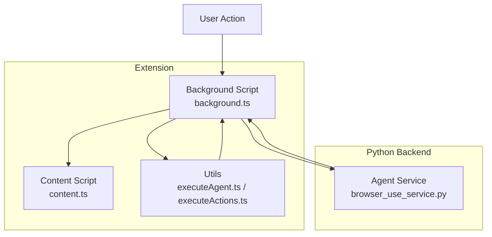
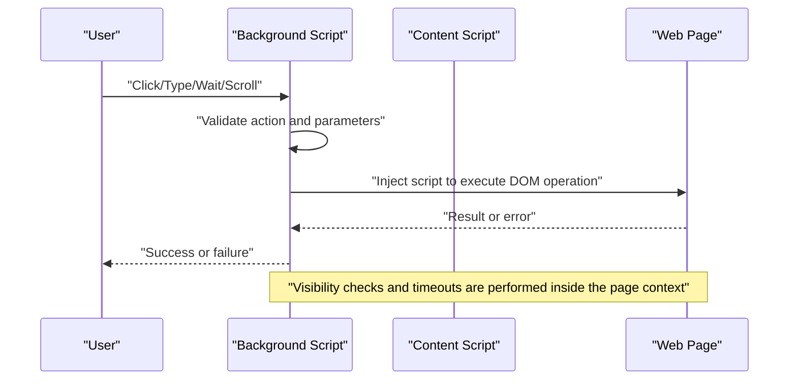
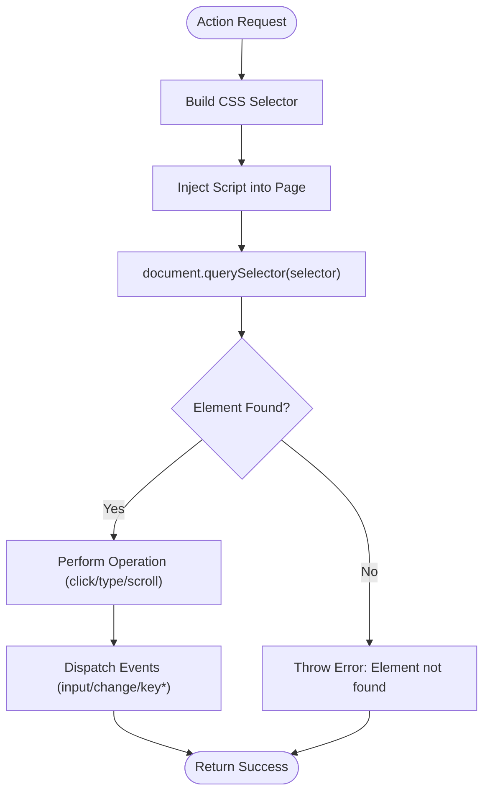
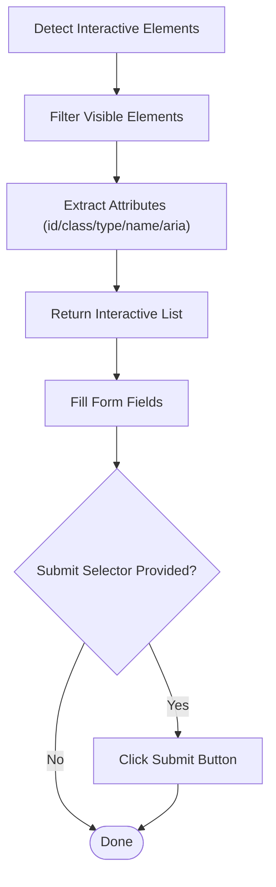
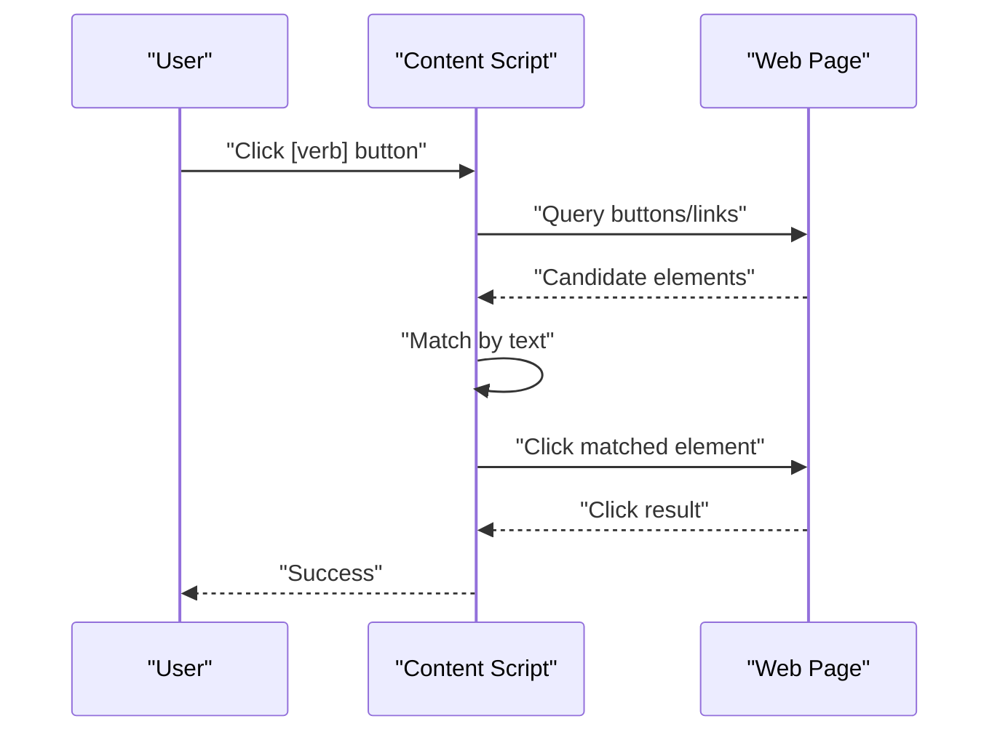
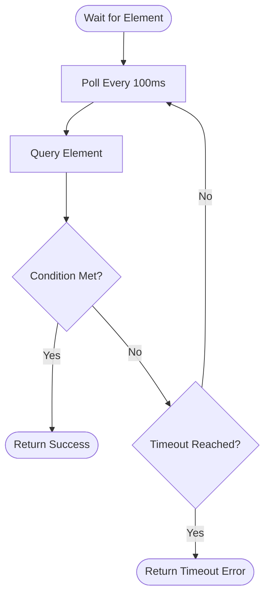
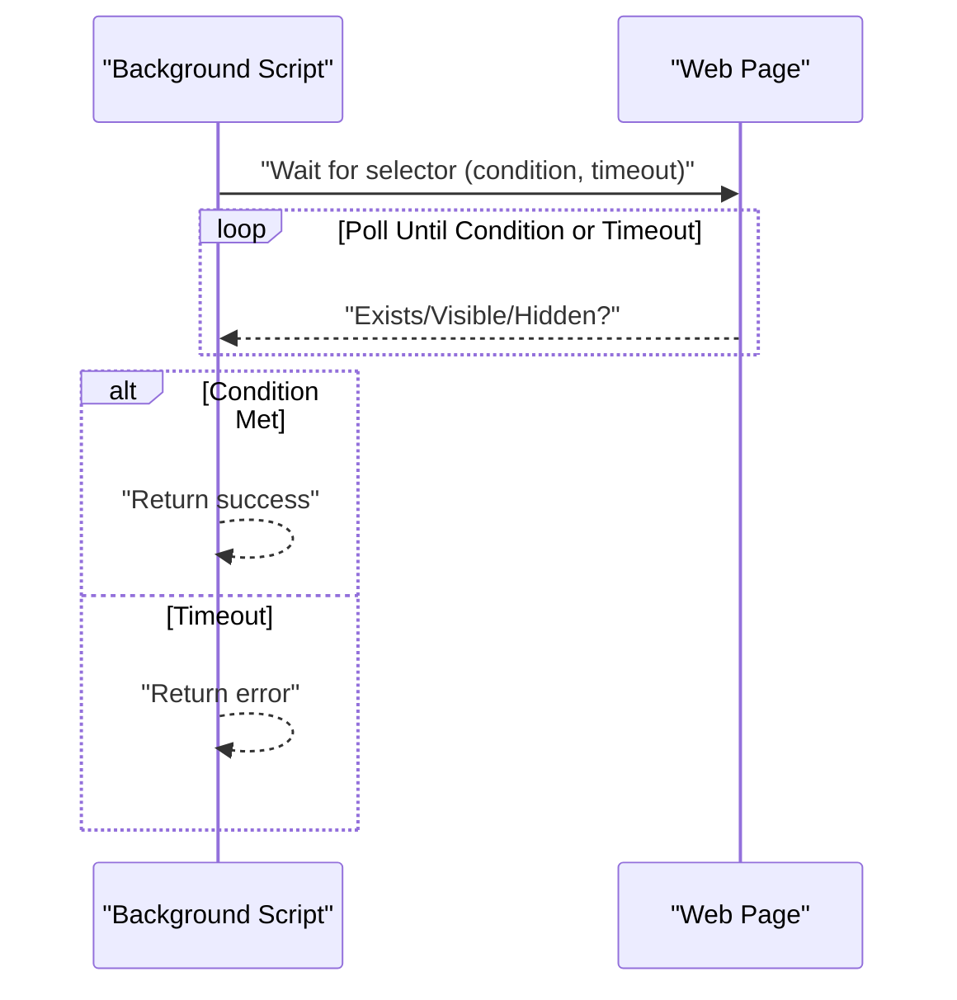
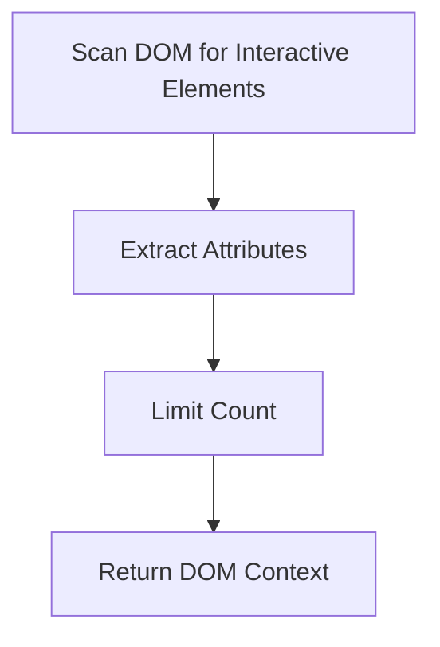
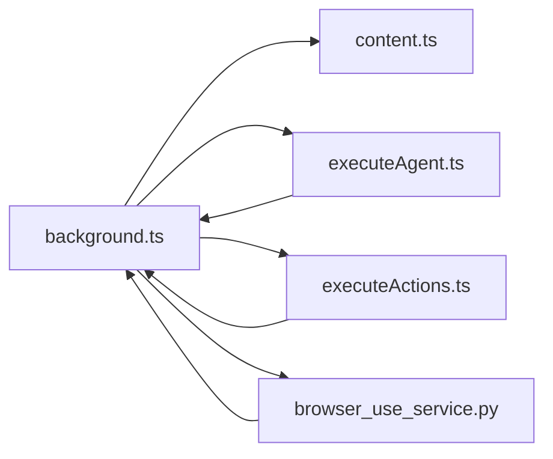

# DOM Manipulation and Element Targeting

<cite>
**Referenced Files in This Document**
- [background.ts](file://extension/entrypoints/background.ts)
- [content.ts](file://extension/entrypoints/content.ts)
- [executeAgent.ts](file://extension/entrypoints/utils/executeAgent.ts)
- [executeActions.ts](file://extension/entrypoints/utils/executeActions.ts)
- [browser_use_service.py](file://services/browser_use_service.py)
</cite>

## Table of Contents
1. [Introduction](#introduction)
2. [Project Structure](#project-structure)
3. [Core Components](#core-components)
4. [Architecture Overview](#architecture-overview)
5. [Detailed Component Analysis](#detailed-component-analysis)
6. [Dependency Analysis](#dependency-analysis)
7. [Performance Considerations](#performance-considerations)
8. [Troubleshooting Guide](#troubleshooting-guide)
9. [Conclusion](#conclusion)

## Introduction
This document explains how the system discovers, targets, and manipulates webpage elements across the browser extension. It covers selector-based targeting, form detection, input identification, interactive component recognition, element state detection, dynamic content handling, accessibility considerations, visibility checks, and timeout strategies. Practical targeting strategies and troubleshooting guidance are included to help users reliably automate tasks on modern, dynamic websites.

## Project Structure
The DOM manipulation and element targeting capabilities are implemented across:
- Background service worker: orchestrates tab-level actions, executes injected scripts, and manages timeouts.
- Content script: performs lightweight actions directly on the active page and recognizes common interactive patterns.
- Utilities: capture DOM context, build interactive element lists, and route actions to the active tab.
- Python service: formats DOM context for LLM-driven action planning.

**Diagram sources**
- [background.ts](file://extension/entrypoints/background.ts#L17-L128)
- [content.ts](file://extension/entrypoints/content.ts#L1-L326)
- [executeAgent.ts](file://extension/entrypoints/utils/executeAgent.ts#L1-L299)
- [executeActions.ts](file://extension/entrypoints/utils/executeActions.ts#L1-L57)
- [browser_use_service.py](file://services/browser_use_service.py#L1-L96)

**Section sources**
- [background.ts](file://extension/entrypoints/background.ts#L17-L128)
- [content.ts](file://extension/entrypoints/content.ts#L1-L326)
- [executeAgent.ts](file://extension/entrypoints/utils/executeAgent.ts#L1-L299)
- [executeActions.ts](file://extension/entrypoints/utils/executeActions.ts#L1-L57)
- [browser_use_service.py](file://services/browser_use_service.py#L1-L96)

## Core Components
- Selector-based element targeting: CSS selectors are used to locate elements for click, type, and visibility checks.
- Form and input detection: heuristics identify inputs, textareas, selects, and contenteditable regions; appropriate events are dispatched to simulate user input.
- Interactive component recognition: a curated set of selectors targets buttons, links, and role-based controls.
- Visibility and state detection: computed styles and offset checks determine visibility; wait conditions support dynamic content.
- Dynamic content handling: polling loops with timeouts ensure robustness on slow-loading pages.
- Accessibility-aware attributes: aria-label and other attributes are captured to improve targeting accuracy.

**Section sources**
- [background.ts](file://extension/entrypoints/background.ts#L691-L797)
- [background.ts](file://extension/entrypoints/background.ts#L1238-L1285)
- [executeAgent.ts](file://extension/entrypoints/utils/executeAgent.ts#L170-L227)
- [content.ts](file://extension/entrypoints/content.ts#L215-L323)

## Architecture Overview
The system uses a message-driven architecture:
- Background script receives high-level commands and injects page scripts to perform DOM operations.
- Content script handles simple actions directly on the page.
- Utilities capture DOM context and route actions to the active tab.
- Python service formats DOM context for LLM-driven action planning.

**Diagram sources**
- [background.ts](file://extension/entrypoints/background.ts#L691-L797)
- [background.ts](file://extension/entrypoints/background.ts#L1238-L1285)
- [content.ts](file://extension/entrypoints/content.ts#L215-L323)

## Detailed Component Analysis

### Selector-Based Element Targeting
- CSS selectors are passed to the page context for querying elements.
- Actions include clicking elements identified by a selector and typing into input/select/textarea/contenteditable elements.
- Visibility filtering supports returning only visible elements when listing candidates.

**Diagram sources**
- [background.ts](file://extension/entrypoints/background.ts#L691-L797)
- [background.ts](file://extension/entrypoints/background.ts#L1238-L1285)

**Section sources**
- [background.ts](file://extension/entrypoints/background.ts#L691-L797)
- [background.ts](file://extension/entrypoints/background.ts#L1238-L1285)

### Form Element Detection and Input Identification
- Heuristics identify interactive elements: anchors, buttons, inputs, selects, textareas, and role-based buttons.
- For contenteditable areas, innerText/textContent is set and input/change events are dispatched.
- For standard inputs/textareas, value is set and input/change/keyboard events are dispatched.
- A convenience action fills multiple fields and optionally submits the form.

**Diagram sources**
- [executeAgent.ts](file://extension/entrypoints/utils/executeAgent.ts#L170-L227)
- [background.ts](file://extension/entrypoints/background.ts#L1172-L1196)

**Section sources**
- [executeAgent.ts](file://extension/entrypoints/utils/executeAgent.ts#L170-L227)
- [background.ts](file://extension/entrypoints/background.ts#L1172-L1196)

### Interactive Component Recognition
- Buttons and links are targeted broadly using selectors for anchor tags, buttons, and elements with role="button".
- Content script includes a simple parser to match user intent to visible buttons by text matching.

**Diagram sources**
- [content.ts](file://extension/entrypoints/content.ts#L247-L267)

**Section sources**
- [content.ts](file://extension/entrypoints/content.ts#L247-L267)

### Element State Detection and Visibility Checks
- Visibility is determined by computed styles (display, visibility) and offsetParent presence.
- A wait loop polls until an element exists or meets a visibility condition within a timeout.

**Diagram sources**
- [background.ts](file://extension/entrypoints/background.ts#L1238-L1285)

**Section sources**
- [background.ts](file://extension/entrypoints/background.ts#L1238-L1285)

### Dynamic Content Handling and Timeout Strategies
- Wait actions use a configurable timeout and polling interval to accommodate slow-rendering pages.
- Navigation and tab operations include completion waits and fallback timeouts.

**Diagram sources**
- [background.ts](file://extension/entrypoints/background.ts#L1238-L1285)

**Section sources**
- [background.ts](file://extension/entrypoints/background.ts#L1238-L1285)

### Accessibility Considerations and Attribute Capture
- Captured attributes include id, class, type, placeholder, name, aria-label, and visible text to improve robustness and accessibility.
- The interactive list is limited to avoid excessive payloads.

**Diagram sources**
- [executeAgent.ts](file://extension/entrypoints/utils/executeAgent.ts#L170-L227)
- [browser_use_service.py](file://services/browser_use_service.py#L28-L51)

**Section sources**
- [executeAgent.ts](file://extension/entrypoints/utils/executeAgent.ts#L170-L227)
- [browser_use_service.py](file://services/browser_use_service.py#L28-L51)

## Dependency Analysis
- Background script depends on page injection to perform DOM operations safely.
- Content script provides lightweight actions and pattern-based button matching.
- Utilities coordinate DOM capture and action routing to the active tab.
- Python service consumes DOM context to generate structured action plans.

**Diagram sources**
- [background.ts](file://extension/entrypoints/background.ts#L17-L128)
- [content.ts](file://extension/entrypoints/content.ts#L1-L326)
- [executeAgent.ts](file://extension/entrypoints/utils/executeAgent.ts#L1-L299)
- [executeActions.ts](file://extension/entrypoints/utils/executeActions.ts#L1-L57)
- [browser_use_service.py](file://services/browser_use_service.py#L1-L96)

**Section sources**
- [background.ts](file://extension/entrypoints/background.ts#L17-L128)
- [content.ts](file://extension/entrypoints/content.ts#L1-L326)
- [executeAgent.ts](file://extension/entrypoints/utils/executeAgent.ts#L1-L299)
- [executeActions.ts](file://extension/entrypoints/utils/executeActions.ts#L1-L57)
- [browser_use_service.py](file://services/browser_use_service.py#L1-L96)

## Performance Considerations
- Prefer specific CSS selectors to reduce query overhead.
- Limit the number of returned interactive elements to avoid large payloads.
- Use visibility filters when listing candidates to minimize false positives.
- Batch operations and introduce small delays between actions to prevent overwhelming the page.

## Troubleshooting Guide
Common issues and resolutions:
- Element not found
  - Verify the selector specificity and scope.
  - Ensure the element exists before targeting; use wait conditions for dynamic content.
  - Confirm the page is fully loaded or use navigation waits.
- Visibility errors
  - Use visibility checks or filter visible elements when listing candidates.
  - Adjust selectors to target visible subtrees.
- Dynamic content timing
  - Increase timeout values for wait actions.
  - Use polling intervals suited to the page’s rendering speed.
- Contenteditable vs. inputs
  - For contenteditable, set innerText/textContent and dispatch input/change events.
  - For inputs/textareas, set value and dispatch input/change/keyboard events.
- Accessibility attributes
  - Include aria-label/id/class/name in selectors to improve reliability.
- Mixed environments
  - For SPA or framework-heavy pages, ensure selectors target stable attributes and avoid brittle text-based targeting.

**Section sources**
- [background.ts](file://extension/entrypoints/background.ts#L691-L797)
- [background.ts](file://extension/entrypoints/background.ts#L1238-L1285)
- [executeAgent.ts](file://extension/entrypoints/utils/executeAgent.ts#L170-L227)
- [content.ts](file://extension/entrypoints/content.ts#L247-L267)

## Conclusion
The system combines robust selector-based targeting, comprehensive form and input handling, interactive component recognition, and resilient visibility/timeouts to reliably manipulate DOM elements across diverse web pages. By leveraging accessibility attributes, limiting payloads, and using wait strategies, it achieves reliable automation on static and dynamic sites alike.