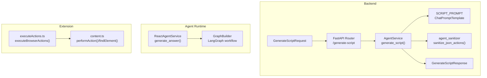
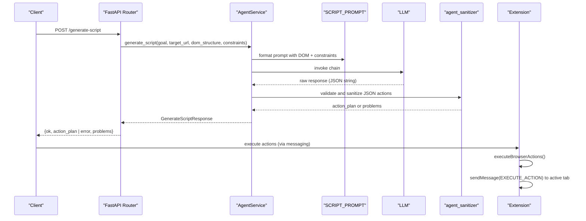
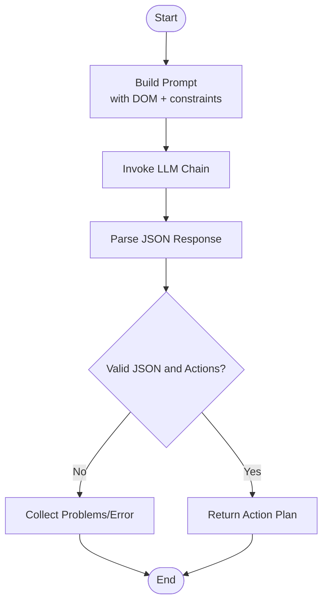
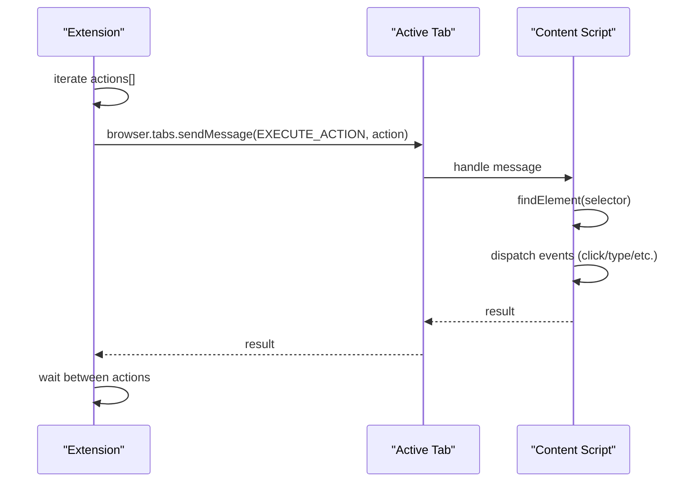
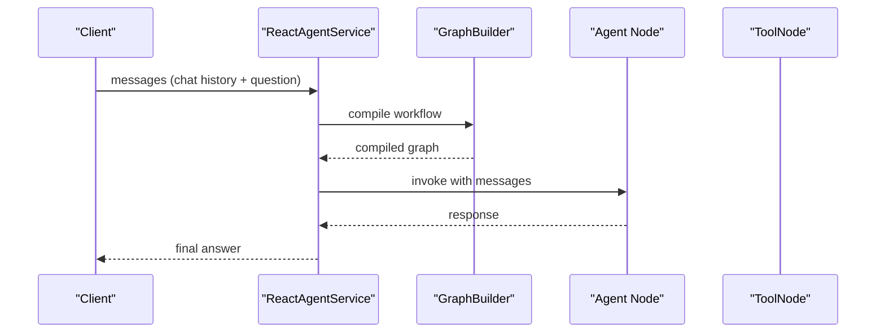
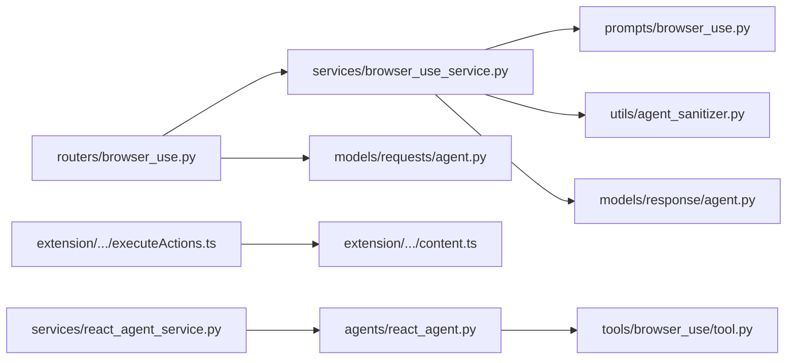

# Dynamic Script Generation

<cite>
**Referenced Files in This Document**
- [react_agent.py](file://agents/react_agent.py)
- [react_agent_service.py](file://services/react_agent_service.py)
- [browser_use_service.py](file://services/browser_use_service.py)
- [browser_use.py](file://routers/browser_use.py)
- [tool.py](file://tools/browser_use/tool.py)
- [browser_use.py](file://prompts/browser_use.py)
- [agent.py](file://models/requests/agent.py)
- [agent.py](file://models/response/agent.py)
- [agent_sanitizer.py](file://utils/agent_sanitizer.py)
- [executeActions.ts](file://extension/entrypoints/utils/executeActions.ts)
- [content.ts](file://extension/entrypoints/content.ts)
- [prompt_injection_validator.py](file://prompts/prompt_injection_validator.py)
</cite>

## Table of Contents
1. [Introduction](#introduction)
2. [Project Structure](#project-structure)
3. [Core Components](#core-components)
4. [Architecture Overview](#architecture-overview)
5. [Detailed Component Analysis](#detailed-component-analysis)
6. [Dependency Analysis](#dependency-analysis)
7. [Performance Considerations](#performance-considerations)
8. [Troubleshooting Guide](#troubleshooting-guide)
9. [Conclusion](#conclusion)

## Introduction
This document explains the dynamic script generation system that transforms natural language goals into safe, executable browser actions. It covers the end-to-end pipeline from goal interpretation to validated action plans, the templating and prompting system, parameter injection, safety validation, sandboxing considerations, error handling, and execution monitoring. It also documents how agent decisions map to generated code, including fallback strategies and error recovery mechanisms.

## Project Structure
The dynamic script generation spans backend services, routing, prompts, sanitization utilities, and the browser extension runtime:
- Backend API and service orchestration
- Prompt templates and LLM invocation
- Validation and sanitization
- Extension-side action execution and content script helpers
- Model schemas for request/response

**Diagram sources**
- [browser_use.py](file://routers/browser_use.py#L16-L44)
- [browser_use_service.py](file://services/browser_use_service.py#L11-L95)
- [browser_use.py](file://prompts/browser_use.py#L5-L137)
- [agent_sanitizer.py](file://utils/agent_sanitizer.py#L20-L95)
- [react_agent_service.py](file://services/react_agent_service.py#L16-L153)
- [react_agent.py](file://agents/react_agent.py#L138-L180)
- [executeActions.ts](file://extension/entrypoints/utils/executeActions.ts#L1-L56)
- [content.ts](file://extension/entrypoints/content.ts#L215-L323)
- [agent.py](file://models/requests/agent.py#L5-L9)
- [agent.py](file://models/response/agent.py#L5-L10)

**Section sources**
- [browser_use.py](file://routers/browser_use.py#L1-L51)
- [browser_use_service.py](file://services/browser_use_service.py#L1-L96)
- [browser_use.py](file://prompts/browser_use.py#L1-L138)
- [agent_sanitizer.py](file://utils/agent_sanitizer.py#L1-L119)
- [react_agent_service.py](file://services/react_agent_service.py#L1-L154)
- [react_agent.py](file://agents/react_agent.py#L1-L191)
- [executeActions.ts](file://extension/entrypoints/utils/executeActions.ts#L1-L57)
- [content.ts](file://extension/entrypoints/content.ts#L1-L326)
- [agent.py](file://models/requests/agent.py#L1-L10)
- [agent.py](file://models/response/agent.py#L1-L11)

## Core Components
- Prompt template and LLM chain for action plan generation
- Service orchestrating prompt assembly, LLM invocation, and validation
- Sanitization and safety checks for generated JSON action plans
- API router validating inputs and returning structured responses
- Extension utilities for executing actions and content script helpers
- Agent runtime for conversational reasoning and tool selection

Key responsibilities:
- Goal interpretation and action planning
- Parameter injection into prompt templates
- Safety validation and error reporting
- Execution coordination between backend and extension

**Section sources**
- [browser_use.py](file://prompts/browser_use.py#L5-L137)
- [browser_use_service.py](file://services/browser_use_service.py#L11-L95)
- [agent_sanitizer.py](file://utils/agent_sanitizer.py#L20-L95)
- [browser_use.py](file://routers/browser_use.py#L16-L44)
- [executeActions.ts](file://extension/entrypoints/utils/executeActions.ts#L1-L56)
- [content.ts](file://extension/entrypoints/content.ts#L215-L323)
- [react_agent.py](file://agents/react_agent.py#L138-L180)

## Architecture Overview
The system follows a clear separation of concerns:
- Frontend sends a goal with optional DOM context and constraints.
- Backend composes a prompt with DOM information and constraints, invokes the LLM, validates the JSON action plan, and returns a structured response.
- The extension executes actions against the active tab, delegating DOM-specific actions to the content script.

**Diagram sources**
- [browser_use.py](file://routers/browser_use.py#L16-L44)
- [browser_use_service.py](file://services/browser_use_service.py#L11-L95)
- [browser_use.py](file://prompts/browser_use.py#L5-L137)
- [agent_sanitizer.py](file://utils/agent_sanitizer.py#L20-L95)
- [executeActions.ts](file://extension/entrypoints/utils/executeActions.ts#L1-L56)

## Detailed Component Analysis

### Prompt Template and Script Generation
- The prompt defines available actions (DOM manipulation and tab/window control), selector best practices, and critical rules for safe and effective automation.
- The service composes a user prompt including goal, target URL, constraints, and a limited DOM snapshot of interactive elements.
- The LLM produces a JSON action plan; the service extracts the content and passes it to the sanitizer.

Validation highlights:
- Enforces presence of an actions array and per-action fields.
- Validates action types and required parameters (e.g., selector for CLICK/TYPE/SELECT, url for OPEN_TAB/NAVIGATE).
- Detects potentially dangerous EXECUTE_SCRIPT patterns.

**Section sources**
- [browser_use.py](file://prompts/browser_use.py#L5-L137)
- [browser_use_service.py](file://services/browser_use_service.py#L53-L79)
- [agent_sanitizer.py](file://utils/agent_sanitizer.py#L20-L95)

### Action Planning Pipeline
The pipeline stages:
1. Input assembly: goal, target_url, dom_structure, constraints.
2. Prompt construction: DOM summary and constraints embedded into a structured prompt.
3. LLM invocation: ChatPromptTemplate chained to the LLM client.
4. Validation: JSON parsing, structure checks, and safety checks.
5. Response shaping: ok flag, action_plan, and optional problems/error.

**Diagram sources**
- [browser_use_service.py](file://services/browser_use_service.py#L53-L91)
- [agent_sanitizer.py](file://utils/agent_sanitizer.py#L20-L95)

**Section sources**
- [browser_use_service.py](file://services/browser_use_service.py#L11-L95)
- [agent.py](file://models/requests/agent.py#L5-L9)
- [agent.py](file://models/response/agent.py#L5-L10)

### Script Templating and Parameter Injection
- The prompt template is a ChatPromptTemplate with a system message enumerating actions and rules, plus user content constructed from the goal, target URL, constraints, and DOM snapshot.
- Parameter injection occurs by formatting the user prompt string with the provided inputs and limiting the number of interactive elements to control token usage.

Best practices reflected in the template:
- Prefer explicit selectors and avoid chrome:// pages for DOM actions.
- Prefer constructing full search URLs directly in OPEN_TAB.
- Encourage atomic, clearly described steps.

**Section sources**
- [browser_use.py](file://prompts/browser_use.py#L5-L137)
- [browser_use_service.py](file://services/browser_use_service.py#L21-L69)

### Safety Validation and Sandboxing
Safety measures:
- JSON validation ensures required fields and correct types.
- EXECUTE_SCRIPT validation scans for dangerous patterns (e.g., eval-like constructs).
- Tab control actions require mandatory fields (e.g., url for OPEN_TAB/NAVIGATE).
- DOM actions are restricted to http/https contexts per prompt rules.

Sandboxing considerations:
- EXECUTE_SCRIPT is allowed but subject to basic pattern checks; it runs in the extension’s content script context.
- DOM actions are delegated to the content script via message passing, reducing direct exposure of unsafe patterns in the extension host.

**Section sources**
- [agent_sanitizer.py](file://utils/agent_sanitizer.py#L20-L95)
- [browser_use.py](file://prompts/browser_use.py#L89-L116)
- [executeActions.ts](file://extension/entrypoints/utils/executeActions.ts#L1-L56)
- [content.ts](file://extension/entrypoints/content.ts#L215-L323)

### Execution Monitoring and Extension Integration
- The extension receives action lists and executes them sequentially with delays between actions.
- DOM actions are sent to the active tab via messaging; the content script performs element queries and interactions.
- The content script includes helpers for element finding and a small set of built-in actions for quick tasks.

**Diagram sources**
- [executeActions.ts](file://extension/entrypoints/utils/executeActions.ts#L1-L56)
- [content.ts](file://extension/entrypoints/content.ts#L215-L323)

**Section sources**
- [executeActions.ts](file://extension/entrypoints/utils/executeActions.ts#L1-L56)
- [content.ts](file://extension/entrypoints/content.ts#L215-L323)

### Relationship Between Agent Decisions and Generated Code
- The prompt template encodes decision rules: choose tab control vs DOM actions based on intent, prefer direct navigation for searches, and use precise selectors.
- The sanitizer enforces these rules at validation time, returning actionable feedback when plans violate constraints.
- The extension faithfully executes the validated plan, with content script helpers enabling DOM interactions.

Fallback and recovery:
- If validation fails, the API returns ok=false with problems; the caller can refine the goal or DOM context and retry.
- For runtime errors during execution, the extension logs failures and continues to the next action after a delay.

**Section sources**
- [browser_use.py](file://prompts/browser_use.py#L89-L116)
- [agent_sanitizer.py](file://utils/agent_sanitizer.py#L20-L95)
- [browser_use.py](file://routers/browser_use.py#L32-L44)
- [executeActions.ts](file://extension/entrypoints/utils/executeActions.ts#L52-L55)

### Examples of Generated Scripts
Below are representative action plan structures produced by the system. These are conceptual examples derived from the prompt template and sanitizer rules.

- Click an element:
  - type: "CLICK"
  - selector: "<specific CSS selector>"
  - description: "<clear description>"

- Type into an input:
  - type: "TYPE"
  - selector: "<specific CSS selector>"
  - value: "<text to type>"
  - description: "<clear description>"

- Navigate to a search result page:
  - type: "OPEN_TAB"
  - url: "<full search URL>"
  - active: true
  - description: "<clear description>"

- Combined workflow (open tab, wait, type, click):
  - OPEN_TAB with url and active
  - WAIT with time
  - TYPE with selector and value
  - CLICK with selector

These examples reflect the prompt’s preference for direct navigation URLs and atomic steps with clear descriptions.

**Section sources**
- [browser_use.py](file://prompts/browser_use.py#L28-L88)
- [agent_sanitizer.py](file://utils/agent_sanitizer.py#L54-L91)

### Agent Runtime and Conversational Planning
While the dynamic script generation focuses on action plans, the agent runtime supports broader conversational reasoning:
- A LangGraph workflow coordinates an agent node and tool execution.
- The runtime normalizes messages and integrates tools, including a browser action tool that delegates to the script generation service.

**Diagram sources**
- [react_agent_service.py](file://services/react_agent_service.py#L16-L153)
- [react_agent.py](file://agents/react_agent.py#L138-L180)
- [tool.py](file://tools/browser_use/tool.py#L27-L40)

**Section sources**
- [react_agent_service.py](file://services/react_agent_service.py#L16-L153)
- [react_agent.py](file://agents/react_agent.py#L138-L180)
- [tool.py](file://tools/browser_use/tool.py#L27-L40)

## Dependency Analysis
- Router depends on AgentService and models for request/response.
- AgentService composes SCRIPT_PROMPT and invokes the LLM, then applies agent_sanitizer.
- Extension utilities depend on browser APIs for tab management and content script messaging.
- The agent runtime composes tools and a LangGraph workflow.

**Diagram sources**
- [browser_use.py](file://routers/browser_use.py#L16-L44)
- [browser_use_service.py](file://services/browser_use_service.py#L11-L95)
- [browser_use.py](file://prompts/browser_use.py#L5-L137)
- [agent_sanitizer.py](file://utils/agent_sanitizer.py#L20-L95)
- [agent.py](file://models/response/agent.py#L5-L10)
- [agent.py](file://models/requests/agent.py#L5-L9)
- [executeActions.ts](file://extension/entrypoints/utils/executeActions.ts#L1-L56)
- [content.ts](file://extension/entrypoints/content.ts#L215-L323)
- [react_agent_service.py](file://services/react_agent_service.py#L16-L153)
- [react_agent.py](file://agents/react_agent.py#L138-L180)
- [tool.py](file://tools/browser_use/tool.py#L27-L40)

**Section sources**
- [browser_use.py](file://routers/browser_use.py#L1-L51)
- [browser_use_service.py](file://services/browser_use_service.py#L1-L96)
- [browser_use.py](file://prompts/browser_use.py#L1-L138)
- [agent_sanitizer.py](file://utils/agent_sanitizer.py#L1-L119)
- [executeActions.ts](file://extension/entrypoints/utils/executeActions.ts#L1-L57)
- [content.ts](file://extension/entrypoints/content.ts#L1-L326)
- [react_agent_service.py](file://services/react_agent_service.py#L1-L154)
- [react_agent.py](file://agents/react_agent.py#L1-L191)
- [tool.py](file://tools/browser_use/tool.py#L1-L49)

## Performance Considerations
- Limit DOM snapshots: The service truncates interactive elements to reduce token usage.
- Batch execution delays: The extension introduces small delays between actions to prevent overwhelming the page.
- Validation overhead: JSON parsing and safety checks occur synchronously; keep action plans concise and atomic.
- Prompt caching: Consider caching repeated prompts or using a smaller subset of DOM data when feasible.

[No sources needed since this section provides general guidance]

## Troubleshooting Guide
Common issues and resolutions:
- Invalid JSON or missing fields:
  - The sanitizer reports problems; refine the goal or provide a richer DOM context.
- Missing required fields for actions:
  - Ensure selector for DOM actions and url for tab actions.
- Dangerous EXECUTE_SCRIPT patterns:
  - Simplify or avoid custom scripts; rely on supported DOM actions.
- Extension execution failures:
  - Check console logs for action errors; ensure the active tab is reachable and the selector is correct.
- API validation errors:
  - The endpoint returns ok=false with problems; address reported issues and retry.

**Section sources**
- [agent_sanitizer.py](file://utils/agent_sanitizer.py#L20-L95)
- [browser_use.py](file://routers/browser_use.py#L32-L44)
- [executeActions.ts](file://extension/entrypoints/utils/executeActions.ts#L52-L55)

## Conclusion
The dynamic script generation system combines a structured prompt template, robust validation, and extension-based execution to safely transform natural language goals into executable browser actions. By enforcing strict validation rules, limiting DOM context, and using message-passing for DOM operations, the system balances flexibility with safety. The agent runtime complements this by enabling broader conversational planning, while the API and extension layers provide clear integration points for execution monitoring and error recovery.