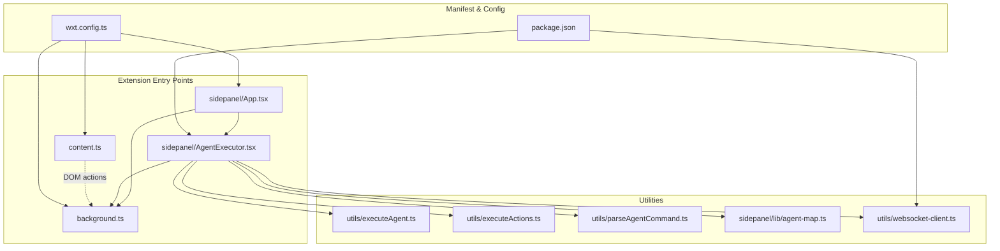
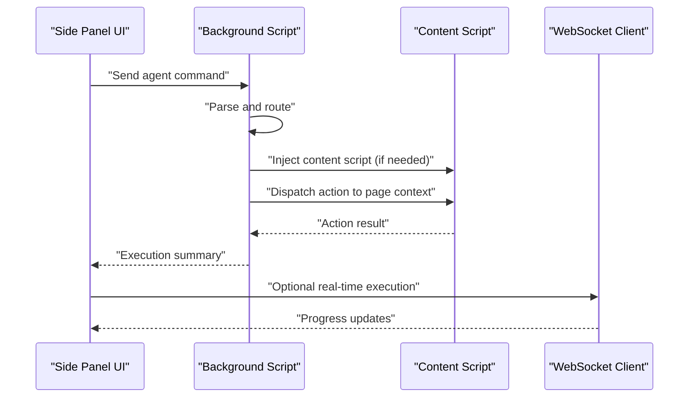
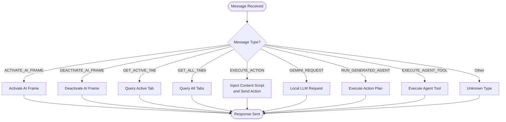
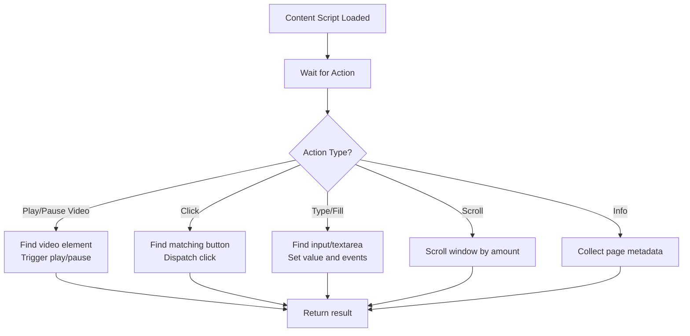
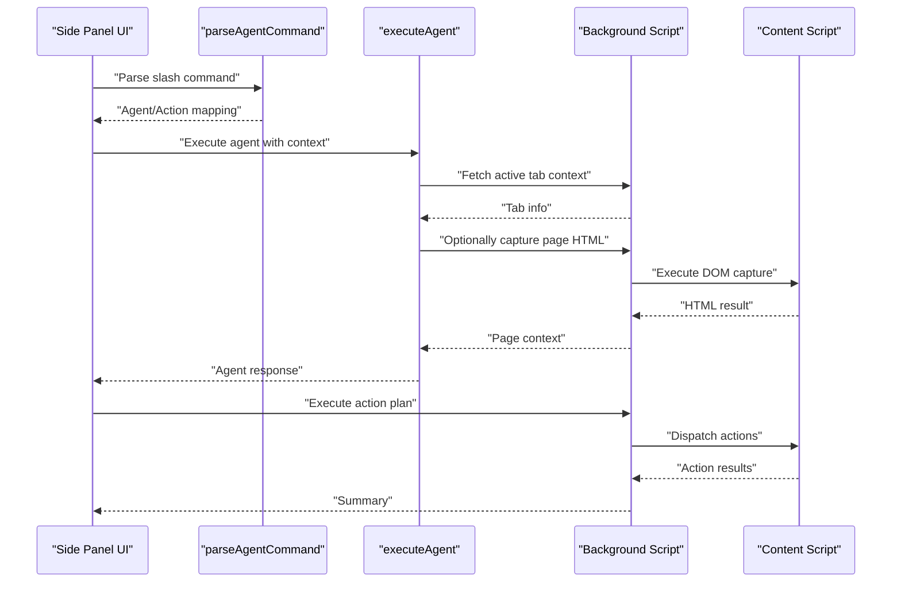
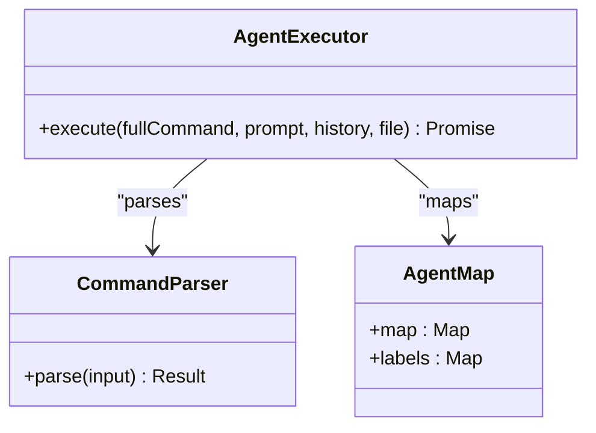
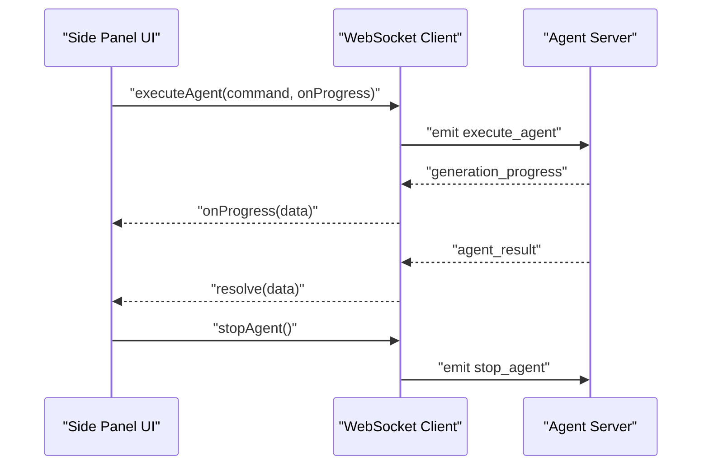
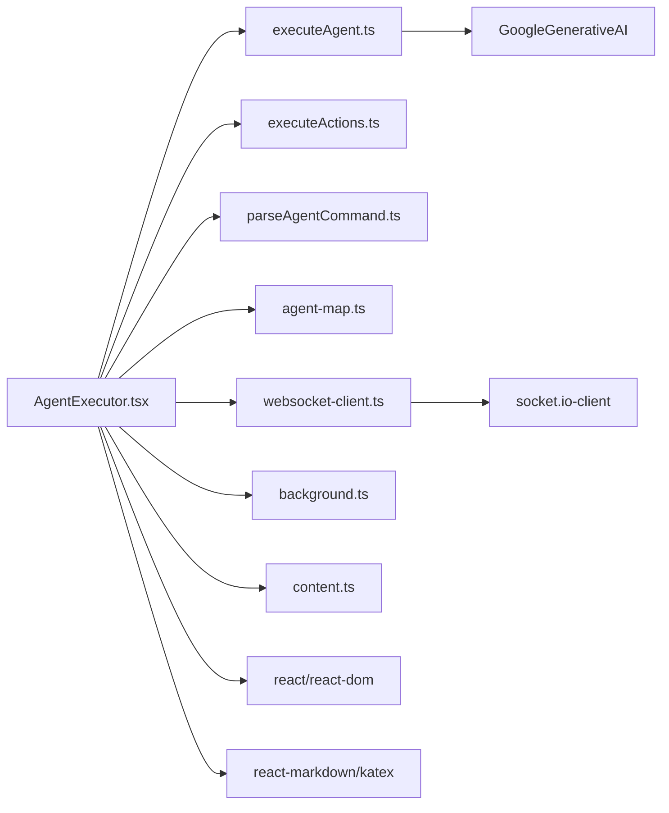

# Extension Architecture and Components

<cite>
**Referenced Files in This Document**
- [background.ts](file://extension/entrypoints/background.ts)
- [content.ts](file://extension/entrypoints/content.ts)
- [App.tsx](file://extension/entrypoints/sidepanel/App.tsx)
- [AgentExecutor.tsx](file://extension/entrypoints/sidepanel/AgentExecutor.tsx)
- [executeActions.ts](file://extension/entrypoints/utils/executeActions.ts)
- [executeAgent.ts](file://extension/entrypoints/utils/executeAgent.ts)
- [parseAgentCommand.ts](file://extension/entrypoints/utils/parseAgentCommand.ts)
- [agent-map.ts](file://extension/entrypoints/sidepanel/lib/agent-map.ts)
- [websocket-client.ts](file://extension/entrypoints/utils/websocket-client.ts)
- [wxt.config.ts](file://extension/wxt.config.ts)
- [package.json](file://extension/package.json)
</cite>

## Table of Contents
1. [Introduction](#introduction)
2. [Project Structure](#project-structure)
3. [Core Components](#core-components)
4. [Architecture Overview](#architecture-overview)
5. [Detailed Component Analysis](#detailed-component-analysis)
6. [Dependency Analysis](#dependency-analysis)
7. [Performance Considerations](#performance-considerations)
8. [Troubleshooting Guide](#troubleshooting-guide)
9. [Conclusion](#conclusion)
10. [Appendices](#appendices)

## Introduction
This document explains the browser extension architecture and component interactions for the Open DIA project. It focuses on:
- The content script’s role in executing browser actions
- The background script’s coordination for cross-tab communication
- The side panel UI integration and agent orchestration
- Message passing protocols between extension components and the main application
- The AgentExecutor component’s role in coordinating agent actions and the content script’s execution environment
- Examples of lifecycle management, permission handling, and security boundaries
- Cross-browser compatibility considerations and extension manifest configuration

## Project Structure
The extension is organized into entrypoints for background, content, and side panel UI, plus shared utilities for agent orchestration and messaging.

**Diagram sources**
- [background.ts](file://extension/entrypoints/background.ts#L1-L1642)
- [content.ts](file://extension/entrypoints/content.ts#L1-L326)
- [App.tsx](file://extension/entrypoints/sidepanel/App.tsx#L1-L200)
- [AgentExecutor.tsx](file://extension/entrypoints/sidepanel/AgentExecutor.tsx#L1-L800)
- [executeAgent.ts](file://extension/entrypoints/utils/executeAgent.ts#L1-L299)
- [executeActions.ts](file://extension/entrypoints/utils/executeActions.ts#L1-L57)
- [parseAgentCommand.ts](file://extension/entrypoints/utils/parseAgentCommand.ts#L1-L86)
- [agent-map.ts](file://extension/entrypoints/sidepanel/lib/agent-map.ts#L1-L80)
- [websocket-client.ts](file://extension/entrypoints/utils/websocket-client.ts#L1-L133)
- [wxt.config.ts](file://extension/wxt.config.ts#L1-L29)
- [package.json](file://extension/package.json#L1-L40)

**Section sources**
- [background.ts](file://extension/entrypoints/background.ts#L1-L1642)
- [content.ts](file://extension/entrypoints/content.ts#L1-L326)
- [App.tsx](file://extension/entrypoints/sidepanel/App.tsx#L1-L200)
- [AgentExecutor.tsx](file://extension/entrypoints/sidepanel/AgentExecutor.tsx#L1-L800)
- [executeAgent.ts](file://extension/entrypoints/utils/executeAgent.ts#L1-L299)
- [executeActions.ts](file://extension/entrypoints/utils/executeActions.ts#L1-L57)
- [parseAgentCommand.ts](file://extension/entrypoints/utils/parseAgentCommand.ts#L1-L86)
- [agent-map.ts](file://extension/entrypoints/sidepanel/lib/agent-map.ts#L1-L80)
- [websocket-client.ts](file://extension/entrypoints/utils/websocket-client.ts#L1-L133)
- [wxt.config.ts](file://extension/wxt.config.ts#L1-L29)
- [package.json](file://extension/package.json#L1-L40)

## Core Components
- Background script: Central coordinator for cross-tab communication, tab state, and action dispatch. Handles message routing and executes browser-level commands.
- Content script: Runs in-page to manipulate DOM and respond to action requests scoped to the active tab.
- Side panel UI: React-based interface that orchestrates agent execution, manages sessions, and coordinates with background and content scripts.
- Agent utilities: Parse slash commands, map agents/actions to endpoints, and execute agent requests with contextual page data.
- WebSocket client: Provides a minimal client for real-time agent execution and progress updates.

**Section sources**
- [background.ts](file://extension/entrypoints/background.ts#L1-L1642)
- [content.ts](file://extension/entrypoints/content.ts#L1-L326)
- [App.tsx](file://extension/entrypoints/sidepanel/App.tsx#L1-L200)
- [AgentExecutor.tsx](file://extension/entrypoints/sidepanel/AgentExecutor.tsx#L1-L800)
- [executeAgent.ts](file://extension/entrypoints/utils/executeAgent.ts#L1-L299)
- [websocket-client.ts](file://extension/entrypoints/utils/websocket-client.ts#L1-L133)

## Architecture Overview
The extension follows a message-passing architecture:
- Side panel initiates agent execution and sends commands to the background script.
- Background script resolves actions, injects content scripts when needed, and coordinates tab-level operations.
- Content script performs DOM-level actions within the active tab.
- Utilities parse commands, construct payloads, and capture page context for agent execution.

**Diagram sources**
- [background.ts](file://extension/entrypoints/background.ts#L428-L514)
- [content.ts](file://extension/entrypoints/content.ts#L197-L213)
- [AgentExecutor.tsx](file://extension/entrypoints/sidepanel/AgentExecutor.tsx#L323-L516)
- [websocket-client.ts](file://extension/entrypoints/utils/websocket-client.ts#L61-L95)

## Detailed Component Analysis

### Background Script Coordination
Responsibilities:
- Listens for messages from side panel and content script
- Coordinates tab state and cross-tab communication
- Executes browser-level actions (tabs, navigation, scripting injection)
- Routes agent tool execution to handlers

Key message types:
- ACTIVATE_AI_FRAME / DEACTIVATE_AI_FRAME: Manage overlay frames per tab
- GET_ACTIVE_TAB / GET_ALL_TABS: Tab discovery and state
- EXECUTE_ACTION: Dispatch actions to content script
- GEMINI_REQUEST: Perform local LLM inference
- RUN_GENERATED_AGENT: Execute generated action plans
- EXECUTE_AGENT_TOOL: Invoke agent tools with structured payloads

**Diagram sources**
- [background.ts](file://extension/entrypoints/background.ts#L24-L128)
- [background.ts](file://extension/entrypoints/background.ts#L428-L514)

**Section sources**
- [background.ts](file://extension/entrypoints/background.ts#L1-L1642)

### Content Script Execution Environment
Role:
- Runs in-page to perform DOM-level actions
- Responds to action requests from background script
- Provides simple page interaction helpers (play/pause video, click, fill, scroll, info)

Current capabilities:
- Keyword-based action parsing for simple commands
- DOM queries and synthetic events for input and click
- Basic page information extraction

**Diagram sources**
- [content.ts](file://extension/entrypoints/content.ts#L220-L323)

**Section sources**
- [content.ts](file://extension/entrypoints/content.ts#L1-L326)

### Side Panel UI Integration and AgentExecutor
Responsibilities:
- Manages sessions, chat history, and UI state
- Parses slash commands and maps to agent/action endpoints
- Executes agent requests and triggers browser actions
- Integrates with WebSocket client for real-time execution

Key flows:
- Slash command parsing routes to appropriate agent endpoints
- Agent execution captures page context (HTML, URL, title) when needed
- Action plan execution dispatches actions to background/content scripts
- Settings and authentication screens integrate with browser storage

**Diagram sources**
- [AgentExecutor.tsx](file://extension/entrypoints/sidepanel/AgentExecutor.tsx#L323-L516)
- [parseAgentCommand.ts](file://extension/entrypoints/utils/parseAgentCommand.ts#L5-L86)
- [executeAgent.ts](file://extension/entrypoints/utils/executeAgent.ts#L17-L299)
- [background.ts](file://extension/entrypoints/background.ts#L428-L514)
- [content.ts](file://extension/entrypoints/content.ts#L197-L213)

**Section sources**
- [App.tsx](file://extension/entrypoints/sidepanel/App.tsx#L1-L200)
- [AgentExecutor.tsx](file://extension/entrypoints/sidepanel/AgentExecutor.tsx#L1-L800)
- [parseAgentCommand.ts](file://extension/entrypoints/utils/parseAgentCommand.ts#L1-L86)
- [executeAgent.ts](file://extension/entrypoints/utils/executeAgent.ts#L1-L299)

### Agent Utilities and Mapping
- Command parsing: Supports agent selection, action selection, and completion stages
- Endpoint mapping: Maps agent-action pairs to backend endpoints
- Execution: Builds payloads with page context, chat history, and optional attachments

**Diagram sources**
- [agent-map.ts](file://extension/entrypoints/sidepanel/lib/agent-map.ts#L1-L80)
- [parseAgentCommand.ts](file://extension/entrypoints/utils/parseAgentCommand.ts#L1-L86)
- [executeAgent.ts](file://extension/entrypoints/utils/executeAgent.ts#L1-L299)

**Section sources**
- [agent-map.ts](file://extension/entrypoints/sidepanel/lib/agent-map.ts#L1-L80)
- [parseAgentCommand.ts](file://extension/entrypoints/utils/parseAgentCommand.ts#L1-L86)
- [executeAgent.ts](file://extension/entrypoints/utils/executeAgent.ts#L1-L299)

### WebSocket Client Integration
- Provides a simple API for real-time agent execution and progress updates
- Emits connection status, progress, and result/error events
- Used by the side panel to enhance agent execution UX

**Diagram sources**
- [websocket-client.ts](file://extension/entrypoints/utils/websocket-client.ts#L61-L95)

**Section sources**
- [websocket-client.ts](file://extension/entrypoints/utils/websocket-client.ts#L1-L133)

## Dependency Analysis
External dependencies and their roles:
- React ecosystem: UI rendering and state management
- Socket.IO client: Real-time communication with agent server
- Google Generative AI SDK: Local LLM inference
- Tailwind/KaTeX: UI styling and math rendering

**Diagram sources**
- [AgentExecutor.tsx](file://extension/entrypoints/sidepanel/AgentExecutor.tsx#L1-L800)
- [executeAgent.ts](file://extension/entrypoints/utils/executeAgent.ts#L1-L299)
- [executeActions.ts](file://extension/entrypoints/utils/executeActions.ts#L1-L57)
- [parseAgentCommand.ts](file://extension/entrypoints/utils/parseAgentCommand.ts#L1-L86)
- [agent-map.ts](file://extension/entrypoints/sidepanel/lib/agent-map.ts#L1-L80)
- [websocket-client.ts](file://extension/entrypoints/utils/websocket-client.ts#L1-L133)
- [background.ts](file://extension/entrypoints/background.ts#L1-L1642)
- [content.ts](file://extension/entrypoints/content.ts#L1-L326)
- [package.json](file://extension/package.json#L17-L32)

**Section sources**
- [package.json](file://extension/package.json#L1-L40)

## Performance Considerations
- Minimize DOM queries and synthetic event dispatches; batch actions when possible
- Use timeouts and listeners for tab operations to avoid blocking
- Cache page context only when necessary; avoid large payloads
- Debounce UI updates and progress reporting to reduce re-renders
- Prefer browser APIs (tabs, scripting) over frequent polling

## Troubleshooting Guide
Common issues and resolutions:
- Action not executing in content script:
  - Ensure the content script is injected and the tab is active
  - Verify message routing from background to content script
- Tab operations failing:
  - Confirm tab IDs and window context
  - Check for navigation completion before performing actions
- WebSocket connectivity:
  - Validate server availability and CORS
  - Use fallback HTTP stats when WebSocket is disconnected
- Permission errors:
  - Review manifest permissions and host permissions
  - Reinstall the extension after permission changes

**Section sources**
- [background.ts](file://extension/entrypoints/background.ts#L428-L514)
- [content.ts](file://extension/entrypoints/content.ts#L197-L213)
- [App.tsx](file://extension/entrypoints/sidepanel/App.tsx#L115-L155)
- [wxt.config.ts](file://extension/wxt.config.ts#L8-L26)

## Conclusion
The extension employs a clear separation of concerns: the background script coordinates cross-tab operations, the content script handles DOM-level actions, and the side panel orchestrates agent execution with real-time feedback. Utilities provide robust command parsing and context-aware agent execution. Permissions and manifest configuration enable broad site access and side panel integration. With careful attention to performance and error handling, the architecture supports scalable agent-driven browser automation.

## Appendices

### Message Passing Protocols
- Side panel to background:
  - Types: ACTIVATE_AI_FRAME, DEACTIVATE_AI_FRAME, GET_ACTIVE_TAB, GET_ALL_TABS, EXECUTE_ACTION, GEMINI_REQUEST, RUN_GENERATED_AGENT, EXECUTE_AGENT_TOOL
- Background to content:
  - Types: PERFORM_ACTION (via tabs.sendMessage)
- Background to side panel:
  - Responses to all requests with success/error payloads

**Section sources**
- [background.ts](file://extension/entrypoints/background.ts#L24-L128)
- [content.ts](file://extension/entrypoints/content.ts#L197-L213)

### Lifecycle Management and Security Boundaries
- Lifecycle:
  - Background script initializes listeners and tab tracking
  - Side panel activates/deactivates AI frames and manages sessions
  - Content script loads per-page and responds to actions
- Security:
  - Content scripts run in page context with limited permissions
  - Background script bridges privileged APIs with page contexts
  - Manifest permissions define scope; host permissions grant broad access

**Section sources**
- [background.ts](file://extension/entrypoints/background.ts#L131-L156)
- [App.tsx](file://extension/entrypoints/sidepanel/App.tsx#L54-L101)
- [wxt.config.ts](file://extension/wxt.config.ts#L8-L26)

### Cross-Browser Compatibility
- Build targets:
  - Chrome MV3 and Firefox via WXT build flags
- Differences:
  - Some APIs differ between browsers; use feature detection
  - Manifest keys and permissions may vary slightly

**Section sources**
- [package.json](file://extension/package.json#L7-L13)

### Extension Manifest Configuration
- Name, description, permissions, host permissions
- Permissions include tabs, storage, scripting, identity, sidePanel, webNavigation, webRequest, cookies, bookmarks, history, clipboard, notifications, contextMenus, downloads

**Section sources**
- [wxt.config.ts](file://extension/wxt.config.ts#L5-L27)